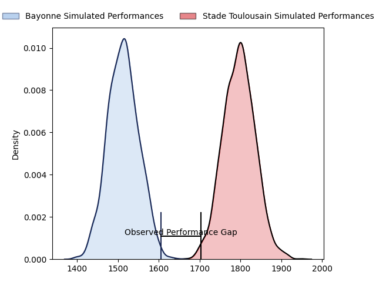
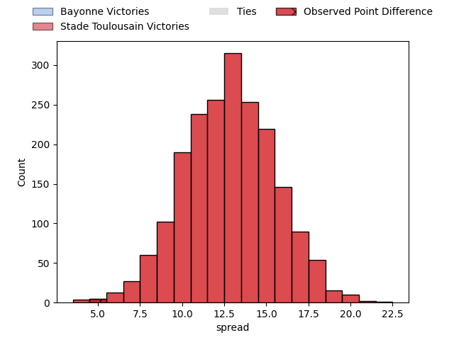
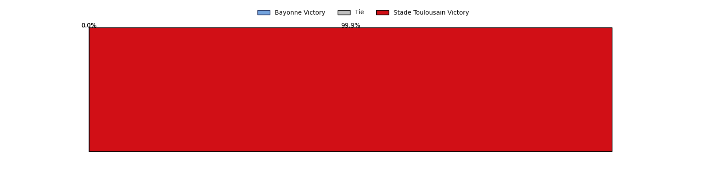
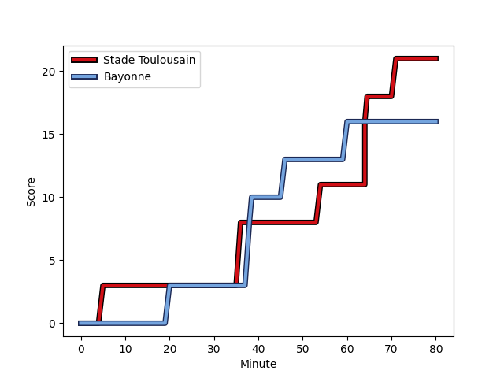

---  
layout: page  
title: Bayonne at Stade Toulousain; 16-21  
date: 2023-02-04 15:00:00 18:00:00 -0500  
categories: match review  
---
# Bayonne at Stade Toulousain; 16-21

# Club Level Predictions

The first set of predictions treats a club as the smallest object, as the club develops its members, organizes a gameplan, and deploys its players as needed for each match. This club model has a prediction of 0.834, which translates to predicting Stade Toulousain to win by 14.1.

Each club has a rating and a rating deviation (simiar to a Glicko system), and expected performances can be generated. This allows for simulated matches and spreads like the ones below.
## Projected Performances

## Projected Spreads

## Projected Results

# Player Level Predictions

Treating teams instead as an entity made up of the currently active players, I have ratings for each player in an altogether different system. These can be combined to form team ratings once teamsheets are announced, weighting starters a bit higher than the reserves. After the match is played, players can be weighted by their minutes on the field, allowing for an accurate measure of the team's composition. With these compiled team ratings, we can make predictions, measure inaccuracy, and update the individual player ratings.
## Prediction with Player Minutes: Bayonne by 5.8

Bayonne by 9.8 on a neutral field
## Scores over Time

## Win Probability over Time

## Prediction without Player Minutes: Bayonne by 2.6

Bayonne by 6.6 on a neutral pitch

|   Away Minutes | Away Player                                                                  |   Away elo |   Away Percentile |   Number |   Home Percentile |   Home elo | Home Player                                                             |   Home Minutes |
|---------------:|:-----------------------------------------------------------------------------|-----------:|------------------:|---------:|------------------:|-----------:|:------------------------------------------------------------------------|---------------:|
|             55 | [Swan Cormenier](..//playerfiles//SwanCormenier_cleaned.md)                  |     100.35 |                63 |        1 |                31 |      90.27 | [Rodrigue Neti](..//playerfiles//RodrigueNeti_cleaned.md)               |             47 |
|             65 | [Facundo Bosch](..//playerfiles//FacundoBosch_cleaned.md)                    |      94.17 |                49 |        2 |                28 |      88.61 | [Guillaume Cramont](..//playerfiles//GuillaumeCramont_cleaned.md)       |             80 |
|             56 | [Pascal Cotet](..//playerfiles//PascalCotet_cleaned.md)                      |      97.49 |                54 |        3 |                86 |     111.24 | [Dorian Aldegheri](..//playerfiles//DorianAldegheri_cleaned.md)         |             55 |
|             75 | [Denis Marchois](..//playerfiles//DenisMarchois_cleaned.md)                  |     168.69 |                99 |        4 |                65 |     101.65 | [Richie Arnold](..//playerfiles//RichieArnold_cleaned.md)               |             65 |
|             80 | [Thomas Ceyte](..//playerfiles//ThomasCeyte_cleaned.md)                      |     145.19 |                99 |        5 |                50 |      97.01 | [Emmanuel Meafou](..//playerfiles//EmmanuelMeafou_cleaned.md)           |             77 |
|             67 | [Pierre Huguet](..//playerfiles//PierreHuguet_cleaned.md)                    |      95.15 |                48 |        6 |                77 |     107.91 | [Alban Placines](..//playerfiles//AlbanPlacines_cleaned.md)             |             47 |
|             80 | [Baptiste Heguy](..//playerfiles//BaptisteHeguy_cleaned.md)                  |     125.91 |                94 |        7 |                90 |     119.9  | [Rynhardt Elstadt](..//playerfiles//RynhardtElstadt_cleaned.md)         |             47 |
|             80 | [Uzair Cassiem](..//playerfiles//UzairCassiem_cleaned.md)                    |     104.85 |                67 |        8 |                95 |     128.03 | [Jack Willis](..//playerfiles//JackWillis_cleaned.md)                   |             80 |
|             56 | [Guillaume Rouet Piffard](..//playerfiles//GuillaumeRouetPiffard_cleaned.md) |     109.55 |                80 |        9 |                44 |      93.74 | [Martin Page-Relo](..//playerfiles//MartinPage-Relo_cleaned.md)         |             80 |
|             80 | [Camille Lopez](..//playerfiles//CamilleLopez_cleaned.md)                    |     137.93 |                98 |       10 |                57 |      99.51 | [Juan Cruz Mallia](..//playerfiles//JuanCruzMallia_cleaned.md)          |             80 |
|             80 | [Remy Baget](..//playerfiles//RemyBaget_cleaned.md)                          |     123.32 |                92 |       11 |                97 |     135.12 | [Matthis Lebel](..//playerfiles//MatthisLebel_cleaned.md)               |             80 |
|             60 | [Eneriko Buliruarua](..//playerfiles//EnerikoBuliruarua_cleaned.md)          |      92.43 |                40 |       12 |                61 |     100.7  | [Pita Ahki](..//playerfiles//PitaAhki_cleaned.md)                       |             80 |
|             80 | [Peyo Muscarditz](..//playerfiles//PeyoMuscarditz_cleaned.md)                |     110.19 |                78 |       13 |                83 |     113.56 | [Pierre-Louis Barassi](..//playerfiles//Pierre-LouisBarassi_cleaned.md) |             50 |
|             80 | [Arnaud Erbinartegaray](..//playerfiles//ArnaudErbinartegaray_cleaned.md)    |     114.49 |                85 |       14 |                88 |     117.62 | [Dimitri Delibes](..//playerfiles//DimitriDelibes_cleaned.md)           |             80 |
|             80 | [Luke Morahan](..//playerfiles//LukeMorahan_cleaned.md)                      |     132.91 |                94 |       15 |                60 |     102.8  | [Max Auriac](..//playerfiles//MaxAuriac_cleaned.md)                     |             58 |
|             25 | [Matis Perchaud](..//playerfiles//MatisPerchaud_cleaned.md)                  |      59.53 |                 1 |       16 |                99 |     163.03 | [Francois Cros](..//playerfiles//FrancoisCros_cleaned.md)               |             33 |
|             24 | [Maxime Machenaud](..//playerfiles//MaximeMachenaud_cleaned.md)              |     107.46 |                76 |       17 |               100 |     141.5  | [Alexandre Roumat](..//playerfiles//AlexandreRoumat_cleaned.md)         |             33 |
|             24 | [Pieter Scholtz](..//playerfiles//PieterScholtz_cleaned.md)                  |      91.11 |                31 |       18 |                66 |     100.64 | [David Ainu'u](..//playerfiles//DavidAinu'u_cleaned.md)                 |             33 |
|             20 | [Guillaume Martocq](..//playerfiles//GuillaumeMartocq_cleaned.md)            |      82.61 |                16 |       19 |                58 |      99.27 | [Santiago Chocobares](..//playerfiles//SantiagoChocobares_cleaned.md)   |             30 |
|             15 | [Thomas Acquier](..//playerfiles//ThomasAcquier_cleaned.md)                  |     102.23 |                74 |       20 |                69 |     101.43 | [Joel Merkler](..//playerfiles//JoelMerkler_cleaned.md)                 |             25 |
|             13 | [Jean Monribot](..//playerfiles//JeanMonribot_cleaned.md)                    |     102.37 |                67 |       21 |                89 |     114.86 | [Paul Graou](..//playerfiles//PaulGraou_cleaned.md)                     |             22 |
|              5 | [Manuel Leindekar](..//playerfiles//ManuelLeindekar_cleaned.md)              |      96.06 |                50 |       22 |                25 |      86.04 | [Yannick Youyoutte](..//playerfiles//YannickYouyoutte_cleaned.md)       |             15 |
|            nan | nan                                                                          |     nan    |               nan |       23 |               nan |      95.1  | [Paul Mallez](..//playerfiles//PaulMallez_cleaned.md)                   |              3 |

