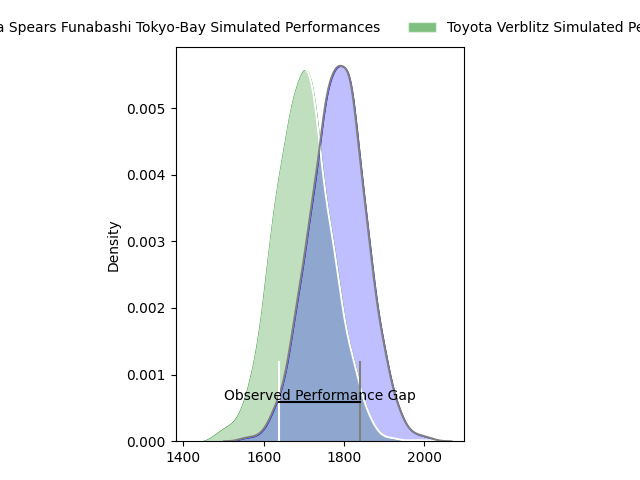
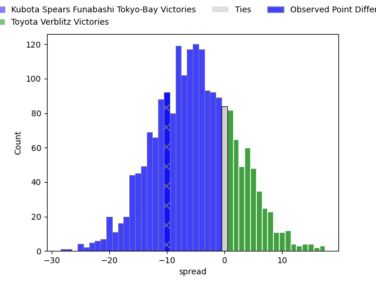
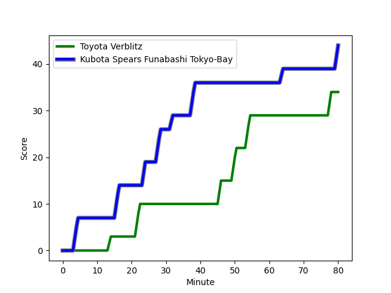
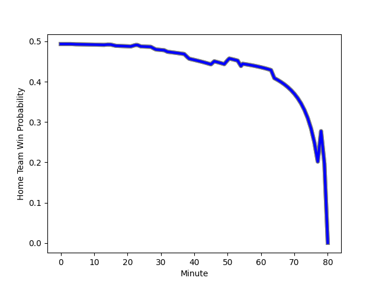

---  
layout: page  
title: Kubota Spears Funabashi Tokyo-Bay at Toyota Verblitz; 44-34  
date: 2023-02-04 06:30:00 18:00:00 -0500  
categories: match review  
---
# Kubota Spears Funabashi Tokyo-Bay at Toyota Verblitz; 44-34

# Club Level Predictions

The first set of predictions treats a club as the smallest object, as the club develops its members, organizes a gameplan, and deploys its players as needed for each match. This club model has a prediction of 0.476, which translates to predicting Kubota Spears Funabashi Tokyo-Bay to win by 0.9.

Each club has a rating and a rating deviation (simiar to a Glicko system), and expected performances can be generated. This allows for simulated matches and spreads like the ones below.
## Projected Performances

## Projected Spreads

## Projected Results

# Player Level Predictions

Treating teams instead as an entity made up of the currently active players, I have ratings for each player in an altogether different system. These can be combined to form team ratings once teamsheets are announced, weighting starters a bit higher than the reserves. After the match is played, players can be weighted by their minutes on the field, allowing for an accurate measure of the team's composition. With these compiled team ratings, we can make predictions, measure inaccuracy, and update the individual player ratings.
## Prediction with Player Minutes: Toyota Verblitz by 2.8

Kubota Spears Funabashi Tokyo-Bay by 1.2 on a neutral field
## Scores over Time

## Win Probability over Time

## Prediction without Player Minutes: Kubota Spears Funabashi Tokyo-Bay by 0.7

Kubota Spears Funabashi Tokyo-Bay by 4.7 on a neutral pitch

|   Away Minutes | Away Player                                                               |   Away elo |   Away Percentile |   Number |   Home Percentile |   Home elo | Home Player                                                           |   Home Minutes |
|---------------:|:--------------------------------------------------------------------------|-----------:|------------------:|---------:|------------------:|-----------:|:----------------------------------------------------------------------|---------------:|
|             47 | [Kota Kaishi](..//playerfiles//KotaKaishi_cleaned.md)                     |     113.94 |                90 |        1 |                77 |     105.68 | [Shogo Miura](..//playerfiles//ShogoMiura_cleaned.md)                 |             80 |
|             80 | [Malcolm Marx](..//playerfiles//MalcolmMarx_cleaned.md)                   |     124.27 |                96 |        2 |                94 |     120.1  | [Yoshikatsu Hikosaka](..//playerfiles//YoshikatsuHikosaka_cleaned.md) |             80 |
|             49 | [Opeti Helu](..//playerfiles//OpetiHelu_cleaned.md)                       |     107.05 |                80 |        3 |                93 |     118.45 | [Yusuke Kizu](..//playerfiles//YusukeKizu_cleaned.md)                 |             40 |
|             80 | [Naoaki Horibe](..//playerfiles//NaoakiHoribe_cleaned.md)                 |      88.78 |                30 |        4 |                58 |      99    | [Daichi Akiyama](..//playerfiles//DaichiAkiyama_cleaned.md)           |             80 |
|             80 | [Yuki Aoki](..//playerfiles//YukiAoki_cleaned.md)                         |      86.41 |                26 |        5 |                61 |     100.41 | [Michael Allardice](..//playerfiles//MichaelAllardice_cleaned.md)     |             72 |
|             54 | [Finau Tupa](..//playerfiles//FinauTupa_cleaned.md)                       |     131.66 |                96 |        6 |                17 |      82.73 | [Will Tupou](..//playerfiles//WillTupou_cleaned.md)                   |             80 |
|             80 | [Lappies Labuschagne](..//playerfiles//LappiesLabuschagne_cleaned.md)     |     104.98 |                72 |        7 |                64 |     101.11 | [Masato Furukawa](..//playerfiles//MasatoFurukawa_cleaned.md)         |             80 |
|             80 | [Takeo Suenaga](..//playerfiles//TakeoSuenaga_cleaned.md)                 |     107.96 |                74 |        8 |                74 |     105.78 | [Kyo Yoshida](..//playerfiles//KyoYoshida_cleaned.md)                 |             80 |
|             54 | [Shinobu Fujiwara](..//playerfiles//ShinobuFujiwara_cleaned.md)           |      93.13 |                42 |        9 |                77 |     107.85 | [Kenta Fukuda](..//playerfiles//KentaFukuda_cleaned.md)               |             59 |
|             80 | [Bernard Foley](..//playerfiles//BernardFoley_cleaned.md)                 |     152.24 |               100 |       10 |                77 |     109.95 | [Tiaan Falcon](..//playerfiles//TiaanFalcon_cleaned.md)               |             80 |
|             80 | [Haruto Kida](..//playerfiles//HarutoKida_cleaned.md)                     |     103.66 |                70 |       11 |               nan |      94.76 | [Shuhei Yamaguchi](..//playerfiles//ShuheiYamaguchi_cleaned.md)       |             40 |
|             74 | [Rikus Pretorius](..//playerfiles//RikusPretorius_cleaned.md)             |      75.73 |                11 |       12 |                90 |     121.28 | [Charlie Lawrence](..//playerfiles//CharlieLawrence_cleaned.md)       |             80 |
|             66 | [Sione Teaupa](..//playerfiles//SioneTeaupa_cleaned.md)                   |      96.72 |                55 |       13 |                91 |     121.74 | [Rob Thompson](..//playerfiles//RobThompson_cleaned.md)               |             80 |
|             80 | [Koga Nezuka](..//playerfiles//KogaNezuka_cleaned.md)                     |      93.19 |                42 |       14 |                23 |      86.5  | [Taichi Takahashi](..//playerfiles//TaichiTakahashi_cleaned.md)       |             80 |
|             80 | [Gerhard van den Heever](..//playerfiles//GerhardvandenHeever_cleaned.md) |     135.48 |                97 |       15 |                48 |      96.5  | [Viliame Tuidraki](..//playerfiles//ViliameTuidraki_cleaned.md)       |             72 |
|             33 | [Kenshi Yamamoto](..//playerfiles//KenshiYamamoto_cleaned.md)             |      91.25 |               nan |       16 |                92 |     127.04 | [Willie le Roux](..//playerfiles//WillieleRoux_cleaned.md)            |             40 |
|             31 | [Shoya Matsunami](..//playerfiles//ShoyaMatsunami_cleaned.md)             |      80.49 |                11 |       17 |                77 |     104.74 | [Shunsuke Asaoka](..//playerfiles//ShunsukeAsaoka_cleaned.md)         |             40 |
|             26 | [Faulua Makisi](..//playerfiles//FauluaMakisi_cleaned.md)                 |      95.4  |                45 |       18 |                61 |     100.1  | [Kaito Shigeno](..//playerfiles//KaitoShigeno_cleaned.md)             |             21 |
|             26 | [Kazuhiro Taniguchi](..//playerfiles//KazuhiroTaniguchi_cleaned.md)       |     113.09 |                91 |       19 |                76 |     109.49 | [Ryoma Nishimura](..//playerfiles//RyomaNishimura_cleaned.md)         |              8 |
|             14 | [Halatoa Vailea](..//playerfiles//HalatoaVailea_cleaned.md)               |      95.2  |                47 |       20 |               nan |      98.29 | [Jamie Henry](..//playerfiles//JamieHenry_cleaned.md)                 |              8 |
|              6 | [Atsushi Oshikawa](..//playerfiles//AtsushiOshikawa_cleaned.md)           |     101.27 |                61 |       21 |               nan |     nan    | nan                                                                   |            nan |

