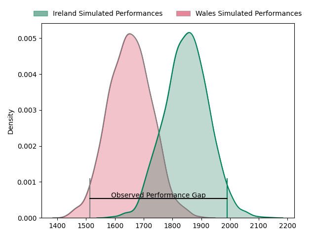
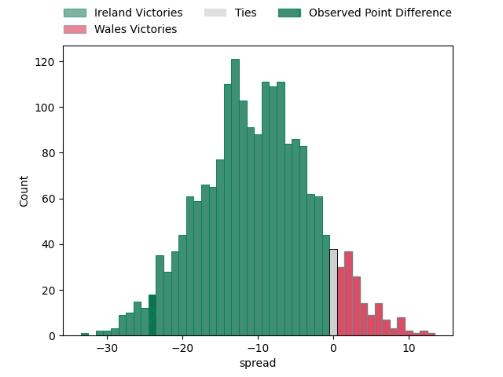
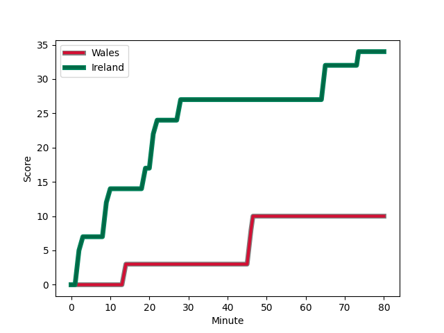

---  
layout: page  
title: Ireland at Wales; 34.0-10.0  
date: 2023-02-04 09:15:00 18:00:00 -0500  
categories: match review  
---
# Ireland at Wales; 34.0-10.0

# Club Level Predictions

The first set of predictions treats a club as the smallest object, as the club develops its members, organizes a gameplan, and deploys its players as needed for each match. This club model has a prediction of 0.251, which translates to predicting Ireland to win by 9.8.

Each club has a rating and a rating deviation (simiar to a Glicko system), and expected performances can be generated. This allows for simulated matches and spreads like the ones below.
## Projected Performances

## Projected Spreads

## Projected Results

# Player Level Predictions

Treating teams instead as an entity made up of the currently active players, I have ratings for each player in an altogether different system. These can be combined to form team ratings once teamsheets are announced, weighting starters a bit higher than the reserves. After the match is played, players can be weighted by their minutes on the field, allowing for an accurate measure of the team's composition. With these compiled team ratings, we can make predictions, measure inaccuracy, and update the individual player ratings.
## Prediction with Player Minutes: Ireland by 19.4

Ireland by 23.4 on a neutral field
## Scores over Time

## Win Probability over Time

## Prediction without Player Minutes: Ireland by 18.2

Ireland by 22.2 on a neutral pitch

|   Away Minutes | Away Player                                                       |   Away elo |   Away Percentile |   Number |   Home Percentile |   Home elo | Home Player                                                   |   Home Minutes |
|---------------:|:------------------------------------------------------------------|-----------:|------------------:|---------:|------------------:|-----------:|:--------------------------------------------------------------|---------------:|
|             74 | [Andrew Porter](..//playerfiles//AndrewPorter_cleaned.md)         |      99.74 |                61 |        1 |                12 |      81.11 | [Gareth Thomas](..//playerfiles//GarethThomas_cleaned.md)     |             54 |
|             74 | [Dan Sheehan](..//playerfiles//DanSheehan_cleaned.md)             |     101.22 |                67 |        2 |                34 |      90.48 | [Ken Owens](..//playerfiles//KenOwens_cleaned.md)             |             61 |
|             60 | [Finlay Bealham](..//playerfiles//FinlayBealham_cleaned.md)       |     100.44 |                64 |        3 |                96 |     122.59 | [Tomas Francis](..//playerfiles//TomasFrancis_cleaned.md)     |             40 |
|             54 | [Tadhg Beirne](..//playerfiles//TadhgBeirne_cleaned.md)           |     131.38 |                96 |        4 |                57 |      98.32 | [Adam Beard](..//playerfiles//AdamBeard_cleaned.md)           |             80 |
|             80 | [James Ryan](..//playerfiles//JamesRyan_cleaned.md)               |     116.1  |                86 |        5 |                77 |     107.69 | [Alun Wyn Jones](..//playerfiles//AlunWynJones_cleaned.md)    |             61 |
|             60 | [Peter O'Mahony](..//playerfiles//PeterO'Mahony_cleaned.md)       |      79.52 |                11 |        6 |                65 |     103.91 | [Jac Morgan](..//playerfiles//JacMorgan_cleaned.md)           |             80 |
|             80 | [Josh van der Flier](..//playerfiles//JoshvanderFlier_cleaned.md) |     127.83 |                95 |        7 |                90 |     119.99 | [Justin Tipuric](..//playerfiles//JustinTipuric_cleaned.md)   |             54 |
|             80 | [Caelan Doris](..//playerfiles//CaelanDoris_cleaned.md)           |     135.58 |                97 |        8 |                48 |      97.03 | [Taulupe Faletau](..//playerfiles//TaulupeFaletau_cleaned.md) |             80 |
|             64 | [Conor Murray](..//playerfiles//ConorMurray_cleaned.md)           |     144.08 |                99 |        9 |                85 |     111.88 | [Tomos Williams](..//playerfiles//TomosWilliams_cleaned.md)   |             64 |
|             69 | [Johnny Sexton](..//playerfiles//JohnnySexton_cleaned.md)         |     149.53 |                99 |       10 |                97 |     134.34 | [Dan Biggar](..//playerfiles//DanBiggar_cleaned.md)           |             68 |
|             80 | [James Lowe](..//playerfiles//JamesLowe_cleaned.md)               |     149.18 |                99 |       11 |                 3 |      62.8  | [Rio Dyer](..//playerfiles//RioDyer_cleaned.md)               |             69 |
|             60 | [Stuart McCloskey](..//playerfiles//StuartMcCloskey_cleaned.md)   |     136.87 |                98 |       12 |                13 |      80.38 | [Joe Hawkins](..//playerfiles//JoeHawkins_cleaned.md)         |             80 |
|             80 | [Garry Ringrose](..//playerfiles//GarryRingrose_cleaned.md)       |      93.7  |                43 |       13 |                78 |     111.23 | [George North](..//playerfiles//GeorgeNorth_cleaned.md)       |             80 |
|             80 | [Mack Hansen](..//playerfiles//MackHansen_cleaned.md)             |      97.74 |                50 |       14 |                47 |      95.76 | [Josh Adams](..//playerfiles//JoshAdams_cleaned.md)           |             80 |
|             80 | [Hugo Keenan](..//playerfiles//HugoKeenan_cleaned.md)             |     141.46 |                97 |       15 |                98 |     145.82 | [Liam Williams](..//playerfiles//LiamWilliams_cleaned.md)     |             80 |
|              6 | [Rob Herring](..//playerfiles//RobHerring_cleaned.md)             |      95.4  |                53 |       16 |                68 |     102.33 | [Scott Baldwin](..//playerfiles//ScottBaldwin_cleaned.md)     |             19 |
|              6 | [Dave Kilcoyne](..//playerfiles//DaveKilcoyne_cleaned.md)         |     134.12 |                98 |       17 |                17 |      84.4  | [Rhys Carré](..//playerfiles//RhysCarré_cleaned.md)           |             26 |
|             20 | [Tom O'Toole](..//playerfiles//TomO'Toole_cleaned.md)             |      88.96 |                29 |       18 |                79 |     106.9  | [Dillon Lewis](..//playerfiles//DillonLewis_cleaned.md)       |             40 |
|             26 | [Iain Henderson](..//playerfiles//IainHenderson_cleaned.md)       |     115.59 |                87 |       19 |                87 |     116.67 | [Dafydd Jenkins](..//playerfiles//DafyddJenkins_cleaned.md)   |             19 |
|             20 | [Jack Conan](..//playerfiles//JackConan_cleaned.md)               |     131.55 |                98 |       20 |                83 |     112.82 | [Tommy Reffell](..//playerfiles//TommyReffell_cleaned.md)     |             26 |
|             16 | [Craig Casey](..//playerfiles//CraigCasey_cleaned.md)             |     111.65 |                85 |       21 |                87 |     112.8  | [Rhys Webb](..//playerfiles//RhysWebb_cleaned.md)             |             16 |
|             11 | [Ross Byrne](..//playerfiles//RossByrne_cleaned.md)               |     112.43 |                80 |       22 |                85 |     117.55 | [Owen Williams](..//playerfiles//OwenWilliams_cleaned.md)     |             12 |
|             20 | [Bundee Aki](..//playerfiles//BundeeAki_cleaned.md)               |     136.89 |                98 |       23 |                95 |     127.83 | [Alex Cuthbert](..//playerfiles//AlexCuthbert_cleaned.md)     |             11 |

