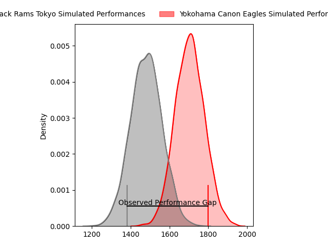
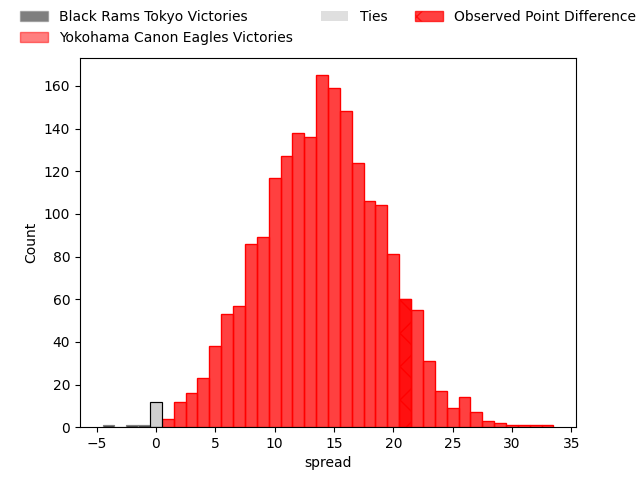
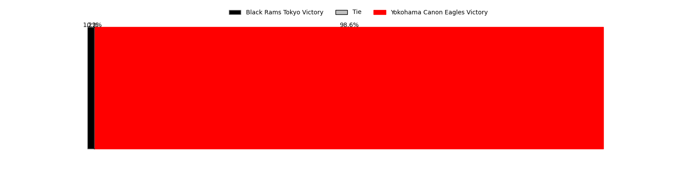
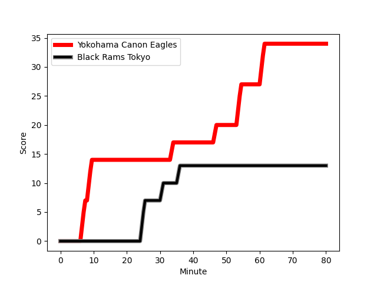
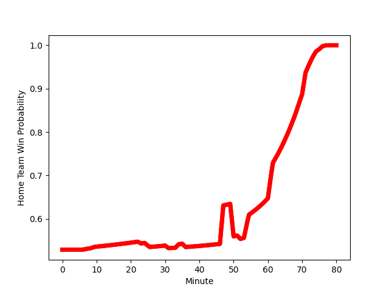

---  
layout: page  
title: Black Rams Tokyo at Yokohama Canon Eagles; 13-34  
date: 2023-02-04 06:30:00 18:00:00 -0500  
categories: match review  
---
# Black Rams Tokyo at Yokohama Canon Eagles; 13-34

# Club Level Predictions

The first set of predictions treats a club as the smallest object, as the club develops its members, organizes a gameplan, and deploys its players as needed for each match. This club model has a prediction of 0.827, which translates to predicting Yokohama Canon Eagles to win by 14.0.

Each club has a rating and a rating deviation (simiar to a Glicko system), and expected performances can be generated. This allows for simulated matches and spreads like the ones below.
## Projected Performances

## Projected Spreads

## Projected Results

# Player Level Predictions

Treating teams instead as an entity made up of the currently active players, I have ratings for each player in an altogether different system. These can be combined to form team ratings once teamsheets are announced, weighting starters a bit higher than the reserves. After the match is played, players can be weighted by their minutes on the field, allowing for an accurate measure of the team's composition. With these compiled team ratings, we can make predictions, measure inaccuracy, and update the individual player ratings.
## Prediction with Player Minutes: Yokohama Canon Eagles by 9.1

Yokohama Canon Eagles by 5.1 on a neutral field
## Scores over Time

## Win Probability over Time

## Prediction without Player Minutes: Yokohama Canon Eagles by 12.3

Yokohama Canon Eagles by 8.3 on a neutral pitch

|   Away Minutes | Away Player                                                       |   Away elo |   Away Percentile |   Number |   Home Percentile |   Home elo | Home Player                                                         |   Home Minutes |
|---------------:|:------------------------------------------------------------------|-----------:|------------------:|---------:|------------------:|-----------:|:--------------------------------------------------------------------|---------------:|
|             57 | [Kazuma Nishi](..//playerfiles//KazumaNishi_cleaned.md)           |      90.04 |                23 |        1 |                97 |     126.91 | [Takato Okabe](..//playerfiles//TakatoOkabe_cleaned.md)             |             61 |
|             71 | [Kazuhiro Koike](..//playerfiles//KazuhiroKoike_cleaned.md)       |      96.26 |                54 |        2 |                45 |      93.44 | [Yusaku Miyoshi](..//playerfiles//YusakuMiyoshi_cleaned.md)         |             69 |
|             47 | [Daigo Sasagawa](..//playerfiles//DaigoSasagawa_cleaned.md)       |      99.55 |                60 |        3 |                75 |     104.6  | [Rento Tsukayama](..//playerfiles//RentoTsukayama_cleaned.md)       |             61 |
|             80 | [Josh Goodhue](..//playerfiles//JoshGoodhue_cleaned.md)           |      96.72 |                52 |        4 |                57 |      98.5  | [Kobus Van Dyk](..//playerfiles//KobusVanDyk_cleaned.md)            |             80 |
|             57 | [Pohiva Lotoahea](..//playerfiles//PohivaLotoahea_cleaned.md)     |     128.23 |                95 |        5 |                45 |      93.45 | [Liaki Moli](..//playerfiles//LiakiMoli_cleaned.md)                 |             80 |
|             80 | [Daiki Yanagawa](..//playerfiles//DaikiYanagawa_cleaned.md)       |      61.02 |                 1 |        6 |                67 |     102.38 | [Sioeli Vakalahi](..//playerfiles//SioeliVakalahi_cleaned.md)       |             75 |
|             23 | [Shuhei Matsuhashi](..//playerfiles//ShuheiMatsuhashi_cleaned.md) |     100.05 |                61 |        7 |                17 |      82.45 | [Naoto Shimada](..//playerfiles//NaotoShimada_cleaned.md)           |             80 |
|             80 | [Talau Fakatava](..//playerfiles//TalauFakatava_cleaned.md)       |     108.76 |                76 |        8 |                73 |     102.94 | [Sione Halasili](..//playerfiles//SioneHalasili_cleaned.md)         |             52 |
|             57 | [Toshiya Takahashi](..//playerfiles//ToshiyaTakahashi_cleaned.md) |      90.48 |                34 |        9 |                80 |     109.14 | [Faf de Klerk](..//playerfiles//FafdeKlerk_cleaned.md)              |             27 |
|             80 | [Isaac Lucas](..//playerfiles//IsaacLucas_cleaned.md)             |     123.03 |                91 |       10 |                93 |     125.1  | [Jumpei Ogura](..//playerfiles//JumpeiOgura_cleaned.md)             |             55 |
|             80 | [Netani Vakayalia](..//playerfiles//NetaniVakayalia_cleaned.md)   |     108.26 |                77 |       11 |                94 |     127.18 | [Viliame Takayawa](..//playerfiles//ViliameTakayawa_cleaned.md)     |             50 |
|             57 | [Hadleigh Parkes](..//playerfiles//HadleighParkes_cleaned.md)     |     113.82 |                83 |       12 |                13 |      80.17 | [Yusuke Kajimura](..//playerfiles//YusukeKajimura_cleaned.md)       |             80 |
|             71 | [Yuki Ikeda](..//playerfiles//YukiIkeda_cleaned.md)               |      85.81 |                24 |       13 |                99 |     143.1  | [Jesse Kriel](..//playerfiles//JesseKriel_cleaned.md)               |             80 |
|             80 | [Main Taira](..//playerfiles//MainTaira_cleaned.md)               |      97.14 |                53 |       14 |                73 |     105.58 | [Inoke Burua](..//playerfiles//InokeBurua_cleaned.md)               |             80 |
|             80 | [Matt McGahan](..//playerfiles//MattMcGahan_cleaned.md)           |     129.31 |                93 |       15 |                84 |     116.29 | [SP Marais](..//playerfiles//SPMarais_cleaned.md)                   |             80 |
|             57 | [Brodi McCurran](..//playerfiles//BrodiMcCurran_cleaned.md)       |     114.74 |                84 |       16 |                89 |     114.11 | [Kouki Arai](..//playerfiles//KoukiArai_cleaned.md)                 |             53 |
|             33 | [Kazuhiro Shibata](..//playerfiles//KazuhiroShibata_cleaned.md)   |      97.52 |               nan |       17 |                 7 |      73.48 | [Masayoshi Takezawa](..//playerfiles//MasayoshiTakezawa_cleaned.md) |             30 |
|             23 | [Nathan Hughes](..//playerfiles//NathanHughes_cleaned.md)         |      97.63 |                49 |       18 |                31 |      89.23 | [Mitch Brown](..//playerfiles//MitchBrown_cleaned.md)               |             28 |
|             23 | [Takeo Makabe](..//playerfiles//TakeoMakabe_cleaned.md)           |      80.71 |               nan |       19 |                56 |      99.32 | [Yu Tamura](..//playerfiles//YuTamura_cleaned.md)                   |             25 |
|             23 | [Ryohei Isoda](..//playerfiles//RyoheiIsoda_cleaned.md)           |     114.29 |                85 |       20 |               nan |      98.34 | [Chang Ho Ahn](..//playerfiles//ChangHoAhn_cleaned.md)              |             19 |
|             23 | [Takanobu Minami](..//playerfiles//TakanobuMinami_cleaned.md)     |      95.13 |                47 |       21 |               nan |      99.65 | [Shouta Matsuoka](..//playerfiles//ShoutaMatsuoka_cleaned.md)       |             19 |
|              9 | [Yuuki Mori](..//playerfiles//YuukiMori_cleaned.md)               |      76.93 |                 7 |       22 |                61 |      99.06 | [Yusuke Niwai](..//playerfiles//YusukeNiwai_cleaned.md)             |             11 |
|              9 | [Yuta Kurihara](..//playerfiles//YutaKurihara_cleaned.md)         |      78.76 |                11 |       23 |                94 |     126.85 | [Ryota Suginaga](..//playerfiles//RyotaSuginaga_cleaned.md)         |              5 |

