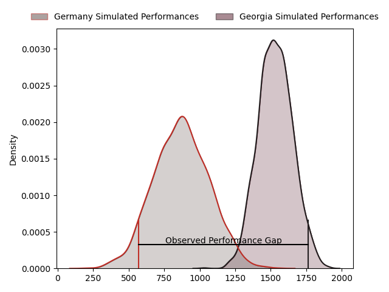
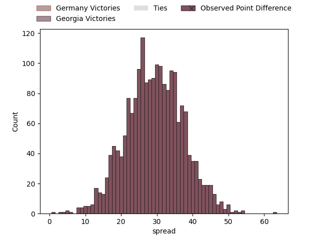
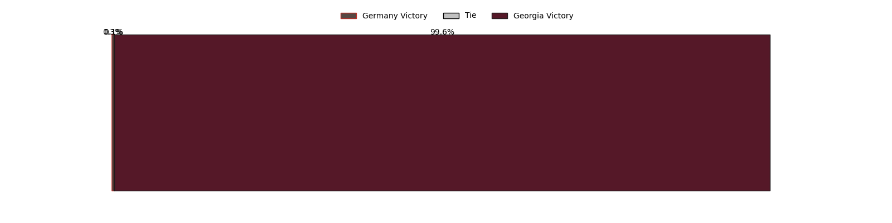

---  
layout: page  
title: Germany at Georgia; 12-75  
date: 2023-02-05 10:00:00 18:00:00 -0500  
categories: match review  
---
# Germany at Georgia; 12-75

# Club Level Predictions

The first set of predictions treats a club as the smallest object, as the club develops its members, organizes a gameplan, and deploys its players as needed for each match. This club model has a prediction of 0.966, which translates to predicting Georgia to win by 31.4.

Each club has a rating and a rating deviation (simiar to a Glicko system), and expected performances can be generated. This allows for simulated matches and spreads like the ones below.
## Projected Performances

## Projected Spreads

## Projected Results

# Player Level Predictions

Treating teams instead as an entity made up of the currently active players, I have ratings for each player in an altogether different system. These can be combined to form team ratings once teamsheets are announced, weighting starters a bit higher than the reserves. After the match is played, players can be weighted by their minutes on the field, allowing for an accurate measure of the team's composition. With these compiled team ratings, we can make predictions, measure inaccuracy, and update the individual player ratings.
## Prediction with Player Minutes: Georgia by 28.2

Georgia by 24.2 on a neutral field
## Prediction without Player Minutes: Georgia by 28.2

Georgia by 24.2 on a neutral pitch

|   Away Minutes | Away Player                                                          |   Away elo |   Away Percentile |   Number |   Home Percentile |   Home elo | Home Player                                                           |   Home Minutes |
|---------------:|:---------------------------------------------------------------------|-----------:|------------------:|---------:|------------------:|-----------:|:----------------------------------------------------------------------|---------------:|
|             80 | [Jörn Schroder](..//playerfiles//JörnSchroder_cleaned.md)            |      84.11 |               nan |        1 |                71 |     102.99 | [Nika Abuladze](..//playerfiles//NikaAbuladze_cleaned.md)             |             80 |
|             80 | [Andrew Reintges](..//playerfiles//AndrewReintges_cleaned.md)        |      95    |               nan |        2 |                72 |     102.82 | [Shalva Mamukashvili](..//playerfiles//ShalvaMamukashvili_cleaned.md) |             80 |
|             80 | [Paul Weiss](..//playerfiles//PaulWeiss_cleaned.md)                  |      70.36 |               nan |        3 |                 2 |      69.44 | [Guram Papidze](..//playerfiles//GuramPapidze_cleaned.md)             |             80 |
|             80 | [Michel Himmer](..//playerfiles//MichelHimmer_cleaned.md)            |      95    |               nan |        4 |                98 |     139.84 | [Nodar Cheishvili](..//playerfiles//NodarCheishvili_cleaned.md)       |             80 |
|             80 | [Hassan Omar Rayan](..//playerfiles//HassanOmarRayan_cleaned.md)     |      95    |               nan |        5 |                 6 |      71.47 | [Kote Mikautadze](..//playerfiles//KoteMikautadze_cleaned.md)         |             80 |
|             80 | [Sebastien Ferreira](..//playerfiles//SebastienFerreira_cleaned.md)  |      68.77 |               nan |        6 |                89 |     118.09 | [Giorgi Tsutskeridze](..//playerfiles//GiorgiTsutskeridze_cleaned.md) |             80 |
|             80 | [Robert Lehmann](..//playerfiles//RobertLehmann_cleaned.md)          |      77.71 |               nan |        7 |                56 |      98.36 | [Beka Saghinadze](..//playerfiles//BekaSaghinadze_cleaned.md)         |             80 |
|             80 | [Oliver Stein](..//playerfiles//OliverStein_cleaned.md)              |      95    |               nan |        8 |                72 |     106.68 | [Tornike Jalagonia](..//playerfiles//TornikeJalagonia_cleaned.md)     |             80 |
|             80 | [Oliver Paine](..//playerfiles//OliverPaine_cleaned.md)              |      63.69 |               nan |        9 |                91 |     116.97 | [Vaso Lobzhanidze](..//playerfiles//VasoLobzhanidze_cleaned.md)       |             80 |
|             80 | [Eduardo Stella](..//playerfiles//EduardoStella_cleaned.md)          |      95    |               nan |       10 |                86 |     118.02 | [Luka Matkava](..//playerfiles//LukaMatkava_cleaned.md)               |             80 |
|             80 | [Felix Lammers](..//playerfiles//FelixLammers_cleaned.md)            |      77.81 |               nan |       11 |               nan |      95    | [Otar Lashkhi](..//playerfiles//OtarLashkhi_cleaned.md)               |             80 |
|             80 | [Leo Wolf](..//playerfiles//LeoWolf_cleaned.md)                      |      95    |               nan |       12 |               nan |      79.89 | [Lasha Malaguradze](..//playerfiles//LashaMalaguradze_cleaned.md)     |             80 |
|             80 | [Sebastian Rodwell](..//playerfiles//SebastianRodwell_cleaned.md)    |      88.41 |               nan |       13 |               nan |      95    | [Tornike Kakhoidze](..//playerfiles//TornikeKakhoidze_cleaned.md)     |             80 |
|             80 | [Zinzan Henrick Hees](..//playerfiles//ZinzanHenrickHees_cleaned.md) |      95    |               nan |       14 |                71 |     104.23 | [Akaki Tabutsadze](..//playerfiles//AkakiTabutsadze_cleaned.md)       |             80 |
|             80 | [Maximilian Kopp](..//playerfiles//MaximilianKopp_cleaned.md)        |      95    |               nan |       15 |                84 |     113.6  | [Miriani Modebadze](..//playerfiles//MirianiModebadze_cleaned.md)     |             80 |

