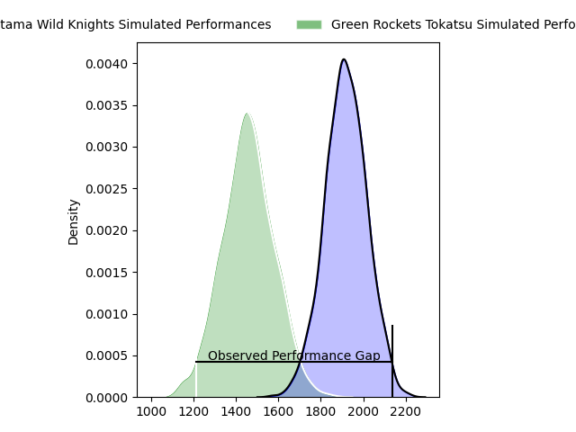
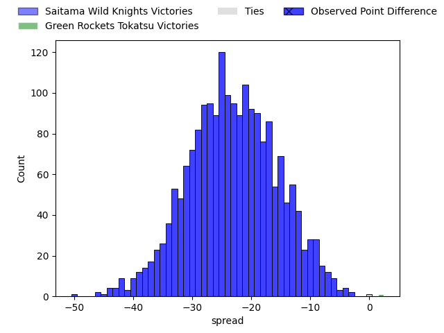
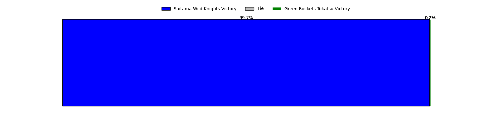
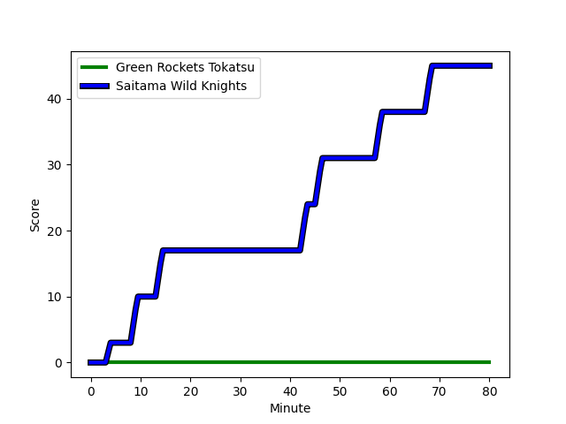
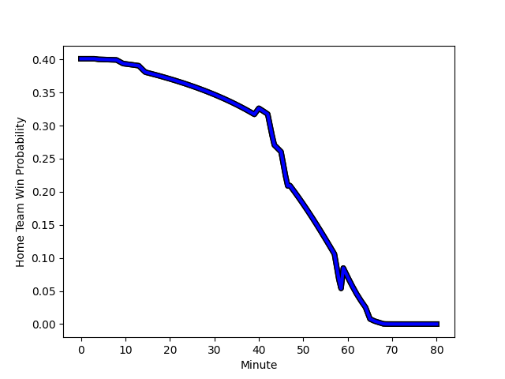

---  
layout: page  
title: Saitama Wild Knights at Green Rockets Tokatsu; 45-0  
date: 2023-02-05 06:30:00 18:00:00 -0500  
categories: match review  
---
# Saitama Wild Knights at Green Rockets Tokatsu; 45-0

# Club Level Predictions

The first set of predictions treats a club as the smallest object, as the club develops its members, organizes a gameplan, and deploys its players as needed for each match. This club model has a prediction of 0.074, which translates to predicting Saitama Wild Knights to win by 23.0.

Each club has a rating and a rating deviation (simiar to a Glicko system), and expected performances can be generated. This allows for simulated matches and spreads like the ones below.
## Projected Performances

## Projected Spreads

## Projected Results

# Player Level Predictions

Treating teams instead as an entity made up of the currently active players, I have ratings for each player in an altogether different system. These can be combined to form team ratings once teamsheets are announced, weighting starters a bit higher than the reserves. After the match is played, players can be weighted by their minutes on the field, allowing for an accurate measure of the team's composition. With these compiled team ratings, we can make predictions, measure inaccuracy, and update the individual player ratings.
## Prediction with Player Minutes: Saitama Wild Knights by 13.4

Saitama Wild Knights by 17.4 on a neutral field
## Scores over Time

## Win Probability over Time

There were 4 large changes in win probability in this match
## Prediction without Player Minutes: Saitama Wild Knights by 16.9

Saitama Wild Knights by 20.9 on a neutral pitch

|   Away Minutes | Away Player                                                     |   Away elo |   Away Percentile |   Number |   Home Percentile |   Home elo | Home Player                                                         |   Home Minutes |
|---------------:|:----------------------------------------------------------------|-----------:|------------------:|---------:|------------------:|-----------:|:--------------------------------------------------------------------|---------------:|
|             59 | [Craig Millar](..//playerfiles//CraigMillar_cleaned.md)         |      96.02 |                49 |        1 |                64 |     100.07 | [Sunao Takizawa](..//playerfiles//SunaoTakizawa_cleaned.md)         |             40 |
|             59 | [Atsushi Sakate](..//playerfiles//AtsushiSakate_cleaned.md)     |     102.95 |                72 |        2 |                 5 |      73.67 | [Yo Sato](..//playerfiles//YoSato_cleaned.md)                       |             59 |
|             59 | [Taiki Fujii](..//playerfiles//TaikiFujii_cleaned.md)           |      95.47 |                48 |        3 |                66 |      96.47 | [Keisuke Kikuta](..//playerfiles//KeisukeKikuta_cleaned.md)         |             40 |
|             80 | [Liam Mitchell](..//playerfiles//LiamMitchell_cleaned.md)       |      91.38 |                37 |        4 |                10 |      76.68 | [Daiki Yamagiwa](..//playerfiles//DaikiYamagiwa_cleaned.md)         |             65 |
|             63 | [Lood de Jager](..//playerfiles//LooddeJager_cleaned.md)        |      96.37 |                51 |        5 |                41 |      90.62 | [Luke Porter](..//playerfiles//LukePorter_cleaned.md)               |             80 |
|             80 | [Shota Fukui](..//playerfiles//ShotaFukui_cleaned.md)           |     105.93 |                68 |        6 |                75 |     106.83 | [Whetu Douglas](..//playerfiles//WhetuDouglas_cleaned.md)           |             80 |
|             80 | [Ben Gunter](..//playerfiles//BenGunter_cleaned.md)             |     128.16 |                95 |        7 |                80 |     111.34 | [Tatsuru Owada](..//playerfiles//TatsuruOwada_cleaned.md)           |             80 |
|             63 | [Jack Cornelsen](..//playerfiles//JackCornelsen_cleaned.md)     |     121.41 |                91 |        8 |                76 |     108.79 | [Aseri Masivou](..//playerfiles//AseriMasivou_cleaned.md)           |             59 |
|             70 | [Taiki Koyama](..//playerfiles//TaikiKoyama_cleaned.md)         |     129.75 |                97 |        9 |                85 |     111.57 | [Nick Phipps](..//playerfiles//NickPhipps_cleaned.md)               |             59 |
|             80 | [Rikiya Matsuda](..//playerfiles//RikiyaMatsuda_cleaned.md)     |     100.56 |                59 |       10 |                16 |      84.85 | [Doga Maeda](..//playerfiles//DogaMaeda_cleaned.md)                 |             80 |
|             63 | [Marika Koroibete](..//playerfiles//MarikaKoroibete_cleaned.md) |      94.6  |                46 |       11 |                76 |     107.15 | [Kenta Omata](..//playerfiles//KentaOmata_cleaned.md)               |             80 |
|             80 | [Tomoki Osada](..//playerfiles//TomokiOsada_cleaned.md)         |     106.43 |                73 |       12 |                46 |      94.91 | [Christian Laui](..//playerfiles//ChristianLaui_cleaned.md)         |             80 |
|             65 | [Dylan Riley](..//playerfiles//DylanRiley_cleaned.md)           |     126.66 |                94 |       13 |                30 |      88.15 | [Koichi Matsura](..//playerfiles//KoichiMatsura_cleaned.md)         |             80 |
|             80 | [Semisi Tupou](..//playerfiles//SemisiTupou_cleaned.md)         |      96.64 |                52 |       14 |                50 |      95.66 | [Lomano Lemeki](..//playerfiles//LomanoLemeki_cleaned.md)           |             80 |
|             80 | [Ryuji Noguchi](..//playerfiles//RyujiNoguchi_cleaned.md)       |     107.64 |                76 |       15 |                13 |      77.91 | [Tom Marshall](..//playerfiles//TomMarshall_cleaned.md)             |             47 |
|             21 | [Daniel Perez](..//playerfiles//DanielPerez_cleaned.md)         |      95    |               nan |       16 |                67 |     101.5  | [Gakuto Ishida](..//playerfiles//GakutoIshida_cleaned.md)           |             40 |
|             21 | [Shota Horie](..//playerfiles//ShotaHorie_cleaned.md)           |     126.95 |               nan |       17 |                93 |     121.1  | [Satoshi Ueda](..//playerfiles//SatoshiUeda_cleaned.md)             |             40 |
|             21 | [Asaeli Ai Valu](..//playerfiles//AsaeliAiValu_cleaned.md)      |     131.04 |                98 |       18 |               nan |      89.78 | [Taqele Naiyaravoro](..//playerfiles//TaqeleNaiyaravoro_cleaned.md) |             33 |
|             17 | [Lachlan Boshier](..//playerfiles//LachlanBoshier_cleaned.md)   |      99.54 |                60 |       19 |                42 |      92.53 | [Myuu Arai](..//playerfiles//MyuuArai_cleaned.md)                   |             21 |
|             17 | [Takuya Yamasawa](..//playerfiles//TakuyaYamasawa_cleaned.md)   |     112.87 |                79 |       20 |                60 |     101.44 | [George Risale](..//playerfiles//GeorgeRisale_cleaned.md)           |             21 |
|             17 | [Ryota Hasegawa](..//playerfiles//RyotaHasegawa_cleaned.md)     |     154.3  |                99 |       21 |                83 |     111    | [Fumiaki Tanaka](..//playerfiles//FumiakiTanaka_cleaned.md)         |             21 |
|             15 | [Vince Aso](..//playerfiles//VinceAso_cleaned.md)               |     109.71 |                78 |       22 |                24 |      85.94 | [Yoshiya Hosoda](..//playerfiles//YoshiyaHosoda_cleaned.md)         |             15 |
|             10 | [Keisuke Uchida](..//playerfiles//KeisukeUchida_cleaned.md)     |     110.53 |                83 |       23 |               nan |     nan    | nan                                                                 |            nan |

