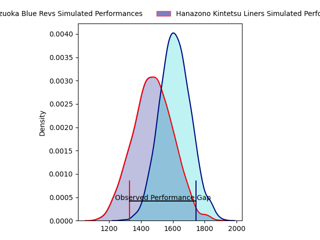
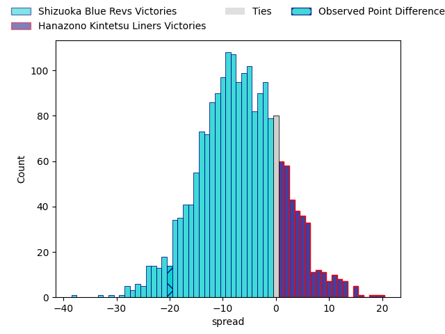
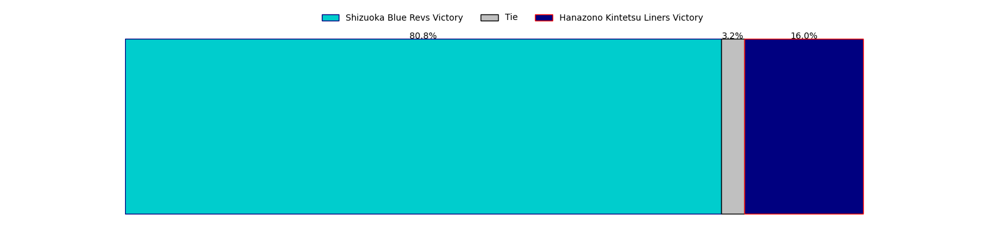
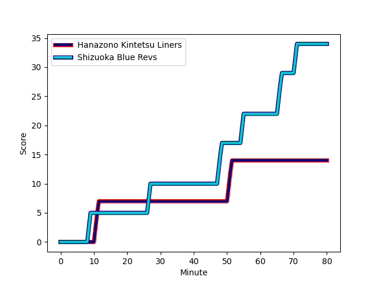
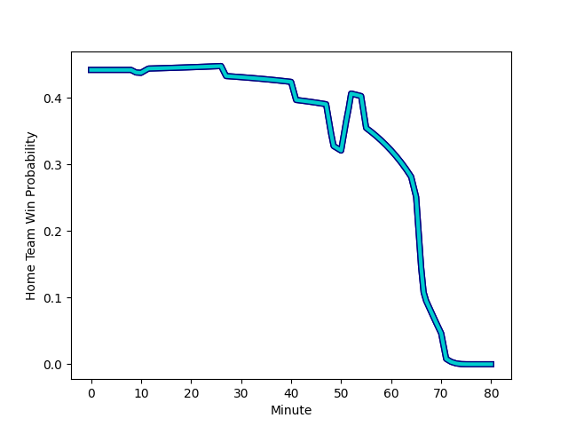

---  
layout: page  
title: Shizuoka Blue Revs at Hanazono Kintetsu Liners; 34-14  
date: 2023-02-05 06:30:00 18:00:00 -0500  
categories: match review  
---
# Shizuoka Blue Revs at Hanazono Kintetsu Liners; 34-14

# Club Level Predictions

The first set of predictions treats a club as the smallest object, as the club develops its members, organizes a gameplan, and deploys its players as needed for each match. This club model has a prediction of 0.317, which translates to predicting Shizuoka Blue Revs to win by 7.0.

Each club has a rating and a rating deviation (simiar to a Glicko system), and expected performances can be generated. This allows for simulated matches and spreads like the ones below.
## Projected Performances

## Projected Spreads

## Projected Results

# Player Level Predictions

Treating teams instead as an entity made up of the currently active players, I have ratings for each player in an altogether different system. These can be combined to form team ratings once teamsheets are announced, weighting starters a bit higher than the reserves. After the match is played, players can be weighted by their minutes on the field, allowing for an accurate measure of the team's composition. With these compiled team ratings, we can make predictions, measure inaccuracy, and update the individual player ratings.
## Prediction with Player Minutes: Shizuoka Blue Revs by 6.1

Shizuoka Blue Revs by 10.1 on a neutral field
## Scores over Time

## Win Probability over Time

There were 8 large changes in win probability in this match
## Prediction without Player Minutes: Shizuoka Blue Revs by 6.5

Shizuoka Blue Revs by 10.5 on a neutral pitch

|   Away Minutes | Away Player                                                         |   Away elo |   Away Percentile |   Number |   Home Percentile |   Home elo | Home Player                                                       |   Home Minutes |
|---------------:|:--------------------------------------------------------------------|-----------:|------------------:|---------:|------------------:|-----------:|:------------------------------------------------------------------|---------------:|
|             73 | [Kazuhiro Kawata](..//playerfiles//KazuhiroKawata_cleaned.md)       |     100.89 |                65 |        1 |                20 |      86.23 | [Kenta Tanaka](..//playerfiles//KentaTanaka_cleaned.md)           |             77 |
|             77 | [Takeshi Hino](..//playerfiles//TakeshiHino_cleaned.md)             |      95.62 |                52 |        2 |                90 |     115.27 | [Atsushi Kashimoto](..//playerfiles//AtsushiKashimoto_cleaned.md) |             65 |
|             73 | [Heiichiro Ito](..//playerfiles//HeiichiroIto_cleaned.md)           |      95.48 |                49 |        3 |                34 |      91.02 | [Kota Mitake](..//playerfiles//KotaMitake_cleaned.md)             |             67 |
|             80 | [Yuya Odo](..//playerfiles//YuyaOdo_cleaned.md)                     |     117.24 |                88 |        4 |                61 |     100.46 | [Tsuyoshi Murata](..//playerfiles//TsuyoshiMurata_cleaned.md)     |             80 |
|             55 | [Eishin Kuwano](..//playerfiles//EishinKuwano_cleaned.md)           |     123.77 |                93 |        5 |                94 |     126.22 | [Ben Toolis](..//playerfiles//BenToolis_cleaned.md)               |             41 |
|             55 | [Riki Sugihara](..//playerfiles//RikiSugihara_cleaned.md)           |      92.59 |                41 |        6 |                13 |      80.8  | [Takahito Sugahara](..//playerfiles//TakahitoSugahara_cleaned.md) |             80 |
|             80 | [Richard Goh Jones](..//playerfiles//RichardGohJones_cleaned.md)    |      91.81 |                39 |        7 |                80 |     110.03 | [Shohei Nonaka](..//playerfiles//ShoheiNonaka_cleaned.md)         |             80 |
|             80 | [Kwagga Smith](..//playerfiles//KwaggaSmith_cleaned.md)             |     110.94 |                78 |        8 |                61 |     101.76 | [Jed Brown](..//playerfiles//JedBrown_cleaned.md)                 |             65 |
|             55 | [Bryn Hall](..//playerfiles//BrynHall_cleaned.md)                   |     126.67 |                97 |        9 |                60 |      99.5  | [Will Genia](..//playerfiles//WillGenia_cleaned.md)               |             77 |
|             80 | [Sho Kiyohara](..//playerfiles//ShoKiyohara_cleaned.md)             |      83.79 |                15 |       10 |                18 |      85.4  | [Takumi Yoshimoto](..//playerfiles//TakumiYoshimoto_cleaned.md)   |             77 |
|             80 | [Malo Tuitama](..//playerfiles//MaloTuitama_cleaned.md)             |     118.62 |                88 |       11 |                16 |      82.18 | [Yoshizumi Takeda](..//playerfiles//YoshizumiTakeda_cleaned.md)   |             52 |
|             80 | [Viliami Tahitu'a](..//playerfiles//ViliamiTahitu'a_cleaned.md)     |      98.3  |                56 |       12 |                99 |     142.74 | [Patrick Stehlin](..//playerfiles//PatrickStehlin_cleaned.md)     |             80 |
|             77 | [Hiroto Kobayashi](..//playerfiles//HirotoKobayashi_cleaned.md)     |     116.28 |                87 |       13 |                11 |      77.28 | [Siosaia Fifita](..//playerfiles//SiosaiaFifita_cleaned.md)       |             80 |
|             77 | [Kakeru Okumura](..//playerfiles//KakeruOkumura_cleaned.md)         |      98.88 |                59 |       14 |                 9 |      75.19 | [Joshua Nohra](..//playerfiles//JoshuaNohra_cleaned.md)           |             80 |
|             80 | [Futo Yamaguchi](..//playerfiles//FutoYamaguchi_cleaned.md)         |     104.63 |                65 |       15 |                72 |     108.34 | [Semisi Masirewa](..//playerfiles//SemisiMasirewa_cleaned.md)     |             80 |
|             25 | [Samuela Anise](..//playerfiles//SamuelaAnise_cleaned.md)           |      92.52 |                44 |       16 |                31 |      83.02 | [Patrick Tafa](..//playerfiles//PatrickTafa_cleaned.md)           |             39 |
|             25 | [Murray Douglas](..//playerfiles//MurrayDouglas_cleaned.md)         |     115.88 |                86 |       17 |               nan |     121.06 | [Tatsuma Nanto](..//playerfiles//TatsumaNanto_cleaned.md)         |             28 |
|             25 | [Yuki Yatomi](..//playerfiles//YukiYatomi_cleaned.md)               |     105.98 |                75 |       18 |               nan |      92.27 | [Kazuma Matsuda](..//playerfiles//KazumaMatsuda_cleaned.md)       |             15 |
|              7 | [Shintaro Okamoto](..//playerfiles//ShintaroOkamoto_cleaned.md)     |      95.06 |               nan |       19 |                35 |      89.35 | [Hayato Yokoi](..//playerfiles//HayatoYokoi_cleaned.md)           |             15 |
|              3 | [Richmond Tongatama](..//playerfiles//RichmondTongatama_cleaned.md) |      94.62 |               nan |       20 |                 7 |      74.92 | [Lata Tangimana](..//playerfiles//LataTangimana_cleaned.md)       |             13 |
|              3 | [Kenta Shikao](..//playerfiles//KentaShikao_cleaned.md)             |     132.34 |                97 |       21 |                 3 |      67.61 | [Koji Okamura](..//playerfiles//KojiOkamura_cleaned.md)           |              3 |
|              3 | [Tomokazu Kira](..//playerfiles//TomokazuKira_cleaned.md)           |      93.21 |                42 |       22 |                59 |      99.1  | [Kotaro Takahashi](..//playerfiles//KotaroTakahashi_cleaned.md)   |              3 |
|              7 | [Bunkei Kaku](..//playerfiles//BunkeiKaku_cleaned.md)               |      93.82 |               nan |       23 |                72 |      95.6  | [Keitaro Hitora](..//playerfiles//KeitaroHitora_cleaned.md)       |              3 |

