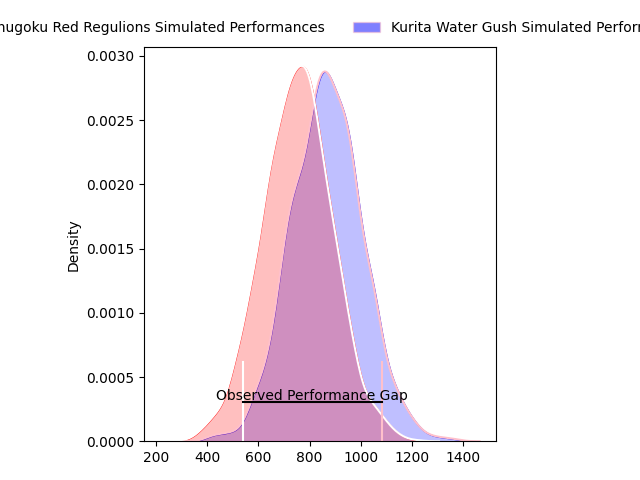
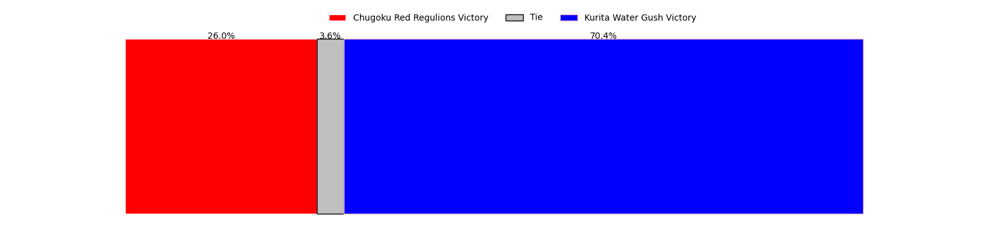
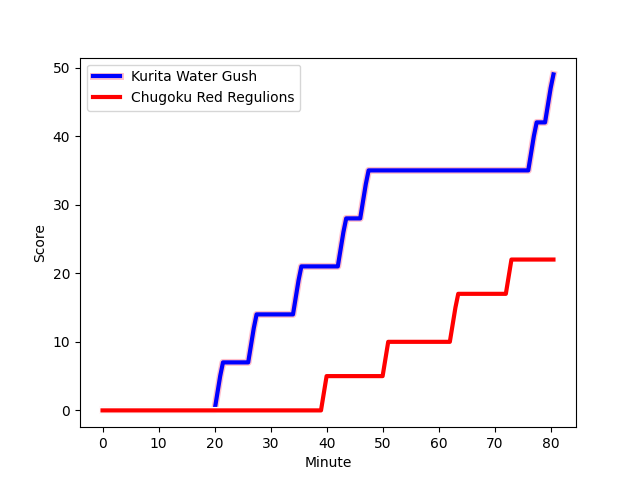
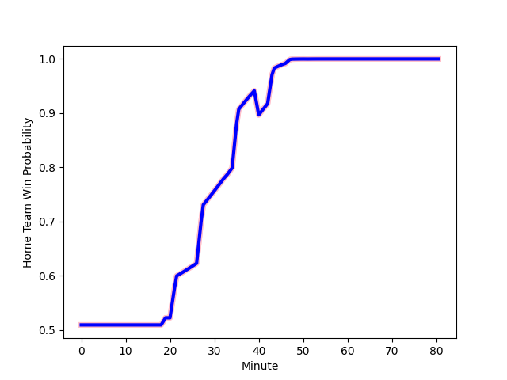

---  
layout: page  
title: Chugoku Red Regulions at Kurita Water Gush; 22-49  
date: 2023-02-05 05:00:00 18:00:00 -0500  
categories: match review  
---
# Chugoku Red Regulions at Kurita Water Gush; 22-49

# Club Level Predictions

The first set of predictions treats a club as the smallest object, as the club develops its members, organizes a gameplan, and deploys its players as needed for each match. This club model has a prediction of 0.647, which translates to predicting Kurita Water Gush to win by 5.7.

Each club has a rating and a rating deviation (simiar to a Glicko system), and expected performances can be generated. This allows for simulated matches and spreads like the ones below.
## Projected Performances

## Projected Spreads

## Projected Results

# Player Level Predictions

Treating teams instead as an entity made up of the currently active players, I have ratings for each player in an altogether different system. These can be combined to form team ratings once teamsheets are announced, weighting starters a bit higher than the reserves. After the match is played, players can be weighted by their minutes on the field, allowing for an accurate measure of the team's composition. With these compiled team ratings, we can make predictions, measure inaccuracy, and update the individual player ratings.
## Prediction with Player Minutes: Kurita Water Gush by 5.7

Kurita Water Gush by 1.7 on a neutral field
## Scores over Time

## Win Probability over Time

There were 7 large changes in win probability in this match
## Prediction without Player Minutes: Kurita Water Gush by 8.9

Kurita Water Gush by 4.9 on a neutral pitch

|   Away Minutes | Away Player                                                       |   Away elo |   Away Percentile |   Number |   Home Percentile |   Home elo | Home Player                                                           |   Home Minutes |
|---------------:|:------------------------------------------------------------------|-----------:|------------------:|---------:|------------------:|-----------:|:----------------------------------------------------------------------|---------------:|
|             51 | [Kojiro Arito](..//playerfiles//KojiroArito_cleaned.md)           |      83.66 |                15 |        1 |                 0 |      56.05 | [Hyong Ji Kim](..//playerfiles//HyongJiKim_cleaned.md)                |             51 |
|             33 | [Kentaro Iwanaga](..//playerfiles//KentaroIwanaga_cleaned.md)     |      81.62 |                13 |        2 |                51 |      92.35 | [Kota Hojo](..//playerfiles//KotaHojo_cleaned.md)                     |             61 |
|             19 | [Kento Miyata](..//playerfiles//KentoMiyata_cleaned.md)           |      86.71 |                22 |        3 |                16 |      83.9  | [Kuriyama Rui](..//playerfiles//KuriyamaRui_cleaned.md)               |             55 |
|             80 | [Taro Nishikawa](..//playerfiles//TaroNishikawa_cleaned.md)       |      51.85 |                 0 |        4 |                 3 |      67.44 | [Kota Nakamura](..//playerfiles//KotaNakamura_cleaned.md)             |             68 |
|             80 | [Noriyuki Kureyama](..//playerfiles//NoriyukiKureyama_cleaned.md) |      84.85 |                21 |        5 |                32 |      89.64 | [Gideon Koegelenberg](..//playerfiles//GideonKoegelenberg_cleaned.md) |             80 |
|             80 | [Shintaro Matsuda](..//playerfiles//ShintaroMatsuda_cleaned.md)   |     101.7  |                66 |        6 |                10 |      79.13 | [Yosuke Ishii](..//playerfiles//YosukeIshii_cleaned.md)               |             80 |
|             80 | [Kohei Matsunaga](..//playerfiles//KoheiMatsunaga_cleaned.md)     |      81.59 |                14 |        7 |                45 |      94.12 | [Taisei Nakao](..//playerfiles//TaiseiNakao_cleaned.md)               |             61 |
|             62 | [Shun Kawaguchi](..//playerfiles//ShunKawaguchi_cleaned.md)       |      69.55 |                 4 |        8 |                62 |      99.36 | [Tebita Oto](..//playerfiles//TebitaOto_cleaned.md)                   |             80 |
|             72 | [Rintaro Kawashima](..//playerfiles//RintaroKawashima_cleaned.md) |      81.19 |                15 |        9 |                30 |      88.35 | [Sho Nakamura](..//playerfiles//ShoNakamura_cleaned.md)               |             51 |
|             80 | [Ippei Yamada](..//playerfiles//IppeiYamada_cleaned.md)           |      90.89 |               nan |       10 |                 9 |      78.14 | [Takuro Hayashida](..//playerfiles//TakuroHayashida_cleaned.md)       |             80 |
|             80 | [Keigo Hatanaka](..//playerfiles//KeigoHatanaka_cleaned.md)       |      89.79 |                32 |       11 |                 9 |      75.03 | [Keigo Hamazoe](..//playerfiles//KeigoHamazoe_cleaned.md)             |             80 |
|             80 | [Shinya Hirayama](..//playerfiles//ShinyaHirayama_cleaned.md)     |      99.73 |                59 |       12 |                35 |      90.62 | [Jamie Vakalahi](..//playerfiles//JamieVakalahi_cleaned.md)           |             51 |
|             80 | [Masaaki Morita](..//playerfiles//MasaakiMorita_cleaned.md)       |      76.53 |                10 |       13 |                56 |      98.19 | [Tom English](..//playerfiles//TomEnglish_cleaned.md)                 |             80 |
|             80 | [Kentaro Fujii](..//playerfiles//KentaroFujii_cleaned.md)         |     101.85 |                67 |       14 |                 2 |      57.5  | [Ayato Sakamoto](..//playerfiles//AyatoSakamoto_cleaned.md)           |             66 |
|             62 | [Masahiro Nakano](..//playerfiles//MasahiroNakano_cleaned.md)     |      73.46 |                 8 |       15 |                72 |     108.23 | [Koshi Emoto](..//playerfiles//KoshiEmoto_cleaned.md)                 |             80 |
|             47 | [Yuuki Asai](..//playerfiles//YuukiAsai_cleaned.md)               |      82.3  |               nan |       16 |               nan |      96.72 | [Megumi Tagusagawa](..//playerfiles//MegumiTagusagawa_cleaned.md)     |             29 |
|             29 | [Toshiyuki Ooki](..//playerfiles//ToshiyukiOoki_cleaned.md)       |      76.49 |                 6 |       17 |                18 |      83.6  | [Ryo Omasa](..//playerfiles//RyoOmasa_cleaned.md)                     |             29 |
|             18 | [Riki Yamaguchi](..//playerfiles//RikiYamaguchi_cleaned.md)       |      82.9  |                18 |       18 |                15 |      86.42 | [Andrew Deegan](..//playerfiles//AndrewDeegan_cleaned.md)             |             29 |
|             18 | [Hashizo Yoshida](..//playerfiles//HashizoYoshida_cleaned.md)     |      76.6  |                 7 |       19 |                 7 |      76.48 | [Aki Kajiwara](..//playerfiles//AkiKajiwara_cleaned.md)               |             25 |
|              8 | [Atsushi Mizofuchi](..//playerfiles//AtsushiMizofuchi_cleaned.md) |      91.93 |                43 |       20 |               nan |      95    | [Jun Kaneko](..//playerfiles//JunKaneko_cleaned.md)                   |             19 |
|             61 | [Saiya Kitajima](..//playerfiles//SaiyaKitajima_cleaned.md)       |      82.46 |                14 |       21 |                 1 |      62.15 | [Hiroki Kawase](..//playerfiles//HirokiKawase_cleaned.md)             |             19 |
|            nan | nan                                                               |     nan    |               nan |       22 |               nan |      95    | [Daiki Yokota](..//playerfiles//DaikiYokota_cleaned.md)               |             14 |
|            nan | nan                                                               |     nan    |               nan |       23 |               nan |      95    | [Kai Yamasaki](..//playerfiles//KaiYamasaki_cleaned.md)               |             12 |

