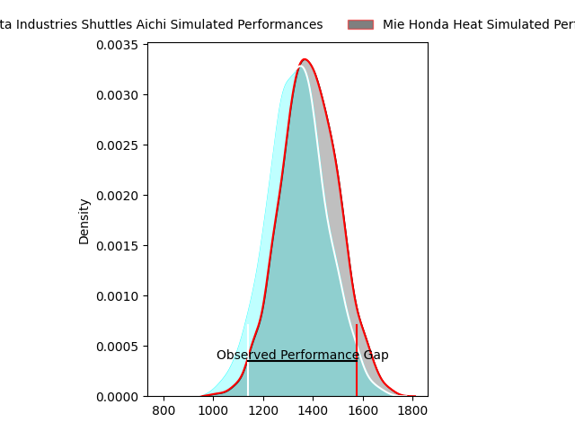
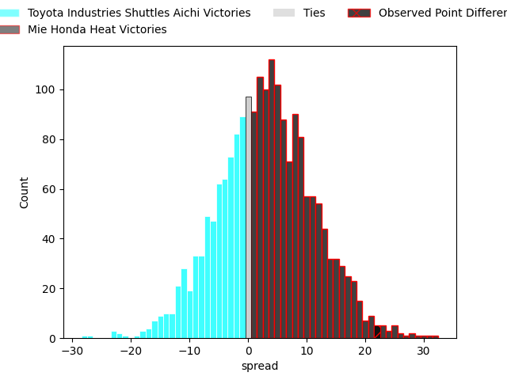
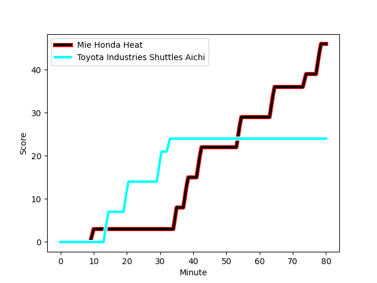
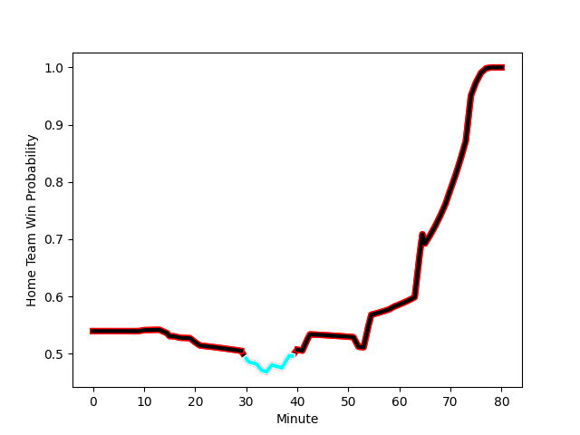

---  
layout: page  
title: Toyota Industries Shuttles Aichi at Mie Honda Heat; 24-46  
date: 2023-02-05 06:30:00 18:00:00 -0500  
categories: match review  
---
# Toyota Industries Shuttles Aichi at Mie Honda Heat; 24-46

# Club Level Predictions

The first set of predictions treats a club as the smallest object, as the club develops its members, organizes a gameplan, and deploys its players as needed for each match. This club model has a prediction of 0.585, which translates to predicting Mie Honda Heat to win by 3.2.

Each club has a rating and a rating deviation (simiar to a Glicko system), and expected performances can be generated. This allows for simulated matches and spreads like the ones below.
## Projected Performances

## Projected Spreads

## Projected Results

# Player Level Predictions

Treating teams instead as an entity made up of the currently active players, I have ratings for each player in an altogether different system. These can be combined to form team ratings once teamsheets are announced, weighting starters a bit higher than the reserves. After the match is played, players can be weighted by their minutes on the field, allowing for an accurate measure of the team's composition. With these compiled team ratings, we can make predictions, measure inaccuracy, and update the individual player ratings.
## Prediction with Player Minutes: Mie Honda Heat by 10.9

Mie Honda Heat by 6.9 on a neutral field
## Scores over Time

## Win Probability over Time

There were 8 large changes in win probability in this match
## Prediction without Player Minutes: Mie Honda Heat by 11.2

Mie Honda Heat by 7.2 on a neutral pitch

|   Away Minutes | Away Player                                                                 |   Away elo |   Away Percentile |   Number |   Home Percentile |   Home elo | Home Player                                                            |   Home Minutes |
|---------------:|:----------------------------------------------------------------------------|-----------:|------------------:|---------:|------------------:|-----------:|:-----------------------------------------------------------------------|---------------:|
|             59 | [Hyosuke Watanabe](..//playerfiles//HyosukeWatanabe_cleaned.md)             |     107.38 |                81 |        1 |                 7 |      76.85 | [Tatsuhiko Tsurukawa](..//playerfiles//TatsuhikoTsurukawa_cleaned.md)  |             80 |
|             74 | [Hiroaki Ushihara](..//playerfiles//HiroakiUshihara_cleaned.md)             |      93.72 |                46 |        2 |                98 |     133.42 | [Tateo Kanai](..//playerfiles//TateoKanai_cleaned.md)                  |             52 |
|             15 | [Harumoto Kodera](..//playerfiles//HarumotoKodera_cleaned.md)               |      94.37 |                44 |        3 |                42 |      91.86 | [Taiki Yoshioka](..//playerfiles//TaikiYoshioka_cleaned.md)            |             65 |
|             80 | [Taishi Nakamura](..//playerfiles//TaishiNakamura_cleaned.md)               |      97.01 |                54 |        4 |                55 |      97.39 | [Tetuhi Roberts](..//playerfiles//TetuhiRoberts_cleaned.md)            |             80 |
|             59 | [Yoann Maestri](..//playerfiles//YoannMaestri_cleaned.md)                   |      87.03 |                27 |        5 |                99 |     153.9  | [Franco Mostert](..//playerfiles//FrancoMostert_cleaned.md)            |             80 |
|             80 | [Shoichi Yura](..//playerfiles//ShoichiYura_cleaned.md)                     |     120.73 |                91 |        6 |                98 |     136.49 | [Pablo Matera](..//playerfiles//PabloMatera_cleaned.md)                |             65 |
|             21 | [Michi Kanado](..//playerfiles//MichiKanado_cleaned.md)                     |      99.78 |                60 |        7 |                 1 |      62.3  | [Ryota Kobayashi](..//playerfiles//RyotaKobayashi_cleaned.md)          |             70 |
|             80 | [Taumua Lui Sanft Naeata](..//playerfiles//TaumuaLuiSanftNaeata_cleaned.md) |     101.94 |                62 |        8 |                 5 |      71.36 | [Viliami Afu Kaipouli](..//playerfiles//ViliamiAfuKaipouli_cleaned.md) |             65 |
|             80 | [Riku Morisaki](..//playerfiles//RikuMorisaki_cleaned.md)                   |      98.38 |               nan |        9 |                30 |      87.09 | [Kenta Yamaji](..//playerfiles//KentaYamaji_cleaned.md)                |             17 |
|             80 | [Akihiro Shimizu](..//playerfiles//AkihiroShimizu_cleaned.md)               |     103.75 |                68 |       10 |                86 |     117.99 | [Kaleb Trask](..//playerfiles//KalebTrask_cleaned.md)                  |             80 |
|             80 | [Hiroaki Saito](..//playerfiles//HiroakiSaito_cleaned.md)                   |      99.81 |                60 |       11 |                63 |     100.2  | [Naoki Motomura](..//playerfiles//NaokiMotomura_cleaned.md)            |             65 |
|             67 | [Keita Ichikawa](..//playerfiles//KeitaIchikawa_cleaned.md)                 |      95.39 |               nan |       12 |                37 |      91.08 | [Fraser Quirk](..//playerfiles//FraserQuirk_cleaned.md)                |             80 |
|             80 | [James Mollentze](..//playerfiles//JamesMollentze_cleaned.md)               |      76.42 |                 9 |       13 |                13 |      80.27 | [Clinton Knox](..//playerfiles//ClintonKnox_cleaned.md)                |             80 |
|             80 | [Joe Kamana](..//playerfiles//JoeKamana_cleaned.md)                         |      59.48 |                 2 |       14 |                74 |     105.96 | [Yoshikazu Fujita](..//playerfiles//YoshikazuFujita_cleaned.md)        |             80 |
|             65 | [Shunta Kawano](..//playerfiles//ShuntaKawano_cleaned.md)                   |     101.68 |                66 |       15 |                93 |     128.16 | [Tom Banks](..//playerfiles//TomBanks_cleaned.md)                      |             65 |
|             25 | [Kosuke Oike](..//playerfiles//KosukeOike_cleaned.md)                       |     107.19 |               nan |       16 |                16 |      81.72 | [Shogo Nezuka](..//playerfiles//ShogoNezuka_cleaned.md)                |             63 |
|             40 | [Hiroshi Murakawa](..//playerfiles//HiroshiMurakawa_cleaned.md)             |      75.64 |                 9 |       17 |                45 |      93.67 | [Matthys Basson](..//playerfiles//MatthysBasson_cleaned.md)            |             15 |
|             59 | [Itaru Taniguchi](..//playerfiles//ItaruTaniguchi_cleaned.md)               |     105.23 |                73 |       18 |                53 |      93.67 | [Lee Seung Hyok](..//playerfiles//LeeSeungHyok_cleaned.md)             |             28 |
|             21 | [Shoma Makinouchi](..//playerfiles//ShomaMakinouchi_cleaned.md)             |      92.3  |                39 |       19 |                62 |      95.3  | [Kosuke Hattori](..//playerfiles//KosukeHattori_cleaned.md)            |             15 |
|             21 | [Naoya Ishibashi](..//playerfiles//NaoyaIshibashi_cleaned.md)               |      97.42 |               nan |       20 |                65 |     102.79 | [Gwangtee Oh](..//playerfiles//GwangteeOh_cleaned.md)                  |             15 |
|             15 | [Yuki Omichi](..//playerfiles//YukiOmichi_cleaned.md)                       |     141.62 |                98 |       21 |                79 |     109.49 | [Paddy Butler](..//playerfiles//PaddyButler_cleaned.md)                |             15 |
|             13 | [Yudai Yamamoto](..//playerfiles//YudaiYamamoto_cleaned.md)                 |      95.06 |               nan |       22 |                19 |      83.2  | [Kanta Watanabe](..//playerfiles//KantaWatanabe_cleaned.md)            |             15 |
|              6 | [Tomoya Watanabe](..//playerfiles//TomoyaWatanabe_cleaned.md)               |      77.21 |               nan |       23 |               nan |      73.46 | [Takumi Fuji](..//playerfiles//TakumiFuji_cleaned.md)                  |             10 |

