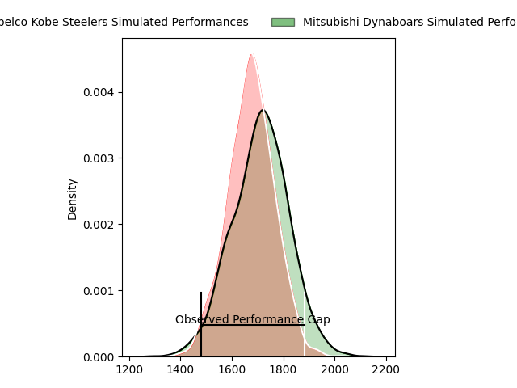
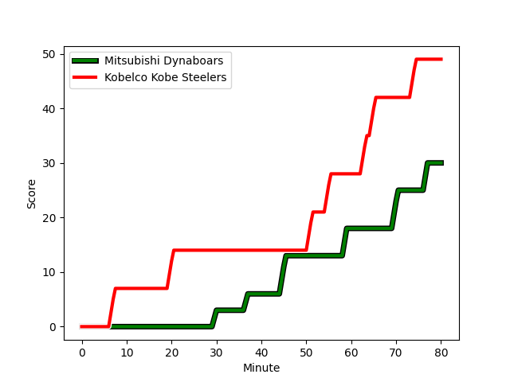
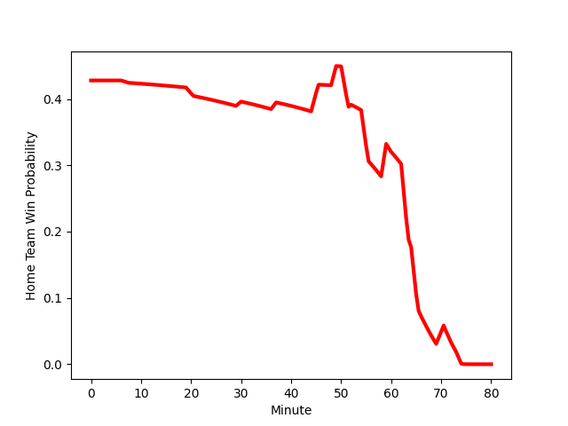

---  
layout: page  
title: Kobelco Kobe Steelers at Mitsubishi Dynaboars; 49-30  
date: 2023-02-05 04:00:00 18:00:00 -0500  
categories: match review  
---
# Kobelco Kobe Steelers at Mitsubishi Dynaboars; 49-30

# Club Level Predictions

The first set of predictions treats a club as the smallest object, as the club develops its members, organizes a gameplan, and deploys its players as needed for each match. This club model has a prediction of 0.553, which translates to predicting Mitsubishi Dynaboars to win by 1.9.

Each club has a rating and a rating deviation (simiar to a Glicko system), and expected performances can be generated. This allows for simulated matches and spreads like the ones below.
## Projected Performances

## Projected Spreads

## Projected Results

# Player Level Predictions

Treating teams instead as an entity made up of the currently active players, I have ratings for each player in an altogether different system. These can be combined to form team ratings once teamsheets are announced, weighting starters a bit higher than the reserves. After the match is played, players can be weighted by their minutes on the field, allowing for an accurate measure of the team's composition. With these compiled team ratings, we can make predictions, measure inaccuracy, and update the individual player ratings.
## Prediction with Player Minutes: Kobelco Kobe Steelers by 8.6

Kobelco Kobe Steelers by 12.6 on a neutral field
## Scores over Time

## Win Probability over Time

There were 9 large changes in win probability in this match
## Prediction without Player Minutes: Kobelco Kobe Steelers by 9.8

Kobelco Kobe Steelers by 13.8 on a neutral pitch

|   Away Minutes | Away Player                                                                    |   Away elo |   Away Percentile |   Number |   Home Percentile |   Home elo | Home Player                                                                 |   Home Minutes |
|---------------:|:-------------------------------------------------------------------------------|-----------:|------------------:|---------:|------------------:|-----------:|:----------------------------------------------------------------------------|---------------:|
|             49 | [Isileli Nakajima Vakauta](..//playerfiles//IsileliNakajimaVakauta_cleaned.md) |     111.86 |                87 |        1 |                17 |      84.89 | [Hayato Hosoda](..//playerfiles//HayatoHosoda_cleaned.md)                   |             52 |
|             66 | [Kenta Matsuoka](..//playerfiles//KentaMatsuoka_cleaned.md)                    |      91.78 |                39 |        2 |                16 |      83.68 | [Yuki Miyazato](..//playerfiles//YukiMiyazato_cleaned.md)                   |             52 |
|             60 | [Sho Maeda](..//playerfiles//ShoMaeda_cleaned.md)                              |     106.36 |                67 |        3 |                99 |     145.31 | [Tomoaki Ishii](..//playerfiles//TomoakiIshii_cleaned.md)                   |             67 |
|             49 | [Seokhwan Jang](..//playerfiles//SeokhwanJang_cleaned.md)                      |     138.83 |                98 |        4 |                20 |      83.21 | [Daniel Linde](..//playerfiles//DanielLinde_cleaned.md)                     |             80 |
|             80 | [JD Schickerling](..//playerfiles//JDSchickerling_cleaned.md)                  |      64.7  |                 3 |        5 |                32 |      89.76 | [Walt Steenkamp](..//playerfiles//WaltSteenkamp_cleaned.md)                 |             64 |
|             74 | [Amanaki Saumaki](..//playerfiles//AmanakiSaumaki_cleaned.md)                  |      93.65 |                44 |        6 |                90 |     119.83 | [Masataka Tsuruya](..//playerfiles//MasatakaTsuruya_cleaned.md)             |             80 |
|             80 | [Hikaru Hashimoto](..//playerfiles//HikaruHashimoto_cleaned.md)                |     128.05 |                95 |        7 |                37 |      91.32 | [Yusuke Sakamoto](..//playerfiles//YusukeSakamoto_cleaned.md)               |             80 |
|             80 | [Marcell Coetzee](..//playerfiles//MarcellCoetzee_cleaned.md)                  |     113.49 |                85 |        8 |                58 |     100.53 | [Jackson Hemopo](..//playerfiles//JacksonHemopo_cleaned.md)                 |             67 |
|             80 | [Kenta Tokuda](..//playerfiles//KentaTokuda_cleaned.md)                        |      92.42 |               nan |        9 |                52 |      97.05 | [Kota Iwamura](..//playerfiles//KotaIwamura_cleaned.md)                     |             76 |
|             80 | [Seungsin Lee](..//playerfiles//SeungsinLee_cleaned.md)                        |     104    |                69 |       10 |                72 |     106.15 | [James Shillcock](..//playerfiles//JamesShillcock_cleaned.md)               |             80 |
|             69 | [Rakuhei Yamashita](..//playerfiles//RakuheiYamashita_cleaned.md)              |     145.93 |                99 |       11 |                72 |     104.69 | [Honeti Taumoha'apai](..//playerfiles//HonetiTaumoha'apai_cleaned.md)       |             80 |
|             80 | [Richard Buckman](..//playerfiles//RichardBuckman_cleaned.md)                  |     118.97 |                89 |       12 |                65 |     102.33 | [Brackin Karauria-Henry](..//playerfiles//BrackinKarauria-Henry_cleaned.md) |             64 |
|             74 | [Junta Hamano](..//playerfiles//JuntaHamano_cleaned.md)                        |      95    |               nan |       13 |                16 |      81.92 | [Curtis Rona](..//playerfiles//CurtisRona_cleaned.md)                       |             80 |
|             80 | [Shinsuke Iseki](..//playerfiles//ShinsukeIseki_cleaned.md)                    |     115.76 |                85 |       14 |                55 |      97.85 | [Jonmoon Han](..//playerfiles//JonmoonHan_cleaned.md)                       |             80 |
|             80 | [Ryohei Yamanaka](..//playerfiles//RyoheiYamanaka_cleaned.md)                  |      98.46 |                52 |       15 |                25 |      87.34 | [Roland Alaiasa](..//playerfiles//RolandAlaiasa_cleaned.md)                 |             80 |
|             31 | [Suguru Igarashi](..//playerfiles//SuguruIgarashi_cleaned.md)                  |      91.18 |                34 |       16 |                46 |      94.81 | [Shunsuke Sakamoto](..//playerfiles//ShunsukeSakamoto_cleaned.md)           |             28 |
|             31 | [Gerard Cowley-Tuioti](..//playerfiles//GerardCowley-Tuioti_cleaned.md)        |     100.65 |                62 |       17 |                16 |      83.96 | [Yoshimitsu Yasue](..//playerfiles//YoshimitsuYasue_cleaned.md)             |             28 |
|             20 | [Hiroshi Yamashita](..//playerfiles//HiroshiYamashita_cleaned.md)              |     115.18 |                91 |       18 |                91 |     121.69 | [Matt To'omua](..//playerfiles//MattTo'omua_cleaned.md)                     |             16 |
|             14 | [Rinpei Sasaki](..//playerfiles//RinpeiSasaki_cleaned.md)                      |      95    |               nan |       19 |                 1 |      59.96 | [Maoya Nakagawa](..//playerfiles//MaoyaNakagawa_cleaned.md)                 |             16 |
|             11 | [Kanta Matsunaga](..//playerfiles//KantaMatsunaga_cleaned.md)                  |      87.12 |                47 |       20 |                42 |      93.67 | [Mototsugu Hachiya](..//playerfiles//MototsuguHachiya_cleaned.md)           |             13 |
|              6 | [Takara Imamura](..//playerfiles//TakaraImamura_cleaned.md)                    |      95.63 |                49 |       21 |                12 |      78.43 | [Epineri Uluiviti](..//playerfiles//EpineriUluiviti_cleaned.md)             |             13 |
|              6 | [Quinton Mahina](..//playerfiles//QuintonMahina_cleaned.md)                    |      95    |               nan |       22 |               nan |      95    | [Ryoto Shibata](..//playerfiles//RyotoShibata_cleaned.md)                   |              4 |

