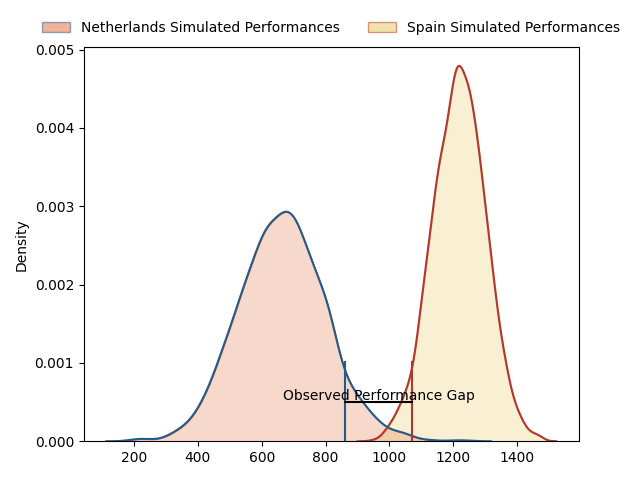
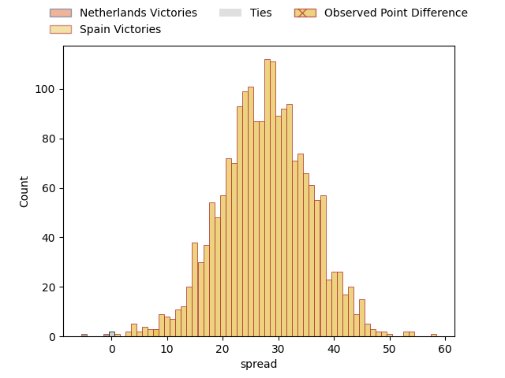
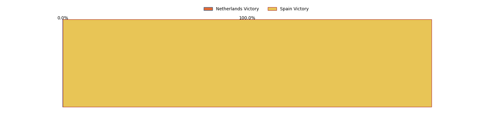

---  
layout: page  
title: Netherlands at Spain; 20-28  
date: 2023-02-05 12:45:00 18:00:00 -0500  
categories: match review  
---
# Netherlands at Spain; 20-28

# Club Level Predictions

The first set of predictions treats a club as the smallest object, as the club develops its members, organizes a gameplan, and deploys its players as needed for each match. This club model has a prediction of 0.971, which translates to predicting Spain to win by 34.2.

Each club has a rating and a rating deviation (simiar to a Glicko system), and expected performances can be generated. This allows for simulated matches and spreads like the ones below.
## Projected Performances

## Projected Spreads

## Projected Results

# Player Level Predictions

Treating teams instead as an entity made up of the currently active players, I have ratings for each player in an altogether different system. These can be combined to form team ratings once teamsheets are announced, weighting starters a bit higher than the reserves. After the match is played, players can be weighted by their minutes on the field, allowing for an accurate measure of the team's composition. With these compiled team ratings, we can make predictions, measure inaccuracy, and update the individual player ratings.
## Prediction with Player Minutes: Spain by 45.0

Spain by 41.0 on a neutral field
## Prediction without Player Minutes: Spain by 45.0

Spain by 41.0 on a neutral pitch

|   Away Minutes | Away Player                                                                  |   Away elo |   Away Percentile |   Number |   Home Percentile |   Home elo | Home Player                                                                                 |   Home Minutes |
|---------------:|:-----------------------------------------------------------------------------|-----------:|------------------:|---------:|------------------:|-----------:|:--------------------------------------------------------------------------------------------|---------------:|
|             80 | [Hugo Langelaan](..//playerfiles//HugoLangelaan_cleaned.md)                  |      54.07 |                 0 |        1 |                22 |      86.87 | [Titi Futeu Youtcheu](..//playerfiles//TitiFuteuYoutcheu_cleaned.md)                        |             80 |
|             80 | [Ross Bennie-Coulson](..//playerfiles//RossBennie-Coulson_cleaned.md)        |      63.75 |                 1 |        2 |                87 |     112    | [Vicente del Hoyo Portoles](..//playerfiles//VicentedelHoyoPortoles_cleaned.md)             |             80 |
|             80 | [Thymo Peters](..//playerfiles//ThymoPeters_cleaned.md)                      |      95    |               nan |        3 |                89 |     113.09 | [Jon Zabala Arrieta](..//playerfiles//JonZabalaArrieta_cleaned.md)                          |             80 |
|             80 | [Louis Bruinsma](..//playerfiles//LouisBruinsma_cleaned.md)                  |      75.08 |                 7 |        4 |                36 |      90.94 | [Brice Ferrer](..//playerfiles//BriceFerrer_cleaned.md)                                     |             80 |
|             80 | [Christopher van Leeuwen](..//playerfiles//ChristophervanLeeuwen_cleaned.md) |      75.88 |                 9 |        5 |                68 |     102.9  | [Josh Peters](..//playerfiles//JoshPeters_cleaned.md)                                       |             80 |
|             80 | [Spike Salman](..//playerfiles//SpikeSalman_cleaned.md)                      |      73.36 |                 6 |        6 |                71 |     104.07 | [Matthew Foulds](..//playerfiles//MatthewFoulds_cleaned.md)                                 |             80 |
|             80 | [Wolf van Dijk](..//playerfiles//WolfvanDijk_cleaned.md)                     |      61.12 |                 1 |        7 |                73 |     105.01 | [Mario Pichardi Garcia](..//playerfiles//MarioPichardiGarcia_cleaned.md)                    |             80 |
|             80 | [Christopher Raymond](..//playerfiles//ChristopherRaymond_cleaned.md)        |      78.31 |                11 |        8 |                46 |      94.47 | [Facundo Nahuel Dominguez Gatell](..//playerfiles//FacundoNahuelDominguezGatell_cleaned.md) |             80 |
|             80 | [Mark Alexander Coebergh](..//playerfiles//MarkAlexanderCoebergh_cleaned.md) |      87.35 |                27 |        9 |                44 |      93.69 | [Estanislao Bay](..//playerfiles//EstanislaoBay_cleaned.md)                                 |             80 |
|             80 | [Reinhardt Fortuin](..//playerfiles//ReinhardtFortuin_cleaned.md)            |      81.72 |                16 |       10 |                36 |      92.15 | [Gonzalo Vinuesa Garcia](..//playerfiles//GonzaloVinuesaGarcia_cleaned.md)                  |             80 |
|             80 | [Siem Noorman](..//playerfiles//SiemNoorman_cleaned.md)                      |      87.11 |                24 |       11 |                87 |     116.96 | [Silvio Federico Castiglioni](..//playerfiles//SilvioFedericoCastiglioni_cleaned.md)        |             80 |
|             80 | [Daily Limmen](..//playerfiles//DailyLimmen_cleaned.md)                      |      68.81 |                 4 |       12 |                23 |      84.73 | [Gonzalo Lopez Bontempo](..//playerfiles//GonzaloLopezBontempo_cleaned.md)                  |             80 |
|             80 | [Leroy Van Dam](..//playerfiles//LeroyVanDam_cleaned.md)                     |      61.73 |               nan |       13 |               nan |      95    | [Inaki Martin Mateu](..//playerfiles//InakiMartinMateu_cleaned.md)                          |             80 |
|             80 | [Jordy Hop](..//playerfiles//JordyHop_cleaned.md)                            |      52.17 |                 0 |       14 |                66 |     101.72 | [Jordi Jorba Jorge](..//playerfiles//JordiJorbaJorge_cleaned.md)                            |             80 |
|             80 | [David Weersma](..//playerfiles//DavidWeersma_cleaned.md)                    |      62.26 |                 2 |       15 |                43 |      94.08 | [JW Bell](..//playerfiles//JWBell_cleaned.md)                                               |             80 |

