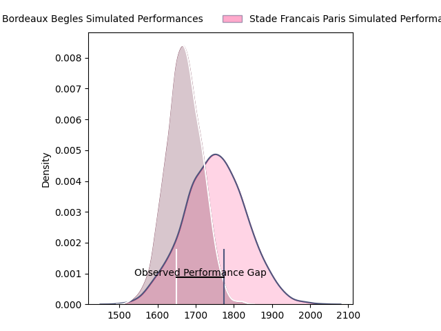
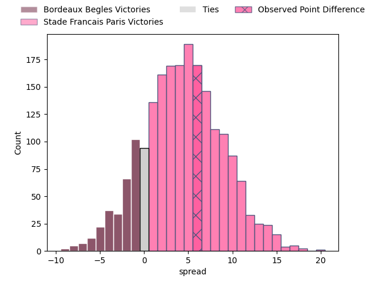
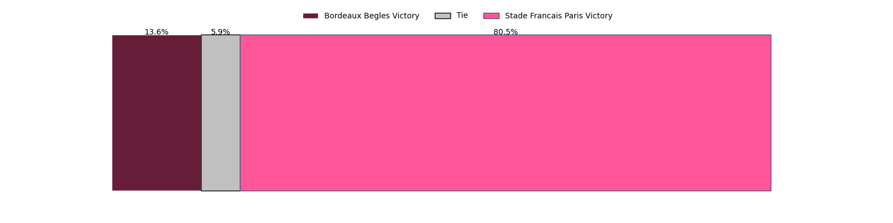
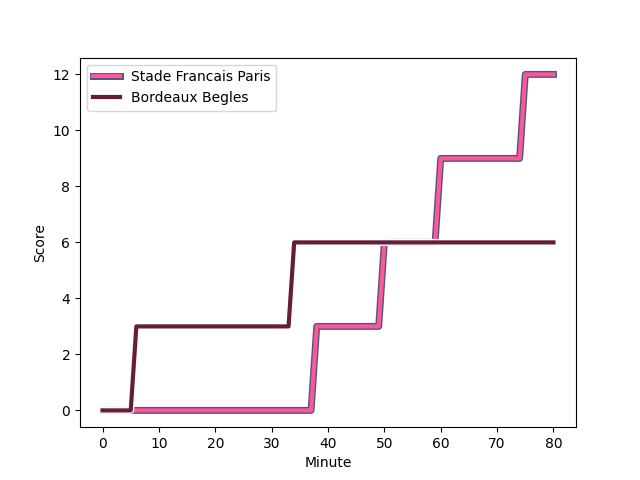
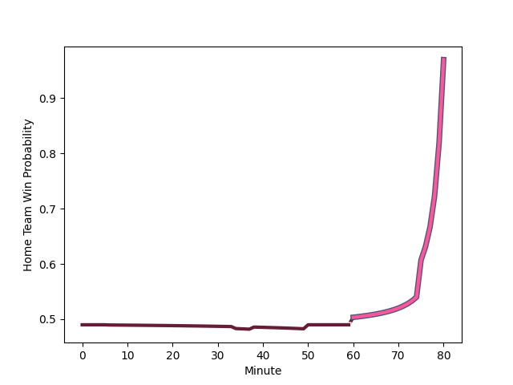

---  
layout: page  
title: Bordeaux Begles at Stade Francais Paris; 6-12  
date: 2023-02-05 21:00:00 18:00:00 -0500  
categories: match review  
---
# Bordeaux Begles at Stade Francais Paris; 6-12

# Club Level Predictions

The first set of predictions treats a club as the smallest object, as the club develops its members, organizes a gameplan, and deploys its players as needed for each match. This club model has a prediction of 0.55, which translates to predicting Stade Francais Paris to win by 1.7.

Each club has a rating and a rating deviation (simiar to a Glicko system), and expected performances can be generated. This allows for simulated matches and spreads like the ones below.
## Projected Performances

## Projected Spreads

## Projected Results

# Player Level Predictions

Treating teams instead as an entity made up of the currently active players, I have ratings for each player in an altogether different system. These can be combined to form team ratings once teamsheets are announced, weighting starters a bit higher than the reserves. After the match is played, players can be weighted by their minutes on the field, allowing for an accurate measure of the team's composition. With these compiled team ratings, we can make predictions, measure inaccuracy, and update the individual player ratings.
## Prediction with Player Minutes: Stade Francais Paris by 2.2

Bordeaux Begles by 1.8 on a neutral field
## Scores over Time

## Win Probability over Time

## Prediction without Player Minutes: Bordeaux Begles by 2.5

Bordeaux Begles by 6.5 on a neutral pitch

|   Away Minutes | Away Player                                                                      |   Away elo |   Away Percentile |   Number |   Home Percentile |   Home elo | Home Player                                                                   |   Home Minutes |
|---------------:|:---------------------------------------------------------------------------------|-----------:|------------------:|---------:|------------------:|-----------:|:------------------------------------------------------------------------------|---------------:|
|             41 | [Lekso Kaulashvili](..//playerfiles//LeksoKaulashvili_cleaned.md)                |     100.43 |                63 |        1 |                50 |      93.74 | [Moses Alo-Emile](..//playerfiles//MosesAlo-Emile_cleaned.md)                 |             48 |
|             49 | [Maxime Lamothe](..//playerfiles//MaximeLamothe_cleaned.md)                      |     100    |                63 |        2 |                45 |      93.18 | [Mickael Ivaldi](..//playerfiles//MickaelIvaldi_cleaned.md)                   |             80 |
|             54 | [Ben Tameifuna](..//playerfiles//BenTameifuna_cleaned.md)                        |     143.83 |                99 |        3 |                75 |     104.08 | [Paul Alo-Emile](..//playerfiles//PaulAlo-Emile_cleaned.md)                   |             55 |
|             49 | [Cyril Cazeaux](..//playerfiles//CyrilCazeaux_cleaned.md)                        |     109.03 |                78 |        4 |                51 |      96.07 | [Marcos Kremer](..//playerfiles//MarcosKremer_cleaned.md)                     |             80 |
|             80 | [Jandré Marais](..//playerfiles//JandréMarais_cleaned.md)                        |     128.17 |                95 |        5 |                94 |     125.43 | [Sitaleki Timani](..//playerfiles//SitalekiTimani_cleaned.md)                 |             61 |
|             49 | [Bastien Vergnes Taillefer](..//playerfiles//BastienVergnesTaillefer_cleaned.md) |     122.96 |                91 |        6 |                76 |     107.64 | [Romain Briatte](..//playerfiles//RomainBriatte_cleaned.md)                   |             80 |
|             80 | [Mahamadou Diaby](..//playerfiles//MahamadouDiaby_cleaned.md)                    |     113.26 |                84 |        7 |                 2 |      63.3  | [Mathieu Hirigoyen](..//playerfiles//MathieuHirigoyen_cleaned.md)             |             71 |
|             80 | [Tom Willis](..//playerfiles//TomWillis_cleaned.md)                              |      99.37 |                50 |        8 |                98 |     136.68 | [Giovanni Habel-Kueffner](..//playerfiles//GiovanniHabel-Kueffner_cleaned.md) |             80 |
|             73 | [Jules Gimbert](..//playerfiles//JulesGimbert_cleaned.md)                        |      77.68 |                10 |        9 |                50 |      95.36 | [Morgan Parra](..//playerfiles//MorganParra_cleaned.md)                       |             80 |
|             80 | [Zack Holmes](..//playerfiles//ZackHolmes_cleaned.md)                            |     110.91 |                78 |       10 |                92 |     124.05 | [Joris Segonds](..//playerfiles//JorisSegonds_cleaned.md)                     |             79 |
|             80 | [Louis Bielle-Biarrey](..//playerfiles//LouisBielle-Biarrey_cleaned.md)          |      96.65 |                49 |       11 |                91 |     122.77 | [Lester Etien](..//playerfiles//LesterEtien_cleaned.md)                       |             80 |
|             39 | [Remi Lamerat](..//playerfiles//RemiLamerat_cleaned.md)                          |     111.42 |                80 |       12 |                47 |      95.06 | [Theo Dachary](..//playerfiles//TheoDachary_cleaned.md)                       |             61 |
|             80 | [Gatien Masse](..//playerfiles//GatienMasse_cleaned.md)                          |     103.35 |                71 |       13 |                64 |     101.44 | [Jeremy Ward](..//playerfiles//JeremyWard_cleaned.md)                         |             80 |
|             80 | [Santiago Cordero](..//playerfiles//SantiagoCordero_cleaned.md)                  |      81.16 |                14 |       14 |                80 |     110.39 | [Sione Tui](..//playerfiles//SioneTui_cleaned.md)                             |             80 |
|             80 | [Romain Buros](..//playerfiles//RomainBuros_cleaned.md)                          |     147.44 |                98 |       15 |                81 |     112.56 | [Kylan Hamdaoui](..//playerfiles//KylanHamdaoui_cleaned.md)                   |             80 |
|             41 | [Tani Vili](..//playerfiles//TaniVili_cleaned.md)                                |      96.15 |                46 |       16 |                85 |     110.18 | [Clement Castets](..//playerfiles//ClementCastets_cleaned.md)                 |             32 |
|             39 | [Ugo Boniface](..//playerfiles//UgoBoniface_cleaned.md)                          |     104.26 |                74 |       17 |                57 |      98.24 | [Paul Gabrillagues](..//playerfiles//PaulGabrillagues_cleaned.md)             |             19 |
|             31 | [Antoine Miquel](..//playerfiles//AntoineMiquel_cleaned.md)                      |     116.55 |                88 |       18 |                77 |     105.69 | [Giorgi Melikidze](..//playerfiles//GiorgiMelikidze_cleaned.md)               |             25 |
|             31 | [Gabriel Oghre](..//playerfiles//GabrielOghre_cleaned.md)                        |      96.45 |                60 |       19 |                94 |     126.44 | [Harry Glover](..//playerfiles//HarryGlover_cleaned.md)                       |             19 |
|             31 | [Thomas Jolmes](..//playerfiles//ThomasJolmes_cleaned.md)                        |      71.11 |                 6 |       20 |                27 |      87.89 | [Julien Ory](..//playerfiles//JulienOry_cleaned.md)                           |              9 |
|             26 | [Vadim Cobilas](..//playerfiles//VadimCobilas_cleaned.md)                        |     107.08 |                80 |       21 |                79 |     112.66 | [Leo Barre](..//playerfiles//LeoBarre_cleaned.md)                             |              1 |
|              7 | [Hugo Zabalza](..//playerfiles//HugoZabalza_cleaned.md)                          |      86.93 |                27 |       22 |               nan |     nan    | nan                                                                           |            nan |

