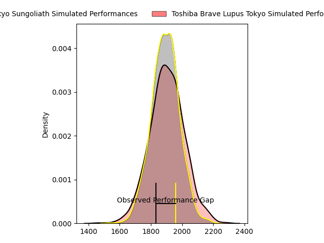
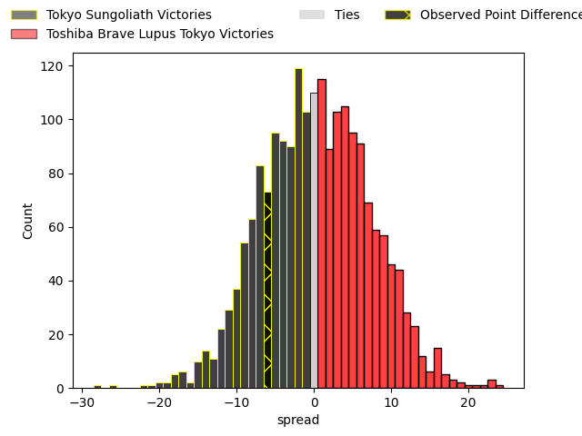
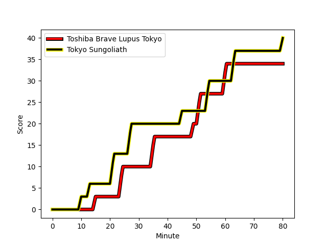
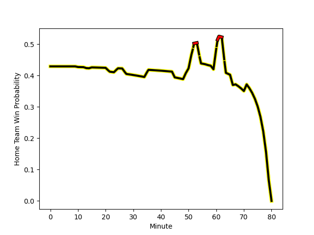

---  
layout: page  
title: Tokyo Sungoliath at Toshiba Brave Lupus Tokyo; 40-34  
date: 2023-02-05 06:00:00 18:00:00 -0500  
categories: match review  
---
# Tokyo Sungoliath at Toshiba Brave Lupus Tokyo; 40-34

# Club Level Predictions

The first set of predictions treats a club as the smallest object, as the club develops its members, organizes a gameplan, and deploys its players as needed for each match. This club model has a prediction of 0.52, which translates to predicting Toshiba Brave Lupus Tokyo to win by 0.7.

Each club has a rating and a rating deviation (simiar to a Glicko system), and expected performances can be generated. This allows for simulated matches and spreads like the ones below.
## Projected Performances

## Projected Spreads

## Projected Results

# Player Level Predictions

Treating teams instead as an entity made up of the currently active players, I have ratings for each player in an altogether different system. These can be combined to form team ratings once teamsheets are announced, weighting starters a bit higher than the reserves. After the match is played, players can be weighted by their minutes on the field, allowing for an accurate measure of the team's composition. With these compiled team ratings, we can make predictions, measure inaccuracy, and update the individual player ratings.
## Prediction with Player Minutes: Tokyo Sungoliath by 8.4

Tokyo Sungoliath by 12.4 on a neutral field
## Scores over Time

## Win Probability over Time

There were 12 large changes in win probability in this match
## Prediction without Player Minutes: Tokyo Sungoliath by 12.8

Tokyo Sungoliath by 16.8 on a neutral pitch

|   Away Minutes | Away Player                                                           |   Away elo |   Away Percentile |   Number |   Home Percentile |   Home elo | Home Player                                                         |   Home Minutes |
|---------------:|:----------------------------------------------------------------------|-----------:|------------------:|---------:|------------------:|-----------:|:--------------------------------------------------------------------|---------------:|
|             61 | [Kenta Kobayashi](..//playerfiles//KentaKobayashi_cleaned.md)         |     101.67 |                67 |        1 |                68 |     102.08 | [Masataka Mikami](..//playerfiles//MasatakaMikami_cleaned.md)       |             50 |
|             71 | [Shunta Nakamura](..//playerfiles//ShuntaNakamura_cleaned.md)         |     126.04 |                96 |        2 |                 1 |      65.95 | [Daigo Hashimoto](..//playerfiles//DaigoHashimoto_cleaned.md)       |             50 |
|             57 | [Shinnosuke Kakinaga](..//playerfiles//ShinnosukeKakinaga_cleaned.md) |     104.56 |                75 |        3 |                93 |     118.76 | [Yuta Kokaji](..//playerfiles//YutaKokaji_cleaned.md)               |             59 |
|             66 | [Hendrik Tui](..//playerfiles//HendrikTui_cleaned.md)                 |      97.48 |                55 |        4 |                63 |     100.85 | [Warner Dearns](..//playerfiles//WarnerDearns_cleaned.md)           |             67 |
|             80 | [Harry Hockings](..//playerfiles//HarryHockings_cleaned.md)           |     147.86 |                99 |        5 |                 3 |      64.41 | [Kyosuke Kajikawa](..//playerfiles//KyosukeKajikawa_cleaned.md)     |             52 |
|             80 | [Kanji Shimokawa](..//playerfiles//KanjiShimokawa_cleaned.md)         |     125.4  |                93 |        6 |                50 |      95.71 | [Yoshitaka Tokunaga](..//playerfiles//YoshitakaTokunaga_cleaned.md) |             80 |
|             80 | [Kai Yamamoto](..//playerfiles//KaiYamamoto_cleaned.md)               |      99.58 |                60 |        7 |                99 |     147.99 | [Matt Todd](..//playerfiles//MattTodd_cleaned.md)                   |             80 |
|             61 | [Tevita Tatafu](..//playerfiles//TevitaTatafu_cleaned.md)             |     129.11 |                95 |        8 |                89 |     119.29 | [Michael Leitch](..//playerfiles//MichaelLeitch_cleaned.md)         |             80 |
|             51 | [Naoto Saito](..//playerfiles//NaotoSaito_cleaned.md)                 |     104.76 |                72 |        9 |                57 |      98.38 | [Takahiro Ogawa](..//playerfiles//TakahiroOgawa_cleaned.md)         |             80 |
|             79 | [Aaron Cruden](..//playerfiles//AaronCruden_cleaned.md)               |     119.54 |                88 |       10 |                76 |     108.32 | [Tom Taylor](..//playerfiles//TomTaylor_cleaned.md)                 |             80 |
|             71 | [Tevita Li](..//playerfiles//TevitaLi_cleaned.md)                     |     135.48 |                97 |       11 |                89 |     119.46 | [Masaki Hamada](..//playerfiles//MasakiHamada_cleaned.md)           |             80 |
|             80 | [Ryoto Nakamura](..//playerfiles//RyotoNakamura_cleaned.md)           |     125.06 |                93 |       12 |                76 |     108.51 | [Nicholas McCurran](..//playerfiles//NicholasMcCurran_cleaned.md)   |             80 |
|             80 | [Shogo Nakano](..//playerfiles//ShogoNakano_cleaned.md)               |     105.48 |                71 |       13 |                70 |     104.5  | [Seta Tamanivalu](..//playerfiles//SetaTamanivalu_cleaned.md)       |             67 |
|             80 | [Seiya Ozaki](..//playerfiles//SeiyaOzaki_cleaned.md)                 |     108.49 |                78 |       14 |                90 |     121.01 | [Jone Naikabula](..//playerfiles//JoneNaikabula_cleaned.md)         |             62 |
|             80 | [Kotaro Matsushima](..//playerfiles//KotaroMatsushima_cleaned.md)     |     100.14 |                57 |       15 |                66 |     106.81 | [Takuro Matsunaga](..//playerfiles//TakuroMatsunaga_cleaned.md)     |             80 |
|             23 | [Kan Nakano](..//playerfiles//KanNakano_cleaned.md)                   |     106.22 |                77 |       16 |                57 |      99.46 | [Mamoru Harada](..//playerfiles//MamoruHarada_cleaned.md)           |             30 |
|             29 | [Yutaka Nagare](..//playerfiles//YutakaNagare_cleaned.md)             |      97.09 |                42 |       17 |                59 |     103.86 | [Sena Kimura](..//playerfiles//SenaKimura_cleaned.md)               |             30 |
|             19 | [Shintaro Ishihara](..//playerfiles//ShintaroIshihara_cleaned.md)     |     112.09 |                88 |       18 |                69 |     103.22 | [Hugh Pyle](..//playerfiles//HughPyle_cleaned.md)                   |             28 |
|             19 | [Ryuga Hashimoto](..//playerfiles//RyugaHashimoto_cleaned.md)         |     101.26 |                64 |       19 |               nan |      99.53 | [Latu Taufa](..//playerfiles//LatuTaufa_cleaned.md)                 |             21 |
|             14 | [Tom Savage](..//playerfiles//TomSavage_cleaned.md)                   |     158.43 |                99 |       20 |                71 |     107.45 | [Shohei Toyoshima](..//playerfiles//ShoheiToyoshima_cleaned.md)     |             18 |
|              9 | [Ryosuke Kawase](..//playerfiles//RyosukeKawase_cleaned.md)           |     100.67 |                63 |       21 |               nan |     104.44 | [Takeshi Sasaki](..//playerfiles//TakeshiSasaki_cleaned.md)         |             13 |
|              1 | [Keisuke Moriya](..//playerfiles//KeisukeMoriya_cleaned.md)           |     130.48 |                95 |       22 |                86 |     117.21 | [Burger Odendaal](..//playerfiles//BurgerOdendaal_cleaned.md)       |             13 |
|              9 | [Kienori Go](..//playerfiles//KienoriGo_cleaned.md)                   |      92.03 |               nan |       23 |               nan |     nan    | nan                                                                 |            nan |

