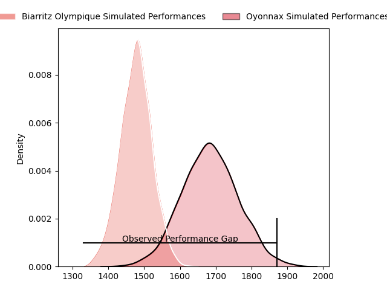
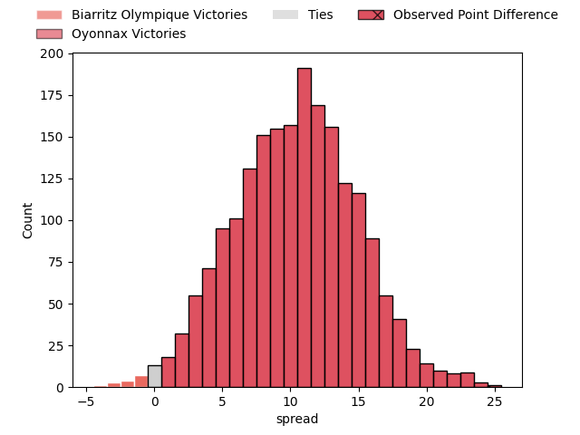
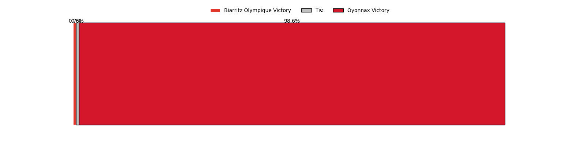
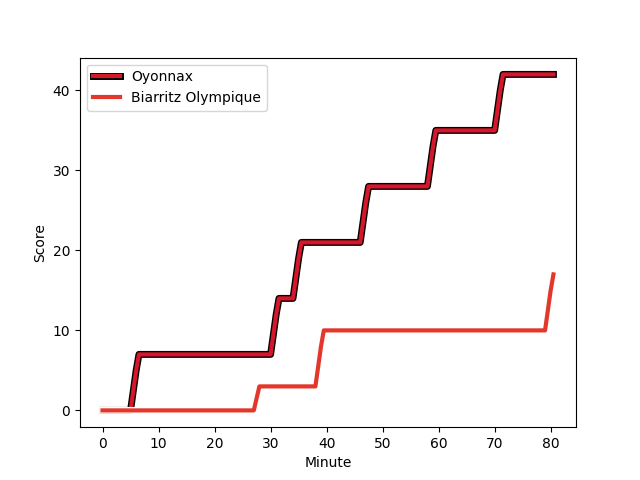
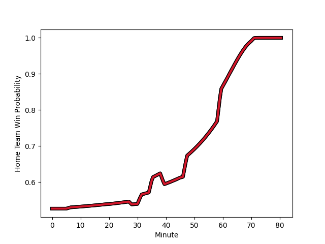

---  
layout: page  
title: Biarritz Olympique at Oyonnax; 17-42  
date: 2023-02-09 21:00:00 18:00:00 -0500  
categories: match review  
---
# Biarritz Olympique at Oyonnax; 17-42

# Club Level Predictions

The first set of predictions treats a club as the smallest object, as the club develops its members, organizes a gameplan, and deploys its players as needed for each match. This club model has a prediction of 0.764, which translates to predicting Oyonnax to win by 10.3.

Each club has a rating and a rating deviation (simiar to a Glicko system), and expected performances can be generated. This allows for simulated matches and spreads like the ones below.
## Projected Performances

## Projected Spreads

## Projected Results

# Player Level Predictions

Treating teams instead as an entity made up of the currently active players, I have ratings for each player in an altogether different system. These can be combined to form team ratings once teamsheets are announced, weighting starters a bit higher than the reserves. After the match is played, players can be weighted by their minutes on the field, allowing for an accurate measure of the team's composition. With these compiled team ratings, we can make predictions, measure inaccuracy, and update the individual player ratings.
## Prediction with Player Minutes: Oyonnax by 8.7

Oyonnax by 4.7 on a neutral field
## Scores over Time

## Win Probability over Time

There were 4 large changes in win probability in this match
## Prediction without Player Minutes: Oyonnax by 8.3

Oyonnax by 4.3 on a neutral pitch

|   Away Minutes | Away Player                                                       |   Away elo |   Away Percentile |   Number |   Home Percentile |   Home elo | Home Player                                                       |   Home Minutes |
|---------------:|:------------------------------------------------------------------|-----------:|------------------:|---------:|------------------:|-----------:|:------------------------------------------------------------------|---------------:|
|             58 | [Baptiste Erdocio](..//playerfiles//BaptisteErdocio_cleaned.md)   |      84.62 |                18 |        1 |                 4 |      67.88 | [Tommy Raynaud](..//playerfiles//TommyRaynaud_cleaned.md)         |             60 |
|             58 | [Baptiste Erdocio](..//playerfiles//BaptisteErdocio_cleaned.md)   |      84.62 |                32 |        1 |                 4 |      67.88 | [Tommy Raynaud](..//playerfiles//TommyRaynaud_cleaned.md)         |             60 |
|             50 | [Clement Renaud](..//playerfiles//ClementRenaud_cleaned.md)       |      89.82 |                32 |        2 |                59 |      97.99 | [Benjamin Geledan](..//playerfiles//BenjaminGeledan_cleaned.md)   |             52 |
|             58 | [Quentin Samaran](..//playerfiles//QuentinSamaran_cleaned.md)     |      74.17 |                 5 |        3 |                61 |      99.63 | [Thomas Laclayat](..//playerfiles//ThomasLaclayat_cleaned.md)     |             60 |
|             58 | [Quentin Samaran](..//playerfiles//QuentinSamaran_cleaned.md)     |      74.17 |                11 |        3 |                61 |      99.63 | [Thomas Laclayat](..//playerfiles//ThomasLaclayat_cleaned.md)     |             60 |
|             80 | [Johnny Dyer](..//playerfiles//JohnnyDyer_cleaned.md)             |      81.26 |                16 |        4 |                97 |     134.05 | [Tom Murday](..//playerfiles//TomMurday_cleaned.md)               |             60 |
|             80 | [Johnny Dyer](..//playerfiles//JohnnyDyer_cleaned.md)             |      81.26 |                17 |        4 |                97 |     134.05 | [Tom Murday](..//playerfiles//TomMurday_cleaned.md)               |             60 |
|             46 | [Josh Tyrell](..//playerfiles//JoshTyrell_cleaned.md)             |     102.12 |                67 |        5 |                11 |      77.1  | [Hugo Fabregue](..//playerfiles//HugoFabregue_cleaned.md)         |             52 |
|             80 | [Dave O'Callaghan](..//playerfiles//DaveO'Callaghan_cleaned.md)   |      68.73 |                 3 |        6 |                98 |     140.49 | [Kevin Lebreton](..//playerfiles//KevinLebreton_cleaned.md)       |             60 |
|             80 | [Dave O'Callaghan](..//playerfiles//DaveO'Callaghan_cleaned.md)   |      68.73 |                 6 |        6 |                98 |     140.49 | [Kevin Lebreton](..//playerfiles//KevinLebreton_cleaned.md)       |             60 |
|             80 | [Thomas Hebert](..//playerfiles//ThomasHebert_cleaned.md)         |      96.56 |                52 |        7 |                60 |      99.63 | [Loïc Credoz](..//playerfiles//LoïcCredoz_cleaned.md)             |             80 |
|             80 | [Elliot Dixon](..//playerfiles//ElliotDixon_cleaned.md)           |     106.97 |                73 |        8 |                77 |     110.04 | [Rory Grice](..//playerfiles//RoryGrice_cleaned.md)               |             80 |
|             46 | [Barnabe Couilloud](..//playerfiles//BarnabeCouilloud_cleaned.md) |      75.53 |                 9 |        9 |                 6 |      73.26 | [Ilan El Khattabi](..//playerfiles//IlanElKhattabi_cleaned.md)    |             69 |
|             46 | [Barnabe Couilloud](..//playerfiles//BarnabeCouilloud_cleaned.md) |      75.53 |                15 |        9 |                 6 |      73.26 | [Ilan El Khattabi](..//playerfiles//IlanElKhattabi_cleaned.md)    |             69 |
|             35 | [Ilian Perraux](..//playerfiles//IlianPerraux_cleaned.md)         |     104.84 |                71 |       10 |                64 |      96.48 | [Justin Bouraux](..//playerfiles//JustinBouraux_cleaned.md)       |             80 |
|             20 | [Yohann Artru](..//playerfiles//YohannArtru_cleaned.md)           |     121.63 |                90 |       11 |                65 |     101.05 | [Enzo Reybier](..//playerfiles//EnzoReybier_cleaned.md)           |             80 |
|             20 | [Yohann Artru](..//playerfiles//YohannArtru_cleaned.md)           |     121.63 |                94 |       11 |                65 |     101.05 | [Enzo Reybier](..//playerfiles//EnzoReybier_cleaned.md)           |             80 |
|             71 | [Auguste Cadot](..//playerfiles//AugusteCadot_cleaned.md)         |     100.88 |                62 |       12 |                 5 |      71.33 | [Gaby Lovobalavu](..//playerfiles//GabyLovobalavu_cleaned.md)     |             48 |
|             80 | [Tyler Morgan](..//playerfiles//TylerMorgan_cleaned.md)           |     101.43 |                64 |       13 |                21 |      84.29 | [Theo Millet](..//playerfiles//TheoMillet_cleaned.md)             |             80 |
|             80 | [Steeve Barry](..//playerfiles//SteeveBarry_cleaned.md)           |     106.42 |                75 |       14 |                88 |     118.58 | [Joe Ravouvou](..//playerfiles//JoeRavouvou_cleaned.md)           |             80 |
|             80 | [Joe Jonas](..//playerfiles//JoeJonas_cleaned.md)                 |     101.73 |                63 |       15 |                15 |      79.64 | [Tony Ensor](..//playerfiles//TonyEnsor_cleaned.md)               |             80 |
|             60 | [Romain Lonca](..//playerfiles//RomainLonca_cleaned.md)           |     120.85 |                89 |       16 |               nan |     112.24 | [Steve Mafi](..//playerfiles//SteveMafi_cleaned.md)               |             28 |
|             60 | [Romain Lonca](..//playerfiles//RomainLonca_cleaned.md)           |     120.85 |                92 |       16 |               nan |     112.24 | [Steve Mafi](..//playerfiles//SteveMafi_cleaned.md)               |             28 |
|             45 | [Baptiste Germain](..//playerfiles//BaptisteGermain_cleaned.md)   |      86.1  |                25 |       17 |                29 |      81.25 | [Teddy Durand](..//playerfiles//TeddyDurand_cleaned.md)           |             28 |
|             34 | [Temo Matiu](..//playerfiles//TemoMatiu_cleaned.md)               |     103.4  |                76 |       18 |                26 |      80.73 | [Victor Lebas](..//playerfiles//VictorLebas_cleaned.md)           |             20 |
|             34 | [Tomas Cubelli](..//playerfiles//TomasCubelli_cleaned.md)         |     108.1  |                79 |       19 |                98 |     130.5  | [Filimo Taofifenua](..//playerfiles//FilimoTaofifenua_cleaned.md) |             20 |
|             30 | [Leo Carella](..//playerfiles//LeoCarella_cleaned.md)             |      95.08 |               nan |       20 |               nan |     102.16 | [Victor Delmas](..//playerfiles//VictorDelmas_cleaned.md)         |             20 |
|             22 | [Giorgi Nutsubidze](..//playerfiles//GiorgiNutsubidze_cleaned.md) |      89.02 |                29 |       21 |                21 |      86.35 | [Antoine Abraham](..//playerfiles//AntoineAbraham_cleaned.md)     |             20 |
|             22 | [Luka Azariashvili](..//playerfiles//LukaAzariashvili_cleaned.md) |      75.76 |                11 |       22 |                64 |      99.58 | [Yvan David](..//playerfiles//YvanDavid_cleaned.md)               |             11 |
|              9 | [Francois Vergnaud](..//playerfiles//FrancoisVergnaud_cleaned.md) |      71.54 |                 4 |       23 |                81 |     112.57 | [Jules Soulan](..//playerfiles//JulesSoulan_cleaned.md)           |             32 |

