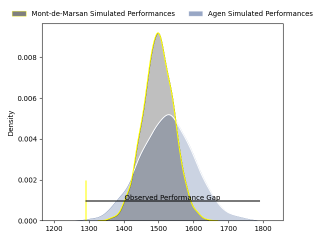
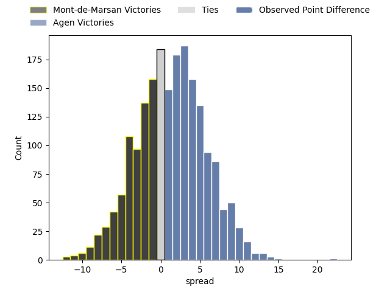
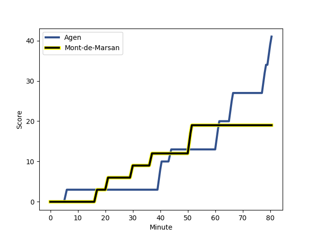
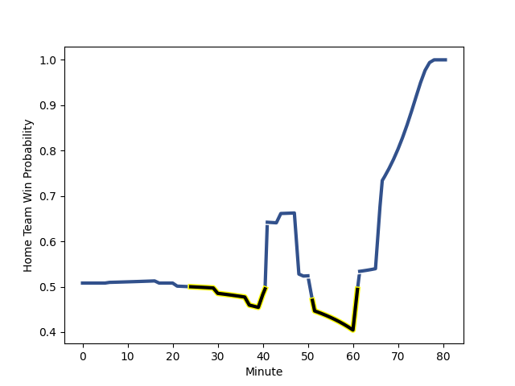

---  
layout: page  
title: Mont-de-Marsan at Agen; 19-41  
date: 2023-02-10 21:00:00 18:00:00 -0500  
categories: match review  
---
# Mont-de-Marsan at Agen; 19-41

# Club Level Predictions

The first set of predictions treats a club as the smallest object, as the club develops its members, organizes a gameplan, and deploys its players as needed for each match. This club model has a prediction of 0.537, which translates to predicting Agen to win by 1.3.

Each club has a rating and a rating deviation (simiar to a Glicko system), and expected performances can be generated. This allows for simulated matches and spreads like the ones below.
## Projected Performances

## Projected Spreads

## Projected Results

# Player Level Predictions

Treating teams instead as an entity made up of the currently active players, I have ratings for each player in an altogether different system. These can be combined to form team ratings once teamsheets are announced, weighting starters a bit higher than the reserves. After the match is played, players can be weighted by their minutes on the field, allowing for an accurate measure of the team's composition. With these compiled team ratings, we can make predictions, measure inaccuracy, and update the individual player ratings.
## Prediction with Player Minutes: Agen by 5.4

Agen by 1.4 on a neutral field
## Scores over Time

## Win Probability over Time

There were 14 large changes in win probability in this match
## Prediction without Player Minutes: Agen by 2.4

Mont-de-Marsan by 1.6 on a neutral pitch

|   Away Minutes | Away Player                                                              |   Away elo |   Away Percentile |   Number |   Home Percentile |   Home elo | Home Player                                                         |   Home Minutes |
|---------------:|:-------------------------------------------------------------------------|-----------:|------------------:|---------:|------------------:|-----------:|:--------------------------------------------------------------------|---------------:|
|             41 | [Thomas Bultel](..//playerfiles//ThomasBultel_cleaned.md)                |     119.83 |                95 |        1 |                35 |      91.37 | [Hans Lombard-Buret](..//playerfiles//HansLombard-Buret_cleaned.md) |             49 |
|             61 | [Jose Luis Gonzalez](..//playerfiles//JoseLuisGonzalez_cleaned.md)       |     112.67 |                87 |        2 |                58 |      97.49 | [Mike Sosene-Feagai](..//playerfiles//MikeSosene-Feagai_cleaned.md) |             49 |
|             41 | [Lasha Macharashvili](..//playerfiles//LashaMacharashvili_cleaned.md)    |      79.39 |                19 |        3 |                60 |      99.37 | [Alex Burin](..//playerfiles//AlexBurin_cleaned.md)                 |             59 |
|             71 | [Romain Durand](..//playerfiles//RomainDurand_cleaned.md)                |     117.11 |                88 |        4 |                 6 |      71.21 | [Joe Maksymiw](..//playerfiles//JoeMaksymiw_cleaned.md)             |             59 |
|             80 | [Aston Fortuin](..//playerfiles//AstonFortuin_cleaned.md)                |     114.02 |                87 |        5 |                62 |     100.64 | [William Demotte](..//playerfiles//WilliamDemotte_cleaned.md)       |             80 |
|             80 | [Yann Brethous](..//playerfiles//YannBrethous_cleaned.md)                |     103.49 |                70 |        6 |                46 |      94.55 | [Valentin Gayraud](..//playerfiles//ValentinGayraud_cleaned.md)     |             80 |
|             80 | [Léo Banos](..//playerfiles//LéoBanos_cleaned.md)                        |      74.52 |                 6 |        7 |                64 |     101.42 | [Evan Olmstead](..//playerfiles//EvanOlmstead_cleaned.md)           |             48 |
|             80 | [Léo Banos](..//playerfiles//LéoBanos_cleaned.md)                        |      74.52 |                23 |        7 |                64 |     101.42 | [Evan Olmstead](..//playerfiles//EvanOlmstead_cleaned.md)           |             48 |
|             49 | [Mike Faleafa](..//playerfiles//MikeFaleafa_cleaned.md)                  |      81.95 |                19 |        8 |                64 |     103.39 | [Martin Devergie](..//playerfiles//MartinDevergie_cleaned.md)       |             80 |
|             68 | [Christophe Loustalot](..//playerfiles//ChristopheLoustalot_cleaned.md)  |      62.11 |                 0 |        9 |                36 |      91.23 | [Tane Takulua](..//playerfiles//TaneTakulua_cleaned.md)             |             77 |
|             68 | [Christophe Loustalot](..//playerfiles//ChristopheLoustalot_cleaned.md)  |      62.11 |                 7 |        9 |                36 |      91.23 | [Tane Takulua](..//playerfiles//TaneTakulua_cleaned.md)             |             77 |
|             80 | [Willie du Plessis](..//playerfiles//WillieduPlessis_cleaned.md)         |     124.15 |                93 |       10 |                83 |     115.42 | [Elton Jantjies](..//playerfiles//EltonJantjies_cleaned.md)         |             80 |
|             66 | [Kaminieli Rasaku](..//playerfiles//KaminieliRasaku_cleaned.md)          |      91.67 |                38 |       11 |                85 |     114.35 | [Iban Etcheverry](..//playerfiles//IbanEtcheverry_cleaned.md)       |             80 |
|             80 | [Jules Even](..//playerfiles//JulesEven_cleaned.md)                      |      70.26 |                 4 |       12 |                68 |     103.7  | [Kolinio Ramoka](..//playerfiles//KolinioRamoka_cleaned.md)         |             80 |
|             80 | [Jules Even](..//playerfiles//JulesEven_cleaned.md)                      |      70.26 |                12 |       12 |                68 |     103.7  | [Kolinio Ramoka](..//playerfiles//KolinioRamoka_cleaned.md)         |             80 |
|             61 | [Ambrose Curtis](..//playerfiles//AmbroseCurtis_cleaned.md)              |      97.74 |                56 |       13 |                34 |      89.64 | [Clement Garrigues](..//playerfiles//ClementGarrigues_cleaned.md)   |             37 |
|             80 | [Pierre Sayerse](..//playerfiles//PierreSayerse_cleaned.md)              |     102.64 |                68 |       14 |                64 |     100.75 | [Tevita Railevu](..//playerfiles//TevitaRailevu_cleaned.md)         |             80 |
|             80 | [Yoann Laousse Azpiazu](..//playerfiles//YoannLaousseAzpiazu_cleaned.md) |     130.69 |                93 |       15 |                90 |     120.16 | [Thomas Vincent](..//playerfiles//ThomasVincent_cleaned.md)         |             80 |
|             39 | [Jean-Luc Innocente](..//playerfiles//Jean-LucInnocente_cleaned.md)      |      64.13 |                 3 |       16 |                59 |      99.07 | [Jefferson Joseph](..//playerfiles//JeffersonJoseph_cleaned.md)     |             43 |
|             39 | [Anthony Alves](..//playerfiles//AnthonyAlves_cleaned.md)                |     116.42 |                92 |       17 |                20 |      83.85 | [Zak Farrance](..//playerfiles//ZakFarrance_cleaned.md)             |             32 |
|             39 | [Anthony Alves](..//playerfiles//AnthonyAlves_cleaned.md)                |     116.42 |                93 |       17 |                20 |      83.85 | [Zak Farrance](..//playerfiles//ZakFarrance_cleaned.md)             |             32 |
|             31 | [Raphaël Robic](..//playerfiles//RaphaëlRobic_cleaned.md)                |     103.43 |                61 |       18 |                 3 |      65.55 | [Florent Guion](..//playerfiles//FlorentGuion_cleaned.md)           |             31 |
|             19 | [Simon Labouyrie](..//playerfiles//SimonLabouyrie_cleaned.md)            |      89.21 |                41 |       19 |                80 |     106.97 | [Loris Zarantonello](..//playerfiles//LorisZarantonello_cleaned.md) |             31 |
|             19 | [Simon Renda](..//playerfiles//SimonRenda_cleaned.md)                    |     122.55 |                91 |       20 |                49 |      95.6  | [Beau Farrance](..//playerfiles//BeauFarrance_cleaned.md)           |             21 |
|             14 | [Alexandre de Nardi](..//playerfiles//AlexandredeNardi_cleaned.md)       |      83.06 |                17 |       21 |                86 |     115.21 | [Fotu Lokotui](..//playerfiles//FotuLokotui_cleaned.md)             |             21 |
|             12 | [Martin Doan](..//playerfiles//MartinDoan_cleaned.md)                    |      95.41 |                42 |       22 |                45 |      93.45 | [Dorian Bellot](..//playerfiles//DorianBellot_cleaned.md)           |              3 |
|              9 | [Thibault Tauleigne](..//playerfiles//ThibaultTauleigne_cleaned.md)      |      98.31 |                41 |       23 |               nan |     nan    | nan                                                                 |            nan |

