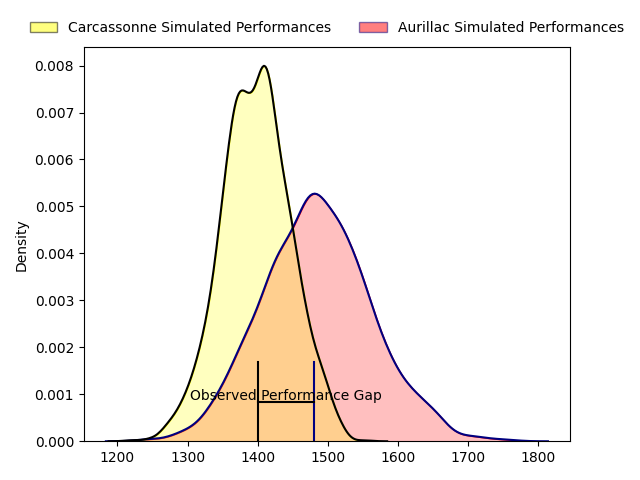
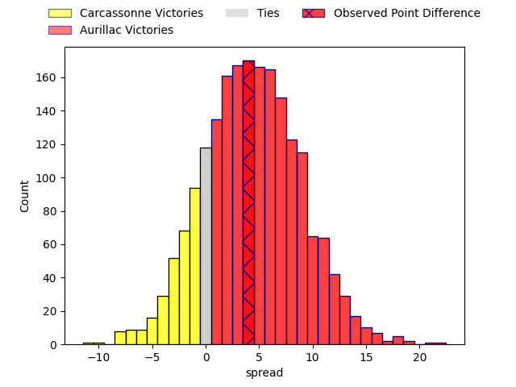
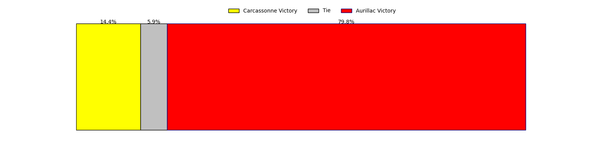
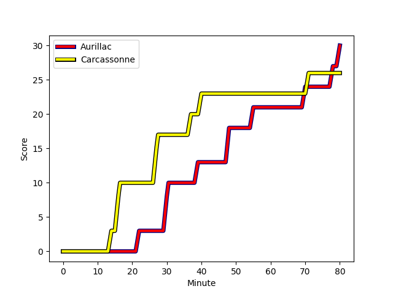

---  
layout: page  
title: Carcassonne at Aurillac; 26-30  
date: 2023-02-10 19:30:00 18:00:00 -0500  
categories: match review  
---
# Carcassonne at Aurillac; 26-30

# Club Level Predictions

The first set of predictions treats a club as the smallest object, as the club develops its members, organizes a gameplan, and deploys its players as needed for each match. This club model has a prediction of 0.621, which translates to predicting Aurillac to win by 4.3.

Each club has a rating and a rating deviation (simiar to a Glicko system), and expected performances can be generated. This allows for simulated matches and spreads like the ones below.
## Projected Performances

## Projected Spreads

## Projected Results

# Player Level Predictions

Treating teams instead as an entity made up of the currently active players, I have ratings for each player in an altogether different system. These can be combined to form team ratings once teamsheets are announced, weighting starters a bit higher than the reserves. After the match is played, players can be weighted by their minutes on the field, allowing for an accurate measure of the team's composition. With these compiled team ratings, we can make predictions, measure inaccuracy, and update the individual player ratings.
## Prediction with Player Minutes: Aurillac by 10.4

Aurillac by 6.4 on a neutral field
## Scores over Time

## Win Probability over Time

There were 5 large changes in win probability in this match
## Prediction without Player Minutes: Aurillac by 18.1

Aurillac by 14.1 on a neutral pitch

|   Away Minutes | Away Player                                                                     |   Away elo |   Away Percentile |   Number |   Home Percentile |   Home elo | Home Player                                                               |   Home Minutes |
|---------------:|:--------------------------------------------------------------------------------|-----------:|------------------:|---------:|------------------:|-----------:|:--------------------------------------------------------------------------|---------------:|
|             64 | [Youssef Amrouni](..//playerfiles//YoussefAmrouni_cleaned.md)                   |      81.79 |                 7 |        1 |                83 |     110.72 | [Alexandre Plantier](..//playerfiles//AlexandrePlantier_cleaned.md)       |             64 |
|             64 | [Raphael Carbou](..//playerfiles//RaphaelCarbou_cleaned.md)                     |      81.25 |                 5 |        2 |                93 |     118.87 | [Adrian Smith](..//playerfiles//AdrianSmith_cleaned.md)                   |             64 |
|             64 | [Raphael Carbou](..//playerfiles//RaphaelCarbou_cleaned.md)                     |      81.25 |                 5 |        2 |                91 |     118.87 | [Adrian Smith](..//playerfiles//AdrianSmith_cleaned.md)                   |             64 |
|             47 | [Soso Bekoshvili](..//playerfiles//SosoBekoshvili_cleaned.md)                   |      89.16 |                25 |        3 |                94 |     120.76 | [Giorgi Kartvelishvili](..//playerfiles//GiorgiKartvelishvili_cleaned.md) |             41 |
|             47 | [Soso Bekoshvili](..//playerfiles//SosoBekoshvili_cleaned.md)                   |      89.16 |                25 |        3 |                91 |     120.76 | [Giorgi Kartvelishvili](..//playerfiles//GiorgiKartvelishvili_cleaned.md) |             41 |
|             41 | [Romain Manchia](..//playerfiles//RomainManchia_cleaned.md)                     |      83    |                 9 |        4 |                90 |     119.24 | [Cam Dodson](..//playerfiles//CamDodson_cleaned.md)                       |             50 |
|             41 | [Romain Manchia](..//playerfiles//RomainManchia_cleaned.md)                     |      83    |                19 |        4 |                90 |     119.24 | [Cam Dodson](..//playerfiles//CamDodson_cleaned.md)                       |             50 |
|             80 | [Rynard Landman](..//playerfiles//RynardLandman_cleaned.md)                     |     105.02 |                67 |        5 |                58 |      98.56 | [Georgi Javakhia](..//playerfiles//GeorgiJavakhia_cleaned.md)             |             64 |
|             80 | [Aaron Carroll](..//playerfiles//AaronCarroll_cleaned.md)                       |     120.03 |                90 |        6 |                57 |     100.3  | [Yann Tivoli](..//playerfiles//YannTivoli_cleaned.md)                     |             80 |
|             80 | [Rob Harley](..//playerfiles//RobHarley_cleaned.md)                             |     119.88 |                90 |        7 |                60 |      99.59 | [Hugo Huurman](..//playerfiles//HugoHuurman_cleaned.md)                   |             41 |
|             80 | [Pierre Reynaud](..//playerfiles//PierreReynaud_cleaned.md)                     |     111.49 |                79 |        8 |                96 |     129.75 | [Didier Tison](..//playerfiles//DidierTison_cleaned.md)                   |             80 |
|             69 | [Pierre Pages](..//playerfiles//PierrePages_cleaned.md)                         |     101.33 |                64 |        9 |                11 |      78.4  | [Hugo Bouyssou](..//playerfiles//HugoBouyssou_cleaned.md)                 |             66 |
|             62 | [Dorian Jones](..//playerfiles//DorianJones_cleaned.md)                         |     104.13 |                62 |       10 |                81 |     114.56 | [Marc Palmier](..//playerfiles//MarcPalmier_cleaned.md)                   |             80 |
|             80 | [Clément Clavières](..//playerfiles//ClémentClavières_cleaned.md)               |     103.93 |                71 |       11 |                55 |      97.74 | [Giorgi Gogoladze](..//playerfiles//GiorgiGogoladze_cleaned.md)           |             80 |
|             80 | [Jordan Puletua](..//playerfiles//JordanPuletua_cleaned.md)                     |      64.36 |                 1 |       12 |                44 |      93.91 | [Christa Powell](..//playerfiles//ChristaPowell_cleaned.md)               |             80 |
|             80 | [Brieuc Plessis-Couillaud](..//playerfiles//BrieucPlessis-Couillaud_cleaned.md) |      79.19 |                13 |       13 |                29 |      91.09 | [Jimmy Yobo](..//playerfiles//JimmyYobo_cleaned.md)                       |             80 |
|             80 | [Léo Darrelatour](..//playerfiles//LéoDarrelatour_cleaned.md)                   |      96.3  |                52 |       14 |                77 |     109.41 | [Elijah Niko](..//playerfiles//ElijahNiko_cleaned.md)                     |             56 |
|             80 | [Léo Darrelatour](..//playerfiles//LéoDarrelatour_cleaned.md)                   |      96.3  |                52 |       14 |                71 |     109.41 | [Elijah Niko](..//playerfiles//ElijahNiko_cleaned.md)                     |             56 |
|             80 | [Damien Añon](..//playerfiles//DamienAñon_cleaned.md)                           |      92.58 |                32 |       15 |                10 |      75.8  | [Anderson Neisen](..//playerfiles//AndersonNeisen_cleaned.md)             |             80 |
|             39 | [George Merrick](..//playerfiles//GeorgeMerrick_cleaned.md)                     |      82.47 |                14 |       16 |                12 |      82.48 | [Henzo Kiteau](..//playerfiles//HenzoKiteau_cleaned.md)                   |             39 |
|             33 | [Jérémy Boyadjis](..//playerfiles//JérémyBoyadjis_cleaned.md)                   |     108.5  |                82 |       17 |                30 |      89.2  | [Latuka Maituku](..//playerfiles//LatukaMaituku_cleaned.md)               |             39 |
|             18 | [Chris Hilsenbeck](..//playerfiles//ChrisHilsenbeck_cleaned.md)                 |     101.71 |                62 |       18 |                47 |      96.16 | [Martial Rolland](..//playerfiles//MartialRolland_cleaned.md)             |             30 |
|             18 | [Chris Hilsenbeck](..//playerfiles//ChrisHilsenbeck_cleaned.md)                 |     101.71 |                61 |       18 |                47 |      96.16 | [Martial Rolland](..//playerfiles//MartialRolland_cleaned.md)             |             30 |
|             16 | [Sami Mavinga](..//playerfiles//SamiMavinga_cleaned.md)                         |      87.75 |                16 |       19 |                23 |      87.04 | [Antoine Aucagne](..//playerfiles//AntoineAucagne_cleaned.md)             |             24 |
|             16 | [Luka Petriashvili](..//playerfiles//LukaPetriashvili_cleaned.md)               |     117.27 |                84 |       20 |                16 |      81.31 | [Jean-Baptiste Singer](..//playerfiles//Jean-BaptisteSinger_cleaned.md)   |             16 |
|             16 | [Luka Petriashvili](..//playerfiles//LukaPetriashvili_cleaned.md)               |     117.27 |                92 |       20 |                12 |      81.31 | [Jean-Baptiste Singer](..//playerfiles//Jean-BaptisteSinger_cleaned.md)   |             16 |
|             16 | [Luka Petriashvili](..//playerfiles//LukaPetriashvili_cleaned.md)               |     117.27 |                84 |       20 |                12 |      81.31 | [Jean-Baptiste Singer](..//playerfiles//Jean-BaptisteSinger_cleaned.md)   |             16 |
|             16 | [Luka Petriashvili](..//playerfiles//LukaPetriashvili_cleaned.md)               |     117.27 |                92 |       20 |                16 |      81.31 | [Jean-Baptiste Singer](..//playerfiles//Jean-BaptisteSinger_cleaned.md)   |             16 |
|             11 | [Martin Dulon](..//playerfiles//MartinDulon_cleaned.md)                         |      93.73 |                44 |       21 |                94 |     119.7  | [Luka Nioradze](..//playerfiles//LukaNioradze_cleaned.md)                 |             16 |
|            nan | nan                                                                             |     nan    |               nan |       22 |                24 |      87.64 | [Robert Rodgers](..//playerfiles//RobertRodgers_cleaned.md)               |             16 |
|            nan | nan                                                                             |     nan    |               nan |       22 |                18 |      87.64 | [Robert Rodgers](..//playerfiles//RobertRodgers_cleaned.md)               |             16 |
|            nan | nan                                                                             |     nan    |               nan |       23 |                16 |      81.9  | [David Delarue](..//playerfiles//DavidDelarue_cleaned.md)                 |             14 |
|            nan | nan                                                                             |     nan    |               nan |       23 |                12 |      81.9  | [David Delarue](..//playerfiles//DavidDelarue_cleaned.md)                 |             14 |

