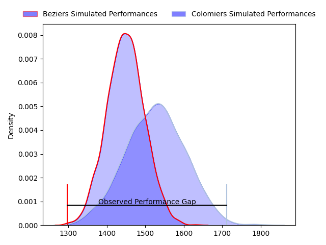
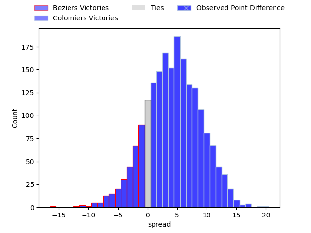
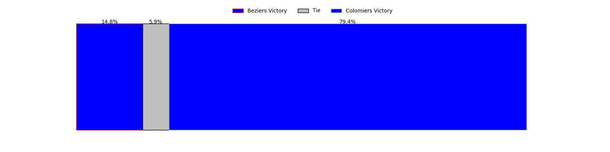
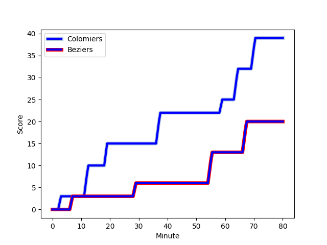
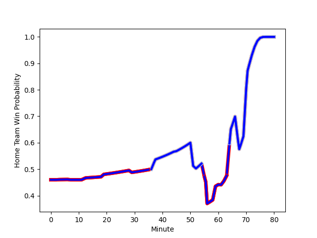

---  
layout: page  
title: Beziers at Colomiers; 20-39  
date: 2023-02-10 19:30:00 18:00:00 -0500  
categories: match review  
---
# Beziers at Colomiers; 20-39

# Club Level Predictions

The first set of predictions treats a club as the smallest object, as the club develops its members, organizes a gameplan, and deploys its players as needed for each match. This club model has a prediction of 0.614, which translates to predicting Colomiers to win by 4.1.

Each club has a rating and a rating deviation (simiar to a Glicko system), and expected performances can be generated. This allows for simulated matches and spreads like the ones below.
## Projected Performances

## Projected Spreads

## Projected Results

# Player Level Predictions

Treating teams instead as an entity made up of the currently active players, I have ratings for each player in an altogether different system. These can be combined to form team ratings once teamsheets are announced, weighting starters a bit higher than the reserves. After the match is played, players can be weighted by their minutes on the field, allowing for an accurate measure of the team's composition. With these compiled team ratings, we can make predictions, measure inaccuracy, and update the individual player ratings.
## Prediction with Player Minutes: Beziers by 3.8

Beziers by 7.8 on a neutral field
## Scores over Time

## Win Probability over Time

There were 15 large changes in win probability in this match
## Prediction without Player Minutes: Beziers by 3.1

Beziers by 7.1 on a neutral pitch

|   Away Minutes | Away Player                                                                          |   Away elo |   Away Percentile |   Number |   Home Percentile |   Home elo | Home Player                                                         |   Home Minutes |
|---------------:|:-------------------------------------------------------------------------------------|-----------:|------------------:|---------:|------------------:|-----------:|:--------------------------------------------------------------------|---------------:|
|             54 | [Francisco Fernandes Moreira](..//playerfiles//FranciscoFernandesMoreira_cleaned.md) |     119.89 |                94 |        1 |                 2 |      64.15 | [Thomas Dubois](..//playerfiles//ThomasDubois_cleaned.md)           |             56 |
|             54 | [Francisco Fernandes Moreira](..//playerfiles//FranciscoFernandesMoreira_cleaned.md) |     119.89 |                95 |        1 |                 5 |      64.15 | [Thomas Dubois](..//playerfiles//ThomasDubois_cleaned.md)           |             56 |
|             54 | [Francisco Fernandes Moreira](..//playerfiles//FranciscoFernandesMoreira_cleaned.md) |     119.89 |                95 |        1 |                 2 |      64.15 | [Thomas Dubois](..//playerfiles//ThomasDubois_cleaned.md)           |             56 |
|             54 | [Francisco Fernandes Moreira](..//playerfiles//FranciscoFernandesMoreira_cleaned.md) |     119.89 |                94 |        1 |                 5 |      64.15 | [Thomas Dubois](..//playerfiles//ThomasDubois_cleaned.md)           |             56 |
|             45 | [Marco Pinto Ferrer](..//playerfiles//MarcoPintoFerrer_cleaned.md)                   |      88.88 |                28 |        2 |                49 |      88.89 | [Andrew Ready](..//playerfiles//AndrewReady_cleaned.md)             |             51 |
|             45 | [Marco Pinto Ferrer](..//playerfiles//MarcoPintoFerrer_cleaned.md)                   |      88.88 |                28 |        2 |                29 |      88.89 | [Andrew Ready](..//playerfiles//AndrewReady_cleaned.md)             |             51 |
|             45 | [Yannick Arroyo](..//playerfiles//YannickArroyo_cleaned.md)                          |      97.07 |                64 |        3 |                 1 |      58.54 | [Hugo Pirlet](..//playerfiles//HugoPirlet_cleaned.md)               |             56 |
|             45 | [Yannick Arroyo](..//playerfiles//YannickArroyo_cleaned.md)                          |      97.07 |                54 |        3 |                 1 |      58.54 | [Hugo Pirlet](..//playerfiles//HugoPirlet_cleaned.md)               |             56 |
|             80 | [Clément Bitz](..//playerfiles//ClémentBitz_cleaned.md)                              |      99.55 |                60 |        4 |                84 |     109.58 | [Jean Thomas](..//playerfiles//JeanThomas_cleaned.md)               |             56 |
|             51 | [Yassine Maamry](..//playerfiles//YassineMaamry_cleaned.md)                          |      83.67 |                19 |        5 |                57 |      87.61 | [Maxime Granouillet](..//playerfiles//MaximeGranouillet_cleaned.md) |             80 |
|             51 | [Yassine Maamry](..//playerfiles//YassineMaamry_cleaned.md)                          |      83.67 |                19 |        5 |                28 |      87.61 | [Maxime Granouillet](..//playerfiles//MaximeGranouillet_cleaned.md) |             80 |
|             80 | [Jean-Baptiste Barrère](..//playerfiles//Jean-BaptisteBarrère_cleaned.md)            |      79.12 |                11 |        6 |                 2 |      66.88 | [Anthony Coletta](..//playerfiles//AnthonyColetta_cleaned.md)       |             80 |
|             80 | [Éloi Massot](..//playerfiles//ÉloiMassot_cleaned.md)                                |      81.04 |                13 |        7 |                44 |      93.4  | [Aldric Lescure](..//playerfiles//AldricLescure_cleaned.md)         |             80 |
|             51 | [Thomas Hoarau](..//playerfiles//ThomasHoarau_cleaned.md)                            |     101.64 |                61 |        8 |                36 |      80.43 | [Jorick Dastugue](..//playerfiles//JorickDastugue_cleaned.md)       |             63 |
|             51 | [Thomas Hoarau](..//playerfiles//ThomasHoarau_cleaned.md)                            |     101.64 |                73 |        8 |                14 |      80.43 | [Jorick Dastugue](..//playerfiles//JorickDastugue_cleaned.md)       |             63 |
|             51 | [Thomas Hoarau](..//playerfiles//ThomasHoarau_cleaned.md)                            |     101.64 |                61 |        8 |                14 |      80.43 | [Jorick Dastugue](..//playerfiles//JorickDastugue_cleaned.md)       |             63 |
|             51 | [Thomas Hoarau](..//playerfiles//ThomasHoarau_cleaned.md)                            |     101.64 |                73 |        8 |                36 |      80.43 | [Jorick Dastugue](..//playerfiles//JorickDastugue_cleaned.md)       |             63 |
|             50 | [Mitch Short](..//playerfiles//MitchShort_cleaned.md)                                |      67.21 |                 4 |        9 |                70 |     102.2  | [Edoardo Gori](..//playerfiles//EdoardoGori_cleaned.md)             |             56 |
|             50 | [Mitch Short](..//playerfiles//MitchShort_cleaned.md)                                |      67.21 |                 4 |        9 |                66 |     102.2  | [Edoardo Gori](..//playerfiles//EdoardoGori_cleaned.md)             |             56 |
|             60 | [Victor Dreuille](..//playerfiles//VictorDreuille_cleaned.md)                        |      86.83 |                34 |       10 |                 1 |      53.45 | [Maxime Javaux](..//playerfiles//MaximeJavaux_cleaned.md)           |             80 |
|             60 | [Victor Dreuille](..//playerfiles//VictorDreuille_cleaned.md)                        |      86.83 |                22 |       10 |                 1 |      53.45 | [Maxime Javaux](..//playerfiles//MaximeJavaux_cleaned.md)           |             80 |
|             80 | [Raffaele Storti](..//playerfiles//RaffaeleStorti_cleaned.md)                        |     112    |                82 |       11 |                42 |      93.01 | [Valentin Saurs](..//playerfiles//ValentinSaurs_cleaned.md)         |             80 |
|             52 | [James Tofa](..//playerfiles//JamesTofa_cleaned.md)                                  |      62.01 |                 1 |       12 |                87 |     114.07 | [Paul Pimienta](..//playerfiles//PaulPimienta_cleaned.md)           |             80 |
|             52 | [James Tofa](..//playerfiles//JamesTofa_cleaned.md)                                  |      62.01 |                 2 |       12 |                87 |     114.07 | [Paul Pimienta](..//playerfiles//PaulPimienta_cleaned.md)           |             80 |
|             80 | [Dries Swanepoel](..//playerfiles//DriesSwanepoel_cleaned.md)                        |      87.81 |                28 |       13 |                45 |      94.32 | [Fabien Perrin](..//playerfiles//FabienPerrin_cleaned.md)           |             56 |
|             80 | [Watisoni Votu](..//playerfiles//WatisoniVotu_cleaned.md)                            |      97.72 |                55 |       14 |                70 |     107.22 | [Max Auriac](..//playerfiles//MaxAuriac_cleaned.md)                 |             80 |
|             80 | [Nicolas Plazy](..//playerfiles//NicolasPlazy_cleaned.md)                            |     122.9  |                91 |       15 |                30 |      88.7  | [Thomas Girard](..//playerfiles//ThomasGirard_cleaned.md)           |             61 |
|             35 | [Clément Esteriola](..//playerfiles//ClémentEsteriola_cleaned.md)                    |      78.47 |                 9 |       16 |                71 |     102.58 | [Hika Elliot](..//playerfiles//HikaElliot_cleaned.md)               |             29 |
|             35 | [Jamie Hagan](..//playerfiles//JamieHagan_cleaned.md)                                |     119.32 |                93 |       17 |                97 |     121.2  | [Marco Fepulea'i](..//playerfiles//MarcoFepulea'i_cleaned.md)       |             24 |
|             35 | [Jamie Hagan](..//playerfiles//JamieHagan_cleaned.md)                                |     119.32 |                93 |       17 |                95 |     121.2  | [Marco Fepulea'i](..//playerfiles//MarcoFepulea'i_cleaned.md)       |             24 |
|             30 | [Josh Valentine](..//playerfiles//JoshValentine_cleaned.md)                          |     115.49 |                90 |       18 |                49 |      95.77 | [Mathis Galthié](..//playerfiles//MathisGalthié_cleaned.md)         |             24 |
|             29 | [Maxence Lemardelet](..//playerfiles//MaxenceLemardelet_cleaned.md)                  |      82.41 |                17 |       19 |                94 |     125.38 | [Johan Deysel (Jnr)](..//playerfiles//JohanDeysel(Jnr)_cleaned.md)  |             24 |
|             29 | [Maxence Lemardelet](..//playerfiles//MaxenceLemardelet_cleaned.md)                  |      82.41 |                17 |       19 |                93 |     125.38 | [Johan Deysel (Jnr)](..//playerfiles//JohanDeysel(Jnr)_cleaned.md)  |             24 |
|             29 | [John Madigan](..//playerfiles//JohnMadigan_cleaned.md)                              |      82.34 |                26 |       20 |                20 |      73.45 | [Alexandre Ricard](..//playerfiles//AlexandreRicard_cleaned.md)     |             24 |
|             29 | [John Madigan](..//playerfiles//JohnMadigan_cleaned.md)                              |      82.34 |                17 |       20 |                20 |      73.45 | [Alexandre Ricard](..//playerfiles//AlexandreRicard_cleaned.md)     |             24 |
|             29 | [John Madigan](..//playerfiles//JohnMadigan_cleaned.md)                              |      82.34 |                26 |       20 |                 8 |      73.45 | [Alexandre Ricard](..//playerfiles//AlexandreRicard_cleaned.md)     |             24 |
|             29 | [John Madigan](..//playerfiles//JohnMadigan_cleaned.md)                              |      82.34 |                17 |       20 |                 8 |      73.45 | [Alexandre Ricard](..//playerfiles//AlexandreRicard_cleaned.md)     |             24 |
|             28 | [Jarrod Poi](..//playerfiles//JarrodPoi_cleaned.md)                                  |     101.33 |                64 |       21 |                96 |     124.23 | [Guillaume Tartas](..//playerfiles//GuillaumeTartas_cleaned.md)     |             24 |
|             26 | [John-Hubert Meyer](..//playerfiles//John-HubertMeyer_cleaned.md)                    |     102.67 |                71 |       22 |                 8 |      74.21 | [Peni Rokoduguni](..//playerfiles//PeniRokoduguni_cleaned.md)       |             19 |
|             20 | [Romain Uruty](..//playerfiles//RomainUruty_cleaned.md)                              |      98.4  |                60 |       23 |                14 |      77.46 | [Yann Peysson](..//playerfiles//YannPeysson_cleaned.md)             |             17 |

