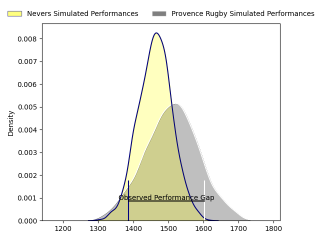
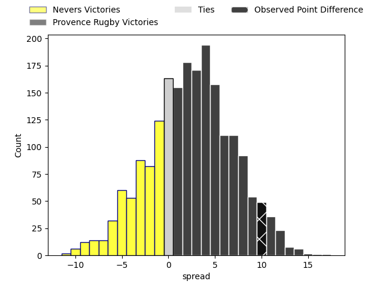
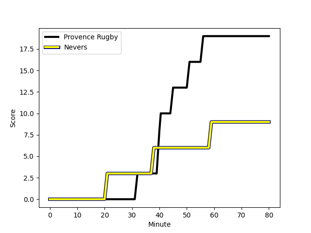
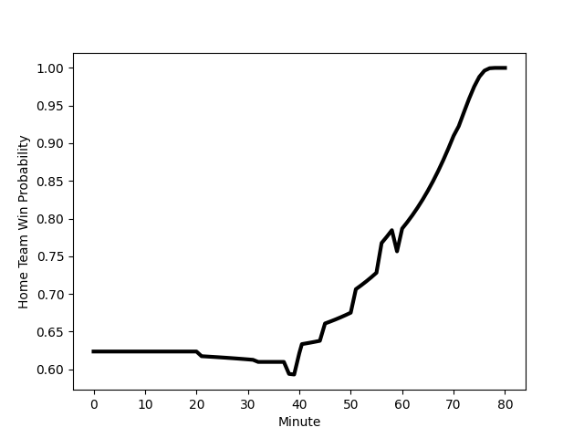

---  
layout: page  
title: Nevers at Provence Rugby; 9-19  
date: 2023-02-10 19:30:00 18:00:00 -0500  
categories: match review  
---
# Nevers at Provence Rugby; 9-19

# Club Level Predictions

The first set of predictions treats a club as the smallest object, as the club develops its members, organizes a gameplan, and deploys its players as needed for each match. This club model has a prediction of 0.568, which translates to predicting Provence Rugby to win by 2.4.

Each club has a rating and a rating deviation (simiar to a Glicko system), and expected performances can be generated. This allows for simulated matches and spreads like the ones below.
## Projected Performances

## Projected Spreads

## Projected Results

# Player Level Predictions

Treating teams instead as an entity made up of the currently active players, I have ratings for each player in an altogether different system. These can be combined to form team ratings once teamsheets are announced, weighting starters a bit higher than the reserves. After the match is played, players can be weighted by their minutes on the field, allowing for an accurate measure of the team's composition. With these compiled team ratings, we can make predictions, measure inaccuracy, and update the individual player ratings.
## Prediction with Player Minutes: Provence Rugby by 25.9

Provence Rugby by 21.9 on a neutral field
## Scores over Time

## Win Probability over Time

There were 5 large changes in win probability in this match
## Prediction without Player Minutes: Provence Rugby by 25.1

Provence Rugby by 21.1 on a neutral pitch

|   Away Minutes | Away Player                                                                   |   Away elo |   Away Percentile |   Number |   Home Percentile |   Home elo | Home Player                                                              |   Home Minutes |
|---------------:|:------------------------------------------------------------------------------|-----------:|------------------:|---------:|------------------:|-----------:|:-------------------------------------------------------------------------|---------------:|
|             47 | [Tornike Mataradze](..//playerfiles//TornikeMataradze_cleaned.md)             |      90.42 |                32 |        1 |                81 |     110.13 | [Federico Wegrzyn](..//playerfiles//FedericoWegrzyn_cleaned.md)          |             32 |
|             59 | [Issam Hamel](..//playerfiles//IssamHamel_cleaned.md)                         |      86.81 |                35 |        2 |                23 |      94.63 | [Lucas Martin](..//playerfiles//LucasMartin_cleaned.md)                  |             32 |
|             59 | [Issam Hamel](..//playerfiles//IssamHamel_cleaned.md)                         |      86.81 |                22 |        2 |                23 |      94.63 | [Lucas Martin](..//playerfiles//LucasMartin_cleaned.md)                  |             32 |
|             47 | [Aselo Ikahehegi](..//playerfiles//AseloIkahehegi_cleaned.md)                 |      92.7  |                44 |        3 |                73 |     104.06 | [Luke Tagi](..//playerfiles//LukeTagi_cleaned.md)                        |             32 |
|             80 | [Christiaan van der Merwe](..//playerfiles//ChristiaanvanderMerwe_cleaned.md) |      63.17 |                 2 |        4 |                93 |     124.24 | [Clément Chartier](..//playerfiles//ClémentChartier_cleaned.md)          |             80 |
|             56 | [Will Skelton](..//playerfiles//WillSkelton_cleaned.md)                       |     119.38 |                91 |        5 |                41 |      93.26 | [Alexandre Flanquart](..//playerfiles//AlexandreFlanquart_cleaned.md)    |             56 |
|             56 | [Will Skelton](..//playerfiles//WillSkelton_cleaned.md)                       |     119.38 |                90 |        5 |                41 |      93.26 | [Alexandre Flanquart](..//playerfiles//AlexandreFlanquart_cleaned.md)    |             56 |
|             80 | [Steven David](..//playerfiles//StevenDavid_cleaned.md)                       |      84.15 |                21 |        6 |                79 |     109.54 | [Guillaume Piazzoli](..//playerfiles//GuillaumePiazzoli_cleaned.md)      |             80 |
|             80 | [Hugues Bastide](..//playerfiles//HuguesBastide_cleaned.md)                   |     122.32 |                92 |        7 |                16 |      92.39 | [Jessy Jegerlehner](..//playerfiles//JessyJegerlehner_cleaned.md)        |             60 |
|             80 | [Hugues Bastide](..//playerfiles//HuguesBastide_cleaned.md)                   |     122.32 |                92 |        7 |                41 |      92.39 | [Jessy Jegerlehner](..//playerfiles//JessyJegerlehner_cleaned.md)        |             60 |
|             54 | [Shaun Adendorff](..//playerfiles//ShaunAdendorff_cleaned.md)                 |     104.28 |                67 |        8 |                68 |     104.95 | [Carl Axtens](..//playerfiles//CarlAxtens_cleaned.md)                    |             80 |
|             50 | [Yoan Cottin](..//playerfiles//YoanCottin_cleaned.md)                         |     111.6  |                87 |        9 |                60 |      97.43 | [Simon Tarel](..//playerfiles//SimonTarel_cleaned.md)                    |             79 |
|             80 | [Yohan Le Bourhis](..//playerfiles//YohanLeBourhis_cleaned.md)                |      99.73 |                57 |       10 |                85 |     126.51 | [Johnny McPhillips](..//playerfiles//JohnnyMcPhillips_cleaned.md)        |             60 |
|             80 | [Yohan Le Bourhis](..//playerfiles//YohanLeBourhis_cleaned.md)                |      99.73 |                57 |       10 |                94 |     126.51 | [Johnny McPhillips](..//playerfiles//JohnnyMcPhillips_cleaned.md)        |             60 |
|             80 | [Christian Ambadiang](..//playerfiles//ChristianAmbadiang_cleaned.md)         |      82.5  |                17 |       11 |                89 |     119.05 | [Nadir Bouhedjeur](..//playerfiles//NadirBouhedjeur_cleaned.md)          |             80 |
|             71 | [Rudy Derrieux](..//playerfiles//RudyDerrieux_cleaned.md)                     |      75.93 |                14 |       12 |                74 |     106.73 | [Kaveinga Finau](..//playerfiles//KaveingaFinau_cleaned.md)              |             80 |
|             71 | [Rudy Derrieux](..//playerfiles//RudyDerrieux_cleaned.md)                     |      75.93 |                 9 |       12 |                74 |     106.73 | [Kaveinga Finau](..//playerfiles//KaveingaFinau_cleaned.md)              |             80 |
|             80 | [Leonard Paris](..//playerfiles//LeonardParis_cleaned.md)                     |     112.27 |                83 |       13 |                96 |     128.96 | [Peter Betham](..//playerfiles//PeterBetham_cleaned.md)                  |             56 |
|             80 | [Andrzej Charlat](..//playerfiles//AndrzejCharlat_cleaned.md)                 |     127.54 |                95 |       14 |                93 |     125.56 | [Kevin Bly](..//playerfiles//KevinBly_cleaned.md)                        |             80 |
|             59 | [Benjamin Dumas](..//playerfiles//BenjaminDumas_cleaned.md)                   |      77.08 |                11 |       15 |                82 |     115.12 | [Florent Massip](..//playerfiles//FlorentMassip_cleaned.md)              |             80 |
|             33 | [Kamaliele Tufele](..//playerfiles//KamalieleTufele_cleaned.md)               |      87.23 |                32 |       16 |                20 |      86.86 | [Julius Nostadt](..//playerfiles//JuliusNostadt_cleaned.md)              |             48 |
|             33 | [Kamaliele Tufele](..//playerfiles//KamalieleTufele_cleaned.md)               |      87.23 |                24 |       16 |                20 |      86.86 | [Julius Nostadt](..//playerfiles//JuliusNostadt_cleaned.md)              |             48 |
|             33 | [Kamaliele Tufele](..//playerfiles//KamalieleTufele_cleaned.md)               |      87.23 |                32 |       16 |                22 |      86.86 | [Julius Nostadt](..//playerfiles//JuliusNostadt_cleaned.md)              |             48 |
|             33 | [Kamaliele Tufele](..//playerfiles//KamalieleTufele_cleaned.md)               |      87.23 |                24 |       16 |                22 |      86.86 | [Julius Nostadt](..//playerfiles//JuliusNostadt_cleaned.md)              |             48 |
|             33 | [Sosefo Falatea](..//playerfiles//SosefoFalatea_cleaned.md)                   |      78    |                 8 |       17 |                77 |     105.95 | [German Kessler Lordon](..//playerfiles//GermanKesslerLordon_cleaned.md) |             48 |
|             33 | [Sosefo Falatea](..//playerfiles//SosefoFalatea_cleaned.md)                   |      78    |                 8 |       17 |                75 |     105.95 | [German Kessler Lordon](..//playerfiles//GermanKesslerLordon_cleaned.md) |             48 |
|             30 | [Arthurs Barbier](..//playerfiles//ArthursBarbier_cleaned.md)                 |      98.04 |                55 |       18 |                14 |      83.68 | [Dave Lolohea](..//playerfiles//DaveLolohea_cleaned.md)                  |             48 |
|             30 | [Arthurs Barbier](..//playerfiles//ArthursBarbier_cleaned.md)                 |      98.04 |                64 |       18 |                16 |      83.68 | [Dave Lolohea](..//playerfiles//DaveLolohea_cleaned.md)                  |             48 |
|             30 | [Arthurs Barbier](..//playerfiles//ArthursBarbier_cleaned.md)                 |      98.04 |                64 |       18 |                14 |      83.68 | [Dave Lolohea](..//playerfiles//DaveLolohea_cleaned.md)                  |             48 |
|             30 | [Arthurs Barbier](..//playerfiles//ArthursBarbier_cleaned.md)                 |      98.04 |                55 |       18 |                16 |      83.68 | [Dave Lolohea](..//playerfiles//DaveLolohea_cleaned.md)                  |             48 |
|             26 | [Julien Kazubek](..//playerfiles//JulienKazubek_cleaned.md)                   |      86.84 |                24 |       19 |                94 |     125.66 | [Jérôme Dufour](..//playerfiles//JérômeDufour_cleaned.md)                |             24 |
|             26 | [Julien Kazubek](..//playerfiles//JulienKazubek_cleaned.md)                   |      86.84 |                34 |       19 |                94 |     125.66 | [Jérôme Dufour](..//playerfiles//JérômeDufour_cleaned.md)                |             24 |
|             26 | [Julien Kazubek](..//playerfiles//JulienKazubek_cleaned.md)                   |      86.84 |                24 |       19 |                89 |     125.66 | [Jérôme Dufour](..//playerfiles//JérômeDufour_cleaned.md)                |             24 |
|             26 | [Julien Kazubek](..//playerfiles//JulienKazubek_cleaned.md)                   |      86.84 |                34 |       19 |                89 |     125.66 | [Jérôme Dufour](..//playerfiles//JérômeDufour_cleaned.md)                |             24 |
|             24 | [Makatuki Polutele](..//playerfiles//MakatukiPolutele_cleaned.md)             |      49.46 |                 0 |       20 |                95 |     127.96 | [Louis Marrou](..//playerfiles//LouisMarrou_cleaned.md)                  |             24 |
|             21 | [Thomas Zenon](..//playerfiles//ThomasZenon_cleaned.md)                       |      87.34 |                27 |       21 |                 5 |      74.64 | [Nicolas Mousties](..//playerfiles//NicolasMousties_cleaned.md)          |             20 |
|             21 | [Quentin Beaudaux](..//playerfiles//QuentinBeaudaux_cleaned.md)               |      88.07 |                29 |       22 |                80 |     114.6  | [Enzo Selponi](..//playerfiles//EnzoSelponi_cleaned.md)                  |             20 |
|              9 | [Mattéo Faucher](..//playerfiles//MattéoFaucher_cleaned.md)                   |      95.91 |                50 |       23 |               nan |      94.79 | [Jeremie Martin](..//playerfiles//JeremieMartin_cleaned.md)              |              1 |

