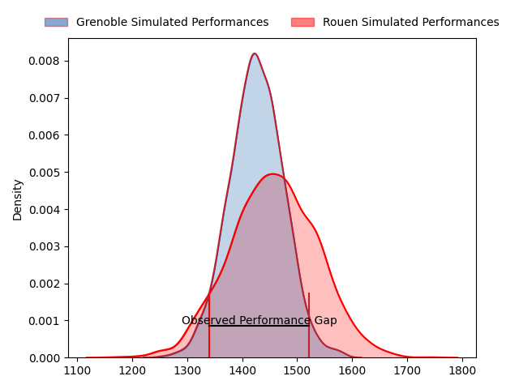
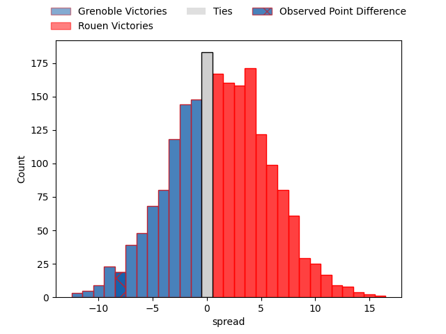
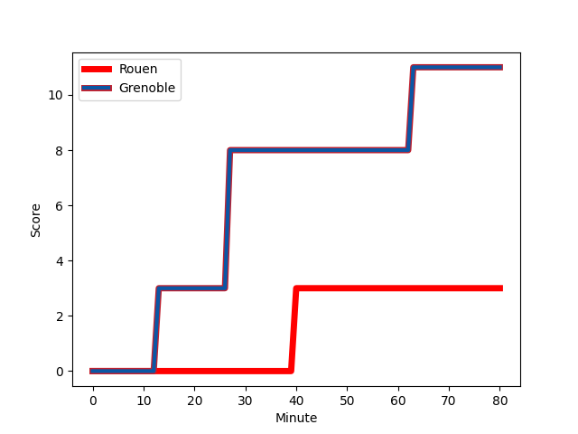
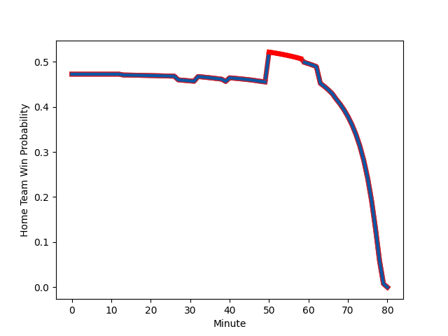

---  
layout: page  
title: Grenoble at Rouen; 11-3  
date: 2023-02-10 19:00:00 18:00:00 -0500  
categories: match review  
---
# Grenoble at Rouen; 11-3

# Club Level Predictions

The first set of predictions treats a club as the smallest object, as the club develops its members, organizes a gameplan, and deploys its players as needed for each match. This club model has a prediction of 0.54, which translates to predicting Rouen to win by 1.4.

Each club has a rating and a rating deviation (simiar to a Glicko system), and expected performances can be generated. This allows for simulated matches and spreads like the ones below.
## Projected Performances

## Projected Spreads

## Projected Results

# Player Level Predictions

Treating teams instead as an entity made up of the currently active players, I have ratings for each player in an altogether different system. These can be combined to form team ratings once teamsheets are announced, weighting starters a bit higher than the reserves. After the match is played, players can be weighted by their minutes on the field, allowing for an accurate measure of the team's composition. With these compiled team ratings, we can make predictions, measure inaccuracy, and update the individual player ratings.
## Prediction with Player Minutes: Grenoble by 0.8

Grenoble by 4.8 on a neutral field
## Scores over Time

## Win Probability over Time

There were 9 large changes in win probability in this match
## Prediction without Player Minutes: Grenoble by 2.7

Grenoble by 6.7 on a neutral pitch

|   Away Minutes | Away Player                                                           |   Away elo |   Away Percentile |   Number |   Home Percentile |   Home elo | Home Player                                                             |   Home Minutes |
|---------------:|:----------------------------------------------------------------------|-----------:|------------------:|---------:|------------------:|-----------:|:------------------------------------------------------------------------|---------------:|
|             41 | [Zurabi Zhvania](..//playerfiles//ZurabiZhvania_cleaned.md)           |     127.06 |                97 |        1 |                26 |      88.06 | [Antoine Fournier](..//playerfiles//AntoineFournier_cleaned.md)         |             67 |
|             39 | [Mathis Sarragallet](..//playerfiles//MathisSarragallet_cleaned.md)   |      99.71 |                63 |        2 |                 2 |      70.04 | [Efi Ma'afu](..//playerfiles//EfiMa'afu_cleaned.md)                     |             59 |
|             41 | [Regis Montagne](..//playerfiles//RegisMontagne_cleaned.md)           |      99.85 |                62 |        3 |                85 |     110.19 | [Hugo Ndiaye](..//playerfiles//HugoNdiaye_cleaned.md)                   |             50 |
|             80 | [Thomas Lainault](..//playerfiles//ThomasLainault_cleaned.md)         |     101.99 |                66 |        4 |                 2 |      61.52 | [John-Charles Astle](..//playerfiles//John-CharlesAstle_cleaned.md)     |             80 |
|             80 | [Tanginoa Halaifonua](..//playerfiles//TanginoaHalaifonua_cleaned.md) |     111.38 |                82 |        5 |                88 |     117.52 | [Jimi Maximin](..//playerfiles//JimiMaximin_cleaned.md)                 |             80 |
|             59 | [Marnus Schoeman](..//playerfiles//MarnusSchoeman_cleaned.md)         |      87.05 |                24 |        6 |                66 |     101.89 | [Lucas Costa](..//playerfiles//LucasCosta_cleaned.md)                   |             47 |
|             80 | [Thibaut Martel](..//playerfiles//ThibautMartel_cleaned.md)           |      77.89 |                10 |        7 |                48 |      95.36 | [Tienie Burger](..//playerfiles//TienieBurger_cleaned.md)               |             80 |
|             50 | [Pio Muarua](..//playerfiles//PioMuarua_cleaned.md)                   |     111.88 |                80 |        8 |                 9 |      77.76 | [Abdelkarim Fofana](..//playerfiles//AbdelkarimFofana_cleaned.md)       |             32 |
|             73 | [Eric Escande](..//playerfiles//EricEscande_cleaned.md)               |     105.87 |                73 |        9 |                14 |      79.92 | [Theo Nanette](..//playerfiles//TheoNanette_cleaned.md)                 |             61 |
|             59 | [Thomas Fortunel](..//playerfiles//ThomasFortunel_cleaned.md)         |      85.07 |                18 |       10 |                72 |     105.62 | [Franck Pourteau](..//playerfiles//FranckPourteau_cleaned.md)           |             80 |
|             80 | [Lucas Dupont](..//playerfiles//LucasDupont_cleaned.md)               |      89.18 |                31 |       11 |                86 |     116.02 | [Benito Masilevu](..//playerfiles//BenitoMasilevu_cleaned.md)           |             55 |
|             80 | [Romain Barthelemy](..//playerfiles//RomainBarthelemy_cleaned.md)     |     116.08 |                87 |       12 |                67 |     103.27 | [JT Jackson](..//playerfiles//JTJackson_cleaned.md)                     |             41 |
|             80 | [Terrence Hepetema](..//playerfiles//TerrenceHepetema_cleaned.md)     |      82.98 |                19 |       13 |                26 |      87.33 | [Opetera Peleseuma](..//playerfiles//OpeteraPeleseuma_cleaned.md)       |             80 |
|             57 | [Wilfried Hulleu](..//playerfiles//WilfriedHulleu_cleaned.md)         |      92.12 |                38 |       14 |                73 |     105.22 | [Malcolm Bertschy](..//playerfiles//MalcolmBertschy_cleaned.md)         |             80 |
|             80 | [Julien Farnoux](..//playerfiles//JulienFarnoux_cleaned.md)           |     114.47 |                80 |       15 |                48 |      95.82 | [Paul Surano](..//playerfiles//PaulSurano_cleaned.md)                   |             80 |
|             41 | [Lilian Rossi](..//playerfiles//LilianRossi_cleaned.md)               |     112.11 |                85 |       16 |                78 |     113.42 | [Willy N'Diaye](..//playerfiles//WillyN'Diaye_cleaned.md)               |             48 |
|             39 | [Zack Gauthier](..//playerfiles//ZackGauthier_cleaned.md)             |     114.73 |                92 |       17 |                87 |     115.69 | [Alex Luatua](..//playerfiles//AlexLuatua_cleaned.md)                   |             39 |
|             39 | [Toma Taufa](..//playerfiles//TomaTaufa_cleaned.md)                   |     106    |                78 |       18 |                72 |     104.71 | [Jean Leleu](..//playerfiles//JeanLeleu_cleaned.md)                     |             33 |
|             30 | [Clement Ancely](..//playerfiles//ClementAncely_cleaned.md)           |     103.65 |                70 |       19 |                78 |     105.82 | [Cody Thomas](..//playerfiles//CodyThomas_cleaned.md)                   |             30 |
|             23 | [Hugo Trouilloud](..//playerfiles//HugoTrouilloud_cleaned.md)         |      72.67 |                 8 |       20 |                90 |     123.63 | [Pete Lydon](..//playerfiles//PeteLydon_cleaned.md)                     |             25 |
|             21 | [Romain Fusier](..//playerfiles//RomainFusier_cleaned.md)             |      92.33 |                44 |       21 |                22 |      88.25 | [Jean-Étienne Lesueur](..//playerfiles//Jean-ÉtienneLesueur_cleaned.md) |             21 |
|             21 | [Adrien Vigne](..//playerfiles//AdrienVigne_cleaned.md)               |      90.03 |                32 |       22 |                12 |      80.06 | [Florent Campeggia](..//playerfiles//FlorentCampeggia_cleaned.md)       |             19 |
|              7 | [Kelian Boissier](..//playerfiles//KelianBoissier_cleaned.md)         |      95.54 |               nan |       23 |               nan |      95.32 | [Ewan Clément](..//playerfiles//EwanClément_cleaned.md)                 |             13 |

