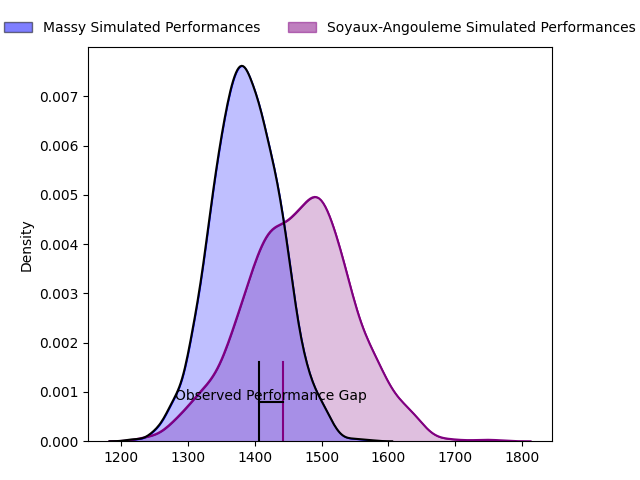
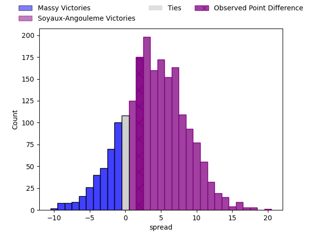
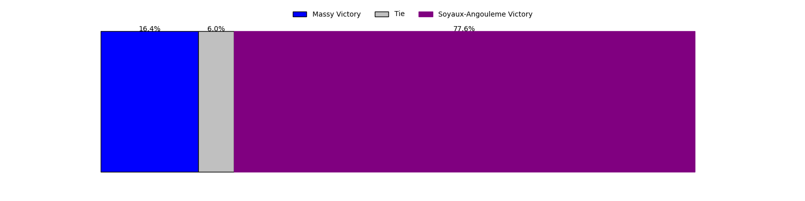
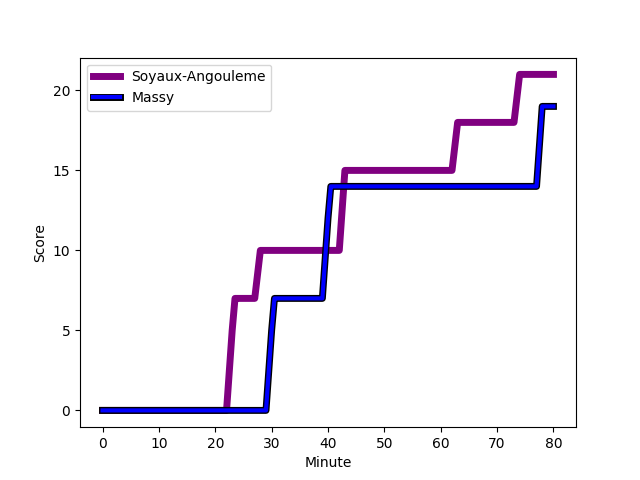
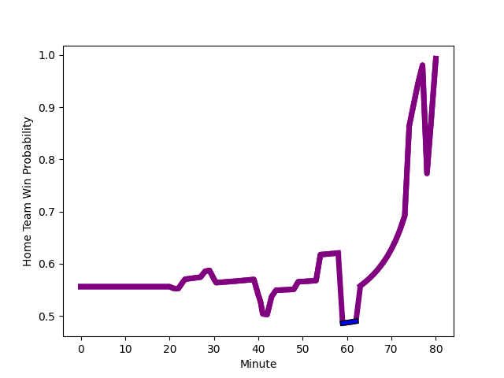

---  
layout: page  
title: Massy at Soyaux-Angouleme; 19-21  
date: 2023-02-10 19:30:00 18:00:00 -0500  
categories: match review  
---
# Massy at Soyaux-Angouleme; 19-21

# Club Level Predictions

The first set of predictions treats a club as the smallest object, as the club develops its members, organizes a gameplan, and deploys its players as needed for each match. This club model has a prediction of 0.61, which translates to predicting Soyaux-Angouleme to win by 3.9.

Each club has a rating and a rating deviation (simiar to a Glicko system), and expected performances can be generated. This allows for simulated matches and spreads like the ones below.
## Projected Performances

## Projected Spreads

## Projected Results

# Player Level Predictions

Treating teams instead as an entity made up of the currently active players, I have ratings for each player in an altogether different system. These can be combined to form team ratings once teamsheets are announced, weighting starters a bit higher than the reserves. After the match is played, players can be weighted by their minutes on the field, allowing for an accurate measure of the team's composition. With these compiled team ratings, we can make predictions, measure inaccuracy, and update the individual player ratings.
## Prediction with Player Minutes: Soyaux-Angouleme by 13.8

Soyaux-Angouleme by 9.8 on a neutral field
## Scores over Time

## Win Probability over Time

There were 13 large changes in win probability in this match
## Prediction without Player Minutes: Soyaux-Angouleme by 12.1

Soyaux-Angouleme by 8.1 on a neutral pitch

|   Away Minutes | Away Player                                                             |   Away elo |   Away Percentile |   Number |   Home Percentile |   Home elo | Home Player                                                                |   Home Minutes |
|---------------:|:------------------------------------------------------------------------|-----------:|------------------:|---------:|------------------:|-----------:|:---------------------------------------------------------------------------|---------------:|
|             54 | [Robin Poipy](..//playerfiles//RobinPoipy_cleaned.md)                   |      93.93 |                51 |        1 |                36 |      93.34 | [Khatchik Vartanov](..//playerfiles//KhatchikVartanov_cleaned.md)          |             80 |
|             52 | [Pierre Trassoudaine](..//playerfiles//PierreTrassoudaine_cleaned.md)   |     127.4  |                96 |        2 |                98 |     133.06 | [Ole Avei](..//playerfiles//OleAvei_cleaned.md)                            |             59 |
|             52 | [Pierre Trassoudaine](..//playerfiles//PierreTrassoudaine_cleaned.md)   |     127.4  |                98 |        2 |                98 |     133.06 | [Ole Avei](..//playerfiles//OleAvei_cleaned.md)                            |             59 |
|             52 | [Tijde Visser](..//playerfiles//TijdeVisser_cleaned.md)                 |      94.71 |                46 |        3 |                62 |     100.13 | [Shota Gogisvanidze](..//playerfiles//ShotaGogisvanidze_cleaned.md)        |             21 |
|             52 | [Tijde Visser](..//playerfiles//TijdeVisser_cleaned.md)                 |      94.71 |                55 |        3 |                62 |     100.13 | [Shota Gogisvanidze](..//playerfiles//ShotaGogisvanidze_cleaned.md)        |             21 |
|             52 | [Tijde Visser](..//playerfiles//TijdeVisser_cleaned.md)                 |      94.71 |                46 |        3 |                46 |     100.13 | [Shota Gogisvanidze](..//playerfiles//ShotaGogisvanidze_cleaned.md)        |             21 |
|             52 | [Tijde Visser](..//playerfiles//TijdeVisser_cleaned.md)                 |      94.71 |                55 |        3 |                46 |     100.13 | [Shota Gogisvanidze](..//playerfiles//ShotaGogisvanidze_cleaned.md)        |             21 |
|             80 | [Andrew Chauveau](..//playerfiles//AndrewChauveau_cleaned.md)           |      87.75 |                28 |        4 |                14 |      77.22 | [Matt Beukeboom](..//playerfiles//MattBeukeboom_cleaned.md)                |             80 |
|             80 | [Dion Evrard Oulai](..//playerfiles//DionEvrardOulai_cleaned.md)        |      71.5  |                 6 |        5 |                82 |     111.99 | [Sikeli Nabou](..//playerfiles//SikeliNabou_cleaned.md)                    |             80 |
|             80 | [Samuel Nollet](..//playerfiles//SamuelNollet_cleaned.md)               |      96.43 |                52 |        6 |                13 |      81.29 | [Gautier Gibouin](..//playerfiles//GautierGibouin_cleaned.md)              |             80 |
|             44 | [Andy Timo](..//playerfiles//AndyTimo_cleaned.md)                       |      87.6  |                33 |        7 |                56 |      98.42 | [Germain Burgaud](..//playerfiles//GermainBurgaud_cleaned.md)              |             62 |
|             49 | [Yohann Gbizie](..//playerfiles//YohannGbizie_cleaned.md)               |      91.68 |                43 |        8 |                95 |     127.23 | [Robin Copeland](..//playerfiles//RobinCopeland_cleaned.md)                |             41 |
|             52 | [Benjamin Prier](..//playerfiles//BenjaminPrier_cleaned.md)             |     122.9  |                95 |        9 |                77 |     112    | [Manu Saubusse](..//playerfiles//ManuSaubusse_cleaned.md)                  |             62 |
|             52 | [Benjamin Prier](..//playerfiles//BenjaminPrier_cleaned.md)             |     122.9  |                95 |        9 |                85 |     112    | [Manu Saubusse](..//playerfiles//ManuSaubusse_cleaned.md)                  |             62 |
|             80 | [Massimo Ortolan](..//playerfiles//MassimoOrtolan_cleaned.md)           |     101.83 |                68 |       10 |                90 |     120.65 | [Matthieu Ugalde](..//playerfiles//MatthieuUgalde_cleaned.md)              |             62 |
|             80 | [Massimo Ortolan](..//playerfiles//MassimoOrtolan_cleaned.md)           |     101.83 |                68 |       10 |                85 |     120.65 | [Matthieu Ugalde](..//playerfiles//MatthieuUgalde_cleaned.md)              |             62 |
|             80 | [Nathan Farissier](..//playerfiles//NathanFarissier_cleaned.md)         |      84.8  |                20 |       11 |                71 |     104.17 | [Marvin Lestremau](..//playerfiles//MarvinLestremau_cleaned.md)            |             80 |
|             46 | [JJ Taulagi](..//playerfiles//JJTaulagi_cleaned.md)                     |      91.87 |                41 |       12 |                76 |     108.59 | [Nasoni Naqiri Kunavore](..//playerfiles//NasoniNaqiriKunavore_cleaned.md) |             80 |
|             46 | [JJ Taulagi](..//playerfiles//JJTaulagi_cleaned.md)                     |      91.87 |                39 |       12 |                76 |     108.59 | [Nasoni Naqiri Kunavore](..//playerfiles//NasoniNaqiriKunavore_cleaned.md) |             80 |
|             80 | [Victorien Jacomme](..//playerfiles//VictorienJacomme_cleaned.md)       |      97.61 |                60 |       13 |                 3 |      68.06 | [Ledua Mau](..//playerfiles//LeduaMau_cleaned.md)                          |             80 |
|             80 | [Martin Carre](..//playerfiles//MartinCarre_cleaned.md)                 |      96.23 |                52 |       14 |                85 |     114.69 | [Kamilieni Raivono](..//playerfiles//KamilieniRaivono_cleaned.md)          |             70 |
|             62 | [Romain Clouté](..//playerfiles//RomainClouté_cleaned.md)               |      89.5  |                32 |       15 |                 7 |      73.39 | [Pierre Lafitte](..//playerfiles//PierreLafitte_cleaned.md)                |             80 |
|             36 | [Dylan Lam](..//playerfiles//DylanLam_cleaned.md)                       |      68.84 |                 7 |       16 |                47 |      94.38 | [Seydou Diakité](..//playerfiles//SeydouDiakité_cleaned.md)                |             59 |
|             36 | [Dylan Lam](..//playerfiles//DylanLam_cleaned.md)                       |      68.84 |                 3 |       16 |                47 |      94.38 | [Seydou Diakité](..//playerfiles//SeydouDiakité_cleaned.md)                |             59 |
|             34 | [Mathieu Guillomot](..//playerfiles//MathieuGuillomot_cleaned.md)       |      69.25 |                 4 |       17 |                31 |      91.45 | [Yassine Jarmouni](..//playerfiles//YassineJarmouni_cleaned.md)            |             39 |
|             34 | [Mathieu Guillomot](..//playerfiles//MathieuGuillomot_cleaned.md)       |      69.25 |                 4 |       17 |                36 |      91.45 | [Yassine Jarmouni](..//playerfiles//YassineJarmouni_cleaned.md)            |             39 |
|             31 | [Abongile Nonkontwana](..//playerfiles//AbongileNonkontwana_cleaned.md) |      80.95 |                15 |       18 |                89 |     118.06 | [Rayne Barka](..//playerfiles//RayneBarka_cleaned.md)                      |             21 |
|             31 | [Abongile Nonkontwana](..//playerfiles//AbongileNonkontwana_cleaned.md) |      80.95 |                15 |       18 |                93 |     118.06 | [Rayne Barka](..//playerfiles//RayneBarka_cleaned.md)                      |             21 |
|             28 | [Gaetan Pichon](..//playerfiles//GaetanPichon_cleaned.md)               |      84.84 |                44 |       19 |                 4 |      67.7  | [Adrien Bau](..//playerfiles//AdrienBau_cleaned.md)                        |             18 |
|             28 | [Gaetan Pichon](..//playerfiles//GaetanPichon_cleaned.md)               |      84.84 |                21 |       19 |                 4 |      67.7  | [Adrien Bau](..//playerfiles//AdrienBau_cleaned.md)                        |             18 |
|             28 | [Corentin Chabeaudie](..//playerfiles//CorentinChabeaudie_cleaned.md)   |      86.7  |                16 |       20 |                83 |     111.97 | [Hubert Texier](..//playerfiles//HubertTexier_cleaned.md)                  |             18 |
|             28 | [Nicolas Ferrer](..//playerfiles//NicolasFerrer_cleaned.md)             |     106.73 |                83 |       21 |                19 |      84.29 | [Jacob Botica](..//playerfiles//JacobBotica_cleaned.md)                    |             18 |
|             26 | [Fernandez Correa](..//playerfiles//FernandezCorrea_cleaned.md)         |      83.88 |                20 |       22 |                79 |     113.4  | [Rémi Brosset](..//playerfiles//RémiBrosset_cleaned.md)                    |             10 |
|             26 | [Fernandez Correa](..//playerfiles//FernandezCorrea_cleaned.md)         |      83.88 |                17 |       22 |                79 |     113.4  | [Rémi Brosset](..//playerfiles//RémiBrosset_cleaned.md)                    |             10 |
|             18 | [Will Haydon-Wood](..//playerfiles//WillHaydon-Wood_cleaned.md)         |      84.52 |                40 |       23 |               nan |     nan    | nan                                                                        |            nan |
|             18 | [Will Haydon-Wood](..//playerfiles//WillHaydon-Wood_cleaned.md)         |      84.52 |                16 |       23 |               nan |     nan    | nan                                                                        |            nan |

