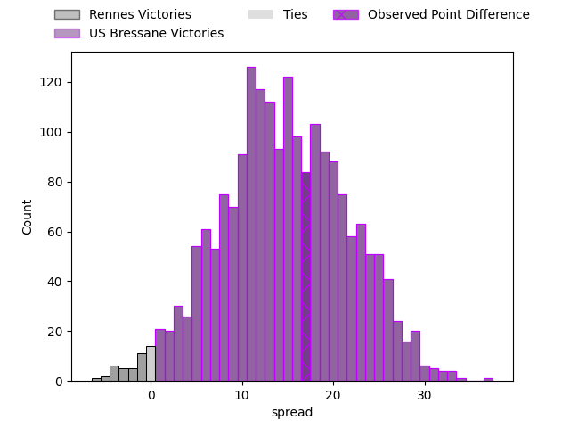
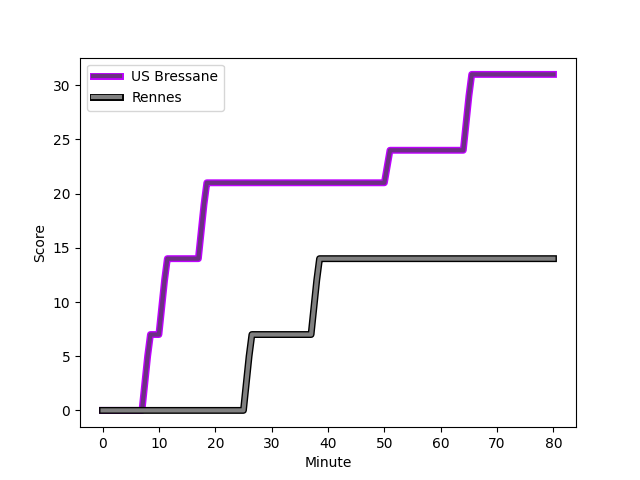
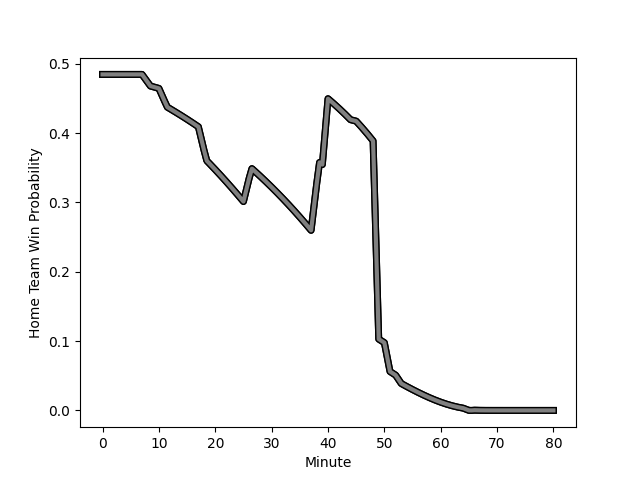

---  
layout: page  
title: Rennes at US Bressane; 14-31  
date: 2023-02-10 19:30:00 18:00:00 -0500  
categories: match review  
---
# Rennes at US Bressane; 14-31

# Club Level Predictions

The first set of predictions treats a club as the smallest object, as the club develops its members, organizes a gameplan, and deploys its players as needed for each match. This club model has a prediction of 0.835, which translates to predicting US Bressane to win by 15.0.

Each club has a rating and a rating deviation (simiar to a Glicko system), and expected performances can be generated. This allows for simulated matches and spreads like the ones below.
## Projected Performances

## Projected Spreads

## Projected Results

# Player Level Predictions

Treating teams instead as an entity made up of the currently active players, I have ratings for each player in an altogether different system. These can be combined to form team ratings once teamsheets are announced, weighting starters a bit higher than the reserves. After the match is played, players can be weighted by their minutes on the field, allowing for an accurate measure of the team's composition. With these compiled team ratings, we can make predictions, measure inaccuracy, and update the individual player ratings.
## Prediction with Player Minutes: US Bressane by 1.3

Rennes by 2.7 on a neutral field
## Scores over Time

## Win Probability over Time

There were 7 large changes in win probability in this match
## Prediction without Player Minutes: Rennes by 1.6

Rennes by 5.6 on a neutral pitch

|   Away Minutes | Away Player                                                             |   Away elo |   Away Percentile |   Number |   Home Percentile |   Home elo | Home Player                                                                       |   Home Minutes |
|---------------:|:------------------------------------------------------------------------|-----------:|------------------:|---------:|------------------:|-----------:|:----------------------------------------------------------------------------------|---------------:|
|             53 | [Baptiste Le Jallé](..//playerfiles//BaptisteLeJallé_cleaned.md)        |      96.04 |                50 |        1 |                 9 |      77.91 | [Teo Bordenave](..//playerfiles//TeoBordenave_cleaned.md)                         |             80 |
|             49 | [Pierre Strippoli](..//playerfiles//PierreStrippoli_cleaned.md)         |      92.22 |                49 |        2 |                57 |      96.39 | [Sione Anga'aelangi](..//playerfiles//SioneAnga'aelangi_cleaned.md)               |             66 |
|             49 | [Luvuyo Pupuma](..//playerfiles//LuvuyoPupuma_cleaned.md)               |      94.88 |                47 |        3 |                16 |      82.37 | [Willem Johannes Harmse](..//playerfiles//WillemJohannesHarmse_cleaned.md)        |             45 |
|             61 | [Alexandre Gueroult](..//playerfiles//AlexandreGueroult_cleaned.md)     |      93.87 |                46 |        4 |                37 |      89.48 | [Monty Leverstein](..//playerfiles//MontyLeverstein_cleaned.md)                   |             80 |
|             80 | [Clément Fontaine](..//playerfiles//ClémentFontaine_cleaned.md)         |      90.31 |                34 |        5 |                91 |     120.92 | [Cyril Veyret](..//playerfiles//CyrilVeyret_cleaned.md)                           |             40 |
|             49 | [Luca Di Salvatore](..//playerfiles//LucaDiSalvatore_cleaned.md)        |      94.41 |                46 |        6 |                81 |     111.22 | [Lucas Lyons](..//playerfiles//LucasLyons_cleaned.md)                             |             80 |
|             80 | [Pedro Ortega](..//playerfiles//PedroOrtega_cleaned.md)                 |      86.78 |                24 |        7 |                26 |      87.4  | [Wael May](..//playerfiles//WaelMay_cleaned.md)                                   |             80 |
|             61 | [Victor Fromenteze](..//playerfiles//VictorFromenteze_cleaned.md)       |      83.73 |                20 |        8 |                23 |      86.66 | [TJ Ioane](..//playerfiles//TJIoane_cleaned.md)                                   |             80 |
|             61 | [Lucas Ollion](..//playerfiles//LucasOllion_cleaned.md)                 |      90.7  |                34 |        9 |                15 |      78.03 | [Robin Graulle](..//playerfiles//RobinGraulle_cleaned.md)                         |             66 |
|             80 | [Sam Leeming](..//playerfiles//SamLeeming_cleaned.md)                   |     110.67 |                78 |       10 |                49 |      96.53 | [Sebastian Poet](..//playerfiles//SebastianPoet_cleaned.md)                       |             80 |
|             80 | [Alexis François](..//playerfiles//AlexisFrançois_cleaned.md)           |      94.38 |                45 |       11 |               nan |      95    | [Clement Latorre](..//playerfiles//ClementLatorre_cleaned.md)                     |             80 |
|             80 | [Ryan Dubois](..//playerfiles//RyanDubois_cleaned.md)                   |      81.11 |                15 |       12 |                89 |     119.5  | [Parataiso Silafai-Lea'ana](..//playerfiles//ParataisoSilafai-Lea'ana_cleaned.md) |             80 |
|             80 | [Clément Lepresle](..//playerfiles//ClémentLepresle_cleaned.md)         |      90.82 |                36 |       13 |                10 |      74.87 | [Alexandre Badet](..//playerfiles//AlexandreBadet_cleaned.md)                     |             40 |
|             80 | [Mateo Carrere](..//playerfiles//MateoCarrere_cleaned.md)               |      95.14 |                48 |       14 |                15 |      81.18 | [Audric Sanlaville](..//playerfiles//AudricSanlaville_cleaned.md)                 |             80 |
|             61 | [Pedro Soto](..//playerfiles//PedroSoto_cleaned.md)                     |      90.9  |                37 |       15 |                48 |      95.94 | [Pierre Berard](..//playerfiles//PierreBerard_cleaned.md)                         |             40 |
|             31 | [Atonio Ulutuipalelei](..//playerfiles//AtonioUlutuipalelei_cleaned.md) |      96.51 |                52 |       16 |                 0 |      49.28 | [Christian Lacombe](..//playerfiles//ChristianLacombe_cleaned.md)                 |             40 |
|             31 | [Gaétan Béraud](..//playerfiles//GaétanBéraud_cleaned.md)               |      78.95 |                12 |       17 |                49 |      95.38 | [Thomas Déliance](..//playerfiles//ThomasDéliance_cleaned.md)                     |             40 |
|             31 | [Alexandre Fau](..//playerfiles//AlexandreFau_cleaned.md)               |      94.76 |                50 |       18 |                12 |      79.16 | [Benjamin Doy](..//playerfiles//BenjaminDoy_cleaned.md)                           |             40 |
|             27 | [Grégory Querin](..//playerfiles//GrégoryQuerin_cleaned.md)             |     104.19 |                53 |       19 |                49 |      93.45 | [Erich de Jager](..//playerfiles//ErichdeJager_cleaned.md)                        |             35 |
|             19 | [Mathieu Brignonen](..//playerfiles//MathieuBrignonen_cleaned.md)       |      90.27 |                34 |       20 |                14 |      81.82 | [Clement Jullien](..//playerfiles//ClementJullien_cleaned.md)                     |             14 |
|             19 | [Matéo Jeune-Joly](..//playerfiles//MatéoJeune-Joly_cleaned.md)         |      98.07 |                57 |       21 |                70 |     104.1  | [Jeremy Valencot](..//playerfiles//JeremyValencot_cleaned.md)                     |             14 |
|             19 | [Guillaume Cazette](..//playerfiles//GuillaumeCazette_cleaned.md)       |     106.85 |                76 |       22 |               nan |     nan    | nan                                                                               |            nan |
|             19 | [Baptiste Beaujouan](..//playerfiles//BaptisteBeaujouan_cleaned.md)     |     100.53 |                52 |       23 |               nan |     nan    | nan                                                                               |            nan |

