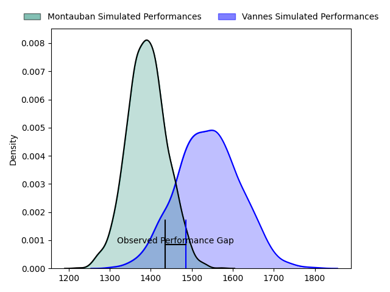
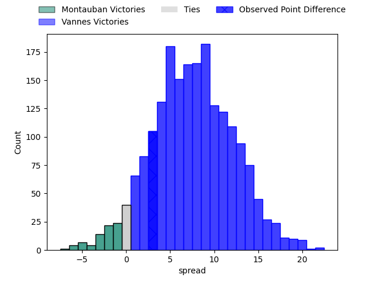
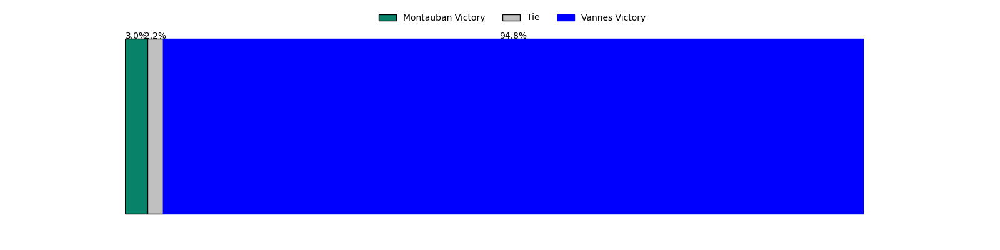
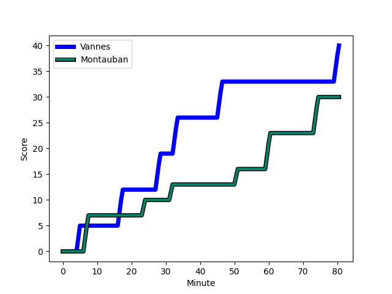
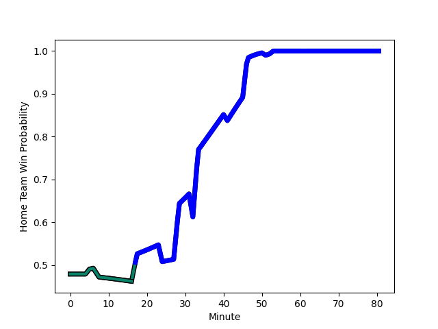

---  
layout: page  
title: Montauban at Vannes; 37-40  
date: 2023-02-10 19:30:00 18:00:00 -0500  
categories: match review  
---
# Montauban at Vannes; 37-40

# Club Level Predictions

The first set of predictions treats a club as the smallest object, as the club develops its members, organizes a gameplan, and deploys its players as needed for each match. This club model has a prediction of 0.702, which translates to predicting Vannes to win by 7.5.

Each club has a rating and a rating deviation (simiar to a Glicko system), and expected performances can be generated. This allows for simulated matches and spreads like the ones below.
## Projected Performances

## Projected Spreads

## Projected Results

# Player Level Predictions

Treating teams instead as an entity made up of the currently active players, I have ratings for each player in an altogether different system. These can be combined to form team ratings once teamsheets are announced, weighting starters a bit higher than the reserves. After the match is played, players can be weighted by their minutes on the field, allowing for an accurate measure of the team's composition. With these compiled team ratings, we can make predictions, measure inaccuracy, and update the individual player ratings.
## Prediction with Player Minutes: Vannes by 0.4

Montauban by 3.6 on a neutral field
## Scores over Time

## Win Probability over Time

There were 8 large changes in win probability in this match
## Prediction without Player Minutes: Vannes by 0.8

Montauban by 3.2 on a neutral pitch

|   Away Minutes | Away Player                                                       |   Away elo |   Away Percentile |   Number |   Home Percentile |   Home elo | Home Player                                                                  |   Home Minutes |
|---------------:|:------------------------------------------------------------------|-----------:|------------------:|---------:|------------------:|-----------:|:-----------------------------------------------------------------------------|---------------:|
|             41 | [Malino Vanai](..//playerfiles//MalinoVanai_cleaned.md)           |      97.57 |                25 |        1 |                87 |     111.52 | [Andy Bordelai](..//playerfiles//AndyBordelai_cleaned.md)                    |             62 |
|             57 | [Kevin Firmin](..//playerfiles//KevinFirmin_cleaned.md)           |      95.9  |                34 |        2 |                73 |     104.06 | [Pat Leafa](..//playerfiles//PatLeafa_cleaned.md)                            |             53 |
|             57 | [Victor Laval](..//playerfiles//VictorLaval_cleaned.md)           |      87.03 |                28 |        3 |                97 |     125.05 | [Paga Tafili](..//playerfiles//PagaTafili_cleaned.md)                        |             53 |
|             47 | [Dimitri Vaotoa](..//playerfiles//DimitriVaotoa_cleaned.md)       |     107.65 |                63 |        4 |                62 |     100.55 | [Joe Edwards](..//playerfiles//JoeEdwards_cleaned.md)                        |             80 |
|             80 | [Dan Malafosse](..//playerfiles//DanMalafosse_cleaned.md)         |     121.07 |                92 |        5 |                33 |      92.02 | [Ewan Thomas Johnson](..//playerfiles//EwanThomasJohnson_cleaned.md)         |             80 |
|             80 | [Quentin Witt](..//playerfiles//QuentinWitt_cleaned.md)           |      96.65 |                36 |        6 |                32 |      90.24 | [Juan Bautista Pedemonte](..//playerfiles//JuanBautistaPedemonte_cleaned.md) |             53 |
|             80 | [Kyllian Ringuet](..//playerfiles//KyllianRinguet_cleaned.md)     |      98.43 |               nan |        7 |                99 |     147.93 | [Francisco Gorrissen](..//playerfiles//FranciscoGorrissen_cleaned.md)        |             80 |
|             47 | [Epeli Momo](..//playerfiles//EpeliMomo_cleaned.md)               |      80.36 |                13 |        8 |                85 |     114.99 | [Léon Boulier](..//playerfiles//LéonBoulier_cleaned.md)                      |             53 |
|             47 | [Anthony Meric](..//playerfiles//AnthonyMeric_cleaned.md)         |      68.81 |                 1 |        9 |                64 |     101.14 | [Alexandre Gouaux](..//playerfiles//AlexandreGouaux_cleaned.md)              |             80 |
|             47 | [Anthony Meric](..//playerfiles//AnthonyMeric_cleaned.md)         |      68.81 |                 1 |        9 |                48 |     101.14 | [Alexandre Gouaux](..//playerfiles//AlexandreGouaux_cleaned.md)              |             80 |
|             80 | [Jérôme Bosviel](..//playerfiles//JérômeBosviel_cleaned.md)       |     119.22 |                88 |       10 |                70 |     104.46 | [Maxime Lafage](..//playerfiles//MaximeLafage_cleaned.md)                    |             80 |
|             80 | [Raphael Sanchez](..//playerfiles//RaphaelSanchez_cleaned.md)     |     111.12 |                81 |       11 |                90 |     127.41 | [Matthys Gratien](..//playerfiles//MatthysGratien_cleaned.md)                |             69 |
|             80 | [Raphael Sanchez](..//playerfiles//RaphaelSanchez_cleaned.md)     |     111.12 |                81 |       11 |                95 |     127.41 | [Matthys Gratien](..//playerfiles//MatthysGratien_cleaned.md)                |             69 |
|             63 | [Sevanaia Galala](..//playerfiles//SevanaiaGalala_cleaned.md)     |     116.87 |                87 |       12 |                63 |     100.99 | [Andres Vilaseca Hontou](..//playerfiles//AndresVilasecaHontou_cleaned.md)   |             80 |
|             80 | [Maxence Bonnin](..//playerfiles//MaxenceBonnin_cleaned.md)       |     101.21 |               nan |       13 |                12 |      76.71 | [Branden Holder](..//playerfiles//BrandenHolder_cleaned.md)                  |             62 |
|             80 | [Semesa Rokoduguni](..//playerfiles//SemesaRokoduguni_cleaned.md) |     129.47 |                96 |       14 |                23 |      86.43 | [Nathanael Hulleu](..//playerfiles//NathanaelHulleu_cleaned.md)              |             80 |
|             63 | [Maxime Salles](..//playerfiles//MaximeSalles_cleaned.md)         |     152.89 |                99 |       15 |                46 |      94.74 | [Romaric Camou](..//playerfiles//RomaricCamou_cleaned.md)                    |             80 |
|             39 | [Lucas Seyrolle](..//playerfiles//LucasSeyrolle_cleaned.md)       |     110.81 |                85 |       16 |                56 |      98.39 | [Cyril Blanchard](..//playerfiles//CyrilBlanchard_cleaned.md)                |             27 |
|             39 | [Lucas Seyrolle](..//playerfiles//LucasSeyrolle_cleaned.md)       |     110.81 |                69 |       16 |                56 |      98.39 | [Cyril Blanchard](..//playerfiles//CyrilBlanchard_cleaned.md)                |             27 |
|             33 | [Tjuee Uanivi](..//playerfiles//TjueeUanivi_cleaned.md)           |     109.47 |                79 |       17 |                29 |      89.44 | [John Afoa](..//playerfiles//JohnAfoa_cleaned.md)                            |             27 |
|             33 | [Alexis Bernadet](..//playerfiles//AlexisBernadet_cleaned.md)     |     113.14 |                87 |       18 |                 0 |      51.49 | [Eric Marks](..//playerfiles//EricMarks_cleaned.md)                          |             27 |
|             33 | [Frédéric Quercy](..//playerfiles//FrédéricQuercy_cleaned.md)     |      59.48 |                 0 |       19 |                34 |      89.96 | [Gregoire Bazin](..//playerfiles//GregoireBazin_cleaned.md)                  |             27 |
|             33 | [Frédéric Quercy](..//playerfiles//FrédéricQuercy_cleaned.md)     |      59.48 |                 0 |       19 |                20 |      89.96 | [Gregoire Bazin](..//playerfiles//GregoireBazin_cleaned.md)                  |             27 |
|             23 | [Simon Renaud](..//playerfiles//SimonRenaud_cleaned.md)           |      95.26 |                48 |       20 |                53 |      96.87 | [Ximun Bessonart](..//playerfiles//XimunBessonart_cleaned.md)                |             18 |
|             23 | [Simon Renaud](..//playerfiles//SimonRenaud_cleaned.md)           |      95.26 |                48 |       20 |                42 |      96.87 | [Ximun Bessonart](..//playerfiles//XimunBessonart_cleaned.md)                |             18 |
|             23 | [Cyril Deligny](..//playerfiles//CyrilDeligny_cleaned.md)         |      65.29 |                 0 |       21 |                26 |      86.39 | [Nicolas Freitas](..//playerfiles//NicolasFreitas_cleaned.md)                |             18 |
|             17 | [Taleta Tupuola](..//playerfiles//TaletaTupuola_cleaned.md)       |      70.92 |                 5 |       22 |                31 |      90.72 | [Jean Chezeau](..//playerfiles//JeanChezeau_cleaned.md)                      |             11 |
|             17 | [Julian Hauw](..//playerfiles//JulianHauw_cleaned.md)             |      95    |               nan |       23 |               nan |     nan    | nan                                                                          |            nan |

