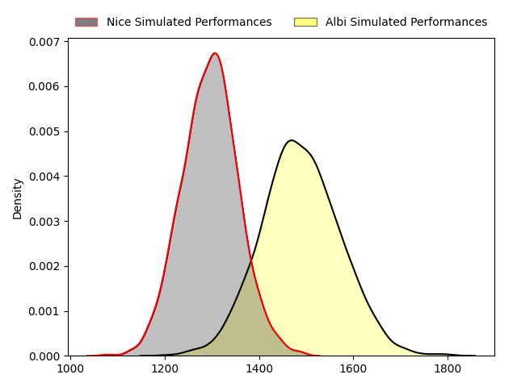
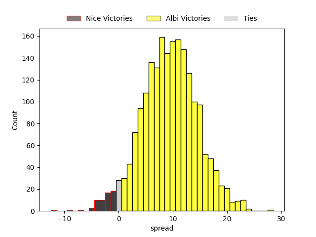
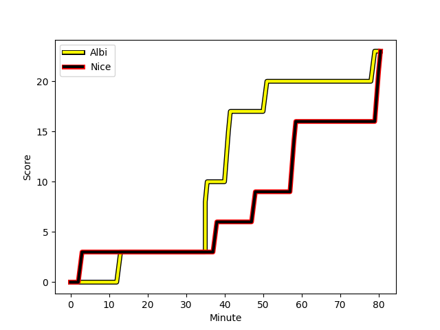
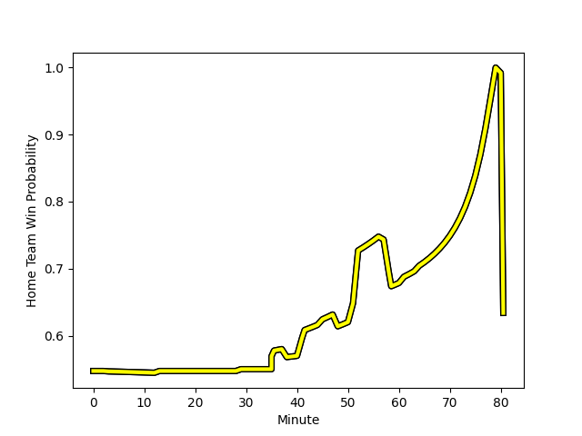

---  
layout: page  
title: Nice at Albi; 23-23  
date: 2023-02-11 18:00:00 18:00:00 -0500  
categories: match review  
---
# Nice at Albi; 23-23

# Club Level Predictions

The first set of predictions treats a club as the smallest object, as the club develops its members, organizes a gameplan, and deploys its players as needed for each match. This club model has a prediction of 0.747, which translates to predicting Albi to win by 9.6.

Each club has a rating and a rating deviation (simiar to a Glicko system), and expected performances can be generated. This allows for simulated matches and spreads like the ones below.
## Projected Performances

## Projected Spreads

## Projected Results

# Player Level Predictions

Treating teams instead as an entity made up of the currently active players, I have ratings for each player in an altogether different system. These can be combined to form team ratings once teamsheets are announced, weighting starters a bit higher than the reserves. After the match is played, players can be weighted by their minutes on the field, allowing for an accurate measure of the team's composition. With these compiled team ratings, we can make predictions, measure inaccuracy, and update the individual player ratings.
## Prediction with Player Minutes: Albi by 12.2

Albi by 8.2 on a neutral field
## Scores over Time

## Win Probability over Time

There were 10 large changes in win probability in this match
## Prediction without Player Minutes: Albi by 12.3

Albi by 8.3 on a neutral pitch

|   Away Minutes | Away Player                                                             |   Away elo |   Away Percentile |   Number |   Home Percentile |   Home elo | Home Player                                                                        |   Home Minutes |
|---------------:|:------------------------------------------------------------------------|-----------:|------------------:|---------:|------------------:|-----------:|:-----------------------------------------------------------------------------------|---------------:|
|             64 | [Sunia Vola](..//playerfiles//SuniaVola_cleaned.md)                     |     102.77 |                71 |        1 |                82 |     108.08 | [Antoine Soave](..//playerfiles//AntoineSoave_cleaned.md)                          |             52 |
|             68 | [Badri Alkhazashvili](..//playerfiles//BadriAlkhazashvili_cleaned.md)   |      87.93 |                25 |        2 |                24 |      87.52 | [Reinach Venter](..//playerfiles//ReinachVenter_cleaned.md)                        |             64 |
|             57 | [Jemal Shatirishvili](..//playerfiles//JemalShatirishvili_cleaned.md)   |      76.21 |                 6 |        3 |                21 |      86.97 | [Jean Baptiste De Clercq](..//playerfiles//JeanBaptisteDeClercq_cleaned.md)        |             52 |
|             52 | [Jérôme Mondoulet](..//playerfiles//JérômeMondoulet_cleaned.md)         |      85.08 |                21 |        4 |               nan |      97.26 | [John Henry Heath Backhouse](..//playerfiles//JohnHenryHeathBackhouse_cleaned.md)  |             80 |
|             52 | [Martin Freytes](..//playerfiles//MartinFreytes_cleaned.md)             |      76.26 |                10 |        5 |                58 |      98.68 | [Pilbarnon Djossou Lokossou](..//playerfiles//PilbarnonDjossouLokossou_cleaned.md) |             52 |
|             80 | [Steffon Armitage](..//playerfiles//SteffonArmitage_cleaned.md)         |     108.71 |                74 |        6 |                21 |      85.65 | [Hugo Boutin](..//playerfiles//HugoBoutin_cleaned.md)                              |             29 |
|             80 | [Louis Suaud](..//playerfiles//LouisSuaud_cleaned.md)                   |     105.34 |                73 |        7 |                 8 |      76.9  | [Luke Stringer](..//playerfiles//LukeStringer_cleaned.md)                          |             80 |
|             61 | [Laijiasa Bolenaivalu](..//playerfiles//LaijiasaBolenaivalu_cleaned.md) |     113.19 |                81 |        8 |                89 |     118.69 | [Sandrick Maciotta](..//playerfiles//SandrickMaciotta_cleaned.md)                  |             80 |
|             80 | [Mathieu Loree](..//playerfiles//MathieuLoree_cleaned.md)               |     111.07 |                84 |        9 |                72 |     104.75 | [Gilen Queheille](..//playerfiles//GilenQueheille_cleaned.md)                      |             80 |
|             80 | [Mathis Viard](..//playerfiles//MathisViard_cleaned.md)                 |     101.22 |                61 |       10 |                56 |     100    | [Francois Fontaine](..//playerfiles//FrancoisFontaine_cleaned.md)                  |             80 |
|             80 | [Clement Egiziano](..//playerfiles//ClementEgiziano_cleaned.md)         |      97.94 |                56 |       11 |                76 |     107.46 | [Enzo Marzocca](..//playerfiles//EnzoMarzocca_cleaned.md)                          |             80 |
|             68 | [Julien Fritz](..//playerfiles//JulienFritz_cleaned.md)                 |     100.59 |                62 |       12 |                59 |      99.48 | [Simon Andreu](..//playerfiles//SimonAndreu_cleaned.md)                            |             80 |
|             80 | [Alban Conduche](..//playerfiles//AlbanConduche_cleaned.md)             |      84.12 |                20 |       13 |                92 |     124.55 | [Baptiste Couchinave](..//playerfiles//BaptisteCouchinave_cleaned.md)              |             64 |
|             80 | [David Odiete](..//playerfiles//DavidOdiete_cleaned.md)                 |      90.5  |                35 |       14 |                79 |     109.38 | [Charly Trussardi](..//playerfiles//CharlyTrussardi_cleaned.md)                    |             80 |
|             80 | [Loic Le Gal](..//playerfiles//LoicLeGal_cleaned.md)                    |      72.83 |                 9 |       15 |                57 |     100.16 | [Paul Clergue](..//playerfiles//PaulClergue_cleaned.md)                            |             45 |
|             16 | [Nicolas Ciancio](..//playerfiles//NicolasCiancio_cleaned.md)           |      93.19 |               nan |       16 |                64 |     100.77 | [Dimitri Tchapnga](..//playerfiles//DimitriTchapnga_cleaned.md)                    |             28 |
|             12 | [Hugo Martin](..//playerfiles//HugoMartin_cleaned.md)                   |      75.28 |                 5 |       17 |                17 |      85.79 | [Maxime Escur](..//playerfiles//MaximeEscur_cleaned.md)                            |             16 |
|             23 | [James Johnston](..//playerfiles//JamesJohnston_cleaned.md)             |     101.49 |                68 |       18 |                62 |      99.39 | [Romain Maurice](..//playerfiles//RomainMaurice_cleaned.md)                        |             28 |
|             28 | [Marvin Woki](..//playerfiles//MarvinWoki_cleaned.md)                   |     104.65 |                71 |       19 |                83 |     111.75 | [Charles Foures](..//playerfiles//CharlesFoures_cleaned.md)                        |             28 |
|             28 | [Thibault Rey](..//playerfiles//ThibaultRey_cleaned.md)                 |     103.74 |                70 |       20 |                35 |      90.89 | [Guillem Calmon](..//playerfiles//GuillemCalmon_cleaned.md)                        |             51 |
|             19 | [Arthur Vignolles](..//playerfiles//ArthurVignolles_cleaned.md)         |     100.7  |                63 |       21 |                52 |      96.39 | [Wandile Mjekevu](..//playerfiles//WandileMjekevu_cleaned.md)                      |             16 |
|             12 | [Luca Cutayar](..//playerfiles//LucaCutayar_cleaned.md)                 |     105.57 |                70 |       22 |                75 |     110.59 | [Téo Dospital](..//playerfiles//TéoDospital_cleaned.md)                            |             35 |

