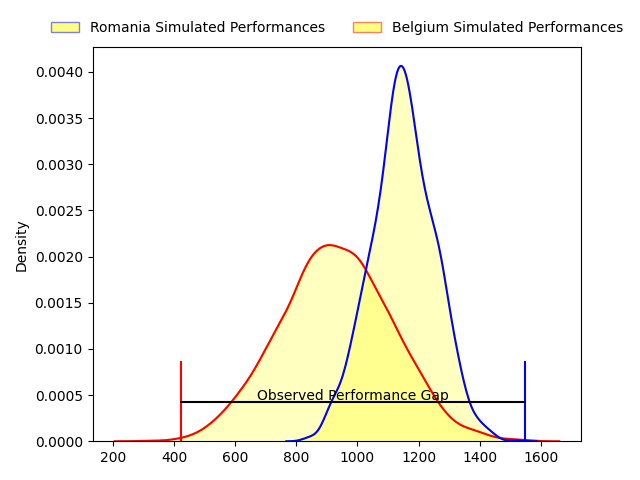
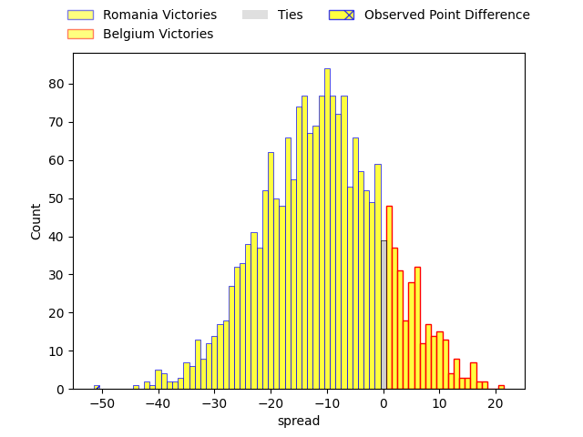
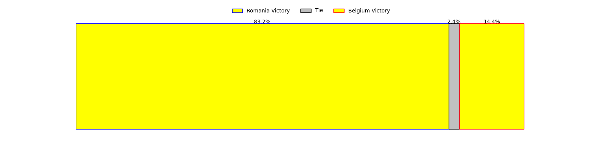
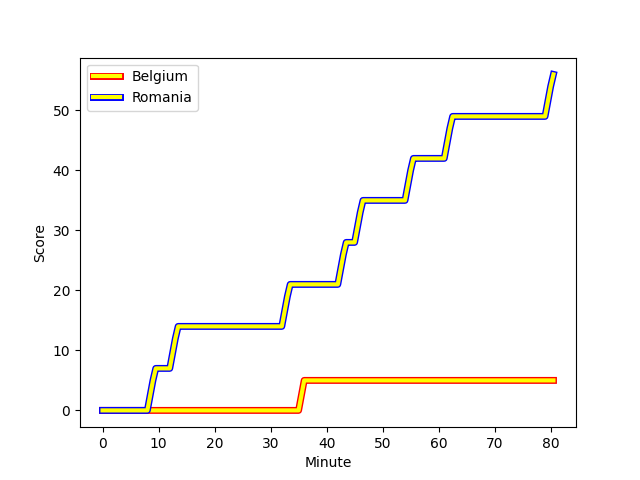
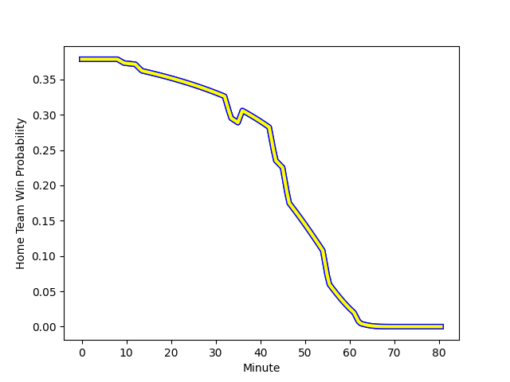

---  
layout: page  
title: Romania at Belgium; 56-5  
date: 2023-02-11 18:30:00 18:00:00 -0500  
categories: match review  
---
# Romania at Belgium; 56-5

# Club Level Predictions

The first set of predictions treats a club as the smallest object, as the club develops its members, organizes a gameplan, and deploys its players as needed for each match. This club model has a prediction of 0.236, which translates to predicting Romania to win by 10.7.

Each club has a rating and a rating deviation (simiar to a Glicko system), and expected performances can be generated. This allows for simulated matches and spreads like the ones below.
## Projected Performances

## Projected Spreads

## Projected Results

# Player Level Predictions

Treating teams instead as an entity made up of the currently active players, I have ratings for each player in an altogether different system. These can be combined to form team ratings once teamsheets are announced, weighting starters a bit higher than the reserves. After the match is played, players can be weighted by their minutes on the field, allowing for an accurate measure of the team's composition. With these compiled team ratings, we can make predictions, measure inaccuracy, and update the individual player ratings.
## Prediction with Player Minutes: Romania by 21.5

Romania by 25.5 on a neutral field
## Scores over Time

## Win Probability over Time

There were 3 large changes in win probability in this match
## Prediction without Player Minutes: Romania by 20.5

Romania by 24.5 on a neutral pitch

|   Away Minutes | Away Player                                                                        |   Away elo |   Away Percentile |   Number |   Home Percentile |   Home elo | Home Player                                                             |   Home Minutes |
|---------------:|:-----------------------------------------------------------------------------------|-----------:|------------------:|---------:|------------------:|-----------:|:------------------------------------------------------------------------|---------------:|
|             80 | [Alexandru Savin](..//playerfiles//AlexandruSavin_cleaned.md)                      |     100.77 |                59 |        1 |               nan |      99.93 | [Lucas Sotteau](..//playerfiles//LucasSotteau_cleaned.md)               |             80 |
|             80 | [Alexandru Savin](..//playerfiles//AlexandruSavin_cleaned.md)                      |     100.77 |                59 |        1 |               nan |      99.93 | [Lucas Sotteau](..//playerfiles//LucasSotteau_cleaned.md)               |             48 |
|             48 | [Alexandru Savin](..//playerfiles//AlexandruSavin_cleaned.md)                      |     100.77 |                59 |        1 |               nan |      99.93 | [Lucas Sotteau](..//playerfiles//LucasSotteau_cleaned.md)               |             48 |
|             48 | [Alexandru Savin](..//playerfiles//AlexandruSavin_cleaned.md)                      |     100.77 |                59 |        1 |               nan |      99.93 | [Lucas Sotteau](..//playerfiles//LucasSotteau_cleaned.md)               |             80 |
|             80 | [Eugen Capatana](..//playerfiles//EugenCapatana_cleaned.md)                        |      91.96 |                41 |        2 |                64 |      98.55 | [Alexis Cuffolo](..//playerfiles//AlexisCuffolo_cleaned.md)             |             63 |
|             48 | [Eugen Capatana](..//playerfiles//EugenCapatana_cleaned.md)                        |      91.96 |                41 |        2 |                64 |      98.55 | [Alexis Cuffolo](..//playerfiles//AlexisCuffolo_cleaned.md)             |             63 |
|             80 | [Eugen Capatana](..//playerfiles//EugenCapatana_cleaned.md)                        |      91.96 |                41 |        2 |                64 |      98.55 | [Alexis Cuffolo](..//playerfiles//AlexisCuffolo_cleaned.md)             |             80 |
|             48 | [Eugen Capatana](..//playerfiles//EugenCapatana_cleaned.md)                        |      91.96 |                41 |        2 |                64 |      98.55 | [Alexis Cuffolo](..//playerfiles//AlexisCuffolo_cleaned.md)             |             80 |
|             80 | [Gheorge Gajion](..//playerfiles//GheorgeGajion_cleaned.md)                        |      96.15 |                53 |        3 |                45 |      92.52 | [Romain Pinte](..//playerfiles//RomainPinte_cleaned.md)                 |             48 |
|             80 | [Gheorge Gajion](..//playerfiles//GheorgeGajion_cleaned.md)                        |      96.15 |                39 |        3 |                45 |      92.52 | [Romain Pinte](..//playerfiles//RomainPinte_cleaned.md)                 |             48 |
|             54 | [Gheorge Gajion](..//playerfiles//GheorgeGajion_cleaned.md)                        |      96.15 |                39 |        3 |                45 |      92.52 | [Romain Pinte](..//playerfiles//RomainPinte_cleaned.md)                 |             48 |
|             80 | [Gheorge Gajion](..//playerfiles//GheorgeGajion_cleaned.md)                        |      96.15 |                53 |        3 |                45 |      92.52 | [Romain Pinte](..//playerfiles//RomainPinte_cleaned.md)                 |             80 |
|             80 | [Gheorge Gajion](..//playerfiles//GheorgeGajion_cleaned.md)                        |      96.15 |                39 |        3 |                45 |      92.52 | [Romain Pinte](..//playerfiles//RomainPinte_cleaned.md)                 |             80 |
|             54 | [Gheorge Gajion](..//playerfiles//GheorgeGajion_cleaned.md)                        |      96.15 |                53 |        3 |                45 |      92.52 | [Romain Pinte](..//playerfiles//RomainPinte_cleaned.md)                 |             80 |
|             54 | [Gheorge Gajion](..//playerfiles//GheorgeGajion_cleaned.md)                        |      96.15 |                39 |        3 |                45 |      92.52 | [Romain Pinte](..//playerfiles//RomainPinte_cleaned.md)                 |             80 |
|             54 | [Gheorge Gajion](..//playerfiles//GheorgeGajion_cleaned.md)                        |      96.15 |                53 |        3 |                45 |      92.52 | [Romain Pinte](..//playerfiles//RomainPinte_cleaned.md)                 |             48 |
|             80 | [Adrian Motoc](..//playerfiles//AdrianMotoc_cleaned.md)                            |      95.14 |                49 |        4 |                41 |      92.17 | [Chris Salay Baudry](..//playerfiles//ChrisSalayBaudry_cleaned.md)      |             80 |
|             80 | [Adrian Motoc](..//playerfiles//AdrianMotoc_cleaned.md)                            |      95.14 |                49 |        4 |                41 |      92.17 | [Chris Salay Baudry](..//playerfiles//ChrisSalayBaudry_cleaned.md)      |             57 |
|             57 | [Marius Antonescu](..//playerfiles//MariusAntonescu_cleaned.md)                    |     117.53 |                81 |        5 |                 6 |      72.77 | [Maximilien Hendrickx](..//playerfiles//MaximilienHendrickx_cleaned.md) |             80 |
|             57 | [Marius Antonescu](..//playerfiles//MariusAntonescu_cleaned.md)                    |     117.53 |                89 |        5 |                 6 |      72.77 | [Maximilien Hendrickx](..//playerfiles//MaximilienHendrickx_cleaned.md) |             80 |
|             80 | [Marius Antonescu](..//playerfiles//MariusAntonescu_cleaned.md)                    |     117.53 |                81 |        5 |                 6 |      72.77 | [Maximilien Hendrickx](..//playerfiles//MaximilienHendrickx_cleaned.md) |             80 |
|             80 | [Marius Antonescu](..//playerfiles//MariusAntonescu_cleaned.md)                    |     117.53 |                89 |        5 |                 6 |      72.77 | [Maximilien Hendrickx](..//playerfiles//MaximilienHendrickx_cleaned.md) |             80 |
|             80 | [Florian Rosu](..//playerfiles//FlorianRosu_cleaned.md)                            |      98.76 |                52 |        6 |                 4 |      66.09 | [Robin Vermeersch](..//playerfiles//RobinVermeersch_cleaned.md)         |             80 |
|             80 | [Florian Rosu](..//playerfiles//FlorianRosu_cleaned.md)                            |      98.76 |                52 |        6 |                 4 |      66.09 | [Robin Vermeersch](..//playerfiles//RobinVermeersch_cleaned.md)         |             66 |
|             80 | [Vlad Neculau](..//playerfiles//VladNeculau_cleaned.md)                            |      83.37 |                18 |        7 |                 4 |      66.17 | [Hughes Bastin](..//playerfiles//HughesBastin_cleaned.md)               |             49 |
|             80 | [Vlad Neculau](..//playerfiles//VladNeculau_cleaned.md)                            |      83.37 |                18 |        7 |                 4 |      66.17 | [Hughes Bastin](..//playerfiles//HughesBastin_cleaned.md)               |             80 |
|             80 | [Cristian Chirica](..//playerfiles//CristianChirica_cleaned.md)                    |      69.42 |                 6 |        8 |                 7 |      74.06 | [Toon Deceuninck](..//playerfiles//ToonDeceuninck_cleaned.md)           |             80 |
|             63 | [Cristian Chirica](..//playerfiles//CristianChirica_cleaned.md)                    |      69.42 |                 6 |        8 |                 7 |      74.06 | [Toon Deceuninck](..//playerfiles//ToonDeceuninck_cleaned.md)           |             80 |
|             60 | [Gabriel Rupanu](..//playerfiles//GabrielRupanu_cleaned.md)                        |      91.6  |                39 |        9 |               nan |      88.8  | [Ryan Godsmark](..//playerfiles//RyanGodsmark_cleaned.md)               |             80 |
|             80 | [Gabriel Rupanu](..//playerfiles//GabrielRupanu_cleaned.md)                        |      91.6  |                39 |        9 |               nan |      88.8  | [Ryan Godsmark](..//playerfiles//RyanGodsmark_cleaned.md)               |             70 |
|             60 | [Gabriel Rupanu](..//playerfiles//GabrielRupanu_cleaned.md)                        |      91.6  |                39 |        9 |               nan |      88.8  | [Ryan Godsmark](..//playerfiles//RyanGodsmark_cleaned.md)               |             70 |
|             80 | [Gabriel Rupanu](..//playerfiles//GabrielRupanu_cleaned.md)                        |      91.6  |                39 |        9 |               nan |      88.8  | [Ryan Godsmark](..//playerfiles//RyanGodsmark_cleaned.md)               |             80 |
|             80 | [Ionel Melinte](..//playerfiles//IonelMelinte_cleaned.md)                          |     102.43 |                53 |       10 |                36 |      90.64 | [Jordan Gott](..//playerfiles//JordanGott_cleaned.md)                   |             80 |
|             80 | [Paul Popoaia](..//playerfiles//PaulPopoaia_cleaned.md)                            |     108.73 |                74 |       11 |                 5 |      70.67 | [Florian Remue](..//playerfiles//FlorianRemue_cleaned.md)               |             80 |
|             80 | [Taylor Gontineac](..//playerfiles//TaylorGontineac_cleaned.md)                    |      99.3  |                58 |       12 |                13 |      77.91 | [Viktor Pazgrat](..//playerfiles//ViktorPazgrat_cleaned.md)             |             61 |
|             57 | [Taylor Gontineac](..//playerfiles//TaylorGontineac_cleaned.md)                    |      99.3  |                58 |       12 |                13 |      77.91 | [Viktor Pazgrat](..//playerfiles//ViktorPazgrat_cleaned.md)             |             61 |
|             80 | [Taylor Gontineac](..//playerfiles//TaylorGontineac_cleaned.md)                    |      99.3  |                58 |       12 |                13 |      77.91 | [Viktor Pazgrat](..//playerfiles//ViktorPazgrat_cleaned.md)             |             80 |
|             57 | [Taylor Gontineac](..//playerfiles//TaylorGontineac_cleaned.md)                    |      99.3  |                58 |       12 |                13 |      77.91 | [Viktor Pazgrat](..//playerfiles//ViktorPazgrat_cleaned.md)             |             80 |
|             80 | [Atila Septar](..//playerfiles//AtilaSeptar_cleaned.md)                            |      89.77 |                35 |       13 |                63 |     101.28 | [Jens Torfs](..//playerfiles//JensTorfs_cleaned.md)                     |             80 |
|             31 | [Atila Septar](..//playerfiles//AtilaSeptar_cleaned.md)                            |      89.77 |                35 |       13 |                63 |     101.28 | [Jens Torfs](..//playerfiles//JensTorfs_cleaned.md)                     |             80 |
|             80 | [Mihai Lamboiu](..//playerfiles//MihaiLamboiu_cleaned.md)                          |      90.86 |                37 |       14 |                16 |      81.07 | [Victor André](..//playerfiles//VictorAndré_cleaned.md)                 |             80 |
|             80 | [Hinckley Vaovasa](..//playerfiles//HinckleyVaovasa_cleaned.md)                    |      86.51 |                15 |       15 |                12 |      75.85 | [Hugo De Francq](..//playerfiles//HugoDeFrancq_cleaned.md)              |             80 |
|             49 | [Jason Tomane](..//playerfiles//JasonTomane_cleaned.md)                            |      84.62 |                23 |       16 |                54 |      96.46 | [Bruno Vliegen](..//playerfiles//BrunoVliegen_cleaned.md)               |             32 |
|             32 | [Constantin Ciprian Chiriac](..//playerfiles//ConstantinCiprianChiriac_cleaned.md) |     105.59 |                78 |       17 |                25 |      87.61 | [Maxime Jadot](..//playerfiles//MaximeJadot_cleaned.md)                 |             32 |
|             32 | [Constantin Ciprian Chiriac](..//playerfiles//ConstantinCiprianChiriac_cleaned.md) |     105.59 |                69 |       17 |                25 |      87.61 | [Maxime Jadot](..//playerfiles//MaximeJadot_cleaned.md)                 |             32 |
|             32 | [Ovidiu Cojocaru](..//playerfiles//OvidiuCojocaru_cleaned.md)                      |      76.7  |                 9 |       18 |               nan |      95    | [Lucas Rassinfosse](..//playerfiles//LucasRassinfosse_cleaned.md)       |             31 |
|             26 | [Costel Burtila](..//playerfiles//CostelBurtila_cleaned.md)                        |      95.47 |                51 |       19 |                 0 |       5.13 | [Guillaume Mortier](..//playerfiles//GuillaumeMortier_cleaned.md)       |             23 |
|             23 | [Vladut Popa](..//playerfiles//VladutPopa_cleaned.md)                              |     103.9  |                67 |       20 |                16 |      80.72 | [Valéry Dulieu](..//playerfiles//ValéryDulieu_cleaned.md)               |             19 |
|             23 | [Marius Iftimiciuc](..//playerfiles//MariusIftimiciuc_cleaned.md)                  |      77.01 |                12 |       21 |                17 |      82.18 | [Basile Van Parys](..//playerfiles//BasileVanParys_cleaned.md)          |             17 |
|             20 | [Alexandru Tigla](..//playerfiles//AlexandruTigla_cleaned.md)                      |     106.01 |                75 |       22 |                19 |      82.75 | [Thomas Boden](..//playerfiles//ThomasBoden_cleaned.md)                 |             14 |
|             20 | [Alexandru Tigla](..//playerfiles//AlexandruTigla_cleaned.md)                      |     106.01 |                59 |       22 |                19 |      82.75 | [Thomas Boden](..//playerfiles//ThomasBoden_cleaned.md)                 |             14 |
|             17 | [Rob Irimescu](..//playerfiles//RobIrimescu_cleaned.md)                            |      91.49 |                31 |       23 |               nan |      93.69 | [Timothé Rifon](..//playerfiles//TimothéRifon_cleaned.md)               |             10 |

