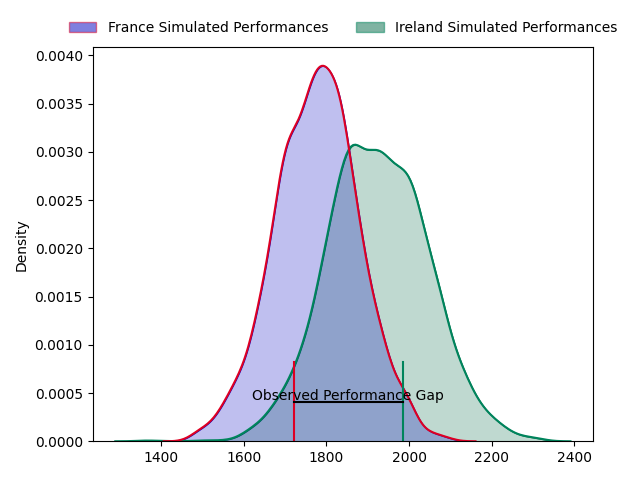
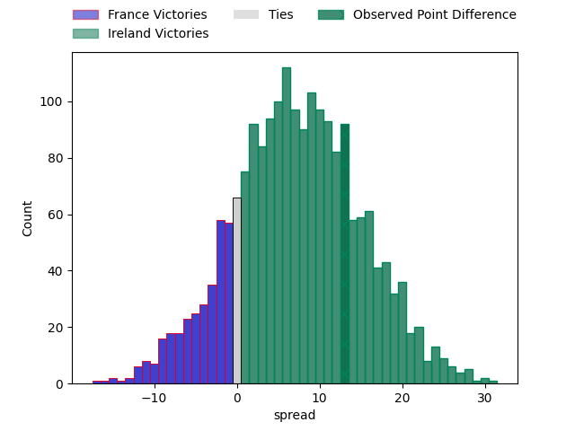
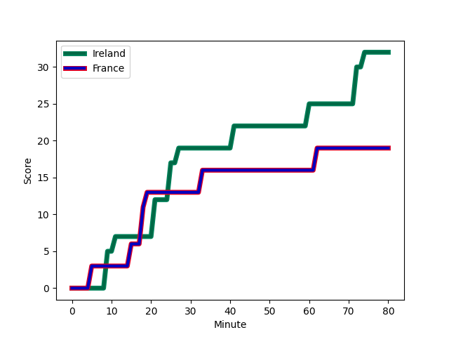
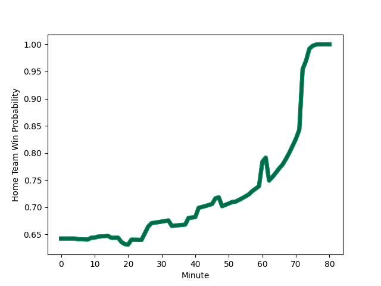

---  
layout: page  
title: France at Ireland; 19.0-32.0  
date: 2023-02-11 09:15:00 18:00:00 -0500  
categories: match review  
---
# France at Ireland; 19.0-32.0

# Club Level Predictions

The first set of predictions treats a club as the smallest object, as the club develops its members, organizes a gameplan, and deploys its players as needed for each match. This club model has a prediction of 0.694, which translates to predicting Ireland to win by 7.5.

Each club has a rating and a rating deviation (simiar to a Glicko system), and expected performances can be generated. This allows for simulated matches and spreads like the ones below.
## Projected Performances

## Projected Spreads

## Projected Results

# Player Level Predictions

Treating teams instead as an entity made up of the currently active players, I have ratings for each player in an altogether different system. These can be combined to form team ratings once teamsheets are announced, weighting starters a bit higher than the reserves. After the match is played, players can be weighted by their minutes on the field, allowing for an accurate measure of the team's composition. With these compiled team ratings, we can make predictions, measure inaccuracy, and update the individual player ratings.
## Prediction with Player Minutes: Ireland by 30.2

Ireland by 26.2 on a neutral field
## Scores over Time

## Win Probability over Time

There were 3 large changes in win probability in this match
## Prediction without Player Minutes: Ireland by 26.1

Ireland by 22.1 on a neutral pitch

|   Away Minutes | Away Player                                                         |   Away elo |   Away Percentile |   Number |   Home Percentile |   Home elo | Home Player                                                       |   Home Minutes |
|---------------:|:--------------------------------------------------------------------|-----------:|------------------:|---------:|------------------:|-----------:|:------------------------------------------------------------------|---------------:|
|             57 | [Cyril Baille](..//playerfiles//CyrilBaille_cleaned.md)             |      90.44 |                33 |        1 |                71 |     103.1  | [Andrew Porter](..//playerfiles//AndrewPorter_cleaned.md)         |             70 |
|             74 | [Julien Marchand](..//playerfiles//JulienMarchand_cleaned.md)       |      95.14 |                51 |        2 |                53 |      95.67 | [Rob Herring](..//playerfiles//RobHerring_cleaned.md)             |             26 |
|             57 | [Uini Atonio](..//playerfiles//UiniAtonio_cleaned.md)               |     122.76 |                96 |        3 |                71 |     103.16 | [Finlay Bealham](..//playerfiles//FinlayBealham_cleaned.md)       |             62 |
|             80 | [Thibaud Flament](..//playerfiles//ThibaudFlament_cleaned.md)       |     102.05 |                66 |        4 |                97 |     133.82 | [Tadhg Beirne](..//playerfiles//TadhgBeirne_cleaned.md)           |             46 |
|             46 | [Paul Willemse](..//playerfiles//PaulWillemse_cleaned.md)           |     132.22 |                97 |        5 |                91 |     119.73 | [James Ryan](..//playerfiles//JamesRyan_cleaned.md)               |             80 |
|             80 | [Anthony Jelonch](..//playerfiles//AnthonyJelonch_cleaned.md)       |      80.62 |                13 |        6 |                16 |      82.23 | [Peter O'Mahony](..//playerfiles//PeterO'Mahony_cleaned.md)       |             57 |
|             70 | [Charles Ollivon](..//playerfiles//CharlesOllivon_cleaned.md)       |     130.47 |                95 |        7 |                95 |     131.46 | [Josh van der Flier](..//playerfiles//JoshvanderFlier_cleaned.md) |             80 |
|             52 | [Gregory Alldritt](..//playerfiles//GregoryAlldritt_cleaned.md)     |     108.77 |                75 |        8 |                99 |     139.22 | [Caelan Doris](..//playerfiles//CaelanDoris_cleaned.md)           |             80 |
|             80 | [Antoine Dupont](..//playerfiles//AntoineDupont_cleaned.md)         |     114.8  |                89 |        9 |                99 |     146.99 | [Conor Murray](..//playerfiles//ConorMurray_cleaned.md)           |             57 |
|             80 | [Romain Ntamack](..//playerfiles//RomainNtamack_cleaned.md)         |     114.45 |                82 |       10 |                99 |     152.66 | [Johnny Sexton](..//playerfiles//JohnnySexton_cleaned.md)         |             48 |
|             68 | [Ethan Dumortier](..//playerfiles//EthanDumortier_cleaned.md)       |      86.85 |                23 |       11 |                99 |     152.82 | [James Lowe](..//playerfiles//JamesLowe_cleaned.md)               |             80 |
|             80 | [Yoram Moefana](..//playerfiles//YoramMoefana_cleaned.md)           |      88.67 |                31 |       12 |                99 |     139.6  | [Stuart McCloskey](..//playerfiles//StuartMcCloskey_cleaned.md)   |             66 |
|             80 | [Gael Fickou](..//playerfiles//GaelFickou_cleaned.md)               |      97.17 |                53 |       13 |                54 |      97.33 | [Garry Ringrose](..//playerfiles//GarryRingrose_cleaned.md)       |             80 |
|             80 | [Damian Penaud](..//playerfiles//DamianPenaud_cleaned.md)           |      99.55 |                61 |       14 |                66 |     101.37 | [Mack Hansen](..//playerfiles//MackHansen_cleaned.md)             |             80 |
|             62 | [Thomas Ramos](..//playerfiles//ThomasRamos_cleaned.md)             |     131.89 |                94 |       15 |                98 |     145.1  | [Hugo Keenan](..//playerfiles//HugoKeenan_cleaned.md)             |             80 |
|              6 | [Gaetan Barlot](..//playerfiles//GaetanBarlot_cleaned.md)           |     119.12 |                94 |       16 |                97 |     130.97 | [Ronan Kelleher](..//playerfiles//RonanKelleher_cleaned.md)       |             54 |
|             23 | [Reda Wardi](..//playerfiles//RedaWardi_cleaned.md)                 |     107.93 |                84 |       17 |                98 |     134.38 | [Dave Kilcoyne](..//playerfiles//DaveKilcoyne_cleaned.md)         |             10 |
|             35 | [Sipili Falatea](..//playerfiles//SipiliFalatea_cleaned.md)         |     102.47 |                74 |       18 |                29 |      89.87 | [Tom O'Toole](..//playerfiles//TomO'Toole_cleaned.md)             |             18 |
|             34 | [Romain Taofifenua](..//playerfiles//RomainTaofifenua_cleaned.md)   |     101.31 |                69 |       19 |                87 |     116.77 | [Iain Henderson](..//playerfiles//IainHenderson_cleaned.md)       |             34 |
|             10 | [Francois Cros](..//playerfiles//FrancoisCros_cleaned.md)           |     163.47 |                99 |       20 |                98 |     132.46 | [Jack Conan](..//playerfiles//JackConan_cleaned.md)               |             23 |
|             28 | [Sekou Macalou](..//playerfiles//SekouMacalou_cleaned.md)           |     114.33 |                87 |       21 |                85 |     112.36 | [Craig Casey](..//playerfiles//CraigCasey_cleaned.md)             |             23 |
|              0 | [Baptiste Couilloud](..//playerfiles//BaptisteCouilloud_cleaned.md) |     129.59 |                97 |       22 |                81 |     112.93 | [Ross Byrne](..//playerfiles//RossByrne_cleaned.md)               |             32 |
|             18 | [Matthieu Jalibert](..//playerfiles//MatthieuJalibert_cleaned.md)   |     113.68 |                83 |       23 |                98 |     137.79 | [Bundee Aki](..//playerfiles//BundeeAki_cleaned.md)               |             14 |

