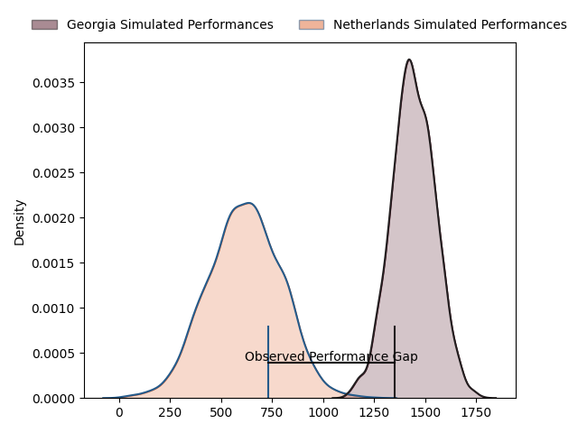
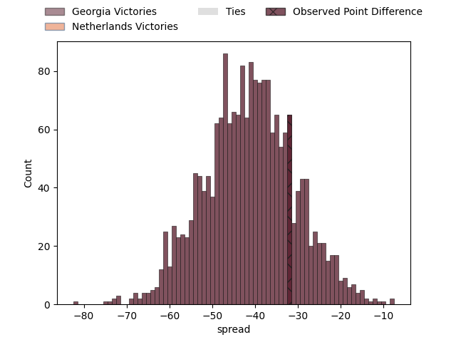
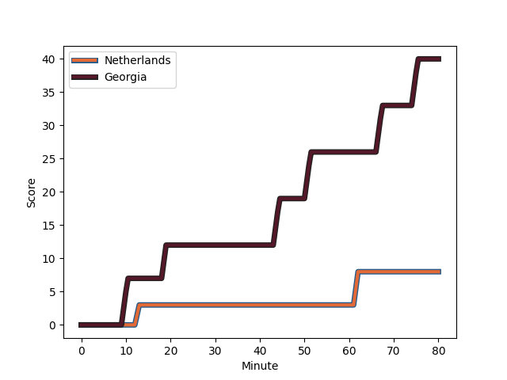
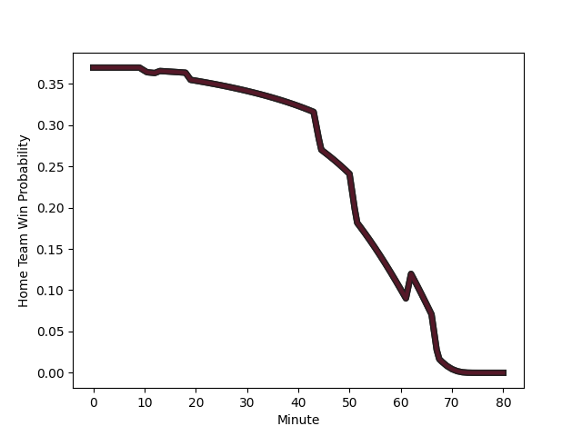

---  
layout: page  
title: Georgia at Netherlands; 40-8  
date: 2023-02-11 13:15:00 18:00:00 -0500  
categories: match review  
---
# Georgia at Netherlands; 40-8

# Club Level Predictions

The first set of predictions treats a club as the smallest object, as the club develops its members, organizes a gameplan, and deploys its players as needed for each match. This club model has a prediction of 0.011, which translates to predicting Georgia to win by 41.1.

Each club has a rating and a rating deviation (simiar to a Glicko system), and expected performances can be generated. This allows for simulated matches and spreads like the ones below.
## Projected Performances

## Projected Spreads

## Projected Results

# Player Level Predictions

Treating teams instead as an entity made up of the currently active players, I have ratings for each player in an altogether different system. These can be combined to form team ratings once teamsheets are announced, weighting starters a bit higher than the reserves. After the match is played, players can be weighted by their minutes on the field, allowing for an accurate measure of the team's composition. With these compiled team ratings, we can make predictions, measure inaccuracy, and update the individual player ratings.
## Prediction with Player Minutes: Georgia by 40.7

Georgia by 44.7 on a neutral field
## Scores over Time

## Win Probability over Time

There were 2 large changes in win probability in this match
## Prediction without Player Minutes: Georgia by 38.7

Georgia by 42.7 on a neutral pitch

|   Away Minutes | Away Player                                                               |   Away elo |   Away Percentile |   Number |   Home Percentile |   Home elo | Home Player                                                                  |   Home Minutes |
|---------------:|:--------------------------------------------------------------------------|-----------:|------------------:|---------:|------------------:|-----------:|:-----------------------------------------------------------------------------|---------------:|
|             80 | [Nika Abuladze](..//playerfiles//NikaAbuladze_cleaned.md)                 |     112.01 |                79 |        1 |                 3 |      80.99 | [Hugo Langelaan](..//playerfiles//HugoLangelaan_cleaned.md)                  |             80 |
|             57 | [Nika Abuladze](..//playerfiles//NikaAbuladze_cleaned.md)                 |     112.01 |                86 |        1 |                14 |      80.99 | [Hugo Langelaan](..//playerfiles//HugoLangelaan_cleaned.md)                  |             80 |
|             80 | [Nika Abuladze](..//playerfiles//NikaAbuladze_cleaned.md)                 |     112.01 |                79 |        1 |                 3 |      80.99 | [Hugo Langelaan](..//playerfiles//HugoLangelaan_cleaned.md)                  |             71 |
|             80 | [Nika Abuladze](..//playerfiles//NikaAbuladze_cleaned.md)                 |     112.01 |                86 |        1 |                 3 |      80.99 | [Hugo Langelaan](..//playerfiles//HugoLangelaan_cleaned.md)                  |             71 |
|             80 | [Nika Abuladze](..//playerfiles//NikaAbuladze_cleaned.md)                 |     112.01 |                86 |        1 |                 3 |      80.99 | [Hugo Langelaan](..//playerfiles//HugoLangelaan_cleaned.md)                  |             80 |
|             80 | [Nika Abuladze](..//playerfiles//NikaAbuladze_cleaned.md)                 |     112.01 |                86 |        1 |                14 |      80.99 | [Hugo Langelaan](..//playerfiles//HugoLangelaan_cleaned.md)                  |             80 |
|             80 | [Nika Abuladze](..//playerfiles//NikaAbuladze_cleaned.md)                 |     112.01 |                79 |        1 |                14 |      80.99 | [Hugo Langelaan](..//playerfiles//HugoLangelaan_cleaned.md)                  |             80 |
|             57 | [Nika Abuladze](..//playerfiles//NikaAbuladze_cleaned.md)                 |     112.01 |                86 |        1 |                 3 |      80.99 | [Hugo Langelaan](..//playerfiles//HugoLangelaan_cleaned.md)                  |             80 |
|             57 | [Nika Abuladze](..//playerfiles//NikaAbuladze_cleaned.md)                 |     112.01 |                79 |        1 |                 3 |      80.99 | [Hugo Langelaan](..//playerfiles//HugoLangelaan_cleaned.md)                  |             80 |
|             57 | [Nika Abuladze](..//playerfiles//NikaAbuladze_cleaned.md)                 |     112.01 |                79 |        1 |                14 |      80.99 | [Hugo Langelaan](..//playerfiles//HugoLangelaan_cleaned.md)                  |             80 |
|             57 | [Nika Abuladze](..//playerfiles//NikaAbuladze_cleaned.md)                 |     112.01 |                79 |        1 |                 3 |      80.99 | [Hugo Langelaan](..//playerfiles//HugoLangelaan_cleaned.md)                  |             71 |
|             57 | [Nika Abuladze](..//playerfiles//NikaAbuladze_cleaned.md)                 |     112.01 |                86 |        1 |                 3 |      80.99 | [Hugo Langelaan](..//playerfiles//HugoLangelaan_cleaned.md)                  |             71 |
|             80 | [Nika Abuladze](..//playerfiles//NikaAbuladze_cleaned.md)                 |     112.01 |                79 |        1 |                14 |      80.99 | [Hugo Langelaan](..//playerfiles//HugoLangelaan_cleaned.md)                  |             71 |
|             57 | [Nika Abuladze](..//playerfiles//NikaAbuladze_cleaned.md)                 |     112.01 |                86 |        1 |                14 |      80.99 | [Hugo Langelaan](..//playerfiles//HugoLangelaan_cleaned.md)                  |             71 |
|             57 | [Nika Abuladze](..//playerfiles//NikaAbuladze_cleaned.md)                 |     112.01 |                79 |        1 |                14 |      80.99 | [Hugo Langelaan](..//playerfiles//HugoLangelaan_cleaned.md)                  |             71 |
|             80 | [Nika Abuladze](..//playerfiles//NikaAbuladze_cleaned.md)                 |     112.01 |                86 |        1 |                14 |      80.99 | [Hugo Langelaan](..//playerfiles//HugoLangelaan_cleaned.md)                  |             71 |
|             57 | [Giorgi Chkoidze](..//playerfiles//GiorgiChkoidze_cleaned.md)             |     109.36 |                84 |        2 |                 1 |      58.42 | [Andy Darlington](..//playerfiles//AndyDarlington_cleaned.md)                |             80 |
|             80 | [Giorgi Chkoidze](..//playerfiles//GiorgiChkoidze_cleaned.md)             |     109.36 |                84 |        2 |                 1 |      58.42 | [Andy Darlington](..//playerfiles//AndyDarlington_cleaned.md)                |             80 |
|             57 | [Giorgi Chkoidze](..//playerfiles//GiorgiChkoidze_cleaned.md)             |     109.36 |                84 |        2 |                11 |      78.33 | [Mark Darlington](..//playerfiles//MarkDarlington_cleaned.md)                |             50 |
|             80 | [Giorgi Chkoidze](..//playerfiles//GiorgiChkoidze_cleaned.md)             |     109.36 |                84 |        2 |                11 |      78.33 | [Mark Darlington](..//playerfiles//MarkDarlington_cleaned.md)                |             50 |
|             66 | [Beka Gigashvili](..//playerfiles//BekaGigashvili_cleaned.md)             |     109.04 |                83 |        3 |                94 |     119.71 | [Thymo Peters](..//playerfiles//ThymoPeters_cleaned.md)                      |             40 |
|             80 | [Beka Gigashvili](..//playerfiles//BekaGigashvili_cleaned.md)             |     109.04 |                83 |        3 |                94 |     119.71 | [Thymo Peters](..//playerfiles//ThymoPeters_cleaned.md)                      |             40 |
|             66 | [Beka Gigashvili](..//playerfiles//BekaGigashvili_cleaned.md)             |     109.04 |                83 |        3 |                78 |     119.71 | [Thymo Peters](..//playerfiles//ThymoPeters_cleaned.md)                      |             40 |
|             66 | [Beka Gigashvili](..//playerfiles//BekaGigashvili_cleaned.md)             |     109.04 |                83 |        3 |                94 |     119.71 | [Thymo Peters](..//playerfiles//ThymoPeters_cleaned.md)                      |             80 |
|             80 | [Beka Gigashvili](..//playerfiles//BekaGigashvili_cleaned.md)             |     109.04 |                83 |        3 |                94 |     119.71 | [Thymo Peters](..//playerfiles//ThymoPeters_cleaned.md)                      |             80 |
|             66 | [Beka Gigashvili](..//playerfiles//BekaGigashvili_cleaned.md)             |     109.04 |                83 |        3 |                78 |     119.71 | [Thymo Peters](..//playerfiles//ThymoPeters_cleaned.md)                      |             80 |
|             80 | [Beka Gigashvili](..//playerfiles//BekaGigashvili_cleaned.md)             |     109.04 |                83 |        3 |                78 |     119.71 | [Thymo Peters](..//playerfiles//ThymoPeters_cleaned.md)                      |             80 |
|             80 | [Beka Gigashvili](..//playerfiles//BekaGigashvili_cleaned.md)             |     109.04 |                83 |        3 |                78 |     119.71 | [Thymo Peters](..//playerfiles//ThymoPeters_cleaned.md)                      |             40 |
|             80 | [Lado Chachanidze](..//playerfiles//LadoChachanidze_cleaned.md)           |     107.69 |                72 |        4 |                48 |     108.82 | [Louis Bruinsma](..//playerfiles//LouisBruinsma_cleaned.md)                  |             80 |
|             80 | [Lado Chachanidze](..//playerfiles//LadoChachanidze_cleaned.md)           |     107.69 |                72 |        4 |                78 |     108.82 | [Louis Bruinsma](..//playerfiles//LouisBruinsma_cleaned.md)                  |             80 |
|             57 | [Kote Mikautadze](..//playerfiles//KoteMikautadze_cleaned.md)             |      82.45 |                18 |        5 |                 8 |      71.87 | [Koen Bloemen](..//playerfiles//KoenBloemen_cleaned.md)                      |             67 |
|             80 | [Kote Mikautadze](..//playerfiles//KoteMikautadze_cleaned.md)             |      82.45 |                18 |        5 |                 8 |      71.87 | [Koen Bloemen](..//playerfiles//KoenBloemen_cleaned.md)                      |             67 |
|             80 | [Kote Mikautadze](..//playerfiles//KoteMikautadze_cleaned.md)             |      82.45 |                11 |        5 |                 8 |      71.87 | [Koen Bloemen](..//playerfiles//KoenBloemen_cleaned.md)                      |             67 |
|             57 | [Kote Mikautadze](..//playerfiles//KoteMikautadze_cleaned.md)             |      82.45 |                11 |        5 |                 8 |      71.87 | [Koen Bloemen](..//playerfiles//KoenBloemen_cleaned.md)                      |             67 |
|             57 | [Kote Mikautadze](..//playerfiles//KoteMikautadze_cleaned.md)             |      82.45 |                11 |        5 |                 8 |      71.87 | [Koen Bloemen](..//playerfiles//KoenBloemen_cleaned.md)                      |             80 |
|             80 | [Kote Mikautadze](..//playerfiles//KoteMikautadze_cleaned.md)             |      82.45 |                18 |        5 |                 8 |      71.87 | [Koen Bloemen](..//playerfiles//KoenBloemen_cleaned.md)                      |             80 |
|             80 | [Kote Mikautadze](..//playerfiles//KoteMikautadze_cleaned.md)             |      82.45 |                11 |        5 |                 8 |      71.87 | [Koen Bloemen](..//playerfiles//KoenBloemen_cleaned.md)                      |             80 |
|             57 | [Kote Mikautadze](..//playerfiles//KoteMikautadze_cleaned.md)             |      82.45 |                18 |        5 |                 8 |      71.87 | [Koen Bloemen](..//playerfiles//KoenBloemen_cleaned.md)                      |             80 |
|             66 | [Giorgi Tsutskeridze](..//playerfiles//GiorgiTsutskeridze_cleaned.md)     |     118.06 |                89 |        6 |                25 |      87.01 | [Spike Salman](..//playerfiles//SpikeSalman_cleaned.md)                      |             80 |
|             80 | [Giorgi Tsutskeridze](..//playerfiles//GiorgiTsutskeridze_cleaned.md)     |     118.06 |                89 |        6 |                25 |      87.01 | [Spike Salman](..//playerfiles//SpikeSalman_cleaned.md)                      |             80 |
|             80 | [Beka Saghinadze](..//playerfiles//BekaSaghinadze_cleaned.md)             |     104.16 |                70 |        7 |                24 |      86.49 | [Wolf van Dijk](..//playerfiles//WolfvanDijk_cleaned.md)                     |             80 |
|             80 | [Beka Saghinadze](..//playerfiles//BekaSaghinadze_cleaned.md)             |     104.16 |                70 |        7 |                 6 |      86.49 | [Wolf van Dijk](..//playerfiles//WolfvanDijk_cleaned.md)                     |             80 |
|             80 | [Otar Giorgadze](..//playerfiles//OtarGiorgadze_cleaned.md)               |     101.71 |                62 |        8 |                40 |      92.8  | [Christopher Raymond](..//playerfiles//ChristopherRaymond_cleaned.md)        |             80 |
|             80 | [Gela Aprasidze](..//playerfiles//GelaAprasidze_cleaned.md)               |      97.05 |                54 |        9 |                65 |     113.11 | [Mark Alexander Coebergh](..//playerfiles//MarkAlexanderCoebergh_cleaned.md) |             63 |
|             80 | [Gela Aprasidze](..//playerfiles//GelaAprasidze_cleaned.md)               |      97.05 |                54 |        9 |                86 |     113.11 | [Mark Alexander Coebergh](..//playerfiles//MarkAlexanderCoebergh_cleaned.md) |             63 |
|             58 | [Gela Aprasidze](..//playerfiles//GelaAprasidze_cleaned.md)               |      97.05 |                54 |        9 |                86 |     113.11 | [Mark Alexander Coebergh](..//playerfiles//MarkAlexanderCoebergh_cleaned.md) |             63 |
|             58 | [Gela Aprasidze](..//playerfiles//GelaAprasidze_cleaned.md)               |      97.05 |                54 |        9 |                86 |     113.11 | [Mark Alexander Coebergh](..//playerfiles//MarkAlexanderCoebergh_cleaned.md) |             80 |
|             80 | [Gela Aprasidze](..//playerfiles//GelaAprasidze_cleaned.md)               |      97.05 |                54 |        9 |                86 |     113.11 | [Mark Alexander Coebergh](..//playerfiles//MarkAlexanderCoebergh_cleaned.md) |             80 |
|             58 | [Gela Aprasidze](..//playerfiles//GelaAprasidze_cleaned.md)               |      97.05 |                54 |        9 |                65 |     113.11 | [Mark Alexander Coebergh](..//playerfiles//MarkAlexanderCoebergh_cleaned.md) |             80 |
|             80 | [Gela Aprasidze](..//playerfiles//GelaAprasidze_cleaned.md)               |      97.05 |                54 |        9 |                65 |     113.11 | [Mark Alexander Coebergh](..//playerfiles//MarkAlexanderCoebergh_cleaned.md) |             80 |
|             58 | [Gela Aprasidze](..//playerfiles//GelaAprasidze_cleaned.md)               |      97.05 |                54 |        9 |                65 |     113.11 | [Mark Alexander Coebergh](..//playerfiles//MarkAlexanderCoebergh_cleaned.md) |             63 |
|             80 | [Tedo Abzhandadze](..//playerfiles//TedoAbzhandadze_cleaned.md)           |      96.39 |                50 |       10 |                50 |      96.56 | [Reinhardt Fortuin](..//playerfiles//ReinhardtFortuin_cleaned.md)            |             80 |
|             65 | [Tedo Abzhandadze](..//playerfiles//TedoAbzhandadze_cleaned.md)           |      96.39 |                50 |       10 |                50 |      96.56 | [Reinhardt Fortuin](..//playerfiles//ReinhardtFortuin_cleaned.md)            |             80 |
|             80 | [Sandro Todua](..//playerfiles//SandroTodua_cleaned.md)                   |     113.69 |                84 |       11 |                56 |     112.1  | [Siem Noorman](..//playerfiles//SiemNoorman_cleaned.md)                      |             66 |
|             80 | [Sandro Todua](..//playerfiles//SandroTodua_cleaned.md)                   |     113.69 |                84 |       11 |                83 |     112.1  | [Siem Noorman](..//playerfiles//SiemNoorman_cleaned.md)                      |             66 |
|             80 | [Sandro Todua](..//playerfiles//SandroTodua_cleaned.md)                   |     113.69 |                84 |       11 |                56 |     112.1  | [Siem Noorman](..//playerfiles//SiemNoorman_cleaned.md)                      |             80 |
|             80 | [Sandro Todua](..//playerfiles//SandroTodua_cleaned.md)                   |     113.69 |                84 |       11 |                83 |     112.1  | [Siem Noorman](..//playerfiles//SiemNoorman_cleaned.md)                      |             80 |
|             80 | [Giorgi Kveseladze](..//playerfiles//GiorgiKveseladze_cleaned.md)         |     110.5  |                79 |       12 |                48 |      94.78 | [Daily Limmen](..//playerfiles//DailyLimmen_cleaned.md)                      |             80 |
|             80 | [Giorgi Kveseladze](..//playerfiles//GiorgiKveseladze_cleaned.md)         |     110.5  |                79 |       12 |                16 |      94.78 | [Daily Limmen](..//playerfiles//DailyLimmen_cleaned.md)                      |             80 |
|             80 | [Demur Tapladze](..//playerfiles//DemurTapladze_cleaned.md)               |      93.17 |                44 |       13 |                 5 |      70.27 | [Oliva Sialau](..//playerfiles//OlivaSialau_cleaned.md)                      |             80 |
|             46 | [Akaki Tabutsadze](..//playerfiles//AkakiTabutsadze_cleaned.md)           |     110.91 |                81 |       14 |                23 |      84.18 | [Leroy Van Dam](..//playerfiles//LeroyVanDam_cleaned.md)                     |             80 |
|             80 | [Akaki Tabutsadze](..//playerfiles//AkakiTabutsadze_cleaned.md)           |     110.91 |                81 |       14 |                23 |      84.18 | [Leroy Van Dam](..//playerfiles//LeroyVanDam_cleaned.md)                     |             80 |
|             80 | [Davit Niniashvili](..//playerfiles//DavitNiniashvili_cleaned.md)         |     106.99 |                70 |       15 |                13 |      76.65 | [David Weersma](..//playerfiles//DavidWeersma_cleaned.md)                    |             66 |
|             80 | [Davit Niniashvili](..//playerfiles//DavitNiniashvili_cleaned.md)         |     106.99 |                70 |       15 |                13 |      76.65 | [David Weersma](..//playerfiles//DavidWeersma_cleaned.md)                    |             80 |
|             23 | [Sergo Abramishvili](..//playerfiles//SergoAbramishvili_cleaned.md)       |      94.12 |                34 |       16 |                 6 |      88.23 | [Ross Bennie-Coulson](..//playerfiles//RossBennie-Coulson_cleaned.md)        |             30 |
|             23 | [Sergo Abramishvili](..//playerfiles//SergoAbramishvili_cleaned.md)       |      94.12 |                34 |       16 |                29 |      88.23 | [Ross Bennie-Coulson](..//playerfiles//RossBennie-Coulson_cleaned.md)        |             30 |
|             23 | [Tengiz Zamtaradze](..//playerfiles//TengizZamtaradze_cleaned.md)         |      97.09 |                45 |       17 |               nan |      95.19 | [Odin Ruijgrok](..//playerfiles//OdinRuijgrok_cleaned.md)                    |              9 |
|             14 | [Vakh Abdaladze](..//playerfiles//VakhAbdaladze_cleaned.md)               |      98.23 |               nan |       18 |                 1 |      58.42 | [Andy Darlington](..//playerfiles//AndyDarlington_cleaned.md)                |             40 |
|             23 | [Mikheili Babunashvili](..//playerfiles//MikheiliBabunashvili_cleaned.md) |     100.74 |                63 |       19 |                21 |      86.49 | [Dave Koelman](..//playerfiles//DaveKoelman_cleaned.md)                      |             13 |
|             14 | [Mikheil Gachechiladze](..//playerfiles//MikheilGachechiladze_cleaned.md) |     107.74 |                77 |       20 |                31 |      91.4  | [Rik van Balkom](..//playerfiles//RikvanBalkom_cleaned.md)                   |             17 |
|             22 | [Vaso Lobzhanidze](..//playerfiles//VasoLobzhanidze_cleaned.md)           |     129.21 |                94 |       21 |                 6 |      66.77 | [Jordy Hop](..//playerfiles//JordyHop_cleaned.md)                            |             14 |
|             22 | [Vaso Lobzhanidze](..//playerfiles//VasoLobzhanidze_cleaned.md)           |     129.21 |                97 |       21 |                 6 |      66.77 | [Jordy Hop](..//playerfiles//JordyHop_cleaned.md)                            |             14 |
|             15 | [Luka Matkava](..//playerfiles//LukaMatkava_cleaned.md)                   |     123.66 |                91 |       22 |                 0 |      46.65 | [Te Hauora Campbell](..//playerfiles//TeHauoraCampbell_cleaned.md)           |             14 |
|             34 | [Lasha Khmaladze](..//playerfiles//LashaKhmaladze_cleaned.md)             |     104.37 |                65 |       23 |               nan |     nan    | nan                                                                          |            nan |

