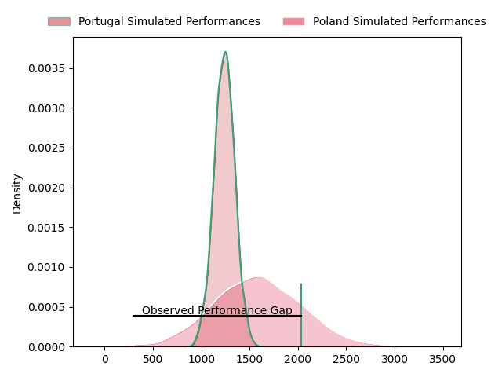
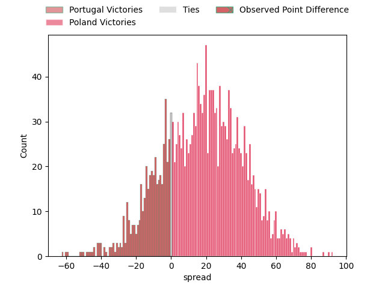
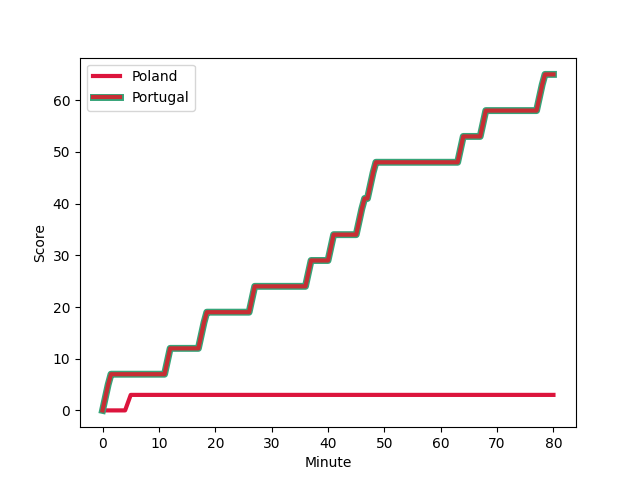
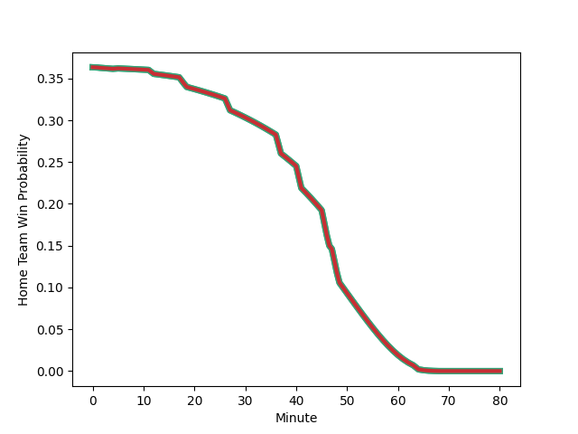

---  
layout: page  
title: Portugal at Poland; 65-3  
date: 2023-02-11 11:45:00 18:00:00 -0500  
categories: match review  
---
# Portugal at Poland; 65-3

# Club Level Predictions

The first set of predictions treats a club as the smallest object, as the club develops its members, organizes a gameplan, and deploys its players as needed for each match. This club model has a prediction of 0.871, which translates to predicting Poland to win by 17.6.

Each club has a rating and a rating deviation (simiar to a Glicko system), and expected performances can be generated. This allows for simulated matches and spreads like the ones below.
## Projected Performances

## Projected Spreads

## Projected Results

# Player Level Predictions

Treating teams instead as an entity made up of the currently active players, I have ratings for each player in an altogether different system. These can be combined to form team ratings once teamsheets are announced, weighting starters a bit higher than the reserves. After the match is played, players can be weighted by their minutes on the field, allowing for an accurate measure of the team's composition. With these compiled team ratings, we can make predictions, measure inaccuracy, and update the individual player ratings.
## Prediction with Player Minutes: Portugal by 20.3

Portugal by 24.3 on a neutral field
## Scores over Time

## Win Probability over Time

There were 3 large changes in win probability in this match
## Prediction without Player Minutes: Portugal by 19.7

Portugal by 23.7 on a neutral pitch

|   Away Minutes | Away Player                                                                            |   Away elo |   Away Percentile |   Number |   Home Percentile |   Home elo | Home Player                                                             |   Home Minutes |
|---------------:|:---------------------------------------------------------------------------------------|-----------:|------------------:|---------:|------------------:|-----------:|:------------------------------------------------------------------------|---------------:|
|             66 | [David Da Costa](..//playerfiles//DavidDaCosta_cleaned.md)                             |     105.61 |                77 |        1 |               nan |      92.24 | [Quentin Cieslinski](..//playerfiles//QuentinCieslinski_cleaned.md)     |             80 |
|             80 | [David Da Costa](..//playerfiles//DavidDaCosta_cleaned.md)                             |     105.61 |                77 |        1 |               nan |      92.24 | [Quentin Cieslinski](..//playerfiles//QuentinCieslinski_cleaned.md)     |             80 |
|             80 | [David Da Costa](..//playerfiles//DavidDaCosta_cleaned.md)                             |     105.61 |                77 |        1 |               nan |      92.24 | [Quentin Cieslinski](..//playerfiles//QuentinCieslinski_cleaned.md)     |             49 |
|             66 | [David Da Costa](..//playerfiles//DavidDaCosta_cleaned.md)                             |     105.61 |                77 |        1 |               nan |      92.24 | [Quentin Cieslinski](..//playerfiles//QuentinCieslinski_cleaned.md)     |             49 |
|             80 | [Mike Tadjer Barbosa](..//playerfiles//MikeTadjerBarbosa_cleaned.md)                   |      89.83 |                30 |        2 |               nan |      95    | [Dominik Mohyla](..//playerfiles//DominikMohyla_cleaned.md)             |             43 |
|             62 | [Mike Tadjer Barbosa](..//playerfiles//MikeTadjerBarbosa_cleaned.md)                   |      89.83 |                30 |        2 |               nan |      95    | [Dominik Mohyla](..//playerfiles//DominikMohyla_cleaned.md)             |             43 |
|             80 | [Mike Tadjer Barbosa](..//playerfiles//MikeTadjerBarbosa_cleaned.md)                   |      89.83 |                30 |        2 |               nan |      95    | [Dominik Mohyla](..//playerfiles//DominikMohyla_cleaned.md)             |             80 |
|             62 | [Mike Tadjer Barbosa](..//playerfiles//MikeTadjerBarbosa_cleaned.md)                   |      89.83 |                30 |        2 |               nan |      95    | [Dominik Mohyla](..//playerfiles//DominikMohyla_cleaned.md)             |             80 |
|             80 | [Diogo Hasse Ferreira](..//playerfiles//DiogoHasseFerreira_cleaned.md)                 |      78.65 |                 9 |        3 |                18 |      84.39 | [Sylwester Gaska](..//playerfiles//SylwesterGaska_cleaned.md)           |             80 |
|             59 | [Diogo Hasse Ferreira](..//playerfiles//DiogoHasseFerreira_cleaned.md)                 |      78.65 |                 9 |        3 |                26 |      84.39 | [Sylwester Gaska](..//playerfiles//SylwesterGaska_cleaned.md)           |             80 |
|             59 | [Diogo Hasse Ferreira](..//playerfiles//DiogoHasseFerreira_cleaned.md)                 |      78.65 |                 9 |        3 |                18 |      84.39 | [Sylwester Gaska](..//playerfiles//SylwesterGaska_cleaned.md)           |             80 |
|             80 | [Diogo Hasse Ferreira](..//playerfiles//DiogoHasseFerreira_cleaned.md)                 |      78.65 |                 9 |        3 |                18 |      84.39 | [Sylwester Gaska](..//playerfiles//SylwesterGaska_cleaned.md)           |             43 |
|             59 | [Diogo Hasse Ferreira](..//playerfiles//DiogoHasseFerreira_cleaned.md)                 |      78.65 |                 9 |        3 |                26 |      84.39 | [Sylwester Gaska](..//playerfiles//SylwesterGaska_cleaned.md)           |             43 |
|             80 | [Diogo Hasse Ferreira](..//playerfiles//DiogoHasseFerreira_cleaned.md)                 |      78.65 |                 9 |        3 |                26 |      84.39 | [Sylwester Gaska](..//playerfiles//SylwesterGaska_cleaned.md)           |             43 |
|             59 | [Diogo Hasse Ferreira](..//playerfiles//DiogoHasseFerreira_cleaned.md)                 |      78.65 |                 9 |        3 |                18 |      84.39 | [Sylwester Gaska](..//playerfiles//SylwesterGaska_cleaned.md)           |             43 |
|             80 | [Diogo Hasse Ferreira](..//playerfiles//DiogoHasseFerreira_cleaned.md)                 |      78.65 |                 9 |        3 |                26 |      84.39 | [Sylwester Gaska](..//playerfiles//SylwesterGaska_cleaned.md)           |             80 |
|             80 | [Jose Madeira](..//playerfiles//JoseMadeira_cleaned.md)                                |     114.96 |                86 |        4 |                29 |      88.32 | [Michal Kruzycki](..//playerfiles//MichalKruzycki_cleaned.md)           |             80 |
|             65 | [Joao Belo](..//playerfiles//JoaoBelo_cleaned.md)                                      |     112.83 |                86 |        5 |               nan |      95    | [Max Loboda](..//playerfiles//MaxLoboda_cleaned.md)                     |             67 |
|             80 | [Joao Belo](..//playerfiles//JoaoBelo_cleaned.md)                                      |     112.83 |                86 |        5 |               nan |      95    | [Max Loboda](..//playerfiles//MaxLoboda_cleaned.md)                     |             67 |
|             65 | [Joao Belo](..//playerfiles//JoaoBelo_cleaned.md)                                      |     112.83 |                86 |        5 |               nan |      95    | [Max Loboda](..//playerfiles//MaxLoboda_cleaned.md)                     |             80 |
|             80 | [Joao Belo](..//playerfiles//JoaoBelo_cleaned.md)                                      |     112.83 |                86 |        5 |               nan |      95    | [Max Loboda](..//playerfiles//MaxLoboda_cleaned.md)                     |             80 |
|             80 | [David Wallis De Carvalho](..//playerfiles//DavidWallisDeCarvalho_cleaned.md)          |      95    |               nan |        6 |               nan |      92.91 | [Kacper Palamarczuk](..//playerfiles//KacperPalamarczuk_cleaned.md)     |             80 |
|             80 | [Nicolas Martins](..//playerfiles//NicolasMartins_cleaned.md)                          |      79.65 |                11 |        7 |               nan |      92.66 | [Arthur Klis](..//playerfiles//ArthurKlis_cleaned.md)                   |             59 |
|             80 | [Nicolas Martins](..//playerfiles//NicolasMartins_cleaned.md)                          |      79.65 |                11 |        7 |               nan |      92.66 | [Arthur Klis](..//playerfiles//ArthurKlis_cleaned.md)                   |             80 |
|             80 | [Thibault de Freitas](..//playerfiles//ThibaultdeFreitas_cleaned.md)                   |     103.34 |                64 |        8 |                20 |      83.72 | [Piotr Zeszutek](..//playerfiles//PiotrZeszutek_cleaned.md)             |             80 |
|             68 | [Thibault de Freitas](..//playerfiles//ThibaultdeFreitas_cleaned.md)                   |     103.34 |                64 |        8 |                20 |      83.72 | [Piotr Zeszutek](..//playerfiles//PiotrZeszutek_cleaned.md)             |             80 |
|             68 | [Thibault de Freitas](..//playerfiles//ThibaultdeFreitas_cleaned.md)                   |     103.34 |                64 |        8 |                28 |      83.72 | [Piotr Zeszutek](..//playerfiles//PiotrZeszutek_cleaned.md)             |             80 |
|             80 | [Thibault de Freitas](..//playerfiles//ThibaultdeFreitas_cleaned.md)                   |     103.34 |                64 |        8 |                28 |      83.72 | [Piotr Zeszutek](..//playerfiles//PiotrZeszutek_cleaned.md)             |             80 |
|             55 | [Samuel Marques](..//playerfiles//SamuelMarques_cleaned.md)                            |     124.52 |                96 |        9 |               nan |      95    | [Sean Cole](..//playerfiles//SeanCole_cleaned.md)                       |             53 |
|             80 | [Samuel Marques](..//playerfiles//SamuelMarques_cleaned.md)                            |     124.52 |                96 |        9 |               nan |      95    | [Sean Cole](..//playerfiles//SeanCole_cleaned.md)                       |             53 |
|             55 | [Samuel Marques](..//playerfiles//SamuelMarques_cleaned.md)                            |     124.52 |                96 |        9 |               nan |      95    | [Sean Cole](..//playerfiles//SeanCole_cleaned.md)                       |             80 |
|             80 | [Samuel Marques](..//playerfiles//SamuelMarques_cleaned.md)                            |     124.52 |                96 |        9 |               nan |      95    | [Sean Cole](..//playerfiles//SeanCole_cleaned.md)                       |             80 |
|             80 | [Jeronimo Portela](..//playerfiles//JeronimoPortela_cleaned.md)                        |     117    |                85 |       10 |               nan |      93.75 | [Wojciak Piotrowicz](..//playerfiles//WojciakPiotrowicz_cleaned.md)     |             80 |
|             80 | [Rodrigo Marta](..//playerfiles//RodrigoMarta_cleaned.md)                              |     104.85 |                72 |       11 |               nan |      95    | [Grzegorz Szczepanski](..//playerfiles//GrzegorzSzczepanski_cleaned.md) |             80 |
|             80 | [Tomas Appleton](..//playerfiles//TomasAppleton_cleaned.md)                            |      99.74 |                60 |       12 |               nan |      95    | [Daniel Gdula](..//playerfiles//DanielGdula_cleaned.md)                 |             40 |
|             80 | [Tomas Appleton](..//playerfiles//TomasAppleton_cleaned.md)                            |      99.74 |                60 |       12 |               nan |      95    | [Daniel Gdula](..//playerfiles//DanielGdula_cleaned.md)                 |             80 |
|             48 | [Jose Lima](..//playerfiles//JoseLima_cleaned.md)                                      |     122.96 |                91 |       13 |                31 |      88.32 | [Peter Hudson](..//playerfiles//PeterHudson_cleaned.md)                 |             80 |
|             80 | [Jose Lima](..//playerfiles//JoseLima_cleaned.md)                                      |     122.96 |                91 |       13 |                31 |      88.32 | [Peter Hudson](..//playerfiles//PeterHudson_cleaned.md)                 |             80 |
|             80 | [Vincent Pinto](..//playerfiles//VincentPinto_cleaned.md)                              |      97.45 |                54 |       14 |               nan |      94.58 | [Tomek Pozniak](..//playerfiles//TomekPozniak_cleaned.md)               |             68 |
|             80 | [Vincent Pinto](..//playerfiles//VincentPinto_cleaned.md)                              |      97.45 |                54 |       14 |               nan |      94.58 | [Tomek Pozniak](..//playerfiles//TomekPozniak_cleaned.md)               |             80 |
|             72 | [Simao Broeiro Bento](..//playerfiles//SimaoBroeiroBento_cleaned.md)                   |      97.24 |                54 |       15 |                30 |      88.32 | [Ross Cooke](..//playerfiles//RossCooke_cleaned.md)                     |             80 |
|             80 | [Simao Broeiro Bento](..//playerfiles//SimaoBroeiroBento_cleaned.md)                   |      97.24 |                54 |       15 |                30 |      88.32 | [Ross Cooke](..//playerfiles//RossCooke_cleaned.md)                     |             80 |
|             32 | [Pedro Bettencourt Avila](..//playerfiles//PedroBettencourtAvila_cleaned.md)           |      94.07 |                44 |       16 |                27 |      88.32 | [Dominik Morycki](..//playerfiles//DominikMorycki_cleaned.md)           |             40 |
|             25 | [Pedro Lucas](..//playerfiles//PedroLucas_cleaned.md)                                  |      90.54 |                30 |       17 |               nan |      95    | [Jakub Burek](..//playerfiles//JakubBurek_cleaned.md)                   |             37 |
|             21 | [Antonio Prim Da Costa](..//playerfiles//AntonioPrimDaCosta_cleaned.md)                |      98.65 |                58 |       18 |               nan |      92.24 | [Tom Fidler](..//playerfiles//TomFidler_cleaned.md)                     |             37 |
|             18 | [Duarte Azevedo de Brito Diniz](..//playerfiles//DuarteAzevedodeBritoDiniz_cleaned.md) |      67.69 |                 1 |       19 |                26 |      84.39 | [Jake Wisniewski](..//playerfiles//JakeWisniewski_cleaned.md)           |             31 |
|             18 | [Duarte Azevedo de Brito Diniz](..//playerfiles//DuarteAzevedodeBritoDiniz_cleaned.md) |      67.69 |                 1 |       19 |                18 |      84.39 | [Jake Wisniewski](..//playerfiles//JakeWisniewski_cleaned.md)           |             31 |
|             15 | [Duarte Torgal](..//playerfiles//DuarteTorgal_cleaned.md)                              |      91.01 |                36 |       20 |                29 |      82.3  | [Dawid Plichta](..//playerfiles//DawidPlichta_cleaned.md)               |             27 |
|             15 | [Duarte Torgal](..//playerfiles//DuarteTorgal_cleaned.md)                              |      91.01 |                36 |       20 |                17 |      82.3  | [Dawid Plichta](..//playerfiles//DawidPlichta_cleaned.md)               |             27 |
|             14 | [André Arrojado](..//playerfiles//AndréArrojado_cleaned.md)                            |     102.1  |                68 |       21 |               nan |      95    | [Arkadiusz Janeczko](..//playerfiles//ArkadiuszJaneczko_cleaned.md)     |             21 |
|             12 | [Manuel Maria Picao Eusebio](..//playerfiles//ManuelMariaPicaoEusebio_cleaned.md)      |     110.83 |                79 |       22 |               nan |      95    | [Adam Piotrowski](..//playerfiles//AdamPiotrowski_cleaned.md)           |             13 |
|              8 | [Nuno Sousa Guedes](..//playerfiles//NunoSousaGuedes_cleaned.md)                       |      98.37 |                52 |       23 |                31 |      82.05 | [Dawid Banaszek](..//playerfiles//DawidBanaszek_cleaned.md)             |             12 |
|              8 | [Nuno Sousa Guedes](..//playerfiles//NunoSousaGuedes_cleaned.md)                       |      98.37 |                52 |       23 |                16 |      82.05 | [Dawid Banaszek](..//playerfiles//DawidBanaszek_cleaned.md)             |             12 |

