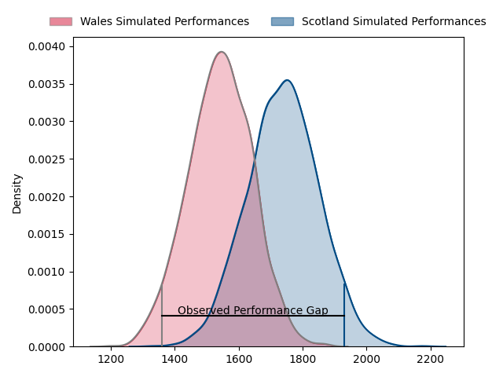
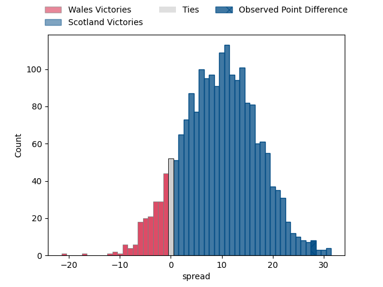
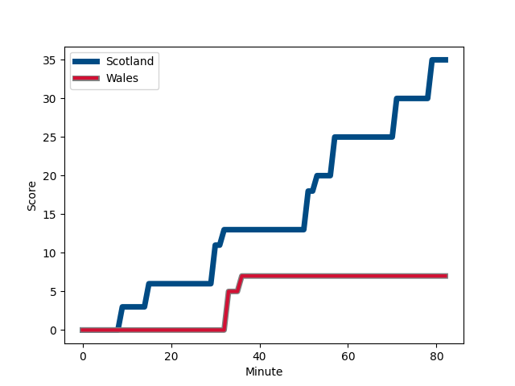
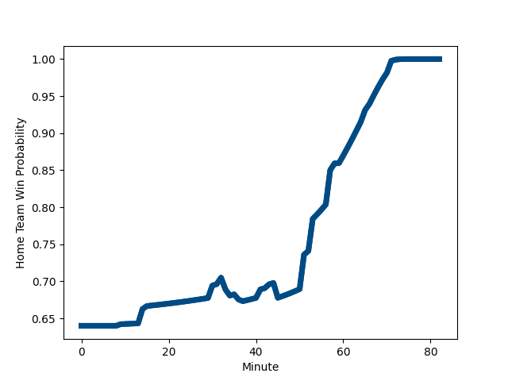

---  
layout: page  
title: Wales at Scotland; 7.0-35.0  
date: 2023-02-11 11:45:00 18:00:00 -0500  
categories: match review  
---
# Wales at Scotland; 7.0-35.0

# Club Level Predictions

The first set of predictions treats a club as the smallest object, as the club develops its members, organizes a gameplan, and deploys its players as needed for each match. This club model has a prediction of 0.74, which translates to predicting Scotland to win by 9.5.

Each club has a rating and a rating deviation (simiar to a Glicko system), and expected performances can be generated. This allows for simulated matches and spreads like the ones below.
## Projected Performances

## Projected Spreads

## Projected Results

# Player Level Predictions

Treating teams instead as an entity made up of the currently active players, I have ratings for each player in an altogether different system. These can be combined to form team ratings once teamsheets are announced, weighting starters a bit higher than the reserves. After the match is played, players can be weighted by their minutes on the field, allowing for an accurate measure of the team's composition. With these compiled team ratings, we can make predictions, measure inaccuracy, and update the individual player ratings.
## Prediction with Player Minutes: Scotland by 29.0

Scotland by 25.0 on a neutral field
## Scores over Time

## Win Probability over Time

There were 3 large changes in win probability in this match
## Prediction without Player Minutes: Scotland by 26.7

Scotland by 22.7 on a neutral pitch

|   Away Minutes | Away Player                                                   |   Away elo |   Away Percentile |   Number |   Home Percentile |   Home elo | Home Player                                                         |   Home Minutes |
|---------------:|:--------------------------------------------------------------|-----------:|------------------:|---------:|------------------:|-----------:|:--------------------------------------------------------------------|---------------:|
|             53 | [Wyn Jones](..//playerfiles//WynJones_cleaned.md)             |     124.74 |                96 |        1 |                55 |      96.83 | [Pierre Schoeman](..//playerfiles//PierreSchoeman_cleaned.md)       |             65 |
|             65 | [Ken Owens](..//playerfiles//KenOwens_cleaned.md)             |      92.87 |                44 |        2 |                98 |     131.47 | [George Turner](..//playerfiles//GeorgeTurner_cleaned.md)           |             59 |
|             65 | [Dillon Lewis](..//playerfiles//DillonLewis_cleaned.md)       |      99.47 |                68 |        3 |                93 |     117.77 | [Zander Fagerson](..//playerfiles//ZanderFagerson_cleaned.md)       |             65 |
|             66 | [Dafydd Jenkins](..//playerfiles//DafyddJenkins_cleaned.md)   |     115.61 |                88 |        4 |                96 |     131.73 | [Richie Gray](..//playerfiles//RichieGray_cleaned.md)               |             82 |
|             82 | [Adam Beard](..//playerfiles//AdamBeard_cleaned.md)           |      92.93 |                43 |        5 |                97 |     136.31 | [Grant Gilchrist](..//playerfiles//GrantGilchrist_cleaned.md)       |             65 |
|             82 | [Christ Tshiunza](..//playerfiles//ChristTshiunza_cleaned.md) |      91.23 |                37 |        6 |                99 |     141.7  | [Jamie Ritchie](..//playerfiles//JamieRitchie_cleaned.md)           |             82 |
|             82 | [Tommy Reffell](..//playerfiles//TommyReffell_cleaned.md)     |     110.62 |                83 |        7 |                96 |     132.3  | [Luke Crosbie](..//playerfiles//LukeCrosbie_cleaned.md)             |             39 |
|             53 | [Jac Morgan](..//playerfiles//JacMorgan_cleaned.md)           |      98.96 |                59 |        8 |                81 |     112.79 | [Matt Fagerson](..//playerfiles//MattFagerson_cleaned.md)           |             82 |
|             57 | [Tomos Williams](..//playerfiles//TomosWilliams_cleaned.md)   |     113.17 |                86 |        9 |                88 |     114.69 | [Ben White](..//playerfiles//BenWhite_cleaned.md)                   |             59 |
|             57 | [Dan Biggar](..//playerfiles//DanBiggar_cleaned.md)           |     130.03 |                96 |       10 |                98 |     141.36 | [Finn Russell](..//playerfiles//FinnRussell_cleaned.md)             |             82 |
|             82 | [Rio Dyer](..//playerfiles//RioDyer_cleaned.md)               |      62.42 |                 4 |       11 |                82 |     111.57 | [Duhan van der Merwe](..//playerfiles//DuhanvanderMerwe_cleaned.md) |             82 |
|             82 | [Joe Hawkins](..//playerfiles//JoeHawkins_cleaned.md)         |      78.64 |                13 |       12 |                52 |      96.76 | [Sione Tuipulotu](..//playerfiles//SioneTuipulotu_cleaned.md)       |             72 |
|             75 | [George North](..//playerfiles//GeorgeNorth_cleaned.md)       |     108.74 |                76 |       13 |                28 |      86.33 | [Huw Jones](..//playerfiles//HuwJones_cleaned.md)                   |             82 |
|             59 | [Josh Adams](..//playerfiles//JoshAdams_cleaned.md)           |      95.73 |                51 |       14 |                88 |     117.09 | [Kyle Steyn](..//playerfiles//KyleSteyn_cleaned.md)                 |             82 |
|             82 | [Liam Williams](..//playerfiles//LiamWilliams_cleaned.md)     |     135.51 |                96 |       15 |                87 |     118.65 | [Stuart Hogg](..//playerfiles//StuartHogg_cleaned.md)               |             14 |
|             17 | [Scott Baldwin](..//playerfiles//ScottBaldwin_cleaned.md)     |      98.28 |                62 |       16 |                95 |     125.73 | [Fraser Brown](..//playerfiles//FraserBrown_cleaned.md)             |             29 |
|             29 | [Rhys Carré](..//playerfiles//RhysCarré_cleaned.md)           |      84.29 |                22 |       17 |                95 |     122.09 | [Jamie Bhatti](..//playerfiles//JamieBhatti_cleaned.md)             |             17 |
|             17 | [Leon Brown](..//playerfiles//LeonBrown_cleaned.md)           |      90.09 |                33 |       18 |                99 |     137.37 | [WP Nel](..//playerfiles//WPNel_cleaned.md)                         |             17 |
|             16 | [Rhys Davies](..//playerfiles//RhysDavies_cleaned.md)         |     131.95 |                95 |       19 |                75 |     107.59 | [Jonny Gray](..//playerfiles//JonnyGray_cleaned.md)                 |             17 |
|             29 | [Taulupe Faletau](..//playerfiles//TaulupeFaletau_cleaned.md) |      95.63 |                46 |       20 |                34 |      91.19 | [Jack Dempsey](..//playerfiles//JackDempsey_cleaned.md)             |             37 |
|             25 | [Rhys Webb](..//playerfiles//RhysWebb_cleaned.md)             |     111.96 |                86 |       21 |                95 |     123.84 | [George Horne](..//playerfiles//GeorgeHorne_cleaned.md)             |             23 |
|             25 | [Rhys Patchell](..//playerfiles//RhysPatchell_cleaned.md)     |     147.51 |                99 |       22 |                99 |     152.75 | [Blair Kinghorn](..//playerfiles//BlairKinghorn_cleaned.md)         |             68 |
|             30 | [Alex Cuthbert](..//playerfiles//AlexCuthbert_cleaned.md)     |     127.12 |                95 |       23 |                80 |     111.15 | [Chris Harris](..//playerfiles//ChrisHarris_cleaned.md)             |             10 |

