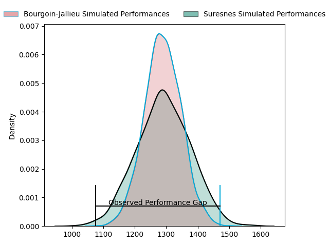
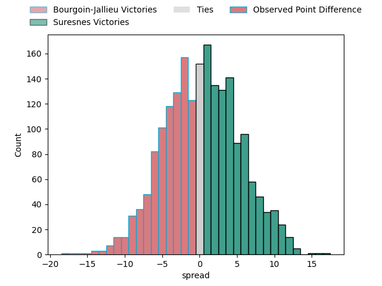
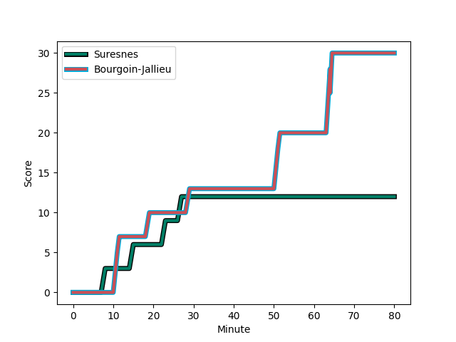
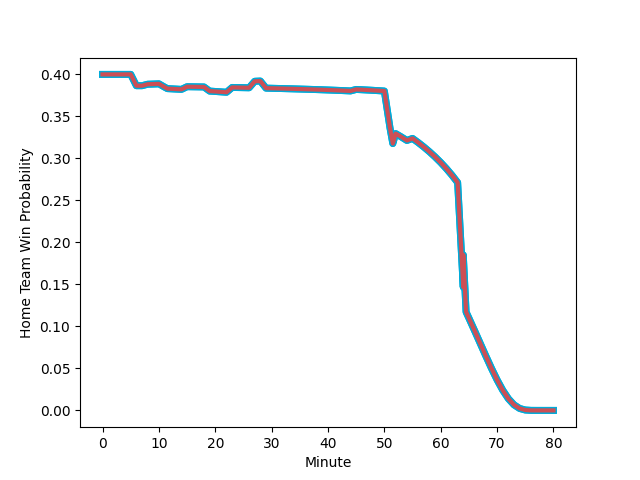

---  
layout: page  
title: Bourgoin-Jallieu at Suresnes; 30-12  
date: 2023-02-11 18:00:00 18:00:00 -0500  
categories: match review  
---
# Bourgoin-Jallieu at Suresnes; 30-12

# Club Level Predictions

The first set of predictions treats a club as the smallest object, as the club develops its members, organizes a gameplan, and deploys its players as needed for each match. This club model has a prediction of 0.507, which translates to predicting Suresnes to win by 0.2.

Each club has a rating and a rating deviation (simiar to a Glicko system), and expected performances can be generated. This allows for simulated matches and spreads like the ones below.
## Projected Performances

## Projected Spreads

## Projected Results

# Player Level Predictions

Treating teams instead as an entity made up of the currently active players, I have ratings for each player in an altogether different system. These can be combined to form team ratings once teamsheets are announced, weighting starters a bit higher than the reserves. After the match is played, players can be weighted by their minutes on the field, allowing for an accurate measure of the team's composition. With these compiled team ratings, we can make predictions, measure inaccuracy, and update the individual player ratings.
## Prediction with Player Minutes: Bourgoin-Jallieu by 15.3

Bourgoin-Jallieu by 19.3 on a neutral field
## Scores over Time

## Win Probability over Time

There were 4 large changes in win probability in this match
## Prediction without Player Minutes: Bourgoin-Jallieu by 12.2

Bourgoin-Jallieu by 16.2 on a neutral pitch

|   Away Minutes | Away Player                                                               |   Away elo |   Away Percentile |   Number |   Home Percentile |   Home elo | Home Player                                                                  |   Home Minutes |
|---------------:|:--------------------------------------------------------------------------|-----------:|------------------:|---------:|------------------:|-----------:|:-----------------------------------------------------------------------------|---------------:|
|             45 | [Rémy Gaborit](..//playerfiles//RémyGaborit_cleaned.md)                   |     111.81 |                87 |        1 |                12 |      80.62 | [Lucas Dycke](..//playerfiles//LucasDycke_cleaned.md)                        |             62 |
|             52 | [Maxime Castant](..//playerfiles//MaximeCastant_cleaned.md)               |      89.15 |                23 |        2 |                17 |      84.64 | [Thomas Bordes](..//playerfiles//ThomasBordes_cleaned.md)                    |             68 |
|             80 | [Michael Simutoga](..//playerfiles//MichaelSimutoga_cleaned.md)           |     106.82 |                80 |        3 |                20 |      85.81 | [Leandro Mario Assi](..//playerfiles//LeandroMarioAssi_cleaned.md)           |             55 |
|             45 | [Robin Gascou](..//playerfiles//RobinGascou_cleaned.md)                   |      83.09 |                17 |        4 |                38 |      91.44 | [Florian Desbordes](..//playerfiles//FlorianDesbordes_cleaned.md)            |             70 |
|             80 | [Kemueli Lavetanakoroi](..//playerfiles//KemueliLavetanakoroi_cleaned.md) |     120.9  |                91 |        5 |                59 |      97.87 | [Wian Vosloo](..//playerfiles//WianVosloo_cleaned.md)                        |             80 |
|             80 | [Kevin Rivoire](..//playerfiles//KevinRivoire_cleaned.md)                 |      91.35 |                37 |        6 |                32 |      86.16 | [Hayam El Bibouji](..//playerfiles//HayamElBibouji_cleaned.md)               |             67 |
|             80 | [Bynjamin Rabatel](..//playerfiles//BynjaminRabatel_cleaned.md)           |     102.82 |                63 |        7 |                69 |     103.05 | [Bastien Berenguel](..//playerfiles//BastienBerenguel_cleaned.md)            |             80 |
|             52 | [Poutasi Luafutu](..//playerfiles//PoutasiLuafutu_cleaned.md)             |     120.29 |                91 |        8 |                36 |      90.62 | [Louis-Mathieu Jazeix](..//playerfiles//Louis-MathieuJazeix_cleaned.md)      |             80 |
|             72 | [Remi Bouet](..//playerfiles//RemiBouet_cleaned.md)                       |     101.41 |                56 |        9 |                22 |      85.44 | [Théo Bachiri](..//playerfiles//ThéoBachiri_cleaned.md)                      |             80 |
|             80 | [Nicolas Vuillemin](..//playerfiles//NicolasVuillemin_cleaned.md)         |      86.48 |                21 |       10 |                89 |     119.79 | [Ignacio Mieres](..//playerfiles//IgnacioMieres_cleaned.md)                  |             68 |
|             80 | [Quentin Lefort](..//playerfiles//QuentinLefort_cleaned.md)               |     100.8  |                64 |       11 |                 0 |      20.72 | [Ervin Muric](..//playerfiles//ErvinMuric_cleaned.md)                        |             68 |
|             71 | [Christopher Bosch](..//playerfiles//ChristopherBosch_cleaned.md)         |     100.8  |                62 |       12 |                18 |      82.85 | [Hugo Detre](..//playerfiles//HugoDetre_cleaned.md)                          |             80 |
|             69 | [Pablo Patilla](..//playerfiles//PabloPatilla_cleaned.md)                 |      83.01 |                18 |       13 |                 9 |      75.99 | [Thomas Baudy](..//playerfiles//ThomasBaudy_cleaned.md)                      |             80 |
|             80 | [Naibuka Rokua](..//playerfiles//NaibukaRokua_cleaned.md)                 |      88.46 |                28 |       14 |                 8 |      74.76 | [Alexis Clement](..//playerfiles//AlexisClement_cleaned.md)                  |             80 |
|             80 | [Nicolas Cachet](..//playerfiles//NicolasCachet_cleaned.md)               |      80.87 |                17 |       15 |                19 |      81.8  | [Goulwen Gueho](..//playerfiles//GoulwenGueho_cleaned.md)                    |              6 |
|             35 | [Romain Favaretto](..//playerfiles//RomainFavaretto_cleaned.md)           |      87.33 |                20 |       16 |                 2 |      59.74 | [Jean-Baptiste Fuster](..//playerfiles//Jean-BaptisteFuster_cleaned.md)      |             74 |
|             35 | [Léandre Cotte](..//playerfiles//LéandreCotte_cleaned.md)                 |      97.77 |                56 |       17 |                87 |     108.01 | [Victor Damian Arias](..//playerfiles//VictorDamianArias_cleaned.md)         |             25 |
|             28 | [Killian Tripier](..//playerfiles//KillianTripier_cleaned.md)             |      93.3  |                44 |       18 |                89 |     109.72 | [Beqa Kakabadze](..//playerfiles//BeqaKakabadze_cleaned.md)                  |             18 |
|             28 | [Théo Lepage](..//playerfiles//ThéoLepage_cleaned.md)                     |      97.04 |                45 |       19 |                95 |     127.08 | [Antonie Claassen](..//playerfiles//AntonieClaassen_cleaned.md)              |             13 |
|             11 | [Pieter Morton](..//playerfiles//PieterMorton_cleaned.md)                 |      96.68 |                47 |       20 |                 5 |      73.37 | [Gaëtan Robert](..//playerfiles//GaëtanRobert_cleaned.md)                    |             12 |
|              9 | [Isaiah Leota](..//playerfiles//IsaiahLeota_cleaned.md)                   |     103.07 |                67 |       21 |                57 |      97.31 | [Anthony Bajart](..//playerfiles//AnthonyBajart_cleaned.md)                  |             12 |
|              8 | [Adrien Pontarollo](..//playerfiles//AdrienPontarollo_cleaned.md)         |      91.96 |                38 |       22 |                34 |      90.28 | [Christopher van Leeuwen](..//playerfiles//ChristophervanLeeuwen_cleaned.md) |             10 |
|            nan | nan                                                                       |     nan    |               nan |       23 |                18 |      81.38 | [Enzo Barbarit](..//playerfiles//EnzoBarbarit_cleaned.md)                    |             12 |

