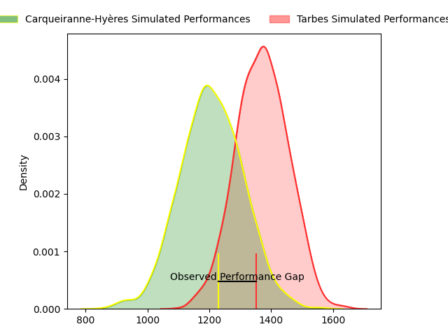
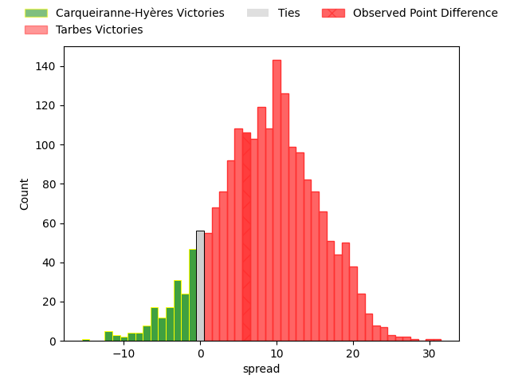
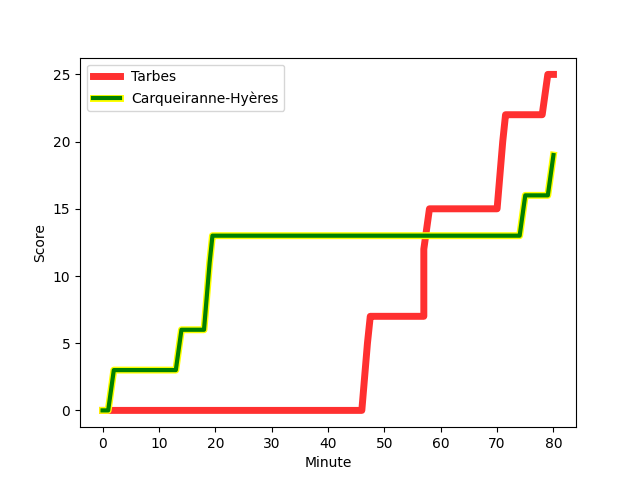
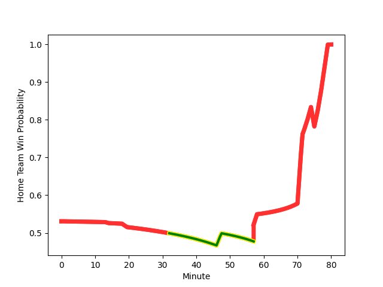

---  
layout: page  
title: Carqueiranne-Hyères at Tarbes; 19-25  
date: 2023-02-11 19:30:00 18:00:00 -0500  
categories: match review  
---
# Carqueiranne-Hyères at Tarbes; 19-25

# Club Level Predictions

The first set of predictions treats a club as the smallest object, as the club develops its members, organizes a gameplan, and deploys its players as needed for each match. This club model has a prediction of 0.717, which translates to predicting Tarbes to win by 8.5.

Each club has a rating and a rating deviation (simiar to a Glicko system), and expected performances can be generated. This allows for simulated matches and spreads like the ones below.
## Projected Performances

## Projected Spreads

## Projected Results

# Player Level Predictions

Treating teams instead as an entity made up of the currently active players, I have ratings for each player in an altogether different system. These can be combined to form team ratings once teamsheets are announced, weighting starters a bit higher than the reserves. After the match is played, players can be weighted by their minutes on the field, allowing for an accurate measure of the team's composition. With these compiled team ratings, we can make predictions, measure inaccuracy, and update the individual player ratings.
## Prediction with Player Minutes: Tarbes by 9.3

Tarbes by 5.3 on a neutral field
## Scores over Time

## Win Probability over Time

There were 11 large changes in win probability in this match
## Prediction without Player Minutes: Tarbes by 8.0

Tarbes by 4.0 on a neutral pitch

|   Away Minutes | Away Player                                                            |   Away elo |   Away Percentile |   Number |   Home Percentile |   Home elo | Home Player                                                                      |   Home Minutes |
|---------------:|:-----------------------------------------------------------------------|-----------:|------------------:|---------:|------------------:|-----------:|:---------------------------------------------------------------------------------|---------------:|
|             59 | [Eli Serra-Miglietti](..//playerfiles//EliSerra-Miglietti_cleaned.md)  |      85.34 |                24 |        1 |                51 |      98.77 | [Antoine Palisse](..//playerfiles//AntoinePalisse_cleaned.md)                    |             58 |
|             80 | [Yan Tabarot](..//playerfiles//YanTabarot_cleaned.md)                  |      79.24 |                10 |        2 |                85 |     110.65 | [Enzo Mondon](..//playerfiles//EnzoMondon_cleaned.md)                            |             80 |
|             68 | [Lasha Mchelidze](..//playerfiles//LashaMchelidze_cleaned.md)          |      92.04 |                37 |        3 |                53 |      99.18 | [Aleksi Tchitchiashvili](..//playerfiles//AleksiTchitchiashvili_cleaned.md)      |             58 |
|             79 | [Lucas Cazac](..//playerfiles//LucasCazac_cleaned.md)                  |      55.2  |                 1 |        4 |                55 |      97.29 | [Antoine Bousquet](..//playerfiles//AntoineBousquet_cleaned.md)                  |             80 |
|             80 | [Nathan Gendre](..//playerfiles//NathanGendre_cleaned.md)              |      99.12 |                62 |        5 |                92 |     122.5  | [Aurelien Ricart](..//playerfiles//AurelienRicart_cleaned.md)                    |             58 |
|             80 | [Florian Munoz Rivero](..//playerfiles//FlorianMunozRivero_cleaned.md) |      93.2  |                43 |        6 |                77 |     108.18 | [Mattéo Coustalat](..//playerfiles//MattéoCoustalat_cleaned.md)                  |             80 |
|             80 | [Joachim Beaumont](..//playerfiles//JoachimBeaumont_cleaned.md)        |     101.19 |                65 |        7 |                43 |      93.34 | [Loan Real](..//playerfiles//LoanReal_cleaned.md)                                |             74 |
|             51 | [Julien Ormea](..//playerfiles//JulienOrmea_cleaned.md)                |     103.09 |                67 |        8 |                 3 |      66.15 | [Len Massyn](..//playerfiles//LenMassyn_cleaned.md)                              |             80 |
|             68 | [Thomas Sonetti](..//playerfiles//ThomasSonetti_cleaned.md)            |     109.72 |                81 |        9 |                 9 |      76.31 | [Alexis Levron](..//playerfiles//AlexisLevron_cleaned.md)                        |             80 |
|             56 | [Lachie Munro](..//playerfiles//LachieMunro_cleaned.md)                |     108.79 |                78 |       10 |                64 |     103.27 | [Pierre Descoubet](..//playerfiles//PierreDescoubet_cleaned.md)                  |             80 |
|             73 | [Josselyn Bouchon](..//playerfiles//JosselynBouchon_cleaned.md)        |      96.1  |                48 |       11 |                91 |     121.81 | [Jonathan Duffau](..//playerfiles//JonathanDuffau_cleaned.md)                    |             80 |
|             80 | [Romain Leveque](..//playerfiles//RomainLeveque_cleaned.md)            |     117.63 |                88 |       12 |                76 |     108.74 | [Josaia Vakacegu](..//playerfiles//JosaiaVakacegu_cleaned.md)                    |             56 |
|             80 | [Charles Brousse](..//playerfiles//CharlesBrousse_cleaned.md)          |     111.79 |                80 |       13 |                97 |     134.57 | [Alofa Alofa](..//playerfiles//AlofaAlofa_cleaned.md)                            |             80 |
|             80 | [Quentin Bourdieu](..//playerfiles//QuentinBourdieu_cleaned.md)        |      93.34 |                43 |       14 |                 5 |      69.2  | [Maxime Oltmann](..//playerfiles//MaximeOltmann_cleaned.md)                      |             80 |
|             80 | [Adrien Amans](..//playerfiles//AdrienAmans_cleaned.md)                |      78.94 |                14 |       15 |                50 |      96.96 | [Thibaut Trotta](..//playerfiles//ThibautTrotta_cleaned.md)                      |             71 |
|             21 | [Sti Sithole](..//playerfiles//StiSithole_cleaned.md)                  |     116.42 |                92 |       16 |                26 |      87.97 | [Alexandre Combier](..//playerfiles//AlexandreCombier_cleaned.md)                |             22 |
|             12 | [Miguel Mathieu](..//playerfiles//MiguelMathieu_cleaned.md)            |      89.25 |                30 |       17 |                26 |      88.22 | [Mariano Ezequiel Filomeno](..//playerfiles//MarianoEzequielFilomeno_cleaned.md) |             22 |
|              1 | [Alexander Nowicki](..//playerfiles//AlexanderNowicki_cleaned.md)      |      84.21 |                19 |       18 |                 5 |      66    | [Paul Sajous](..//playerfiles//PaulSajous_cleaned.md)                            |             22 |
|             29 | [Andre Gorin](..//playerfiles//AndreGorin_cleaned.md)                  |     112.62 |                81 |       19 |                29 |      89.55 | [Gigi Leshkasheli](..//playerfiles//GigiLeshkasheli_cleaned.md)                  |              6 |
|             12 | [Rémi Dubié](..//playerfiles//RémiDubié_cleaned.md)                    |      80.65 |                17 |       20 |                15 |      81.51 | [Johan Paulet](..//playerfiles//JohanPaulet_cleaned.md)                          |             24 |
|             24 | [Théo Defrance](..//playerfiles//ThéoDefrance_cleaned.md)              |      84.23 |                14 |       21 |                25 |      88.32 | [Romain Dumestre](..//playerfiles//RomainDumestre_cleaned.md)                    |              9 |
|              7 | [David Raikuna](..//playerfiles//DavidRaikuna_cleaned.md)              |      72.69 |                 7 |       22 |               nan |     nan    | nan                                                                              |            nan |

