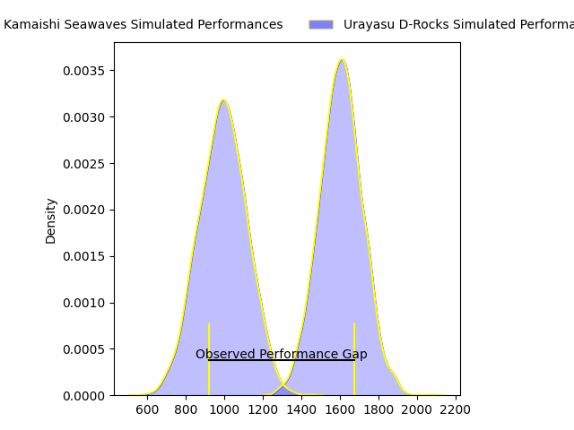
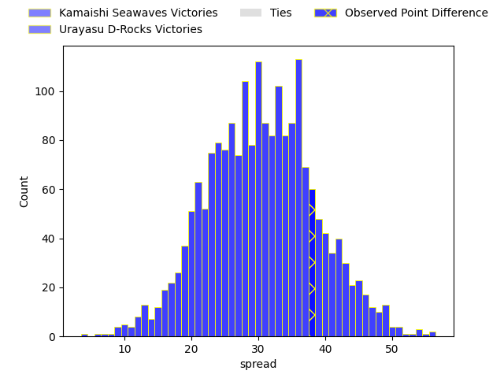
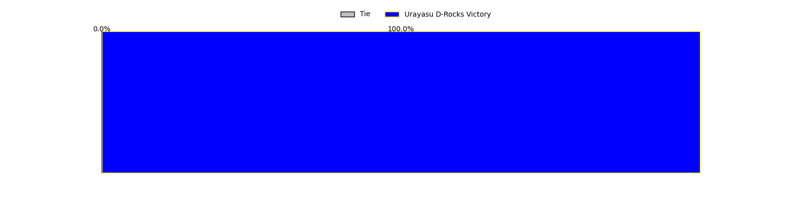
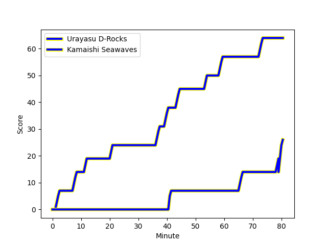
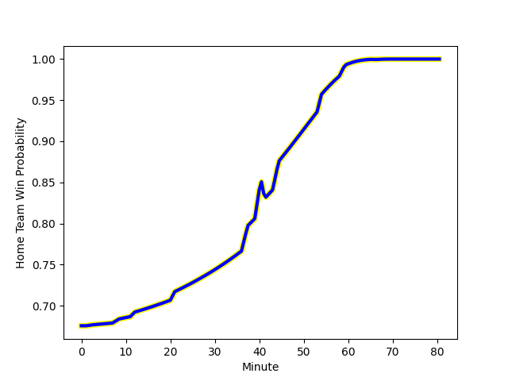

---  
layout: page  
title: Kamaishi Seawaves at Urayasu D-Rocks; 26-64  
date: 2023-02-11 00:00:00 18:00:00 -0500  
categories: match review  
---
# Kamaishi Seawaves at Urayasu D-Rocks; 26-64

# Club Level Predictions

The first set of predictions treats a club as the smallest object, as the club develops its members, organizes a gameplan, and deploys its players as needed for each match. This club model has a prediction of 0.964, which translates to predicting Urayasu D-Rocks to win by 30.5.

Each club has a rating and a rating deviation (simiar to a Glicko system), and expected performances can be generated. This allows for simulated matches and spreads like the ones below.
## Projected Performances

## Projected Spreads

## Projected Results

# Player Level Predictions

Treating teams instead as an entity made up of the currently active players, I have ratings for each player in an altogether different system. These can be combined to form team ratings once teamsheets are announced, weighting starters a bit higher than the reserves. After the match is played, players can be weighted by their minutes on the field, allowing for an accurate measure of the team's composition. With these compiled team ratings, we can make predictions, measure inaccuracy, and update the individual player ratings.
## Prediction with Player Minutes: Urayasu D-Rocks by 35.9

Urayasu D-Rocks by 31.9 on a neutral field
## Scores over Time

## Win Probability over Time

There were 2 large changes in win probability in this match
## Prediction without Player Minutes: Urayasu D-Rocks by 34.2

Urayasu D-Rocks by 30.2 on a neutral pitch

|   Away Minutes | Away Player                                                        |   Away elo |   Away Percentile |   Number |   Home Percentile |   Home elo | Home Player                                                            |   Home Minutes |
|---------------:|:-------------------------------------------------------------------|-----------:|------------------:|---------:|------------------:|-----------:|:-----------------------------------------------------------------------|---------------:|
|             40 | [Shoichiro Inada](..//playerfiles//ShoichiroInada_cleaned.md)      |      95.47 |                58 |        1 |                14 |      81.49 | [Kabuto Anoku](..//playerfiles//KabutoAnoku_cleaned.md)                |             60 |
|             55 | [Kota Kumamoto](..//playerfiles//KotaKumamoto_cleaned.md)          |      99.81 |                78 |        2 |                74 |     103.99 | [Shokei Kin](..//playerfiles//ShokeiKin_cleaned.md)                    |             53 |
|             70 | [Shun Terawaki](..//playerfiles//ShunTerawaki_cleaned.md)          |      88.59 |                28 |        3 |                43 |      93.47 | [Syuhei Takeuchi](..//playerfiles//SyuheiTakeuchi_cleaned.md)          |             40 |
|             40 | [Sergio Moreira](..//playerfiles//SergioMoreira_cleaned.md)        |      92.51 |                42 |        4 |                78 |     108.81 | [Yuta Kojima](..//playerfiles//YutaKojima_cleaned.md)                  |             80 |
|             80 | [Ben Nee Nee](..//playerfiles//BenNeeNee_cleaned.md)               |      73.08 |                 9 |        5 |                19 |      82.6  | [Ryeongji Kim](..//playerfiles//RyeongjiKim_cleaned.md)                |             80 |
|             80 | [Ryunosuke Yamada](..//playerfiles//RyunosukeYamada_cleaned.md)    |      69.93 |                 9 |        6 |                96 |     128.39 | [Tyler Paul](..//playerfiles//TylerPaul_cleaned.md)                    |             53 |
|             61 | [Daisuke Musya](..//playerfiles//DaisukeMusya_cleaned.md)          |      94.45 |                47 |        7 |                64 |     100.92 | [Liam Gill](..//playerfiles//LiamGill_cleaned.md)                      |             73 |
|             80 | [Sam Henwood](..//playerfiles//SamHenwood_cleaned.md)              |     105.52 |                70 |        8 |                33 |      90.66 | [Jimmy Tupou](..//playerfiles//JimmyTupou_cleaned.md)                  |             80 |
|             55 | [Atsushi Minami](..//playerfiles//AtsushiMinami_cleaned.md)        |      86.8  |               nan |        9 |                74 |     106.8  | [Ren Iinuma](..//playerfiles//RenIinuma_cleaned.md)                    |             58 |
|             80 | [Ryoma Nakamura](..//playerfiles//RyomaNakamura_cleaned.md)        |      53.39 |                 2 |       10 |                92 |     124.18 | [Otere Black](..//playerfiles//OtereBlack_cleaned.md)                  |             58 |
|             80 | [Kodai Ono](..//playerfiles//KodaiOno_cleaned.md)                  |      73.53 |                 9 |       11 |                78 |     108.51 | [Kai Ishii](..//playerfiles//KaiIshii_cleaned.md)                      |             80 |
|             80 | [Kohei Ishigaki](..//playerfiles//KoheiIshigaki_cleaned.md)        |     115.59 |                87 |       12 |                97 |     133.91 | [Tone Tukufuka](..//playerfiles//ToneTukufuka_cleaned.md)              |             80 |
|             80 | [Osuka Lloyd Murata](..//playerfiles//OsukaLloydMurata_cleaned.md) |      81.14 |                17 |       13 |                33 |      91.92 | [Samisoni Ahokovi Tua](..//playerfiles//SamisoniAhokoviTua_cleaned.md) |             80 |
|             40 | [Taisei Fukkoshi](..//playerfiles//TaiseiFukkoshi_cleaned.md)      |      77.4  |                13 |       14 |                87 |     116.06 | [Larry Steven Sulunga](..//playerfiles//LarryStevenSulunga_cleaned.md) |             80 |
|             80 | [Cam Bailey](..//playerfiles//CamBailey_cleaned.md)                |      67.2  |                 6 |       15 |                90 |     124.56 | [Takuhei Yasuda](..//playerfiles//TakuheiYasuda_cleaned.md)            |             74 |
|             40 | [Takuya Takahashi](..//playerfiles//TakuyaTakahashi_cleaned.md)    |      76.4  |                 9 |       16 |                36 |      91.43 | [Kim Ryom](..//playerfiles//KimRyom_cleaned.md)                        |             40 |
|             40 | [Ryota Kano](..//playerfiles//RyotaKano_cleaned.md)                |      77.14 |                10 |       17 |                14 |      82.4  | [Franco Marais](..//playerfiles//FrancoMarais_cleaned.md)              |             27 |
|             21 | [Joshua Stander](..//playerfiles//JoshuaStander_cleaned.md)        |     104.3  |                68 |       18 |                86 |     114.33 | [Shingo Nakashima](..//playerfiles//ShingoNakashima_cleaned.md)        |             27 |
|             25 | [Daiki Ito](..//playerfiles//DaikiIto_cleaned.md)                  |      79.85 |                13 |       19 |                65 |     101.62 | [Tian Meyer](..//playerfiles//TianMeyer_cleaned.md)                    |             22 |
|             25 | [Youhei Murakami](..//playerfiles//YouheiMurakami_cleaned.md)      |      76.95 |                12 |       20 |                84 |     110    | [Ryutaro Ueda](..//playerfiles//RyutaroUeda_cleaned.md)                |             20 |
|             19 | [Seta Koroitamana](..//playerfiles//SetaKoroitamana_cleaned.md)    |      88.77 |               nan |       21 |               nan |      95    | [Taisei Konishi](..//playerfiles//TaiseiKonishi_cleaned.md)            |             22 |
|             19 | [Ryo Kataoka](..//playerfiles//RyoKataoka_cleaned.md)              |      94.82 |                46 |       22 |               nan |      95    | [Kazuki Ban](..//playerfiles//KazukiBan_cleaned.md)                    |              7 |
|             10 | [Ryouta Tsukada](..//playerfiles//RyoutaTsukada_cleaned.md)        |     104.56 |                75 |       23 |                57 |      98.46 | [Yuki Ishii](..//playerfiles//YukiIshii_cleaned.md)                    |              6 |

