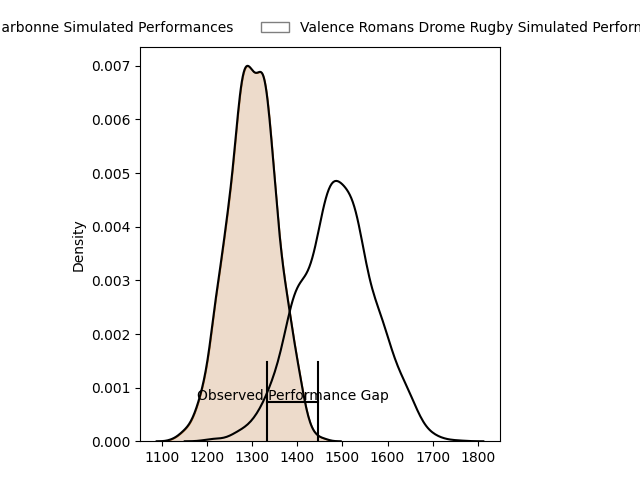
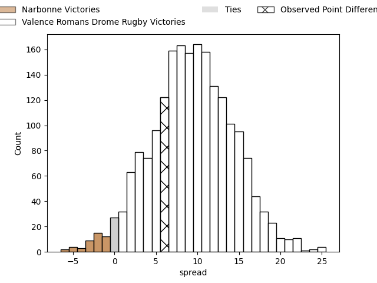
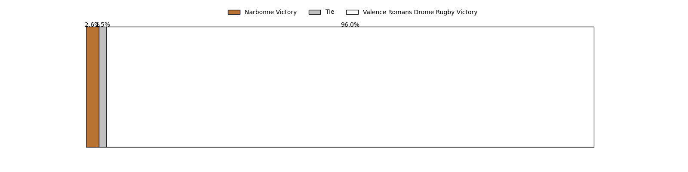
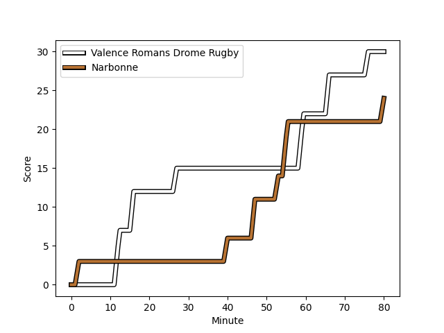
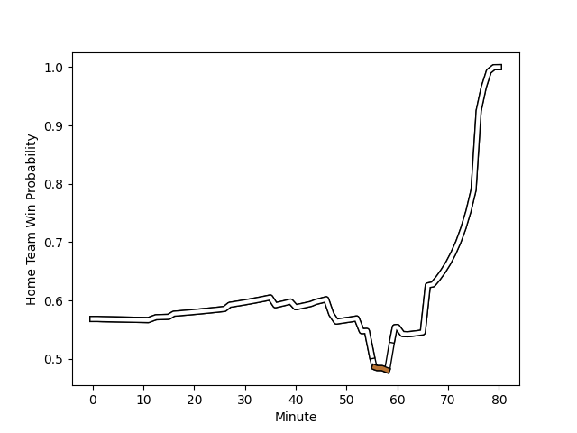

---  
layout: page  
title: Narbonne at Valence Romans Drome Rugby; 24-30  
date: 2023-02-11 19:30:00 18:00:00 -0500  
categories: match review  
---
# Narbonne at Valence Romans Drome Rugby; 24-30

# Club Level Predictions

The first set of predictions treats a club as the smallest object, as the club develops its members, organizes a gameplan, and deploys its players as needed for each match. This club model has a prediction of 0.742, which translates to predicting Valence Romans Drome Rugby to win by 9.3.

Each club has a rating and a rating deviation (simiar to a Glicko system), and expected performances can be generated. This allows for simulated matches and spreads like the ones below.
## Projected Performances

## Projected Spreads

## Projected Results

# Player Level Predictions

Treating teams instead as an entity made up of the currently active players, I have ratings for each player in an altogether different system. These can be combined to form team ratings once teamsheets are announced, weighting starters a bit higher than the reserves. After the match is played, players can be weighted by their minutes on the field, allowing for an accurate measure of the team's composition. With these compiled team ratings, we can make predictions, measure inaccuracy, and update the individual player ratings.
## Prediction with Player Minutes: Valence Romans Drome Rugby by 8.2

Valence Romans Drome Rugby by 4.2 on a neutral field
## Scores over Time

## Win Probability over Time

There were 6 large changes in win probability in this match
## Prediction without Player Minutes: Valence Romans Drome Rugby by 8.9

Valence Romans Drome Rugby by 4.9 on a neutral pitch

|   Away Minutes | Away Player                                                         |   Away elo |   Away Percentile |   Number |   Home Percentile |   Home elo | Home Player                                                           |   Home Minutes |
|---------------:|:--------------------------------------------------------------------|-----------:|------------------:|---------:|------------------:|-----------:|:----------------------------------------------------------------------|---------------:|
|             66 | [Geoffrey Moise](..//playerfiles//GeoffreyMoise_cleaned.md)         |      91.18 |                35 |        1 |                96 |     125.98 | [Sami Zouhair](..//playerfiles//SamiZouhair_cleaned.md)               |             48 |
|             40 | [Jordan Rochier](..//playerfiles//JordanRochier_cleaned.md)         |      83.71 |                23 |        2 |                68 |     101.61 | [Dorian Marco Pena](..//playerfiles//DorianMarcoPena_cleaned.md)      |             48 |
|             51 | [Matthieu Loudet](..//playerfiles//MatthieuLoudet_cleaned.md)       |      93.49 |                42 |        3 |                49 |      95.65 | [John Henry Fincham](..//playerfiles//JohnHenryFincham_cleaned.md)    |             80 |
|             80 | [Morgan Maga](..//playerfiles//MorganMaga_cleaned.md)               |      84.55 |                22 |        4 |                68 |     105.3  | [Francois Uys](..//playerfiles//FrancoisUys_cleaned.md)               |             80 |
|             61 | [Mohamed Kbaier](..//playerfiles//MohamedKbaier_cleaned.md)         |     103.9  |                73 |        5 |                21 |      83.98 | [Florian Goumat](..//playerfiles//FlorianGoumat_cleaned.md)           |             80 |
|             67 | [Guillem Montagne](..//playerfiles//GuillemMontagne_cleaned.md)     |      76.43 |                 9 |        6 |                88 |     117.55 | [Alexis Armary](..//playerfiles//AlexisArmary_cleaned.md)             |             36 |
|             80 | [Valentin Sese](..//playerfiles//ValentinSese_cleaned.md)           |     109.32 |                78 |        7 |                18 |      83.48 | [Matthew Gicquel](..//playerfiles//MatthewGicquel_cleaned.md)         |             80 |
|             80 | [Thibault Clauzade](..//playerfiles//ThibaultClauzade_cleaned.md)   |     100.82 |                63 |        8 |                46 |      95.78 | [Philippe Laville](..//playerfiles//PhilippeLaville_cleaned.md)       |             44 |
|             62 | [Christopher Kaiser](..//playerfiles//ChristopherKaiser_cleaned.md) |      90.07 |                25 |        9 |                12 |      78.81 | [Tim Menzel](..//playerfiles//TimMenzel_cleaned.md)                   |             57 |
|             80 | [Tom Chauvet](..//playerfiles//TomChauvet_cleaned.md)               |      91.41 |                34 |       10 |                11 |      80.66 | [Lucas Meret](..//playerfiles//LucasMeret_cleaned.md)                 |             80 |
|             80 | [Save Totovosau](..//playerfiles//SaveTotovosau_cleaned.md)         |      82.3  |                16 |       11 |                87 |     117.2  | [Tim Giresse](..//playerfiles//TimGiresse_cleaned.md)                 |             80 |
|             80 | [Sébastien Giorgis](..//playerfiles//SébastienGiorgis_cleaned.md)   |      94.67 |                47 |       12 |                73 |     106.47 | [Ben Neiceru](..//playerfiles//BenNeiceru_cleaned.md)                 |             80 |
|             76 | [Pierre Nueno](..//playerfiles//PierreNueno_cleaned.md)             |     100.62 |                61 |       13 |                92 |     123.74 | [Jonathan Quinnez](..//playerfiles//JonathanQuinnez_cleaned.md)       |             53 |
|             80 | [Pierre-Hugo Ducom](..//playerfiles//Pierre-HugoDucom_cleaned.md)   |      96.25 |                52 |       14 |                77 |     107.66 | [Adam Vargas](..//playerfiles//AdamVargas_cleaned.md)                 |             80 |
|             40 | [Paul Auradou](..//playerfiles//PaulAuradou_cleaned.md)             |      92.39 |                38 |       15 |                 8 |      73.23 | [Guillaume Cazes](..//playerfiles//GuillaumeCazes_cleaned.md)         |             53 |
|             14 | [Théo Castinel](..//playerfiles//ThéoCastinel_cleaned.md)           |     119.93 |                94 |       16 |                24 |      87.27 | [Andrea Pontanier](..//playerfiles//AndreaPontanier_cleaned.md)       |             32 |
|             40 | [Martin Vaca](..//playerfiles//MartinVaca_cleaned.md)               |      93.87 |                42 |       17 |                55 |      99.3  | [Ioane Iashagashvili](..//playerfiles//IoaneIashagashvili_cleaned.md) |             36 |
|             29 | [Levi Tikoipau](..//playerfiles//LeviTikoipau_cleaned.md)           |      93.89 |               nan |       18 |                73 |     102.5  | [Yanis Gimenez](..//playerfiles//YanisGimenez_cleaned.md)             |             32 |
|             19 | [Mauro Rebussone](..//playerfiles//MauroRebussone_cleaned.md)       |     125.79 |                94 |       19 |                 4 |      67.64 | [Charles Brayer](..//playerfiles//CharlesBrayer_cleaned.md)           |             44 |
|             13 | [Dorian Peron](..//playerfiles//DorianPeron_cleaned.md)             |      95    |               nan |       20 |                 8 |      77.15 | [Léopold Dupas](..//playerfiles//LéopoldDupas_cleaned.md)             |             23 |
|             18 | [Pablo Barbaste](..//playerfiles//PabloBarbaste_cleaned.md)         |      92.71 |                50 |       21 |                69 |     109.94 | [Joris Moura](..//playerfiles//JorisMoura_cleaned.md)                 |             27 |
|              4 | [Théo Mias](..//playerfiles//ThéoMias_cleaned.md)                   |      95.56 |                39 |       22 |                12 |      79.96 | [Anatole Pauvert](..//playerfiles//AnatolePauvert_cleaned.md)         |             27 |
|             40 | [Étienne Ducom](..//playerfiles//ÉtienneDucom_cleaned.md)           |      95.76 |                52 |       23 |               nan |     nan    | nan                                                                   |            nan |

