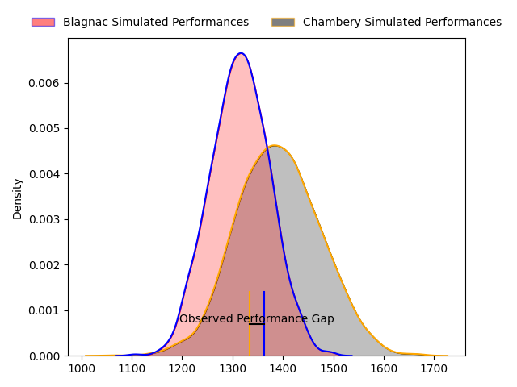
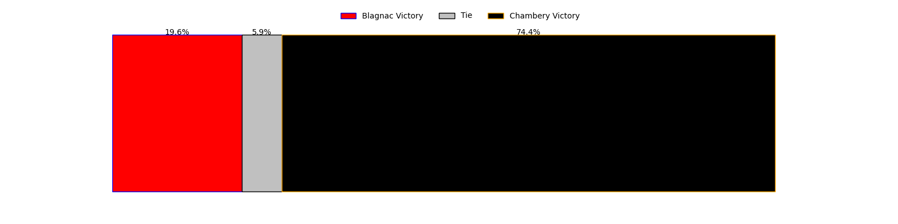
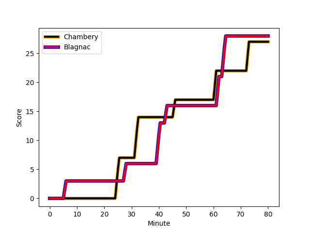
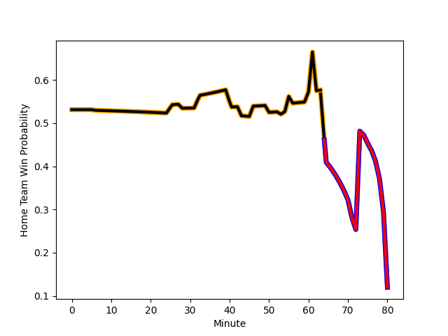

---  
layout: page  
title: Blagnac at Chambery; 28-27  
date: 2023-02-12 15:00:00 18:00:00 -0500  
categories: match review  
---
# Blagnac at Chambery; 28-27

# Club Level Predictions

The first set of predictions treats a club as the smallest object, as the club develops its members, organizes a gameplan, and deploys its players as needed for each match. This club model has a prediction of 0.604, which translates to predicting Chambery to win by 3.7.

Each club has a rating and a rating deviation (simiar to a Glicko system), and expected performances can be generated. This allows for simulated matches and spreads like the ones below.
## Projected Performances

## Projected Spreads

## Projected Results

# Player Level Predictions

Treating teams instead as an entity made up of the currently active players, I have ratings for each player in an altogether different system. These can be combined to form team ratings once teamsheets are announced, weighting starters a bit higher than the reserves. After the match is played, players can be weighted by their minutes on the field, allowing for an accurate measure of the team's composition. With these compiled team ratings, we can make predictions, measure inaccuracy, and update the individual player ratings.
## Prediction with Player Minutes: Blagnac by 1.5

Blagnac by 5.5 on a neutral field
## Scores over Time

## Win Probability over Time

There were 9 large changes in win probability in this match
## Prediction without Player Minutes: Blagnac by 2.7

Blagnac by 6.7 on a neutral pitch

|   Away Minutes | Away Player                                                         |   Away elo |   Away Percentile |   Number |   Home Percentile |   Home elo | Home Player                                                                 |   Home Minutes |
|---------------:|:--------------------------------------------------------------------|-----------:|------------------:|---------:|------------------:|-----------:|:----------------------------------------------------------------------------|---------------:|
|             56 | [Cesar Biscioni](..//playerfiles//CesarBiscioni_cleaned.md)         |     109.31 |                83 |        1 |                57 |      98.09 | [Géraud Clermont](..//playerfiles//GéraudClermont_cleaned.md)               |             50 |
|             56 | [Florian Bertrand](..//playerfiles//FlorianBertrand_cleaned.md)     |      95.8  |                48 |        2 |                65 |     100.53 | [Julien Primault](..//playerfiles//JulienPrimault_cleaned.md)               |             55 |
|             75 | [Fabien Lorenzon](..//playerfiles//FabienLorenzon_cleaned.md)       |      99.19 |                60 |        3 |                60 |      99.28 | [Giorgi Pertaia](..//playerfiles//GiorgiPertaia_cleaned.md)                 |             60 |
|             60 | [Vincent Mutel](..//playerfiles//VincentMutel_cleaned.md)           |     106.07 |                74 |        4 |                43 |      92.87 | [Fabien Witz](..//playerfiles//FabienWitz_cleaned.md)                       |             50 |
|             50 | [Lilian Rousset](..//playerfiles//LilianRousset_cleaned.md)         |     105.28 |                69 |        5 |                 9 |      75.79 | [Romain Guyot](..//playerfiles//RomainGuyot_cleaned.md)                     |             80 |
|             80 | [Nikita Bekov](..//playerfiles//NikitaBekov_cleaned.md)             |     102.04 |                66 |        6 |                45 |      95.4  | [Colin Lebian](..//playerfiles//ColinLebian_cleaned.md)                     |             53 |
|             80 | [Alexandre Perrin](..//playerfiles//AlexandrePerrin_cleaned.md)     |      95    |               nan |        7 |                41 |      92.45 | [Steevy Cerqueira](..//playerfiles//SteevyCerqueira_cleaned.md)             |             80 |
|             80 | [Nekolo Tolofua](..//playerfiles//NekoloTolofua_cleaned.md)         |     102.97 |                66 |        8 |                89 |     118.16 | [Jean-Baptiste Grenod](..//playerfiles//Jean-BaptisteGrenod_cleaned.md)     |             80 |
|             54 | [Paul Ravier](..//playerfiles//PaulRavier_cleaned.md)               |     110.56 |                83 |        9 |                91 |     117.43 | [Thibault Dufau](..//playerfiles//ThibaultDufau_cleaned.md)                 |             71 |
|             67 | [Valentin Delpy](..//playerfiles//ValentinDelpy_cleaned.md)         |     104.62 |                70 |       10 |                45 |      95.32 | [Thibault Moreno](..//playerfiles//ThibaultMoreno_cleaned.md)               |             80 |
|             73 | [Simon Villemur](..//playerfiles//SimonVillemur_cleaned.md)         |      99.46 |                57 |       11 |                74 |     105.86 | [Theo Velten](..//playerfiles//TheoVelten_cleaned.md)                       |             80 |
|             80 | [Aurelien Labau](..//playerfiles//AurelienLabau_cleaned.md)         |      98.47 |                57 |       12 |                 0 |      52.57 | [Vereniki Goneva](..//playerfiles//VerenikiGoneva_cleaned.md)               |             55 |
|             80 | [Clément Vareilles](..//playerfiles//ClémentVareilles_cleaned.md)   |     104.02 |                68 |       13 |                43 |      93.39 | [Victor Pisano](..//playerfiles//VictorPisano_cleaned.md)                   |             80 |
|             80 | [Francois Tardieu](..//playerfiles//FrancoisTardieu_cleaned.md)     |      79.32 |                12 |       14 |                71 |     105.07 | [Arthur Nennig](..//playerfiles//ArthurNennig_cleaned.md)                   |             50 |
|             80 | [Ugo Seunes](..//playerfiles//UgoSeunes_cleaned.md)                 |     105.7  |                72 |       15 |                61 |     102.01 | [Thomas Hecquet](..//playerfiles//ThomasHecquet_cleaned.md)                 |             80 |
|             24 | [Alexis Decaux](..//playerfiles//AlexisDecaux_cleaned.md)           |     105.69 |                72 |       16 |                10 |      80.73 | [Florent Lorenzon](..//playerfiles//FlorentLorenzon_cleaned.md)             |             30 |
|             24 | [Gabin Villerouge](..//playerfiles//GabinVillerouge_cleaned.md)     |     106.6  |                79 |       17 |                43 |      93.67 | [Gauthier Brute de Remur](..//playerfiles//GauthierBrutedeRemur_cleaned.md) |             25 |
|              5 | [Baptiste Collet](..//playerfiles//BaptisteCollet_cleaned.md)       |     104.18 |                70 |       18 |                76 |     106.36 | [Lautaro Caro Saisi](..//playerfiles//LautaroCaroSaisi_cleaned.md)          |             20 |
|             30 | [Lucas Miatto](..//playerfiles//LucasMiatto_cleaned.md)             |      95    |               nan |       19 |                52 |      97.14 | [Pierre-Nicolas Dance](..//playerfiles//Pierre-NicolasDance_cleaned.md)     |             30 |
|             26 | [Corentin Penc'hoat](..//playerfiles//CorentinPenc'hoat_cleaned.md) |      96.81 |                38 |       20 |                44 |      94.39 | [Revan Gautier](..//playerfiles//RevanGautier_cleaned.md)                   |             27 |
|             13 | [Gérald Augustin](..//playerfiles//GéraldAugustin_cleaned.md)       |      91.28 |                38 |       21 |                27 |      87.21 | [Dylan Nocete](..//playerfiles//DylanNocete_cleaned.md)                     |              9 |
|              7 | [Lukas Doyhenard](..//playerfiles//LukasDoyhenard_cleaned.md)       |      94.88 |                47 |       22 |                82 |     113.65 | [Mosese Mawalu](..//playerfiles//MoseseMawalu_cleaned.md)                   |             25 |
|             20 | [Lucas Tolofua](..//playerfiles//LucasTolofua_cleaned.md)           |      75.99 |                 9 |       23 |                13 |      84.1  | [Aviata Silago](..//playerfiles//AviataSilago_cleaned.md)                   |             30 |

