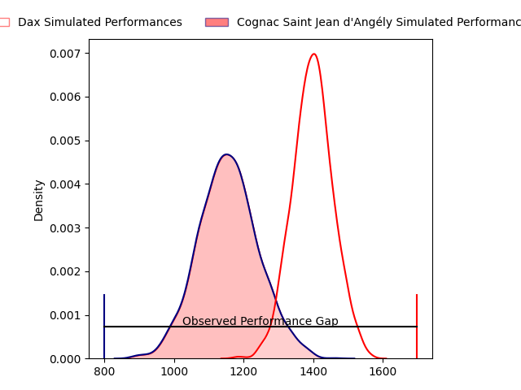
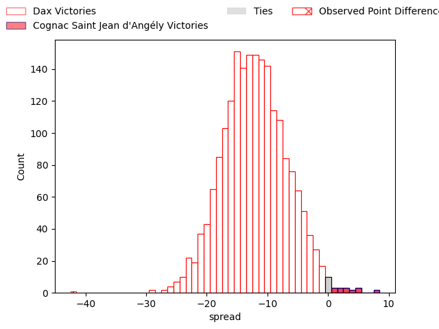
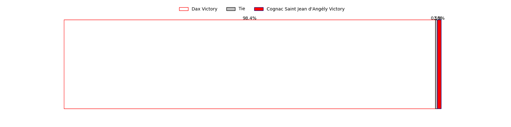
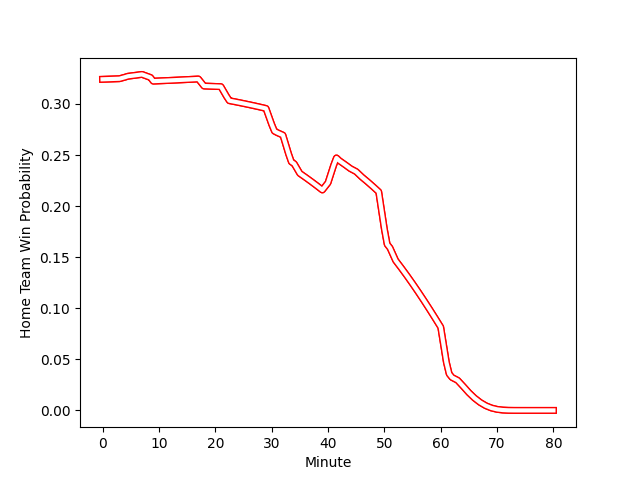

---  
layout: page  
title: Dax at Cognac Saint Jean d'Angély; 59-17  
date: 2023-02-12 15:00:00 18:00:00 -0500  
categories: match review  
---
# Dax at Cognac Saint Jean d'Angély; 59-17

# Club Level Predictions

The first set of predictions treats a club as the smallest object, as the club develops its members, organizes a gameplan, and deploys its players as needed for each match. This club model has a prediction of 0.204, which translates to predicting Dax to win by 12.0.

Each club has a rating and a rating deviation (simiar to a Glicko system), and expected performances can be generated. This allows for simulated matches and spreads like the ones below.
## Projected Performances

## Projected Spreads

## Projected Results

# Player Level Predictions

Treating teams instead as an entity made up of the currently active players, I have ratings for each player in an altogether different system. These can be combined to form team ratings once teamsheets are announced, weighting starters a bit higher than the reserves. After the match is played, players can be weighted by their minutes on the field, allowing for an accurate measure of the team's composition. With these compiled team ratings, we can make predictions, measure inaccuracy, and update the individual player ratings.
## Prediction with Player Minutes: Dax by 27.9

Dax by 31.9 on a neutral field
## Scores over Time

## Win Probability over Time

There were 2 large changes in win probability in this match
## Prediction without Player Minutes: Dax by 28.7

Dax by 32.7 on a neutral pitch

|   Away Minutes | Away Player                                                       |   Away elo |   Away Percentile |   Number |   Home Percentile |   Home elo | Home Player                                                         |   Home Minutes |
|---------------:|:------------------------------------------------------------------|-----------:|------------------:|---------:|------------------:|-----------:|:--------------------------------------------------------------------|---------------:|
|             40 | [Louis Mary](..//playerfiles//LouisMary_cleaned.md)               |      95.37 |                48 |        1 |                14 |      82.68 | [Kevin Tougne](..//playerfiles//KevinTougne_cleaned.md)             |             80 |
|             40 | [Maxime Delonca](..//playerfiles//MaximeDelonca_cleaned.md)       |     107.87 |                81 |        2 |                10 |      78.6  | [Maxime Gau](..//playerfiles//MaximeGau_cleaned.md)                 |             64 |
|             40 | [Anthony Pelmard](..//playerfiles//AnthonyPelmard_cleaned.md)     |      99.69 |                61 |        3 |                41 |      93.46 | [Giorgi Sharashidze](..//playerfiles//GiorgiSharashidze_cleaned.md) |             42 |
|              9 | [Mattieu Bidau](..//playerfiles//MattieuBidau_cleaned.md)         |      85.57 |                24 |        4 |                 1 |      52.18 | [Utu Maninoa](..//playerfiles//UtuManinoa_cleaned.md)               |             63 |
|             80 | [Yoan Gaune](..//playerfiles//YoanGaune_cleaned.md)               |     118.63 |                89 |        5 |                 1 |      57.12 | [Clément Praud](..//playerfiles//ClémentPraud_cleaned.md)           |             80 |
|             80 | [Arnaud Aletti](..//playerfiles//ArnaudAletti_cleaned.md)         |      93.13 |                42 |        6 |                 2 |      66.65 | [Matthieu Thomas](..//playerfiles//MatthieuThomas_cleaned.md)       |             80 |
|             80 | [Jean Despiau](..//playerfiles//JeanDespiau_cleaned.md)           |      81.81 |                19 |        7 |                 4 |      69.18 | [Thomas Toevalu](..//playerfiles//ThomasToevalu_cleaned.md)         |             80 |
|             45 | [Brice Ferrer](..//playerfiles//BriceFerrer_cleaned.md)           |      76.54 |                10 |        8 |                21 |      84.86 | [Filipe Manu](..//playerfiles//FilipeManu_cleaned.md)               |             46 |
|             52 | [Simon Garrouteigt](..//playerfiles//SimonGarrouteigt_cleaned.md) |      89.81 |                33 |        9 |                16 |      83.31 | [Mathieu Billou](..//playerfiles//MathieuBillou_cleaned.md)         |             35 |
|             80 | [Hugo Cerisier](..//playerfiles//HugoCerisier_cleaned.md)         |      97    |                54 |       10 |                 3 |      67.59 | [Serafin Bordoli](..//playerfiles//SerafinBordoli_cleaned.md)       |             80 |
|             80 | [Théo Gatelier](..//playerfiles//ThéoGatelier_cleaned.md)         |      90.34 |                34 |       11 |                 1 |      55.49 | [Jone Tuva](..//playerfiles//JoneTuva_cleaned.md)                   |             31 |
|             80 | [Ilikena Bolakoro](..//playerfiles//IlikenaBolakoro_cleaned.md)   |      98.05 |                56 |       12 |                44 |      93.89 | [Henry Tuilagi](..//playerfiles//HenryTuilagi_cleaned.md)           |             52 |
|             45 | [Sylvère Reteau](..//playerfiles//SylvèreReteau_cleaned.md)       |     103.83 |                68 |       13 |                52 |      91.48 | [Isimeli Kuruibua](..//playerfiles//IsimeliKuruibua_cleaned.md)     |             80 |
|             80 | [Guillaume Bouche](..//playerfiles//GuillaumeBouche_cleaned.md)   |     106.57 |                75 |       14 |                 7 |      72.75 | [Vincent Pageneau](..//playerfiles//VincentPageneau_cleaned.md)     |             80 |
|             45 | [Théo Duprat](..//playerfiles//ThéoDuprat_cleaned.md)             |     112.32 |                78 |       15 |                22 |      83.33 | [Dany Antunes](..//playerfiles//DanyAntunes_cleaned.md)             |             80 |
|             40 | [Asa Faitotoa](..//playerfiles//AsaFaitotoa_cleaned.md)           |     108.82 |                85 |       16 |               nan |      88.8  | [Bryan Bruno](..//playerfiles//BryanBruno_cleaned.md)               |             16 |
|             40 | [Louis Barrere](..//playerfiles//LouisBarrere_cleaned.md)         |      90.38 |                38 |       17 |                40 |      91.73 | [Martin Augeix](..//playerfiles//MartinAugeix_cleaned.md)           |             38 |
|             40 | [Thibaud Dréan](..//playerfiles//ThibaudDréan_cleaned.md)         |      75.99 |                 8 |       18 |               nan |      94.21 | [Khaled Hammouten](..//playerfiles//KhaledHammouten_cleaned.md)     |             17 |
|             71 | [Étienne Loiret](..//playerfiles//ÉtienneLoiret_cleaned.md)       |      92.87 |                43 |       19 |                19 |      82.93 | [Daniel Faleafa](..//playerfiles//DanielFaleafa_cleaned.md)         |             34 |
|             35 | [Théo Tremeau](..//playerfiles//ThéoTremeau_cleaned.md)           |      98.79 |                72 |       20 |                 5 |      70.15 | [Mathis Garnier](..//playerfiles//MathisGarnier_cleaned.md)         |             45 |
|             28 | [Jules Bousquet](..//playerfiles//JulesBousquet_cleaned.md)       |      93.84 |               nan |       21 |                 2 |      54.9  | [Nils Guyon](..//playerfiles//NilsGuyon_cleaned.md)                 |             49 |
|             35 | [Jules Lartigau](..//playerfiles//JulesLartigau_cleaned.md)       |      95    |               nan |       22 |                16 |      82.33 | [Paul Boitard](..//playerfiles//PaulBoitard_cleaned.md)             |             28 |
|             35 | [Julien Dechavanne](..//playerfiles//JulienDechavanne_cleaned.md) |      95.89 |                51 |       23 |               nan |     nan    | nan                                                                 |            nan |

