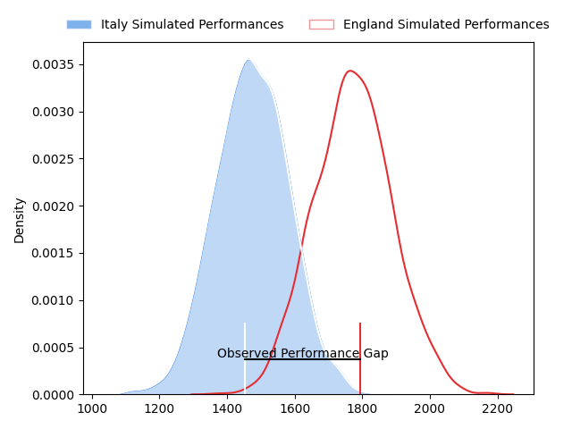
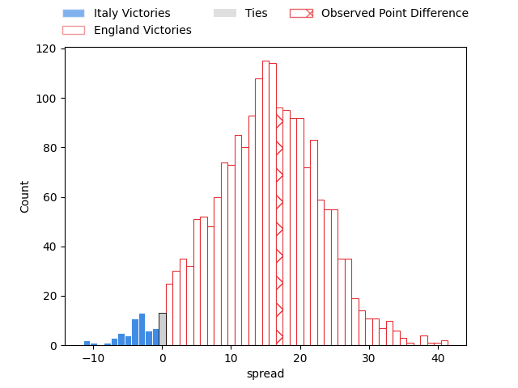
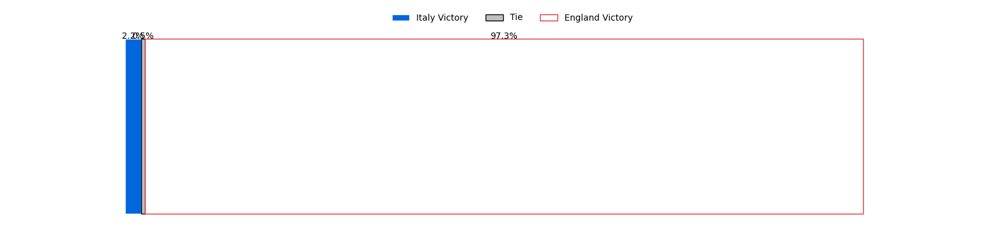
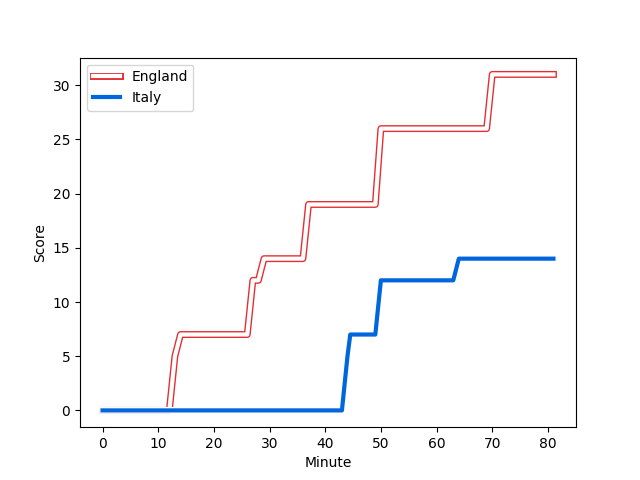
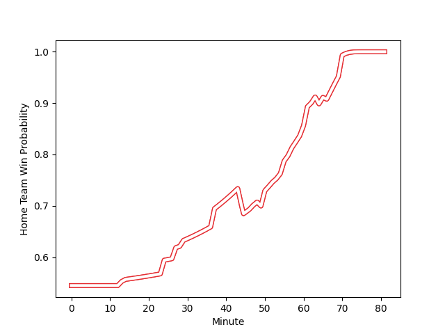

---  
layout: page  
title: Italy at England; 14.0-31.0  
date: 2023-02-12 10:00:00 18:00:00 -0500  
categories: match review  
---
# Italy at England; 14.0-31.0

# Club Level Predictions

The first set of predictions treats a club as the smallest object, as the club develops its members, organizes a gameplan, and deploys its players as needed for each match. This club model has a prediction of 0.836, which translates to predicting England to win by 14.9.

Each club has a rating and a rating deviation (simiar to a Glicko system), and expected performances can be generated. This allows for simulated matches and spreads like the ones below.
## Projected Performances

## Projected Spreads

## Projected Results

# Player Level Predictions

Treating teams instead as an entity made up of the currently active players, I have ratings for each player in an altogether different system. These can be combined to form team ratings once teamsheets are announced, weighting starters a bit higher than the reserves. After the match is played, players can be weighted by their minutes on the field, allowing for an accurate measure of the team's composition. With these compiled team ratings, we can make predictions, measure inaccuracy, and update the individual player ratings.
## Prediction with Player Minutes: England by 12.9

England by 8.9 on a neutral field
## Scores over Time

## Win Probability over Time

There were 5 large changes in win probability in this match
## Prediction without Player Minutes: England by 12.0

England by 8.0 on a neutral pitch

|   Away Minutes | Away Player                                                         |   Away elo |   Away Percentile |   Number |   Home Percentile |   Home elo | Home Player                                                               |   Home Minutes |
|---------------:|:--------------------------------------------------------------------|-----------:|------------------:|---------:|------------------:|-----------:|:--------------------------------------------------------------------------|---------------:|
|             56 | [Danilo Fischetti](..//playerfiles//DaniloFischetti_cleaned.md)     |      97.96 |                58 |        1 |                49 |      94.73 | [Ellis Genge](..//playerfiles//EllisGenge_cleaned.md)                     |             55 |
|             61 | [Giacomo Nicotera](..//playerfiles//GiacomoNicotera_cleaned.md)     |     129.03 |                97 |        2 |               100 |     161.65 | [Jamie George](..//playerfiles//JamieGeorge_cleaned.md)                   |             74 |
|             53 | [Marco Riccioni](..//playerfiles//MarcoRiccioni_cleaned.md)         |     105.78 |                79 |        3 |                85 |     111.02 | [Kyle Sinckler](..//playerfiles//KyleSinckler_cleaned.md)                 |             50 |
|             73 | [Niccolo Cannone](..//playerfiles//NiccoloCannone_cleaned.md)       |      61.93 |                 3 |        4 |                80 |     109.7  | [Maro Itoje](..//playerfiles//MaroItoje_cleaned.md)                       |             81 |
|             81 | [Federico Ruzza](..//playerfiles//FedericoRuzza_cleaned.md)         |     113.19 |                84 |        5 |                91 |     119.48 | [Ollie Chessum](..//playerfiles//OllieChessum_cleaned.md)                 |             81 |
|             76 | [Sebastian Negri](..//playerfiles//SebastianNegri_cleaned.md)       |      95.43 |                49 |        6 |                43 |      93.2  | [Lewis Ludlam](..//playerfiles//LewisLudlam_cleaned.md)                   |             81 |
|             24 | [Michele Lamaro](..//playerfiles//MicheleLamaro_cleaned.md)         |     119.58 |                90 |        7 |                94 |     125.6  | [Jack Willis](..//playerfiles//JackWillis_cleaned.md)                     |             53 |
|             58 | [Lorenzo Cannone](..//playerfiles//LorenzoCannone_cleaned.md)       |     102.53 |                63 |        8 |                99 |     139.14 | [Alex Dombrandt](..//playerfiles//AlexDombrandt_cleaned.md)               |             66 |
|             63 | [Stephen Varney](..//playerfiles//StephenVarney_cleaned.md)         |      75.52 |                10 |        9 |                35 |      90.18 | [Jack van Poortvliet](..//playerfiles//JackvanPoortvliet_cleaned.md)      |             60 |
|             81 | [Tommaso Allan](..//playerfiles//TommasoAllan_cleaned.md)           |      94.92 |                46 |       10 |                92 |     123.89 | [Owen Farrell](..//playerfiles//OwenFarrell_cleaned.md)                   |             81 |
|             81 | [Tommaso Menoncello](..//playerfiles//TommasoMenoncello_cleaned.md) |     128.87 |                95 |       11 |                38 |      91.16 | [Ollie Hassell-Collins](..//playerfiles//OllieHassell-Collins_cleaned.md) |             55 |
|             47 | [Luca Morisi](..//playerfiles//LucaMorisi_cleaned.md)               |     110.89 |                80 |       12 |                38 |      90.61 | [Ollie Lawrence](..//playerfiles//OllieLawrence_cleaned.md)               |             81 |
|             81 | [Juan Ignacio Brex](..//playerfiles//JuanIgnacioBrex_cleaned.md)    |     110.87 |                80 |       13 |                66 |     103.51 | [Henry Slade](..//playerfiles//HenrySlade_cleaned.md)                     |             73 |
|             81 | [Edoardo Padovani](..//playerfiles//EdoardoPadovani_cleaned.md)     |     115.41 |                85 |       14 |                38 |      91.21 | [Max Malins](..//playerfiles//MaxMalins_cleaned.md)                       |             81 |
|             81 | [Ange Capuozzo](..//playerfiles//AngeCapuozzo_cleaned.md)           |     110.65 |                76 |       15 |                50 |      96.7  | [Freddie Steward](..//playerfiles//FreddieSteward_cleaned.md)             |             81 |
|             20 | [Luca Bigi](..//playerfiles//LucaBigi_cleaned.md)                   |      78.63 |                10 |       16 |                50 |      94.7  | [Jack Walker](..//playerfiles//JackWalker_cleaned.md)                     |              7 |
|             25 | [Federico Zani](..//playerfiles//FedericoZani_cleaned.md)           |     101.02 |                64 |       17 |                97 |     126.08 | [Mako Vunipola](..//playerfiles//MakoVunipola_cleaned.md)                 |             26 |
|             33 | [Simone Ferrari](..//playerfiles//SimoneFerrari_cleaned.md)         |      94.87 |                49 |       18 |                21 |      84.93 | [Dan Cole](..//playerfiles//DanCole_cleaned.md)                           |             31 |
|              8 | [Edoardo Iachizzi](..//playerfiles//EdoardoIachizzi_cleaned.md)     |     102.2  |                65 |       19 |                34 |      89.81 | [Nick Isiekwe](..//playerfiles//NickIsiekwe_cleaned.md)                   |             15 |
|             24 | [Jake Polledri](..//playerfiles//JakePolledri_cleaned.md)           |      98.45 |                57 |       20 |                92 |     123.12 | [Ben Earl](..//playerfiles//BenEarl_cleaned.md)                           |             28 |
|             56 | [Manuel Zuliani](..//playerfiles//ManuelZuliani_cleaned.md)         |      96.99 |                51 |       21 |                78 |     107.78 | [Alex Mitchell](..//playerfiles//AlexMitchell_cleaned.md)                 |             21 |
|             18 | [Alessandro Fusco](..//playerfiles//AlessandroFusco_cleaned.md)     |      86.86 |                26 |       22 |                94 |     127.77 | [Marcus Smith](..//playerfiles//MarcusSmith_cleaned.md)                   |              8 |
|             34 | [Pierre Bruno](..//playerfiles//PierreBruno_cleaned.md)             |     106.89 |                75 |       23 |                47 |      95.71 | [Henry Arundell](..//playerfiles//HenryArundell_cleaned.md)               |             26 |

