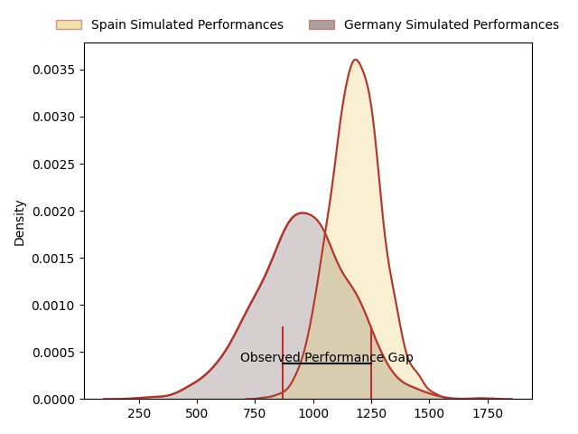
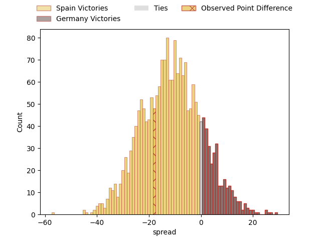
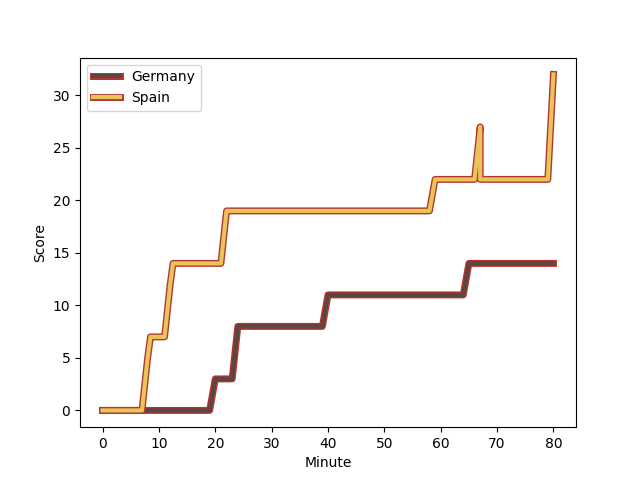
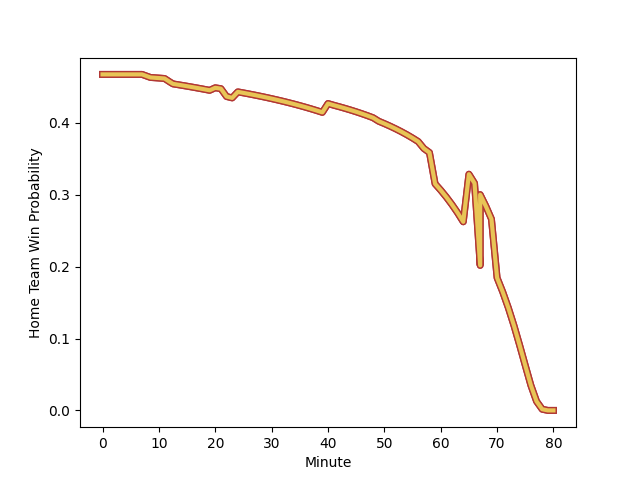

---  
layout: page  
title: Spain at Germany; 32-14  
date: 2023-02-12 14:30:00 18:00:00 -0500  
categories: match review  
---
# Spain at Germany; 32-14

# Club Level Predictions

The first set of predictions treats a club as the smallest object, as the club develops its members, organizes a gameplan, and deploys its players as needed for each match. This club model has a prediction of 0.228, which translates to predicting Spain to win by 11.2.

Each club has a rating and a rating deviation (simiar to a Glicko system), and expected performances can be generated. This allows for simulated matches and spreads like the ones below.
## Projected Performances

## Projected Spreads

## Projected Results

# Player Level Predictions

Treating teams instead as an entity made up of the currently active players, I have ratings for each player in an altogether different system. These can be combined to form team ratings once teamsheets are announced, weighting starters a bit higher than the reserves. After the match is played, players can be weighted by their minutes on the field, allowing for an accurate measure of the team's composition. With these compiled team ratings, we can make predictions, measure inaccuracy, and update the individual player ratings.
## Prediction with Player Minutes: Spain by 1.7

Spain by 5.7 on a neutral field
## Scores over Time

## Win Probability over Time

There were 8 large changes in win probability in this match
## Prediction without Player Minutes: Spain by 1.4

Spain by 5.4 on a neutral pitch

|   Away Minutes | Away Player                                                                                 |   Away elo |   Away Percentile |   Number |   Home Percentile |   Home elo | Home Player                                                            |   Home Minutes |
|---------------:|:--------------------------------------------------------------------------------------------|-----------:|------------------:|---------:|------------------:|-----------:|:-----------------------------------------------------------------------|---------------:|
|             80 | [Titi Futeu Youtcheu](..//playerfiles//TitiFuteuYoutcheu_cleaned.md)                        |      63.82 |                 1 |        1 |                 5 |      74.18 | [Jörn Schroder](..//playerfiles//JörnSchroder_cleaned.md)              |             68 |
|             80 | [Titi Futeu Youtcheu](..//playerfiles//TitiFuteuYoutcheu_cleaned.md)                        |      63.82 |                 9 |        1 |                11 |      74.18 | [Jörn Schroder](..//playerfiles//JörnSchroder_cleaned.md)              |             68 |
|             80 | [Titi Futeu Youtcheu](..//playerfiles//TitiFuteuYoutcheu_cleaned.md)                        |      63.82 |                 1 |        1 |                11 |      74.18 | [Jörn Schroder](..//playerfiles//JörnSchroder_cleaned.md)              |             68 |
|             80 | [Titi Futeu Youtcheu](..//playerfiles//TitiFuteuYoutcheu_cleaned.md)                        |      63.82 |                 9 |        1 |                 5 |      74.18 | [Jörn Schroder](..//playerfiles//JörnSchroder_cleaned.md)              |             68 |
|             57 | [Vicente del Hoyo Portoles](..//playerfiles//VicentedelHoyoPortoles_cleaned.md)             |      87.87 |                70 |        2 |                39 |      85.54 | [Andrew Reintges](..//playerfiles//AndrewReintges_cleaned.md)          |             49 |
|             57 | [Vicente del Hoyo Portoles](..//playerfiles//VicentedelHoyoPortoles_cleaned.md)             |      87.87 |                25 |        2 |                39 |      85.54 | [Andrew Reintges](..//playerfiles//AndrewReintges_cleaned.md)          |             49 |
|             57 | [Vicente del Hoyo Portoles](..//playerfiles//VicentedelHoyoPortoles_cleaned.md)             |      87.87 |                70 |        2 |                19 |      85.54 | [Andrew Reintges](..//playerfiles//AndrewReintges_cleaned.md)          |             49 |
|             57 | [Vicente del Hoyo Portoles](..//playerfiles//VicentedelHoyoPortoles_cleaned.md)             |      87.87 |                25 |        2 |                19 |      85.54 | [Andrew Reintges](..//playerfiles//AndrewReintges_cleaned.md)          |             49 |
|             24 | [Jon Zabala Arrieta](..//playerfiles//JonZabalaArrieta_cleaned.md)                          |      87.88 |                69 |        3 |                 2 |      60.9  | [Paul Weiss](..//playerfiles//PaulWeiss_cleaned.md)                    |             63 |
|             24 | [Jon Zabala Arrieta](..//playerfiles//JonZabalaArrieta_cleaned.md)                          |      87.88 |                69 |        3 |                 1 |      60.9  | [Paul Weiss](..//playerfiles//PaulWeiss_cleaned.md)                    |             63 |
|             24 | [Jon Zabala Arrieta](..//playerfiles//JonZabalaArrieta_cleaned.md)                          |      87.88 |                25 |        3 |                 2 |      60.9  | [Paul Weiss](..//playerfiles//PaulWeiss_cleaned.md)                    |             63 |
|             24 | [Jon Zabala Arrieta](..//playerfiles//JonZabalaArrieta_cleaned.md)                          |      87.88 |                25 |        3 |                 1 |      60.9  | [Paul Weiss](..//playerfiles//PaulWeiss_cleaned.md)                    |             63 |
|             75 | [Mario Pichardi Garcia](..//playerfiles//MarioPichardiGarcia_cleaned.md)                    |      80.35 |                12 |        4 |                33 |      83.41 | [Michel Himmer](..//playerfiles//MichelHimmer_cleaned.md)              |             78 |
|             75 | [Mario Pichardi Garcia](..//playerfiles//MarioPichardiGarcia_cleaned.md)                    |      80.35 |                47 |        4 |                20 |      83.41 | [Michel Himmer](..//playerfiles//MichelHimmer_cleaned.md)              |             78 |
|             75 | [Mario Pichardi Garcia](..//playerfiles//MarioPichardiGarcia_cleaned.md)                    |      80.35 |                12 |        4 |                20 |      83.41 | [Michel Himmer](..//playerfiles//MichelHimmer_cleaned.md)              |             78 |
|             75 | [Mario Pichardi Garcia](..//playerfiles//MarioPichardiGarcia_cleaned.md)                    |      80.35 |                47 |        4 |                33 |      83.41 | [Michel Himmer](..//playerfiles//MichelHimmer_cleaned.md)              |             78 |
|             49 | [Josh Peters](..//playerfiles//JoshPeters_cleaned.md)                                       |      88.49 |                29 |        5 |                34 |      83.96 | [Hassan Omar Rayan](..//playerfiles//HassanOmarRayan_cleaned.md)       |             59 |
|             49 | [Josh Peters](..//playerfiles//JoshPeters_cleaned.md)                                       |      88.49 |                29 |        5 |                21 |      83.96 | [Hassan Omar Rayan](..//playerfiles//HassanOmarRayan_cleaned.md)       |             59 |
|             80 | [Matheo Triki](..//playerfiles//MatheoTriki_cleaned.md)                                     |     106.05 |                77 |        6 |                 1 |      62.46 | [Sebastien Ferreira](..//playerfiles//SebastienFerreira_cleaned.md)    |             80 |
|             80 | [Matthew Foulds](..//playerfiles//MatthewFoulds_cleaned.md)                                 |      77.6  |                 9 |        7 |               nan |      91.22 | [Justin Renc](..//playerfiles//JustinRenc_cleaned.md)                  |             80 |
|             80 | [Matthew Foulds](..//playerfiles//MatthewFoulds_cleaned.md)                                 |      77.6  |                33 |        7 |               nan |      91.22 | [Justin Renc](..//playerfiles//JustinRenc_cleaned.md)                  |             80 |
|             80 | [Facundo Nahuel Dominguez Gatell](..//playerfiles//FacundoNahuelDominguezGatell_cleaned.md) |      80.06 |                14 |        8 |                29 |      88.69 | [Oliver Stein](..//playerfiles//OliverStein_cleaned.md)                |             80 |
|             65 | [Estanislao Bay](..//playerfiles//EstanislaoBay_cleaned.md)                                 |      66.32 |                15 |        9 |                 0 |      57.38 | [Oliver Paine](..//playerfiles//OliverPaine_cleaned.md)                |             65 |
|             65 | [Estanislao Bay](..//playerfiles//EstanislaoBay_cleaned.md)                                 |      66.32 |                 2 |        9 |                 0 |      57.38 | [Oliver Paine](..//playerfiles//OliverPaine_cleaned.md)                |             65 |
|             80 | [Bautista Guemes](..//playerfiles//BautistaGuemes_cleaned.md)                               |     112.11 |               nan |       10 |                26 |      83.49 | [Eduardo Stella](..//playerfiles//EduardoStella_cleaned.md)            |             70 |
|             80 | [Bautista Guemes](..//playerfiles//BautistaGuemes_cleaned.md)                               |     112.11 |               nan |       10 |                15 |      83.49 | [Eduardo Stella](..//playerfiles//EduardoStella_cleaned.md)            |             70 |
|             59 | [Jordi Jorba Jorge](..//playerfiles//JordiJorbaJorge_cleaned.md)                            |      87.32 |                24 |       11 |                 6 |      71.5  | [Felix Lammers](..//playerfiles//FelixLammers_cleaned.md)              |             80 |
|             80 | [Gonzalo Vinuesa Garcia](..//playerfiles//GonzaloVinuesaGarcia_cleaned.md)                  |      77.75 |                 8 |       12 |               nan |      92.32 | [Daniel Wolf](..//playerfiles//DanielWolf_cleaned.md)                  |             75 |
|             67 | [Inaki Martin Mateu](..//playerfiles//InakiMartinMateu_cleaned.md)                          |      80.6  |                13 |       13 |                16 |      82.1  | [Sebastian Rodwell](..//playerfiles//SebastianRodwell_cleaned.md)      |             80 |
|             80 | [Silvio Federico Castiglioni](..//playerfiles//SilvioFedericoCastiglioni_cleaned.md)        |      90.68 |                68 |       14 |               nan |      98.08 | [Carlos Soteras-Merz](..//playerfiles//CarlosSoteras-Merz_cleaned.md)  |             80 |
|             80 | [Silvio Federico Castiglioni](..//playerfiles//SilvioFedericoCastiglioni_cleaned.md)        |      90.68 |                36 |       14 |               nan |      98.08 | [Carlos Soteras-Merz](..//playerfiles//CarlosSoteras-Merz_cleaned.md)  |             80 |
|             80 | [JW Bell](..//playerfiles//JWBell_cleaned.md)                                               |      79.68 |                15 |       15 |                29 |      88.69 | [Zinzan Henrick Hees](..//playerfiles//ZinzanHenrickHees_cleaned.md)   |             80 |
|             17 | [Bittor Aboitiz](..//playerfiles//BittorAboitiz_cleaned.md)                                 |      88.66 |               nan |       16 |               nan |      82.04 | [Elias Ezequiel Haase](..//playerfiles//EliasEzequielHaase_cleaned.md) |             31 |
|             39 | [Lucas Santamaria](..//playerfiles//LucasSantamaria_cleaned.md)                             |      89.24 |               nan |       17 |               nan |      85.66 | [Kilian Bendjaballah](..//playerfiles//KilianBendjaballah_cleaned.md)  |             21 |
|             31 | [Alex Suarez](..//playerfiles//AlexSuarez_cleaned.md)                                       |      97.99 |                57 |       18 |               nan |      91.85 | [Mathis Blume](..//playerfiles//MathisBlume_cleaned.md)                |             17 |
|             21 | [Julen Goia Iriberri](..//playerfiles//JulenGoiaIriberri_cleaned.md)                        |      76.19 |               nan |       19 |               nan |      95    | [Michael McDonald](..//playerfiles//MichaelMcDonald_cleaned.md)        |             15 |
|             15 | [Facundo Munilla](..//playerfiles//FacundoMunilla_cleaned.md)                               |      84.39 |                20 |       20 |                31 |      88.69 | [Leo Wolf](..//playerfiles//LeoWolf_cleaned.md)                        |             12 |
|             13 | [Alberto Carmona](..//playerfiles//AlbertoCarmona_cleaned.md)                               |      92.48 |               nan |       21 |               nan |      95    | [Nicklas Hohl](..//playerfiles//NicklasHohl_cleaned.md)                |             10 |
|              5 | [Guillermo Moreton](..//playerfiles//GuillermoMoreton_cleaned.md)                           |      95    |               nan |       22 |               nan |      92.63 | [Luke Wakefield](..//playerfiles//LukeWakefield_cleaned.md)            |              5 |
|             23 | [Pablo Miejimolle](..//playerfiles//PabloMiejimolle_cleaned.md)                             |      97.19 |                68 |       23 |               nan |      93.98 | [Tyrell Williams](..//playerfiles//TyrellWilliams_cleaned.md)          |              2 |

