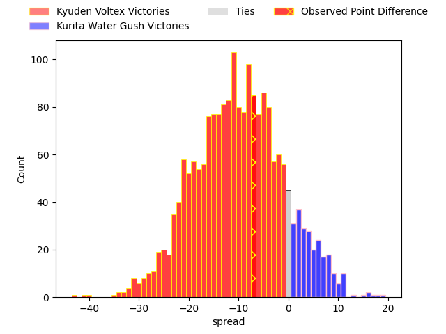
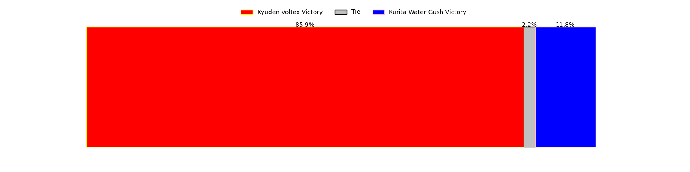
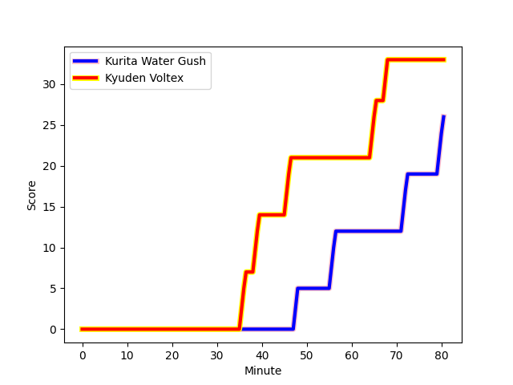
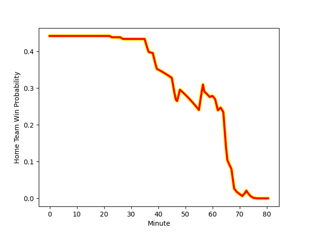

---  
layout: page  
title: Kyuden Voltex at Kurita Water Gush; 33-26  
date: 2023-02-12 00:00:00 18:00:00 -0500  
categories: match review  
---
# Kyuden Voltex at Kurita Water Gush; 33-26

# Club Level Predictions

The first set of predictions treats a club as the smallest object, as the club develops its members, organizes a gameplan, and deploys its players as needed for each match. This club model has a prediction of 0.26, which translates to predicting Kyuden Voltex to win by 9.8.

Each club has a rating and a rating deviation (simiar to a Glicko system), and expected performances can be generated. This allows for simulated matches and spreads like the ones below.
## Projected Performances

## Projected Spreads

## Projected Results

# Player Level Predictions

Treating teams instead as an entity made up of the currently active players, I have ratings for each player in an altogether different system. These can be combined to form team ratings once teamsheets are announced, weighting starters a bit higher than the reserves. After the match is played, players can be weighted by their minutes on the field, allowing for an accurate measure of the team's composition. With these compiled team ratings, we can make predictions, measure inaccuracy, and update the individual player ratings.
## Prediction with Player Minutes: Kyuden Voltex by 5.3

Kyuden Voltex by 9.3 on a neutral field
## Scores over Time

## Win Probability over Time

There were 8 large changes in win probability in this match
## Prediction without Player Minutes: Kyuden Voltex by 3.7

Kyuden Voltex by 7.7 on a neutral pitch

|   Away Minutes | Away Player                                                                |   Away elo |   Away Percentile |   Number |   Home Percentile |   Home elo | Home Player                                                               |   Home Minutes |
|---------------:|:---------------------------------------------------------------------------|-----------:|------------------:|---------:|------------------:|-----------:|:--------------------------------------------------------------------------|---------------:|
|             57 | [Samuel Nozomu Faialaga](..//playerfiles//SamuelNozomuFaialaga_cleaned.md) |     101.43 |                66 |        1 |                 1 |      60.21 | [Hyong Ji Kim](..//playerfiles//HyongJiKim_cleaned.md)                    |             63 |
|             62 | [Daigo Asato](..//playerfiles//DaigoAsato_cleaned.md)                      |      94.55 |                50 |        2 |                57 |      97.32 | [Kota Hojo](..//playerfiles//KotaHojo_cleaned.md)                         |             69 |
|             57 | [Yasuo Saruwatari](..//playerfiles//YasuoSaruwatari_cleaned.md)            |      85.83 |                20 |        3 |                26 |      88.38 | [Kuriyama Rui](..//playerfiles//KuriyamaRui_cleaned.md)                   |             80 |
|             70 | [Tomotaka Ishimatsu](..//playerfiles//TomotakaIshimatsu_cleaned.md)        |     102.97 |                66 |        4 |                 7 |      72.99 | [Kota Nakamura](..//playerfiles//KotaNakamura_cleaned.md)                 |             60 |
|             80 | [Ray Tatafu](..//playerfiles//RayTatafu_cleaned.md)                        |      65.23 |                 3 |        5 |                 7 |      72.55 | [Daymon Leasuasu](..//playerfiles//DaymonLeasuasu_cleaned.md)             |             80 |
|             80 | [Michiro Takai](..//playerfiles//MichiroTakai_cleaned.md)                  |      77.67 |                 9 |        6 |                21 |      85.65 | [Yosuke Ishii](..//playerfiles//YosukeIshii_cleaned.md)                   |             80 |
|             80 | [Colby Fainga'a](..//playerfiles//ColbyFainga'a_cleaned.md)                |      86.15 |                24 |        7 |                 1 |      63.7  | [Hiroki Kawase](..//playerfiles//HirokiKawase_cleaned.md)                 |             66 |
|             80 | [Walker Alex Takuya](..//playerfiles//WalkerAlexTakuya_cleaned.md)         |      90.71 |                35 |        8 |                23 |      85.98 | [Feinga Kihe Lotu Fakai](..//playerfiles//FeingaKiheLotuFakai_cleaned.md) |             27 |
|             57 | [Shunta Takenouchi](..//playerfiles//ShuntaTakenouchi_cleaned.md)          |      94.86 |                47 |        9 |                40 |      92.51 | [Sho Nakamura](..//playerfiles//ShoNakamura_cleaned.md)                   |             62 |
|             70 | [Phil Burleigh](..//playerfiles//PhilBurleigh_cleaned.md)                  |     118.17 |                87 |       10 |                17 |      88.79 | [Andrew Deegan](..//playerfiles//AndrewDeegan_cleaned.md)                 |             80 |
|             80 | [Ren Hagiwara](..//playerfiles//RenHagiwara_cleaned.md)                    |      79.99 |                13 |       11 |                15 |      81.55 | [Keigo Hamazoe](..//playerfiles//KeigoHamazoe_cleaned.md)                 |             62 |
|             62 | [Noriaki Nakazuru](..//playerfiles//NoriakiNakazuru_cleaned.md)            |      82.71 |                18 |       12 |                46 |      94.78 | [Jamie Vakalahi](..//playerfiles//JamieVakalahi_cleaned.md)               |             80 |
|             80 | [Sam Vaka](..//playerfiles//SamVaka_cleaned.md)                            |     106.02 |                73 |       13 |                70 |     104.71 | [Tom English](..//playerfiles//TomEnglish_cleaned.md)                     |             80 |
|             80 | [Yasunari Isoda](..//playerfiles//YasunariIsoda_cleaned.md)                |     106.96 |                76 |       14 |                66 |     101.74 | [Yuta Sugiyama](..//playerfiles//YutaSugiyama_cleaned.md)                 |             23 |
|             80 | [Yusuke Aramaki](..//playerfiles//YusukeAramaki_cleaned.md)                |      98.99 |                54 |       15 |                81 |     114.75 | [Koshi Emoto](..//playerfiles//KoshiEmoto_cleaned.md)                     |             80 |
|             23 | [Kazuto Tokunaga](..//playerfiles//KazutoTokunaga_cleaned.md)              |     125.15 |                96 |       16 |               nan |      95.98 | [Kai Yamasaki](..//playerfiles//KaiYamasaki_cleaned.md)                   |             20 |
|             23 | [Shinpei Kamata](..//playerfiles//ShinpeiKamata_cleaned.md)                |     101.53 |                67 |       17 |                19 |      85.96 | [Ryo Omasa](..//playerfiles//RyoOmasa_cleaned.md)                         |             18 |
|             23 | [Daisuke Kodama](..//playerfiles//DaisukeKodama_cleaned.md)                |      85.56 |                22 |       18 |                17 |      84.66 | [Takuro Hayashida](..//playerfiles//TakuroHayashida_cleaned.md)           |             18 |
|             18 | [Genki Nakamura](..//playerfiles//GenkiNakamura_cleaned.md)                |      83.27 |               nan |       19 |               nan |      99.08 | [Megumi Tagusagawa](..//playerfiles//MegumiTagusagawa_cleaned.md)         |             17 |
|             18 | [Akihito Yamada](..//playerfiles//AkihitoYamada_cleaned.md)                |     122.84 |               nan |       20 |                 1 |      57.65 | [Mitsuo Nakao](..//playerfiles//MitsuoNakao_cleaned.md)                   |             14 |
|             10 | [Kichi Uezato](..//playerfiles//KichiUezato_cleaned.md)                    |     105.32 |                71 |       21 |               nan |      96.55 | [Jun Kaneko](..//playerfiles//JunKaneko_cleaned.md)                       |             11 |
|             10 | [Yoshihiro Sononaka](..//playerfiles//YoshihiroSononaka_cleaned.md)        |      74.96 |               nan |       22 |               nan |      96.14 | [Daiki Yokota](..//playerfiles//DaikiYokota_cleaned.md)                   |             57 |
|            nan | nan                                                                        |     nan    |               nan |       23 |               nan |      79.25 | [Masachi Debuchi](..//playerfiles//MasachiDebuchi_cleaned.md)             |             53 |

