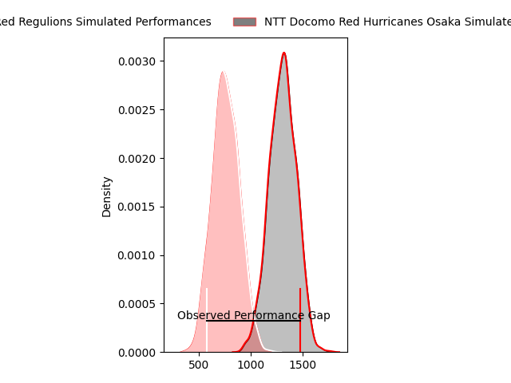
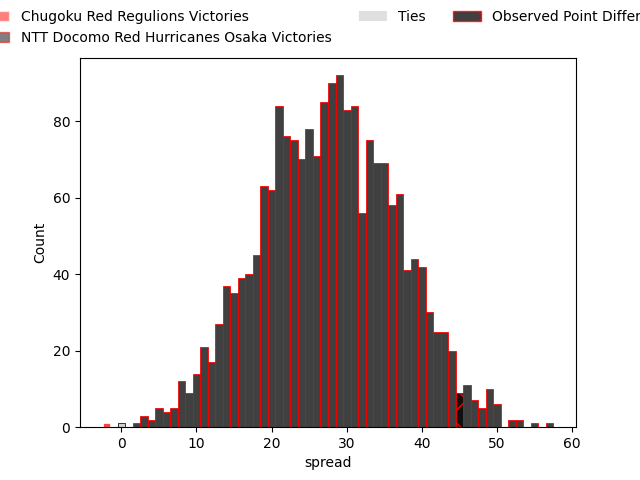
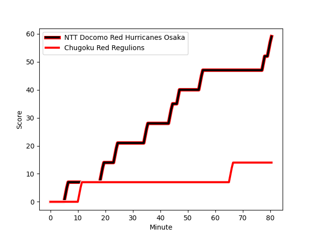
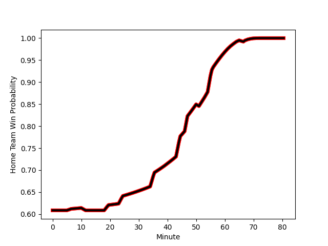

---  
layout: page  
title: Chugoku Red Regulions at NTT Docomo Red Hurricanes Osaka; 14-59  
date: 2023-02-12 00:00:00 18:00:00 -0500  
categories: match review  
---
# Chugoku Red Regulions at NTT Docomo Red Hurricanes Osaka; 14-59

# Club Level Predictions

The first set of predictions treats a club as the smallest object, as the club develops its members, organizes a gameplan, and deploys its players as needed for each match. This club model has a prediction of 0.95, which translates to predicting NTT Docomo Red Hurricanes Osaka to win by 27.7.

Each club has a rating and a rating deviation (simiar to a Glicko system), and expected performances can be generated. This allows for simulated matches and spreads like the ones below.
## Projected Performances

## Projected Spreads

## Projected Results

# Player Level Predictions

Treating teams instead as an entity made up of the currently active players, I have ratings for each player in an altogether different system. These can be combined to form team ratings once teamsheets are announced, weighting starters a bit higher than the reserves. After the match is played, players can be weighted by their minutes on the field, allowing for an accurate measure of the team's composition. With these compiled team ratings, we can make predictions, measure inaccuracy, and update the individual player ratings.
## Prediction with Player Minutes: NTT Docomo Red Hurricanes Osaka by 23.2

NTT Docomo Red Hurricanes Osaka by 19.2 on a neutral field
## Scores over Time

## Win Probability over Time

There were 3 large changes in win probability in this match
## Prediction without Player Minutes: NTT Docomo Red Hurricanes Osaka by 23.3

NTT Docomo Red Hurricanes Osaka by 19.3 on a neutral pitch

|   Away Minutes | Away Player                                                       |   Away elo |   Away Percentile |   Number |   Home Percentile |   Home elo | Home Player                                                             |   Home Minutes |
|---------------:|:------------------------------------------------------------------|-----------:|------------------:|---------:|------------------:|-----------:|:------------------------------------------------------------------------|---------------:|
|             51 | [Toshiyuki Ooki](..//playerfiles//ToshiyukiOoki_cleaned.md)       |      74.13 |                 6 |        1 |                 8 |      77.76 | [Yosuke Nishiura](..//playerfiles//YosukeNishiura_cleaned.md)           |             54 |
|             61 | [Yuuki Asai](..//playerfiles//YuukiAsai_cleaned.md)               |      78.47 |               nan |        2 |                36 |      91.32 | [Hisamitsu Shimada](..//playerfiles//HisamitsuShimada_cleaned.md)       |             70 |
|             51 | [Saiya Kitajima](..//playerfiles//SaiyaKitajima_cleaned.md)       |      77.49 |                14 |        3 |                15 |      82.94 | [Munekata Sashida](..//playerfiles//MunekataSashida_cleaned.md)         |             61 |
|             80 | [Taro Nishikawa](..//playerfiles//TaroNishikawa_cleaned.md)       |      45.34 |                 0 |        4 |                22 |      84.29 | [Willie Britz](..//playerfiles//WillieBritz_cleaned.md)                 |             80 |
|             80 | [Noriyuki Kureyama](..//playerfiles//NoriyukiKureyama_cleaned.md) |      78.33 |                12 |        5 |                57 |      97.86 | [Tom Jeffries](..//playerfiles//TomJeffries_cleaned.md)                 |             80 |
|             80 | [Shintaro Matsuda](..//playerfiles//ShintaroMatsuda_cleaned.md)   |      95.18 |                47 |        6 |                 3 |      67.55 | [Toru Sugishita](..//playerfiles//ToruSugishita_cleaned.md)             |             67 |
|             80 | [Kohei Matsunaga](..//playerfiles//KoheiMatsunaga_cleaned.md)     |      75.07 |                 8 |        7 |               nan |     115.66 | [Taro Sato](..//playerfiles//TaroSato_cleaned.md)                       |             54 |
|             40 | [Shun Kawaguchi](..//playerfiles//ShunKawaguchi_cleaned.md)       |      64.5  |                 2 |        8 |                17 |      82.22 | [Colin Bourke](..//playerfiles//ColinBourke_cleaned.md)                 |             80 |
|             40 | [Atsushi Mizofuchi](..//playerfiles//AtsushiMizofuchi_cleaned.md) |      91.28 |                44 |        9 |               nan |      94.24 | [Toshihiro Yamamouchi](..//playerfiles//ToshihiroYamamouchi_cleaned.md) |             67 |
|             40 | [Hashizo Yoshida](..//playerfiles//HashizoYoshida_cleaned.md)     |      75.13 |                 8 |       10 |                23 |      87.1  | [Ei Kawamuko](..//playerfiles//EiKawamuko_cleaned.md)                   |             56 |
|             80 | [Kentaro Fujii](..//playerfiles//KentaroFujii_cleaned.md)         |      95.33 |                49 |       11 |                67 |     101.84 | [Masaki Kobayashi](..//playerfiles//MasakiKobayashi_cleaned.md)         |             80 |
|             80 | [Shinya Hirayama](..//playerfiles//ShinyaHirayama_cleaned.md)     |      93.21 |                42 |       12 |                 6 |      72.87 | [Mifiposeti Paea](..//playerfiles//MifiposetiPaea_cleaned.md)           |             64 |
|             61 | [Masaaki Morita](..//playerfiles//MasaakiMorita_cleaned.md)       |      70.01 |                 4 |       13 |                98 |     136.81 | [Benjamin Saunders](..//playerfiles//BenjaminSaunders_cleaned.md)       |             80 |
|             80 | [Masahiro Nakano](..//playerfiles//MasahiroNakano_cleaned.md)     |      68.41 |                 4 |       14 |                88 |     117.38 | [Ryo Tsuruda](..//playerfiles//RyoTsuruda_cleaned.md)                   |             80 |
|             51 | [Motoki Arai](..//playerfiles//MotokiArai_cleaned.md)             |      83.95 |                23 |       15 |                 0 |      49.78 | [Taichi Yoshizawa](..//playerfiles//TaichiYoshizawa_cleaned.md)         |             80 |
|             40 | [Hironori Shojima](..//playerfiles//HironoriShojima_cleaned.md)   |      79.68 |                12 |       16 |                25 |      87.71 | [Shosuke Fukasawa](..//playerfiles//ShosukeFukasawa_cleaned.md)         |             26 |
|             40 | [Shohei Tsukamoto](..//playerfiles//ShoheiTsukamoto_cleaned.md)   |      66.39 |                 1 |       17 |                78 |     108.58 | [Hiroki Hanada](..//playerfiles//HirokiHanada_cleaned.md)               |             26 |
|             40 | [Ippei Yamada](..//playerfiles//IppeiYamada_cleaned.md)           |      84.37 |                16 |       18 |               nan |      95    | [Oh Ryong Tee](..//playerfiles//OhRyongTee_cleaned.md)                  |             24 |
|             29 | [Keisuke Maeda](..//playerfiles//KeisukeMaeda_cleaned.md)         |      97.48 |               nan |       19 |               nan |      96.52 | [Yuichiro Hosono](..//playerfiles//YuichiroHosono_cleaned.md)           |             19 |
|             29 | [Daiki Ishida](..//playerfiles//DaikiIshida_cleaned.md)           |      95.32 |                46 |       20 |               nan |      88.5  | [Daisuke Iba](..//playerfiles//DaisukeIba_cleaned.md)                   |             16 |
|             29 | [Keigo Hatanaka](..//playerfiles//KeigoHatanaka_cleaned.md)       |      83.27 |                18 |       21 |                40 |      90.94 | [Tsukasa Yasuda](..//playerfiles//TsukasaYasuda_cleaned.md)             |             13 |
|             19 | [Kentaro Iwanaga](..//playerfiles//KentaroIwanaga_cleaned.md)     |      78.93 |                10 |       22 |                63 |     100.62 | [Kenta Komura](..//playerfiles//KentaKomura_cleaned.md)                 |             13 |
|             19 | [Riki Yamaguchi](..//playerfiles//RikiYamaguchi_cleaned.md)       |      81.44 |                18 |       23 |                63 |      98.03 | [Mitsumasa Harayama](..//playerfiles//MitsumasaHarayama_cleaned.md)     |             10 |

