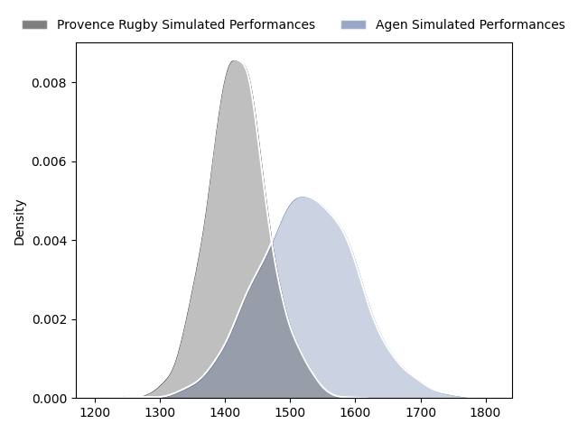
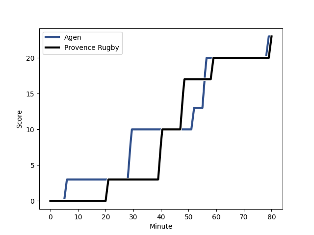
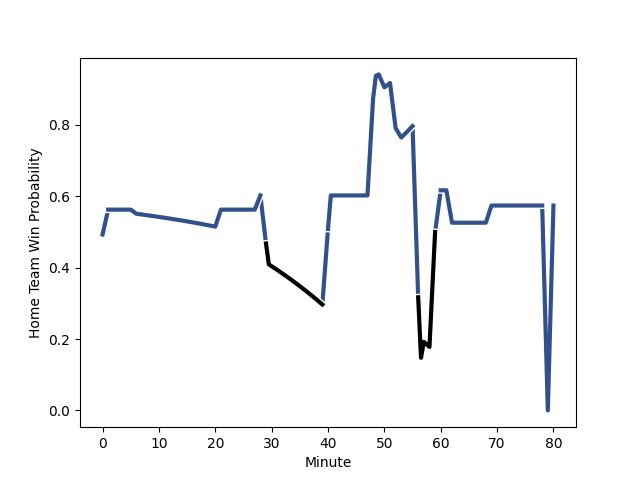

---  
layout: page  
title: Provence Rugby at Agen; 23-23  
date: 2023-02-16 21:00:00 18:00:00 -0500  
categories: match review  
---
# Provence Rugby at Agen; 23-23

# Club Level Predictions

The first set of predictions treats a club as the smallest object, as the club develops its members, organizes a gameplan, and deploys its players as needed for each match. This club model has a prediction of 0.645, which translates to predicting Agen to win by 5.3.

Each club has a rating and a rating deviation (simiar to a Glicko system), and expected performances can be generated. This allows for simulated matches and spreads like the ones below.
## Projected Performances

## Projected Spreads

## Projected Results

# Player Level Predictions

Treating teams instead as an entity made up of the currently active players, I have ratings for each player in an altogether different system. These can be combined to form team ratings once teamsheets are announced, weighting starters a bit higher than the reserves. After the match is played, players can be weighted by their minutes on the field, allowing for an accurate measure of the team's composition. With these compiled team ratings, we can make predictions, measure inaccuracy, and update the individual player ratings.
## Prediction with Player Minutes: Agen by 2.9

Provence Rugby by 1.1 on a neutral field
## Scores over Time

## Win Probability over Time

There were 21 large changes in win probability in this match
## Prediction without Player Minutes: Agen by 4.2

Agen by 0.2 on a neutral pitch

|   Away Minutes | Away Player                                                           |   Away elo |   Away Percentile |   Number |   Home Percentile |   Home elo | Home Player                                                              |   Home Minutes |
|---------------:|:----------------------------------------------------------------------|-----------:|------------------:|---------:|------------------:|-----------:|:-------------------------------------------------------------------------|---------------:|
|             57 | [Julius Nostadt](..//playerfiles//JuliusNostadt_cleaned.md)           |     110.79 |                92 |        1 |                 3 |      67.88 | [Florent Guion](..//playerfiles//FlorentGuion_cleaned.md)                |             50 |
|             57 | [Julius Nostadt](..//playerfiles//JuliusNostadt_cleaned.md)           |     110.79 |                82 |        1 |                 3 |      67.88 | [Florent Guion](..//playerfiles//FlorentGuion_cleaned.md)                |             50 |
|              1 | [Lucas Martin](..//playerfiles//LucasMartin_cleaned.md)               |      97.6  |                60 |        2 |                79 |     104    | [Clément Martinez](..//playerfiles//ClémentMartinez_cleaned.md)          |             50 |
|             57 | [Luke Tagi](..//playerfiles//LukeTagi_cleaned.md)                     |      88.96 |                28 |        3 |               nan |      95    | [Walter Desmaison](..//playerfiles//WalterDesmaison_cleaned.md)          |             50 |
|             80 | [Jérôme Dufour](..//playerfiles//JérômeDufour_cleaned.md)             |     122.4  |                96 |        4 |                75 |     106.65 | [Zak Farrance](..//playerfiles//ZakFarrance_cleaned.md)                  |             60 |
|             80 | [Jérôme Dufour](..//playerfiles//JérômeDufour_cleaned.md)             |     122.4  |                91 |        4 |                75 |     106.65 | [Zak Farrance](..//playerfiles//ZakFarrance_cleaned.md)                  |             60 |
|             53 | [Alexandre Flanquart](..//playerfiles//AlexandreFlanquart_cleaned.md) |      95.49 |                53 |        5 |                85 |     110.93 | [William Demotte](..//playerfiles//WilliamDemotte_cleaned.md)            |             50 |
|             62 | [Guillaume Piazzoli](..//playerfiles//GuillaumePiazzoli_cleaned.md)   |     105.04 |                75 |        6 |                53 |      97.12 | [Antoine Erbani](..//playerfiles//AntoineErbani_cleaned.md)              |             60 |
|             80 | [Jessy Jegerlhener](..//playerfiles//JessyJegerlhener_cleaned.md)     |     103.77 |                72 |        7 |               nan |      95    | [Vincent Farré](..//playerfiles//VincentFarré_cleaned.md)                |             80 |
|             53 | [Baptiste Belhadj](..//playerfiles//BaptisteBelhadj_cleaned.md)       |      95.55 |               nan |        8 |                42 |      95.13 | [Fotu Lokotui](..//playerfiles//FotuLokotui_cleaned.md)                  |             80 |
|             60 | [Simon Tarel](..//playerfiles//SimonTarel_cleaned.md)                 |      89.95 |                33 |        9 |                74 |     103.13 | [Sonatane Takulua](..//playerfiles//SonataneTakulua_cleaned.md)          |             69 |
|             80 | [Enzo Selponi](..//playerfiles//EnzoSelponi_cleaned.md)               |      91.06 |                31 |       10 |                68 |     101.21 | [Elton Thomas Jantjies](..//playerfiles//EltonThomasJantjies_cleaned.md) |             80 |
|             80 | [Léo Drouet](..//playerfiles//LéoDrouet_cleaned.md)                   |      96.44 |                58 |       11 |                63 |      99.35 | [Iban Etcheverry](..//playerfiles//IbanEtcheverry_cleaned.md)            |             80 |
|             80 | [Louis Marrou](..//playerfiles//LouisMarrou_cleaned.md)               |      86.31 |                29 |       12 |                94 |     120.04 | [Kolinio Ramoka](..//playerfiles//KolinioRamoka_cleaned.md)              |             80 |
|             80 | [Dorian Lavernhe](..//playerfiles//DorianLavernhe_cleaned.md)         |      97.36 |                51 |       13 |                 5 |      70.87 | [Baptiste Lafond](..//playerfiles//BaptisteLafond_cleaned.md)            |             80 |
|             57 | [Adrien Lapègue](..//playerfiles//AdrienLapègue_cleaned.md)           |      90.19 |                39 |       14 |                86 |     111.2  | [Tevita Railevu](..//playerfiles//TevitaRailevu_cleaned.md)              |             80 |
|             80 | [Florent Massip](..//playerfiles//FlorentMassip_cleaned.md)           |     112.1  |                85 |       15 |                75 |     106.6  | [Thomas Vincent](..//playerfiles//ThomasVincent_cleaned.md)              |             28 |
|             79 | [German Kessler](..//playerfiles//GermanKessler_cleaned.md)           |     110.72 |                92 |       16 |                52 |      98.82 | [Jefferson Joseph](..//playerfiles//JeffersonJoseph_cleaned.md)          |             52 |
|             79 | [German Kessler](..//playerfiles//GermanKessler_cleaned.md)           |     110.72 |                85 |       16 |                52 |      98.82 | [Jefferson Joseph](..//playerfiles//JeffersonJoseph_cleaned.md)          |             52 |
|             27 | [Clément Chartier](..//playerfiles//ClémentChartier_cleaned.md)       |     114.08 |                89 |       17 |                80 |     104.42 | [Alex Burin](..//playerfiles//AlexBurin_cleaned.md)                      |             30 |
|             27 | [Nicolas Mousties](..//playerfiles//NicolasMousties_cleaned.md)       |      65.13 |                 3 |       18 |                70 |     102.9  | [Evan Olmstead](..//playerfiles//EvanOlmstead_cleaned.md)                |             30 |
|             23 | [Federico Wegrzyn](..//playerfiles//FedericoWegrzyn_cleaned.md)       |     100.14 |                67 |       19 |                39 |      93.09 | [Loris Zarantonello](..//playerfiles//LorisZarantonello_cleaned.md)      |             30 |
|             23 | [Adrian Sanday](..//playerfiles//AdrianSanday_cleaned.md)             |     114.97 |                88 |       20 |                77 |     103.19 | [Hans Lombard-Buret](..//playerfiles//HansLombard-Buret_cleaned.md)      |             30 |
|             23 | [Thomas Vernet](..//playerfiles//ThomasVernet_cleaned.md)             |      92.36 |                32 |       21 |                29 |      87.78 | [Corentin Vernet](..//playerfiles//CorentinVernet_cleaned.md)            |             20 |
|             20 | [Jeremie Martin](..//playerfiles//JeremieMartin_cleaned.md)           |      92.31 |               nan |       22 |               nan |      95    | [Julien Lebian](..//playerfiles//JulienLebian_cleaned.md)                |             20 |
|             18 | [Joseph Laget](..//playerfiles//JosephLaget_cleaned.md)               |      86.68 |                16 |       23 |                48 |      94.1  | [Dorian Bellot](..//playerfiles//DorianBellot_cleaned.md)                |             11 |

