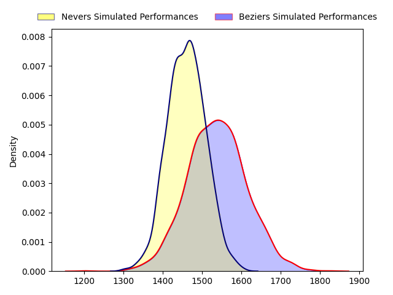
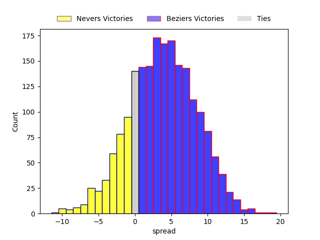
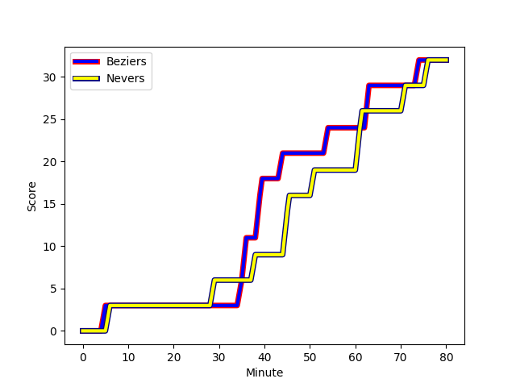
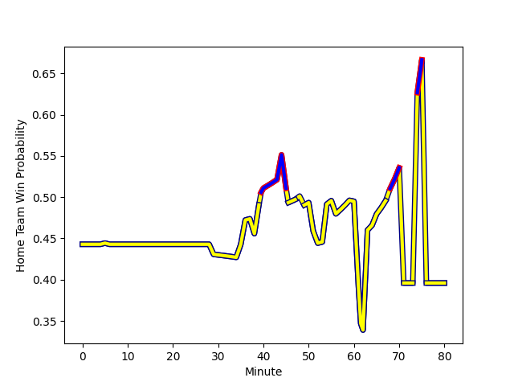

---  
layout: page  
title: Nevers at Beziers; 32-32  
date: 2023-02-17 19:30:00 18:00:00 -0500  
categories: match review  
---
# Nevers at Beziers; 32-32

# Club Level Predictions

The first set of predictions treats a club as the smallest object, as the club develops its members, organizes a gameplan, and deploys its players as needed for each match. This club model has a prediction of 0.608, which translates to predicting Beziers to win by 3.8.

Each club has a rating and a rating deviation (simiar to a Glicko system), and expected performances can be generated. This allows for simulated matches and spreads like the ones below.
## Projected Performances

## Projected Spreads

## Projected Results

# Player Level Predictions

Treating teams instead as an entity made up of the currently active players, I have ratings for each player in an altogether different system. These can be combined to form team ratings once teamsheets are announced, weighting starters a bit higher than the reserves. After the match is played, players can be weighted by their minutes on the field, allowing for an accurate measure of the team's composition. With these compiled team ratings, we can make predictions, measure inaccuracy, and update the individual player ratings.
## Prediction with Player Minutes: Nevers by 5.5

Nevers by 9.5 on a neutral field
## Scores over Time

## Win Probability over Time

There were 13 large changes in win probability in this match
## Prediction without Player Minutes: Nevers by 5.2

Nevers by 9.2 on a neutral pitch

|   Away Minutes | Away Player                                                           |   Away elo |   Away Percentile |   Number |   Home Percentile |   Home elo | Home Player                                                               |   Home Minutes |
|---------------:|:----------------------------------------------------------------------|-----------:|------------------:|---------:|------------------:|-----------:|:--------------------------------------------------------------------------|---------------:|
|             40 | [Kamaliele Tufele](..//playerfiles//KamalieleTufele_cleaned.md)       |     106.58 |                79 |        1 |                22 |      87.06 | [Francisco Fernandes](..//playerfiles//FranciscoFernandes_cleaned.md)     |             48 |
|             40 | [Kamaliele Tufele](..//playerfiles//KamalieleTufele_cleaned.md)       |     106.58 |                74 |        1 |                22 |      87.06 | [Francisco Fernandes](..//playerfiles//FranciscoFernandes_cleaned.md)     |             48 |
|             52 | [Quentin Beaudaux](..//playerfiles//QuentinBeaudaux_cleaned.md)       |      91.58 |                31 |        2 |                14 |      79.06 | [Clément Esteriola](..//playerfiles//ClémentEsteriola_cleaned.md)         |             68 |
|             62 | [Ilia Kaikatsishvili](..//playerfiles//IliaKaikatsishvili_cleaned.md) |     101.94 |                74 |        3 |                16 |      84.02 | [Jon Zabala Arrieta](..//playerfiles//JonZabalaArrieta_cleaned.md)        |             48 |
|             62 | [Ilia Kaikatsishvili](..//playerfiles//IliaKaikatsishvili_cleaned.md) |     101.94 |                65 |        3 |                16 |      84.02 | [Jon Zabala Arrieta](..//playerfiles//JonZabalaArrieta_cleaned.md)        |             48 |
|             80 | [Maxence Barjaud](..//playerfiles//MaxenceBarjaud_cleaned.md)         |     118.47 |                93 |        4 |                80 |     107.1  | [Clément Bitz](..//playerfiles//ClémentBitz_cleaned.md)                   |             80 |
|             65 | [Senio Toleafoa](..//playerfiles//SenioToleafoa_cleaned.md)           |     110.03 |                84 |        5 |                13 |      77.31 | [John Madigan](..//playerfiles//JohnMadigan_cleaned.md)                   |             62 |
|             65 | [Senio Toleafoa](..//playerfiles//SenioToleafoa_cleaned.md)           |     110.03 |                84 |        5 |                19 |      77.31 | [John Madigan](..//playerfiles//JohnMadigan_cleaned.md)                   |             62 |
|             65 | [Luka Plataret](..//playerfiles//LukaPlataret_cleaned.md)             |      96.38 |                51 |        6 |                58 |      98.21 | [William van Bost](..//playerfiles//WilliamvanBost_cleaned.md)            |             48 |
|             80 | [Hugues Bastide](..//playerfiles//HuguesBastide_cleaned.md)           |     136.59 |                98 |        7 |                20 |      85.85 | [Pierrick Gunther](..//playerfiles//PierrickGunther_cleaned.md)           |             80 |
|             49 | [Steven David](..//playerfiles//StevenDavid_cleaned.md)               |      93.08 |                43 |        8 |                75 |     104.5  | [Sias Koen](..//playerfiles//SiasKoen_cleaned.md)                         |             62 |
|             52 | [Arthurs Barbier](..//playerfiles//ArthursBarbier_cleaned.md)         |     104.44 |                68 |        9 |                71 |      98.97 | [Josh Valentine](..//playerfiles//JoshValentine_cleaned.md)               |             60 |
|             52 | [Arthurs Barbier](..//playerfiles//ArthursBarbier_cleaned.md)         |     104.44 |                72 |        9 |                71 |      98.97 | [Josh Valentine](..//playerfiles//JoshValentine_cleaned.md)               |             60 |
|             80 | [Shaun Reynolds](..//playerfiles//ShaunReynolds_cleaned.md)           |      99.13 |                60 |       10 |                83 |     104.76 | [Romain Uruty](..//playerfiles//RomainUruty_cleaned.md)                   |             56 |
|             80 | [Thomas Zenon](..//playerfiles//ThomasZenon_cleaned.md)               |      83.5  |                21 |       11 |                56 |      96.7  | [Paul Reau](..//playerfiles//PaulReau_cleaned.md)                         |             80 |
|             52 | [Rudy Derrieux](..//playerfiles//RudyDerrieux_cleaned.md)             |      85.7  |                22 |       12 |                17 |      83.33 | [James Tofa](..//playerfiles//JamesTofa_cleaned.md)                       |             80 |
|             80 | [Alifereti Loaloa](..//playerfiles//AliferetiLoaloa_cleaned.md)       |      86.38 |                24 |       13 |                99 |     143.76 | [Maxime Espeut](..//playerfiles//MaximeEspeut_cleaned.md)                 |             80 |
|             80 | [Christian Ambadiang](..//playerfiles//ChristianAmbadiang_cleaned.md) |      90.88 |                38 |       14 |                25 |      84.18 | [Nicolas Plazy](..//playerfiles//NicolasPlazy_cleaned.md)                 |             80 |
|             80 | [Kylian Jaminet](..//playerfiles//KylianJaminet_cleaned.md)           |      97.85 |                56 |       15 |                49 |      94.7  | [Charly Malié](..//playerfiles//CharlyMalié_cleaned.md)                   |             80 |
|             40 | [Aitor Kitutu](..//playerfiles//AitorKitutu_cleaned.md)               |     102.14 |                75 |       16 |                74 |     102.1  | [Giorgi Akhaladze](..//playerfiles//GiorgiAkhaladze_cleaned.md)           |             32 |
|             31 | [Kevin Noah](..//playerfiles//KevinNoah_cleaned.md)                   |     112.37 |                86 |       17 |                 8 |      77.7  | [Jean-Baptiste Barrère](..//playerfiles//Jean-BaptisteBarrère_cleaned.md) |             32 |
|             28 | [Yohan Le Bourhis](..//playerfiles//YohanLeBourhis_cleaned.md)        |     105.27 |                78 |       18 |               nan |      91.93 | [Jamie Hagan](..//playerfiles//JamieHagan_cleaned.md)                     |             32 |
|             28 | [Elia Elia](..//playerfiles//EliaElia_cleaned.md)                     |      94.98 |                52 |       19 |                 8 |      77.16 | [Victor Dreuille](..//playerfiles//VictorDreuille_cleaned.md)             |             24 |
|             28 | [Yoan Cottin](..//playerfiles//YoanCottin_cleaned.md)                 |     103.18 |                75 |       20 |                28 |      88.46 | [Jean Victor Goillot](..//playerfiles//JeanVictorGoillot_cleaned.md)      |             20 |
|             28 | [Yoan Cottin](..//playerfiles//YoanCottin_cleaned.md)                 |     103.18 |                75 |       20 |                51 |      88.46 | [Jean Victor Goillot](..//playerfiles//JeanVictorGoillot_cleaned.md)      |             20 |
|             18 | [Sosefo Tapu Falatea](..//playerfiles//SosefoTapuFalatea_cleaned.md)  |      95.21 |               nan |       21 |                15 |      81.62 | [Yassine Maamry](..//playerfiles//YassineMaamry_cleaned.md)               |             18 |
|             15 | [Maka Polutele](..//playerfiles//MakaPolutele_cleaned.md)             |      96.82 |               nan |       22 |                19 |      84.7  | [Thomas Hoarau](..//playerfiles//ThomasHoarau_cleaned.md)                 |             18 |
|             15 | [Julien Kazubek](..//playerfiles//JulienKazubek_cleaned.md)           |      99.94 |                50 |       23 |                35 |      85.87 | [Wilmar Arnoldi](..//playerfiles//WilmarArnoldi_cleaned.md)               |             12 |
|             15 | [Julien Kazubek](..//playerfiles//JulienKazubek_cleaned.md)           |      99.94 |                57 |       23 |                35 |      85.87 | [Wilmar Arnoldi](..//playerfiles//WilmarArnoldi_cleaned.md)               |             12 |
|             15 | [Julien Kazubek](..//playerfiles//JulienKazubek_cleaned.md)           |      99.94 |                50 |       23 |                20 |      85.87 | [Wilmar Arnoldi](..//playerfiles//WilmarArnoldi_cleaned.md)               |             12 |
|             15 | [Julien Kazubek](..//playerfiles//JulienKazubek_cleaned.md)           |      99.94 |                57 |       23 |                20 |      85.87 | [Wilmar Arnoldi](..//playerfiles//WilmarArnoldi_cleaned.md)               |             12 |

