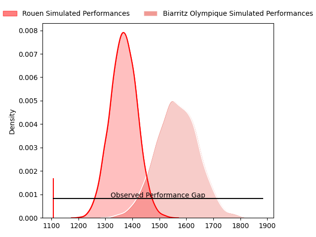
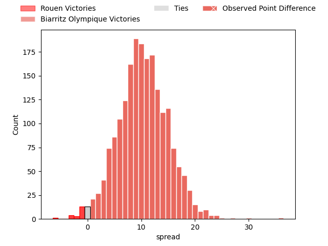
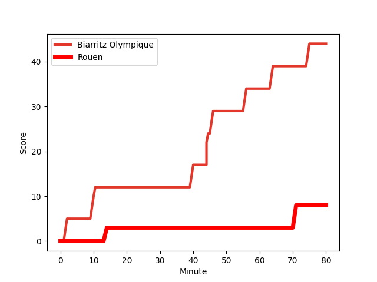
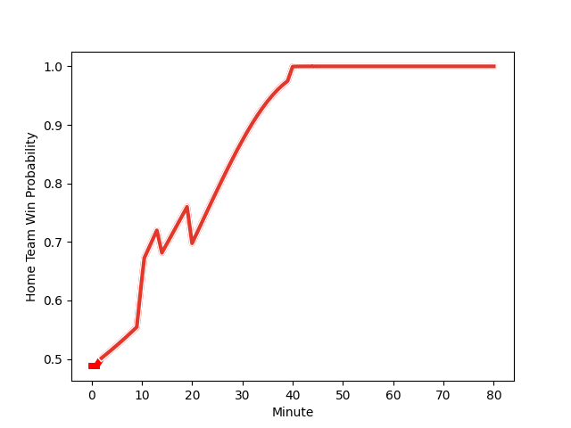

---  
layout: page  
title: Rouen at Biarritz Olympique; 8-44  
date: 2023-02-17 19:30:00 18:00:00 -0500  
categories: match review  
---
# Rouen at Biarritz Olympique; 8-44

# Club Level Predictions

The first set of predictions treats a club as the smallest object, as the club develops its members, organizes a gameplan, and deploys its players as needed for each match. This club model has a prediction of 0.759, which translates to predicting Biarritz Olympique to win by 10.1.

Each club has a rating and a rating deviation (simiar to a Glicko system), and expected performances can be generated. This allows for simulated matches and spreads like the ones below.
## Projected Performances

## Projected Spreads

## Projected Results

# Player Level Predictions

Treating teams instead as an entity made up of the currently active players, I have ratings for each player in an altogether different system. These can be combined to form team ratings once teamsheets are announced, weighting starters a bit higher than the reserves. After the match is played, players can be weighted by their minutes on the field, allowing for an accurate measure of the team's composition. With these compiled team ratings, we can make predictions, measure inaccuracy, and update the individual player ratings.
## Prediction with Player Minutes: Biarritz Olympique by 2.1

Rouen by 1.9 on a neutral field
## Scores over Time

## Win Probability over Time

There were 4 large changes in win probability in this match
## Prediction without Player Minutes: Biarritz Olympique by 3.4

Rouen by 0.6 on a neutral pitch

|   Away Minutes | Away Player                                                               |   Away elo |   Away Percentile |   Number |   Home Percentile |   Home elo | Home Player                                                         |   Home Minutes |
|---------------:|:--------------------------------------------------------------------------|-----------:|------------------:|---------:|------------------:|-----------:|:--------------------------------------------------------------------|---------------:|
|             56 | [Ewan Clément](..//playerfiles//EwanClément_cleaned.md)                   |      94.15 |               nan |        1 |               nan |      94.78 | [Giorgi Nutsubidze](..//playerfiles//GiorgiNutsubidze_cleaned.md)   |             41 |
|             56 | [Ru-Hann Greyling](..//playerfiles//Ru-HannGreyling_cleaned.md)           |      95    |               nan |        2 |                64 |      98.71 | [Thomas Sauveterre](..//playerfiles//ThomasSauveterre_cleaned.md)   |             65 |
|             46 | [Mohamed Boughanmi](..//playerfiles//MohamedBoughanmi_cleaned.md)         |      91.75 |                38 |        3 |               nan |      93.28 | [Luka Azariashvili](..//playerfiles//LukaAzariashvili_cleaned.md)   |             41 |
|             80 | [Jean Leleu](..//playerfiles//JeanLeleu_cleaned.md)                       |      95.96 |                59 |        4 |                60 |      98.2  | [John Dyer](..//playerfiles//JohnDyer_cleaned.md)                   |             65 |
|             20 | [Toby Salmon](..//playerfiles//TobySalmon_cleaned.md)                     |     102.08 |                66 |        5 |                40 |      91.86 | [Josh Tyrell](..//playerfiles//JoshTyrell_cleaned.md)               |             80 |
|             80 | [Fabien Vincent](..//playerfiles//FabienVincent_cleaned.md)               |     103.03 |                71 |        6 |                52 |      96.82 | [Elliott Dixon](..//playerfiles//ElliottDixon_cleaned.md)           |             80 |
|             64 | [Willy N'Diaye](..//playerfiles//WillyN'Diaye_cleaned.md)                 |      96.92 |                60 |        7 |                65 |     100.17 | [Thomas Hebert](..//playerfiles//ThomasHebert_cleaned.md)           |             65 |
|             80 | [Valentino Mapapalangi](..//playerfiles//ValentinoMapapalangi_cleaned.md) |     104.24 |                74 |        8 |                65 |      97.78 | [Temo Matiu](..//playerfiles//TemoMatiu_cleaned.md)                 |             80 |
|             64 | [Joris Lezat](..//playerfiles//JorisLezat_cleaned.md)                     |      87.78 |                27 |        9 |                59 |      96.65 | [Kerman Aurrekoetea](..//playerfiles//KermanAurrekoetea_cleaned.md) |             65 |
|             80 | [Thibault Olender](..//playerfiles//ThibaultOlender_cleaned.md)           |     100.71 |                71 |       10 |                38 |      88.98 | [Baptiste Germain](..//playerfiles//BaptisteGermain_cleaned.md)     |             65 |
|             56 | [Kevin Milhorat](..//playerfiles//KevinMilhorat_cleaned.md)               |      79.21 |                12 |       11 |                34 |      90.02 | [Steeve Barry](..//playerfiles//SteeveBarry_cleaned.md)             |             80 |
|             80 | [John Thomas Jackson](..//playerfiles//JohnThomasJackson_cleaned.md)      |      92.85 |                43 |       12 |                36 |      90.4  | [Auguste Cadot](..//playerfiles//AugusteCadot_cleaned.md)           |             80 |
|             47 | [Alex Luatua](..//playerfiles//AlexLuatua_cleaned.md)                     |      91.31 |                48 |       13 |                48 |      94.59 | [Tyler Morgan](..//playerfiles//TylerMorgan_cleaned.md)             |             65 |
|             80 | [Amidou Marciniek](..//playerfiles//AmidouMarciniek_cleaned.md)           |      92.25 |                42 |       14 |                32 |      89.51 | [Henry Speight](..//playerfiles//HenrySpeight_cleaned.md)           |             80 |
|             80 | [Marius Marty](..//playerfiles//MariusMarty_cleaned.md)                   |      79.66 |                17 |       15 |                27 |      85.71 | [Joe Jonas](..//playerfiles//JoeJonas_cleaned.md)                   |             80 |
|             60 | [Jimi Maximin](..//playerfiles//JimiMaximin_cleaned.md)                   |     110.61 |                84 |       16 |                60 |      97.91 | [Baptiste Erdocio](..//playerfiles//BaptisteErdocio_cleaned.md)     |             39 |
|             34 | [Khvicha Tsopurashvili](..//playerfiles//KhvichaTsopurashvili_cleaned.md) |      96.09 |               nan |       17 |                51 |      95.23 | [Quentin Samaran](..//playerfiles//QuentinSamaran_cleaned.md)       |             39 |
|             33 | [Ugo Delorme](..//playerfiles//UgoDelorme_cleaned.md)                     |      89    |                31 |       18 |                53 |      96.69 | [David O'Callaghan](..//playerfiles//DavidO'Callaghan_cleaned.md)   |             15 |
|             24 | [Soulemane Camara](..//playerfiles//SoulemaneCamara_cleaned.md)           |     106.98 |                84 |       19 |                52 |      93.58 | [Killian Taofifenua](..//playerfiles//KillianTaofifenua_cleaned.md) |             15 |
|             24 | [Jean-Étienne Lesueur](..//playerfiles//Jean-ÉtienneLesueur_cleaned.md)   |      88.42 |                30 |       20 |                57 |      97.48 | [Barnabé Couilloud](..//playerfiles//BarnabéCouilloud_cleaned.md)   |             15 |
|             24 | [Peter Lydon](..//playerfiles//PeterLydon_cleaned.md)                     |     121.75 |                94 |       21 |               nan |      95    | [Gilles Bosch](..//playerfiles//GillesBosch_cleaned.md)             |             15 |
|             16 | [Lucas Costa](..//playerfiles//LucasCosta_cleaned.md)                     |      93.33 |                44 |       22 |                58 |      97.91 | [Darly Domvo](..//playerfiles//DarlyDomvo_cleaned.md)               |             15 |
|             16 | [Théo Nanette](..//playerfiles//ThéoNanette_cleaned.md)                   |      88.89 |                29 |       23 |               nan |      95    | [Bastien Soury](..//playerfiles//BastienSoury_cleaned.md)           |             15 |

