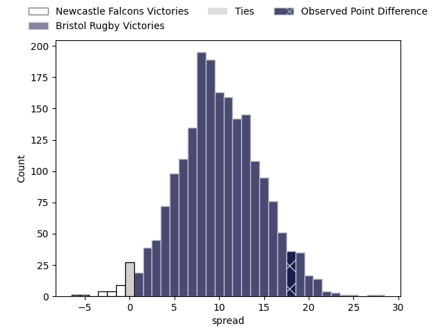
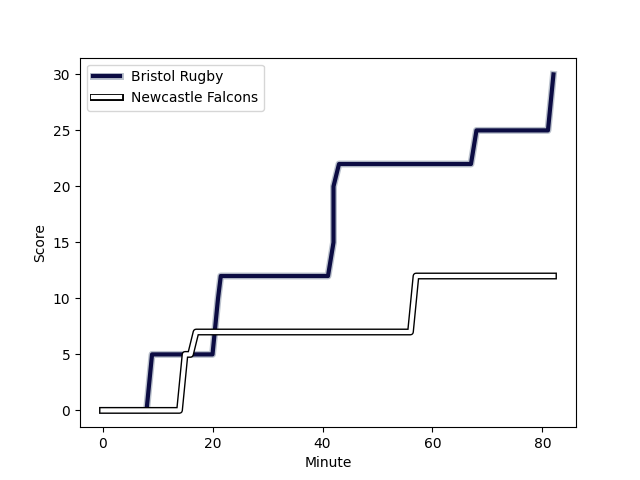
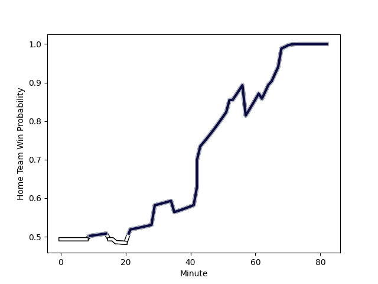

---  
layout: page  
title: Newcastle Falcons at Bristol Rugby; 12.0-30.0  
date: 2023-02-17 14:45:00 18:00:00 -0500  
categories: match review  
---
# Newcastle Falcons at Bristol Rugby; 12.0-30.0

# Club Level Predictions

The first set of predictions treats a club as the smallest object, as the club develops its members, organizes a gameplan, and deploys its players as needed for each match. This club model has a prediction of 0.757, which translates to predicting Bristol Rugby to win by 10.0.

Each club has a rating and a rating deviation (simiar to a Glicko system), and expected performances can be generated. This allows for simulated matches and spreads like the ones below.
## Projected Performances

## Projected Spreads

## Projected Results

# Player Level Predictions

Treating teams instead as an entity made up of the currently active players, I have ratings for each player in an altogether different system. These can be combined to form team ratings once teamsheets are announced, weighting starters a bit higher than the reserves. After the match is played, players can be weighted by their minutes on the field, allowing for an accurate measure of the team's composition. With these compiled team ratings, we can make predictions, measure inaccuracy, and update the individual player ratings.
## Prediction with Player Minutes: Bristol Rugby by 2.8

Newcastle Falcons by 1.2 on a neutral field
## Scores over Time

## Win Probability over Time

There were 8 large changes in win probability in this match
## Prediction without Player Minutes: Bristol Rugby by 2.5

Newcastle Falcons by 1.5 on a neutral pitch

|   Away Minutes | Away Player                                                          |   Away elo |   Away Percentile |   Number |   Home Percentile |   Home elo | Home Player                                                   |   Home Minutes |
|---------------:|:---------------------------------------------------------------------|-----------:|------------------:|---------:|------------------:|-----------:|:--------------------------------------------------------------|---------------:|
|             52 | [Adam Brocklebank](..//playerfiles//AdamBrocklebank_cleaned.md)      |     107.35 |                81 |        1 |                94 |     118.47 | [Jake Woolmore](..//playerfiles//JakeWoolmore_cleaned.md)     |             69 |
|             82 | [Jamie Blamire](..//playerfiles//JamieBlamire_cleaned.md)            |      92.58 |                43 |        2 |                28 |      88.21 | [Harry Thacker](..//playerfiles//HarryThacker_cleaned.md)     |             82 |
|             62 | [Trevor Davison](..//playerfiles//TrevorDavison_cleaned.md)          |      69.85 |                 3 |        3 |                41 |      92.61 | [Max Lahiff](..//playerfiles//MaxLahiff_cleaned.md)           |             69 |
|             62 | [Greg Peterson](..//playerfiles//GregPeterson_cleaned.md)            |      81.97 |                16 |        4 |                87 |     111.45 | [Joe Batley](..//playerfiles//JoeBatley_cleaned.md)           |             73 |
|             82 | [Sebastian de Chaves](..//playerfiles//SebastiandeChaves_cleaned.md) |      86.91 |                25 |        5 |                84 |     109.9  | [Chris Vui](..//playerfiles//ChrisVui_cleaned.md)             |             65 |
|             82 | [Gary Graham](..//playerfiles//GaryGraham_cleaned.md)                |     107.61 |                79 |        6 |                97 |     132.17 | [Steven Luatua](..//playerfiles//StevenLuatua_cleaned.md)     |             75 |
|             82 | [Callum Chick](..//playerfiles//CallumChick_cleaned.md)              |     105.32 |                76 |        7 |                74 |     105.2  | [Fitz Harding](..//playerfiles//FitzHarding_cleaned.md)       |             82 |
|             52 | [Carl Fearns](..//playerfiles//CarlFearns_cleaned.md)                |     125.45 |                96 |        8 |                29 |      89.07 | [Magnus Bradbury](..//playerfiles//MagnusBradbury_cleaned.md) |             82 |
|             82 | [Michael Young](..//playerfiles//MichaelYoung_cleaned.md)            |     124.13 |                97 |        9 |                84 |     108.32 | [Harry Randall](..//playerfiles//HarryRandall_cleaned.md)     |             82 |
|             82 | [Brett Connon](..//playerfiles//BrettConnon_cleaned.md)              |     105.93 |                79 |       10 |                82 |     108.22 | [AJ MacGinty](..//playerfiles//AJMacGinty_cleaned.md)         |             82 |
|             35 | [Mateo Carreras](..//playerfiles//MateoCarreras_cleaned.md)          |      94.54 |                48 |       11 |                78 |     105.64 | [Gabriel Ibitoye](..//playerfiles//GabrielIbitoye_cleaned.md) |             82 |
|             82 | [Matias Orlando](..//playerfiles//MatiasOrlando_cleaned.md)          |      82.07 |                15 |       12 |                 9 |      76.76 | [James Williams](..//playerfiles//JamesWilliams_cleaned.md)   |             82 |
|             82 | [Ben Stevenson](..//playerfiles//BenStevenson_cleaned.md)            |      99.85 |                64 |       13 |                96 |     126.85 | [Semi Radradra](..//playerfiles//SemiRadradra_cleaned.md)     |             82 |
|             82 | [Adam Radwan](..//playerfiles//AdamRadwan_cleaned.md)                |     133.92 |                98 |       14 |                48 |      94.4  | [Ratu Naulago](..//playerfiles//RatuNaulago_cleaned.md)       |             53 |
|             29 | [Tom Penny](..//playerfiles//TomPenny_cleaned.md)                    |     130.14 |                97 |       15 |                11 |      75.62 | [Noah Heward](..//playerfiles//NoahHeward_cleaned.md)         |             82 |
|              0 | [Ollie Fletcher](..//playerfiles//OllieFletcher_cleaned.md)          |      95    |               nan |       16 |               nan |      95    | [Fred Davies](..//playerfiles//FredDavies_cleaned.md)         |              7 |
|             30 | [Logovi'i Mulipola](..//playerfiles//Logovi'iMulipola_cleaned.md)    |     104.87 |                81 |       17 |                46 |      94.03 | [Yann Thomas](..//playerfiles//YannThomas_cleaned.md)         |             13 |
|             20 | [Richard Palframan](..//playerfiles//RichardPalframan_cleaned.md)    |      97.81 |                54 |       18 |               nan |      91.76 | [George Kloska](..//playerfiles//GeorgeKloska_cleaned.md)     |             13 |
|             20 | [Philip van der Walt](..//playerfiles//PhilipvanderWalt_cleaned.md)  |      92.61 |                41 |       19 |               nan |      95    | [Ed Holmes](..//playerfiles//EdHolmes_cleaned.md)             |             17 |
|             30 | [Freddie Lockwood](..//playerfiles//FreddieLockwood_cleaned.md)      |     105.52 |                72 |       20 |                52 |      96.31 | [Jake Heenan](..//playerfiles//JakeHeenan_cleaned.md)         |              9 |
|              5 | [Sam Stuart](..//playerfiles//SamStuart_cleaned.md)                  |      64.53 |                 2 |       21 |                11 |      78.27 | [Andy Uren](..//playerfiles//AndyUren_cleaned.md)             |              0 |
|             47 | [Tian Schoeman](..//playerfiles//TianSchoeman_cleaned.md)            |     117.58 |                91 |       22 |               nan |      94.32 | [Harry Ascherl](..//playerfiles//HarryAscherl_cleaned.md)     |              0 |
|             48 | [Alex Tait](..//playerfiles//AlexTait_cleaned.md)                    |      95    |               nan |       23 |                11 |      80.14 | [Ioan Lloyd](..//playerfiles//IoanLloyd_cleaned.md)           |             29 |

