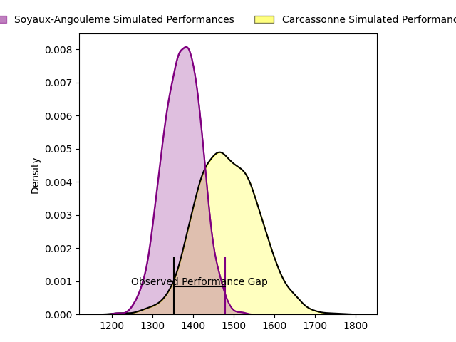
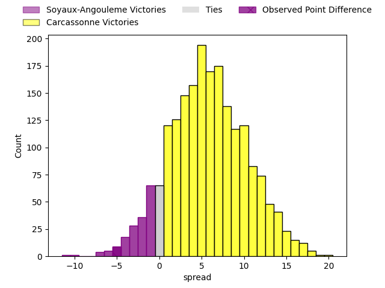
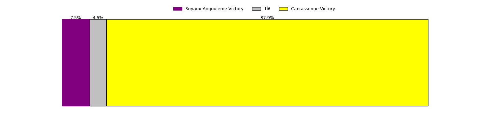
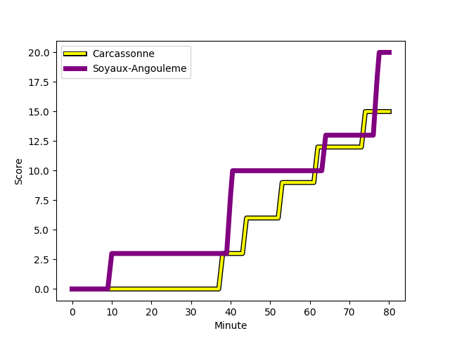
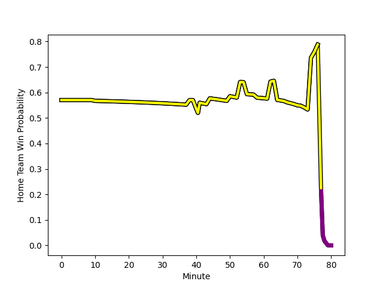

---  
layout: page  
title: Soyaux-Angouleme at Carcassonne; 20-15  
date: 2023-02-17 19:30:00 18:00:00 -0500  
categories: match review  
---
# Soyaux-Angouleme at Carcassonne; 20-15

# Club Level Predictions

The first set of predictions treats a club as the smallest object, as the club develops its members, organizes a gameplan, and deploys its players as needed for each match. This club model has a prediction of 0.657, which translates to predicting Carcassonne to win by 5.7.

Each club has a rating and a rating deviation (simiar to a Glicko system), and expected performances can be generated. This allows for simulated matches and spreads like the ones below.
## Projected Performances

## Projected Spreads

## Projected Results

# Player Level Predictions

Treating teams instead as an entity made up of the currently active players, I have ratings for each player in an altogether different system. These can be combined to form team ratings once teamsheets are announced, weighting starters a bit higher than the reserves. After the match is played, players can be weighted by their minutes on the field, allowing for an accurate measure of the team's composition. With these compiled team ratings, we can make predictions, measure inaccuracy, and update the individual player ratings.
## Prediction with Player Minutes: Carcassonne by 17.6

Carcassonne by 13.6 on a neutral field
## Scores over Time

## Win Probability over Time

There were 10 large changes in win probability in this match
## Prediction without Player Minutes: Carcassonne by 12.9

Carcassonne by 8.9 on a neutral pitch

|   Away Minutes | Away Player                                                                |   Away elo |   Away Percentile |   Number |   Home Percentile |   Home elo | Home Player                                                                    |   Home Minutes |
|---------------:|:---------------------------------------------------------------------------|-----------:|------------------:|---------:|------------------:|-----------:|:-------------------------------------------------------------------------------|---------------:|
|             53 | [Omar Odishvili](..//playerfiles//OmarOdishvili_cleaned.md)                |      94.21 |                47 |        1 |                 7 |      76.14 | [Youssef Amrouni](..//playerfiles//YoussefAmrouni_cleaned.md)                  |             67 |
|             50 | [Patxi Bidart](..//playerfiles//PatxiBidart_cleaned.md)                    |      83.15 |                15 |        2 |                23 |      86.83 | [Raphaël Carbou](..//playerfiles//RaphaëlCarbou_cleaned.md)                    |             50 |
|             50 | [Shota Gogisvanidze](..//playerfiles//ShotaGogisvanidze_cleaned.md)        |     103.95 |                78 |        3 |                63 |     105.63 | [Vakhtangi Akhobadze](..//playerfiles//VakhtangiAkhobadze_cleaned.md)          |             67 |
|             50 | [Shota Gogisvanidze](..//playerfiles//ShotaGogisvanidze_cleaned.md)        |     103.95 |                78 |        3 |                82 |     105.63 | [Vakhtangi Akhobadze](..//playerfiles//VakhtangiAkhobadze_cleaned.md)          |             67 |
|             55 | [Matt Beukeboom](..//playerfiles//MattBeukeboom_cleaned.md)                |      69.09 |                 5 |        4 |                62 |      99.44 | [Come Clayver Joussain](..//playerfiles//ComeClayverJoussain_cleaned.md)       |             58 |
|             80 | [Sikeli Nabou](..//playerfiles//SikeliNabou_cleaned.md)                    |      87.55 |                26 |        5 |                58 |      97.49 | [Rynard Ligtoring Landman](..//playerfiles//RynardLigtoringLandman_cleaned.md) |             80 |
|             80 | [Gautier Gibouin](..//playerfiles//GautierGibouin_cleaned.md)              |      78.13 |                 9 |        6 |                61 |      98.89 | [Stephane Onambele Mbarga](..//playerfiles//StephaneOnambeleMbarga_cleaned.md) |             67 |
|             80 | [Gautier Gibouin](..//playerfiles//GautierGibouin_cleaned.md)              |      78.13 |                 9 |        6 |                40 |      98.89 | [Stephane Onambele Mbarga](..//playerfiles//StephaneOnambeleMbarga_cleaned.md) |             67 |
|             80 | [Germain Burgaud](..//playerfiles//GermainBurgaud_cleaned.md)              |     104.28 |                74 |        7 |                49 |      95.4  | [Robert Harley](..//playerfiles//RobertHarley_cleaned.md)                      |             80 |
|             55 | [Yassine Jarmouni](..//playerfiles//YassineJarmouni_cleaned.md)            |      94.88 |                46 |        8 |                82 |     109.59 | [Pierre Reynaud](..//playerfiles//PierreReynaud_cleaned.md)                    |             80 |
|             55 | [Yassine Jarmouni](..//playerfiles//YassineJarmouni_cleaned.md)            |      94.88 |                55 |        8 |                82 |     109.59 | [Pierre Reynaud](..//playerfiles//PierreReynaud_cleaned.md)                    |             80 |
|             55 | [Adrien Bau](..//playerfiles//AdrienBau_cleaned.md)                        |      54.52 |                 1 |        9 |                84 |     116.61 | [Samuel Marques](..//playerfiles//SamuelMarques_cleaned.md)                    |             80 |
|             55 | [Adrien Bau](..//playerfiles//AdrienBau_cleaned.md)                        |      54.52 |                 1 |        9 |                94 |     116.61 | [Samuel Marques](..//playerfiles//SamuelMarques_cleaned.md)                    |             80 |
|             71 | [Matthieu Ugalde](..//playerfiles//MatthieuUgalde_cleaned.md)              |      96.38 |                51 |       10 |                20 |      86.03 | [Dorian Jones](..//playerfiles//DorianJones_cleaned.md)                        |             41 |
|             80 | [Marvin Lestremau](..//playerfiles//MarvinLestremau_cleaned.md)            |      85.99 |                22 |       11 |                66 |     100.47 | [Clément Clavières](..//playerfiles//ClémentClavières_cleaned.md)              |             80 |
|             53 | [Nasoni Naqiri Kunavore](..//playerfiles//NasoniNaqiriKunavore_cleaned.md) |     114.26 |                89 |       12 |                45 |      93.19 | [Jordan Puletua](..//playerfiles//JordanPuletua_cleaned.md)                    |             80 |
|             80 | [Ledua Mau](..//playerfiles//LeduaMau_cleaned.md)                          |      77.38 |                 9 |       13 |                36 |      90.03 | [Martin Dulon](..//playerfiles//MartinDulon_cleaned.md)                        |             80 |
|             80 | [Pierre Lafitte](..//playerfiles//PierreLafitte_cleaned.md)                |      73.46 |                10 |       14 |                31 |      89.15 | [Léo Darrelatour](..//playerfiles//LéoDarrelatour_cleaned.md)                  |             80 |
|             80 | [Rémi Brosset](..//playerfiles//RémiBrosset_cleaned.md)                    |     106.34 |                78 |       15 |                30 |      87.29 | [Damien Añon](..//playerfiles//DamienAñon_cleaned.md)                          |             41 |
|             30 | [Georgy Balakarev](..//playerfiles//GeorgyBalakarev_cleaned.md)            |      95    |               nan |       16 |                99 |     142.48 | [Benoit Jasmin](..//playerfiles//BenoitJasmin_cleaned.md)                      |             39 |
|             30 | [Seydou Diakité](..//playerfiles//SeydouDiakité_cleaned.md)                |      87.57 |                44 |       17 |                42 |      91.65 | [Baptiste Mouchous](..//playerfiles//BaptisteMouchous_cleaned.md)              |             39 |
|             30 | [Seydou Diakité](..//playerfiles//SeydouDiakité_cleaned.md)                |      87.57 |                44 |       17 |                26 |      91.65 | [Baptiste Mouchous](..//playerfiles//BaptisteMouchous_cleaned.md)              |             39 |
|             27 | [Inaki Ayarza Saporta](..//playerfiles//InakiAyarzaSaporta_cleaned.md)     |      89.61 |                33 |       18 |                93 |     113.95 | [Luka Petriashvili](..//playerfiles//LukaPetriashvili_cleaned.md)              |             30 |
|             27 | [Inaki Ayarza Saporta](..//playerfiles//InakiAyarzaSaporta_cleaned.md)     |      89.61 |                33 |       18 |                85 |     113.95 | [Luka Petriashvili](..//playerfiles//LukaPetriashvili_cleaned.md)              |             30 |
|             27 | [Khatchik Vartan](..//playerfiles//KhatchikVartan_cleaned.md)              |      83.77 |                16 |       19 |                18 |      83.84 | [George Merrick](..//playerfiles//GeorgeMerrick_cleaned.md)                    |             22 |
|             25 | [Lucas Rubio](..//playerfiles//LucasRubio_cleaned.md)                      |      95.56 |               nan |       20 |                25 |      87.29 | [Grégory Annetta](..//playerfiles//GrégoryAnnetta_cleaned.md)                  |             13 |
|             25 | [Matt Va'ai](..//playerfiles//MattVa'ai_cleaned.md)                        |      96.91 |                52 |       21 |                12 |      81.61 | [Jules Martinez](..//playerfiles//JulesMartinez_cleaned.md)                    |             13 |
|             25 | [Matt Va'ai](..//playerfiles//MattVa'ai_cleaned.md)                        |      96.91 |                52 |       21 |                 6 |      81.61 | [Jules Martinez](..//playerfiles//JulesMartinez_cleaned.md)                    |             13 |
|             25 | [Robin Copeland](..//playerfiles//RobinCopeland_cleaned.md)                |      92.73 |                39 |       22 |                84 |     104.66 | [Jérémy Boyadjis](..//playerfiles//JérémyBoyadjis_cleaned.md)                  |             13 |
|              9 | [Jacob Botica](..//playerfiles//JacobBotica_cleaned.md)                    |      91.53 |               nan |       23 |               nan |     nan    | nan                                                                            |            nan |

