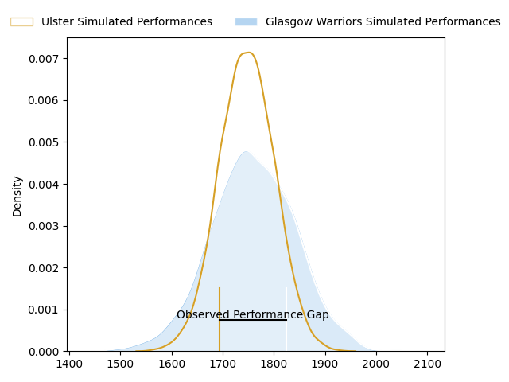
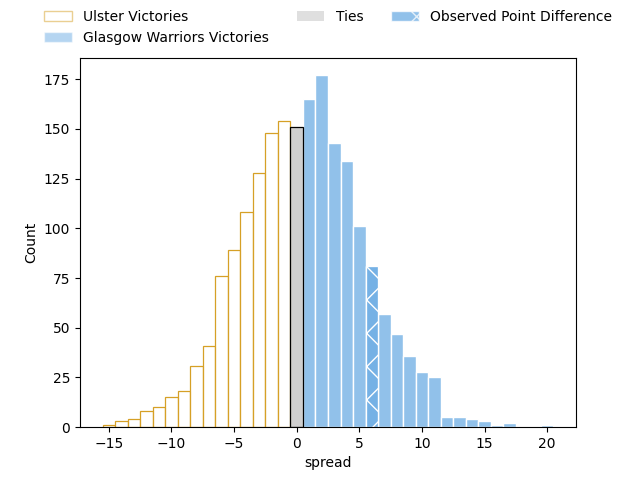
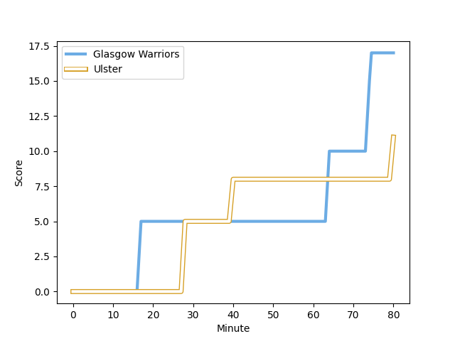
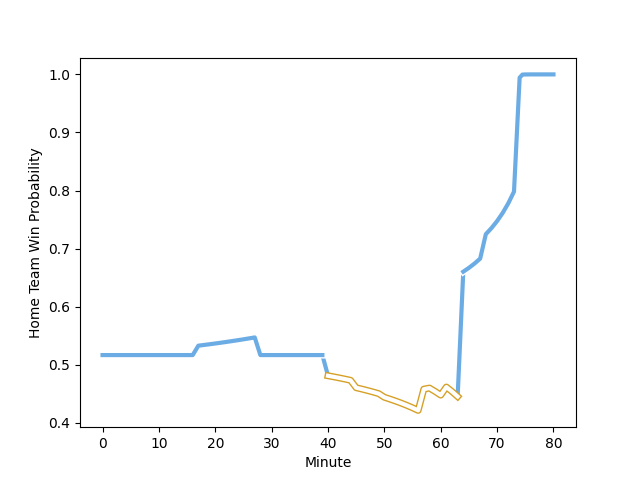

---  
layout: page  
title: Ulster at Glasgow Warriors; 11-17  
date: 2023-02-17 20:35:00 18:00:00 -0500  
categories: match review  
---
# Ulster at Glasgow Warriors; 11-17

# Club Level Predictions

The first set of predictions treats a club as the smallest object, as the club develops its members, organizes a gameplan, and deploys its players as needed for each match. This club model has a prediction of 0.515, which translates to predicting Glasgow Warriors to win by 0.5.

Each club has a rating and a rating deviation (simiar to a Glicko system), and expected performances can be generated. This allows for simulated matches and spreads like the ones below.
## Projected Performances

## Projected Spreads

## Projected Results

# Player Level Predictions

Treating teams instead as an entity made up of the currently active players, I have ratings for each player in an altogether different system. These can be combined to form team ratings once teamsheets are announced, weighting starters a bit higher than the reserves. After the match is played, players can be weighted by their minutes on the field, allowing for an accurate measure of the team's composition. With these compiled team ratings, we can make predictions, measure inaccuracy, and update the individual player ratings.
## Prediction with Player Minutes: Glasgow Warriors by 6.1

Glasgow Warriors by 2.1 on a neutral field
## Scores over Time

## Win Probability over Time

There were 9 large changes in win probability in this match
## Prediction without Player Minutes: Glasgow Warriors by 2.7

Ulster by 1.3 on a neutral pitch

|   Away Minutes | Away Player                                                                 |   Away elo |   Away Percentile |   Number |   Home Percentile |   Home elo | Home Player                                                            |   Home Minutes |
|---------------:|:----------------------------------------------------------------------------|-----------:|------------------:|---------:|------------------:|-----------:|:-----------------------------------------------------------------------|---------------:|
|             45 | [Eric O'Sullivan](..//playerfiles//EricO'Sullivan_cleaned.md)               |      95.57 |                52 |        1 |                65 |      97.17 | [Nathan McBeth](..//playerfiles//NathanMcBeth_cleaned.md)              |             57 |
|             61 | [Tom Stewart](..//playerfiles//TomStewart_cleaned.md)                       |     100.61 |                69 |        2 |                41 |      92.95 | [Johnny Matthews](..//playerfiles//JohnnyMatthews_cleaned.md)          |             57 |
|             68 | [Jeffery To'omaga-Allen](..//playerfiles//JefferyTo'omaga-Allen_cleaned.md) |     112.84 |                91 |        3 |                77 |     103.75 | [Lucio Sordoni](..//playerfiles//LucioSordoni_cleaned.md)              |             57 |
|             68 | [Alan O'Connor](..//playerfiles//AlanO'Connor_cleaned.md)                   |     109.48 |                84 |        4 |                80 |     107.27 | [Lewis Bean](..//playerfiles//LewisBean_cleaned.md)                    |             80 |
|             80 | [Kieran Treadwell](..//playerfiles//KieranTreadwell_cleaned.md)             |     100.14 |                60 |        5 |               nan |      95    | [Scott Cummings](..//playerfiles//ScottCummings_cleaned.md)            |             57 |
|             80 | [Harry Sheridan](..//playerfiles//HarrySheridan_cleaned.md)                 |     100.54 |                65 |        6 |                60 |      98.73 | [Thomas Gordon](..//playerfiles//ThomasGordon_cleaned.md)              |             80 |
|             80 | [Jordi Murphy](..//playerfiles//JordiMurphy_cleaned.md)                     |      95.58 |               nan |        7 |                72 |     104.04 | [Sione Vailanu](..//playerfiles//SioneVailanu_cleaned.md)              |             76 |
|             61 | [Nick Timoney](..//playerfiles//NickTimoney_cleaned.md)                     |     115.73 |                90 |        8 |                82 |     109.68 | [Jack Dempsey](..//playerfiles//JackDempsey_cleaned.md)                |             80 |
|             50 | [Nathan Doak](..//playerfiles//NathanDoak_cleaned.md)                       |     104.79 |                78 |        9 |                72 |     104.18 | [Jamie Dobie](..//playerfiles//JamieDobie_cleaned.md)                  |             57 |
|             80 | [Billy Burns](..//playerfiles//BillyBurns_cleaned.md)                       |      98.64 |                59 |       10 |                43 |      93.61 | [Tom Jordan](..//playerfiles//TomJordan_cleaned.md)                    |             68 |
|             80 | [Jacob Stockdale](..//playerfiles//JacobStockdale_cleaned.md)               |      95.51 |                51 |       11 |                95 |     122.63 | [Ollie Smith](..//playerfiles//OllieSmith_cleaned.md)                  |             80 |
|             80 | [Stewart Moore](..//playerfiles//StewartMoore_cleaned.md)                   |     113.05 |                87 |       12 |                68 |     101.5  | [Sam Johnson](..//playerfiles//SamJohnson_cleaned.md)                  |             80 |
|             77 | [James Hume](..//playerfiles//JamesHume_cleaned.md)                         |     102.27 |                71 |       13 |                95 |     124.97 | [Stafford McDowall](..//playerfiles//StaffordMcDowall_cleaned.md)      |             80 |
|             58 | [Ben Moxham](..//playerfiles//BenMoxham_cleaned.md)                         |     101.39 |                68 |       14 |                69 |     101.5  | [Cole Forbes](..//playerfiles//ColeForbes_cleaned.md)                  |             80 |
|             80 | [Ethan McIlroy](..//playerfiles//EthanMcIlroy_cleaned.md)                   |      98.5  |                53 |       15 |                38 |      90.2  | [Josh McKay](..//playerfiles//JoshMcKay_cleaned.md)                    |             80 |
|             35 | [Rory Sutherland](..//playerfiles//RorySutherland_cleaned.md)               |     101.96 |                65 |       16 |                86 |     108.24 | [Jamie Bhatti](..//playerfiles//JamieBhatti_cleaned.md)                |             23 |
|             19 | [John Andrew](..//playerfiles//JohnAndrew_cleaned.md)                       |      98.93 |               nan |       17 |                89 |     111.69 | [Fraser Brown](..//playerfiles//FraserBrown_cleaned.md)                |             23 |
|             12 | [Andrew Warwick](..//playerfiles//AndrewWarwick_cleaned.md)                 |      98.54 |                56 |       18 |                76 |     103.07 | [Simon Berghan](..//playerfiles//SimonBerghan_cleaned.md)              |             23 |
|             12 | [Cormac Izuchukwu](..//playerfiles//CormacIzuchukwu_cleaned.md)             |      95    |               nan |       19 |                86 |     111.63 | [Jean-Pierre du Preez](..//playerfiles//Jean-PierreduPreez_cleaned.md) |             23 |
|             19 | [Greg Jones](..//playerfiles//GregJones_cleaned.md)                         |      96.66 |                53 |       20 |                58 |      98.37 | [Euan Ferrie](..//playerfiles//EuanFerrie_cleaned.md)                  |              4 |
|             30 | [John Cooney](..//playerfiles//JohnCooney_cleaned.md)                       |     105.03 |                74 |       21 |                52 |      95.55 | [Ali Price](..//playerfiles//AliPrice_cleaned.md)                      |             23 |
|             22 | [Craig Gilroy](..//playerfiles//CraigGilroy_cleaned.md)                     |      95    |               nan |       22 |                47 |      95.22 | [Duncan Weir](..//playerfiles//DuncanWeir_cleaned.md)                  |             12 |
|              3 | [Luke Marshall](..//playerfiles//LukeMarshall_cleaned.md)                   |      99.2  |                63 |       23 |               nan |     nan    | nan                                                                    |            nan |

