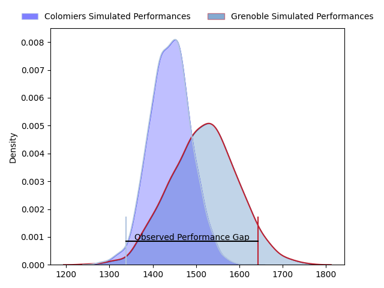
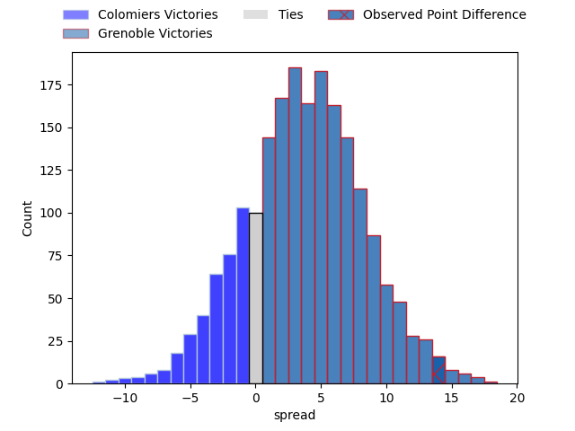
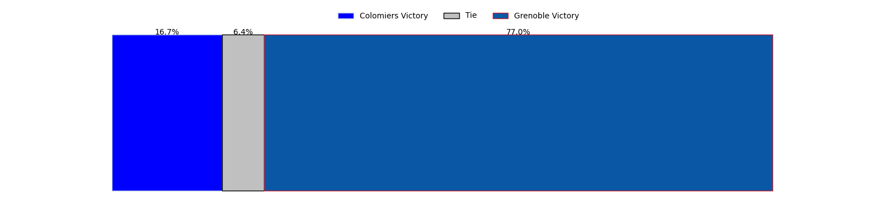
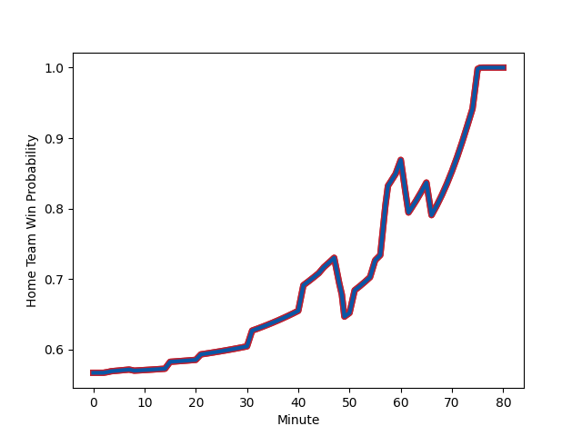

---  
layout: page  
title: Colomiers at Grenoble; 20-34  
date: 2023-02-17 21:00:00 18:00:00 -0500  
categories: match review  
---
# Colomiers at Grenoble; 20-34

# Club Level Predictions

The first set of predictions treats a club as the smallest object, as the club develops its members, organizes a gameplan, and deploys its players as needed for each match. This club model has a prediction of 0.609, which translates to predicting Grenoble to win by 3.9.

Each club has a rating and a rating deviation (simiar to a Glicko system), and expected performances can be generated. This allows for simulated matches and spreads like the ones below.
## Projected Performances

## Projected Spreads

## Projected Results

# Player Level Predictions

Treating teams instead as an entity made up of the currently active players, I have ratings for each player in an altogether different system. These can be combined to form team ratings once teamsheets are announced, weighting starters a bit higher than the reserves. After the match is played, players can be weighted by their minutes on the field, allowing for an accurate measure of the team's composition. With these compiled team ratings, we can make predictions, measure inaccuracy, and update the individual player ratings.
## Prediction with Player Minutes: Grenoble by 15.7

Grenoble by 11.7 on a neutral field
## Scores over Time

## Win Probability over Time

There were 9 large changes in win probability in this match
## Prediction without Player Minutes: Grenoble by 13.8

Grenoble by 9.8 on a neutral pitch

|   Away Minutes | Away Player                                                     |   Away elo |   Away Percentile |   Number |   Home Percentile |   Home elo | Home Player                                                           |   Home Minutes |
|---------------:|:----------------------------------------------------------------|-----------:|------------------:|---------:|------------------:|-----------:|:----------------------------------------------------------------------|---------------:|
|             51 | [Guillaume Tartas](..//playerfiles//GuillaumeTartas_cleaned.md) |     121.61 |                95 |        1 |                96 |     121.06 | [Zack Gauthier](..//playerfiles//ZackGauthier_cleaned.md)             |             49 |
|             51 | [Hikawera Elliot](..//playerfiles//HikaweraElliot_cleaned.md)   |     101.33 |                64 |        2 |                31 |      89.95 | [Enzo Camilleri](..//playerfiles//EnzoCamilleri_cleaned.md)           |             45 |
|             51 | [Robin Bellemand](..//playerfiles//RobinBellemand_cleaned.md)   |      87.93 |                23 |        3 |                61 |      98.65 | [Irakli Aptsiauri](..//playerfiles//IrakliAptsiauri_cleaned.md)       |             49 |
|             80 | [Alexandre Ricard](..//playerfiles//AlexandreRicard_cleaned.md) |      82.53 |                25 |        4 |                76 |     104.83 | [Thomas Lainault](..//playerfiles//ThomasLainault_cleaned.md)         |             80 |
|             80 | [Alexandre Ricard](..//playerfiles//AlexandreRicard_cleaned.md) |      82.53 |                14 |        4 |                76 |     104.83 | [Thomas Lainault](..//playerfiles//ThomasLainault_cleaned.md)         |             80 |
|             55 | [Jack Whetton](..//playerfiles//JackWhetton_cleaned.md)         |      93.88 |               nan |        5 |                67 |     100.73 | [Tanginoa Halaifonua](..//playerfiles//TanginoaHalaifonua_cleaned.md) |             60 |
|             55 | [Jean Thomas](..//playerfiles//JeanThomas_cleaned.md)           |     107.11 |                81 |        6 |                68 |     102.03 | [Marnus Schoeman](..//playerfiles//MarnusSchoeman_cleaned.md)         |             49 |
|             80 | [Waël Ponpon](..//playerfiles//WaëlPonpon_cleaned.md)           |      87.17 |                24 |        7 |                77 |     106.1  | [Thibaut Martel](..//playerfiles//ThibautMartel_cleaned.md)           |             49 |
|             80 | [Yann Peysson](..//playerfiles//YannPeysson_cleaned.md)         |      73.61 |                 7 |        8 |                92 |     119.3  | [Pio Muarua](..//playerfiles//PioMuarua_cleaned.md)                   |             80 |
|             60 | [Mathis Galthié](..//playerfiles//MathisGalthié_cleaned.md)     |      96.57 |                49 |        9 |                78 |     104.46 | [Éric Escande](..//playerfiles//ÉricEscande_cleaned.md)               |             55 |
|             80 | [Romuald Séguy](..//playerfiles//RomualdSéguy_cleaned.md)       |      95.13 |                50 |       10 |                78 |     105.26 | [Romain Barthélémy](..//playerfiles//RomainBarthélémy_cleaned.md)     |             80 |
|             60 | [Valentin Saurs](..//playerfiles//ValentinSaurs_cleaned.md)     |      89.49 |                33 |       11 |                69 |     101.37 | [Wilfried Hulleu](..//playerfiles//WilfriedHulleu_cleaned.md)         |             80 |
|             80 | [Paul Pimienta](..//playerfiles//PaulPimienta_cleaned.md)       |     138.6  |                98 |       12 |                50 |      95.23 | [Terence Hepetema](..//playerfiles//TerenceHepetema_cleaned.md)       |             80 |
|             55 | [Grégoire Maurino](..//playerfiles//GrégoireMaurino_cleaned.md) |     106.72 |                80 |       13 |                19 |      85.39 | [Romain Fusier](..//playerfiles//RomainFusier_cleaned.md)             |             15 |
|             80 | [Victor Moro](..//playerfiles//VictorMoro_cleaned.md)           |      58.5  |                 2 |       14 |                49 |      94.49 | [Karim Qadiri](..//playerfiles//KarimQadiri_cleaned.md)               |             80 |
|             80 | [Max Auriac](..//playerfiles//MaxAuriac_cleaned.md)             |     105.18 |                77 |       15 |                85 |     112.33 | [Julien Farnoux](..//playerfiles//JulienFarnoux_cleaned.md)           |             80 |
|             29 | [Thomas Dubois](..//playerfiles//ThomasDubois_cleaned.md)       |      74.86 |                 6 |       16 |                60 |      98.84 | [Bautista Ezcurra](..//playerfiles//BautistaEzcurra_cleaned.md)       |             65 |
|             29 | [Thomas Larrieu](..//playerfiles//ThomasLarrieu_cleaned.md)     |     123.98 |                97 |       17 |                48 |      93.8  | [Jean-Charles Orioli](..//playerfiles//Jean-CharlesOrioli_cleaned.md) |             35 |
|             29 | [Hugo Pirlet](..//playerfiles//HugoPirlet_cleaned.md)           |      70.58 |                 4 |       18 |                13 |      83.14 | [Luka Goginava](..//playerfiles//LukaGoginava_cleaned.md)             |             31 |
|             25 | [Fabien Perrin](..//playerfiles//FabienPerrin_cleaned.md)       |      98.04 |                59 |       19 |                52 |      98.87 | [Clément Ancely](..//playerfiles//ClémentAncely_cleaned.md)           |             31 |
|             25 | [Jorick Dastugue](..//playerfiles//JorickDastugue_cleaned.md)   |      74.7  |                 8 |       20 |               nan |      95.85 | [Antonin Berruyer](..//playerfiles//AntoninBerruyer_cleaned.md)       |             31 |
|             20 | [Ugo Seguela](..//playerfiles//UgoSeguela_cleaned.md)           |      86.59 |                29 |       21 |                58 |      97.34 | [Regis Montagne](..//playerfiles//RegisMontagne_cleaned.md)           |             31 |
|             20 | [Peni Rokoduguni](..//playerfiles//PeniRokoduguni_cleaned.md)   |      74.04 |                 8 |       22 |                45 |      93.17 | [Felipe Ezcurra](..//playerfiles//FelipeEzcurra_cleaned.md)           |             25 |
|             25 | [Louis Descoux](..//playerfiles//LouisDescoux_cleaned.md)       |      95    |               nan |       23 |                48 |      95.73 | [Adrien Vigne](..//playerfiles//AdrienVigne_cleaned.md)               |             20 |

