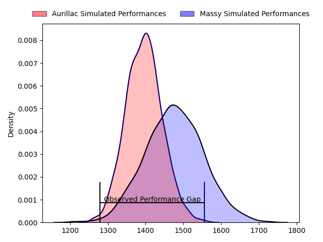
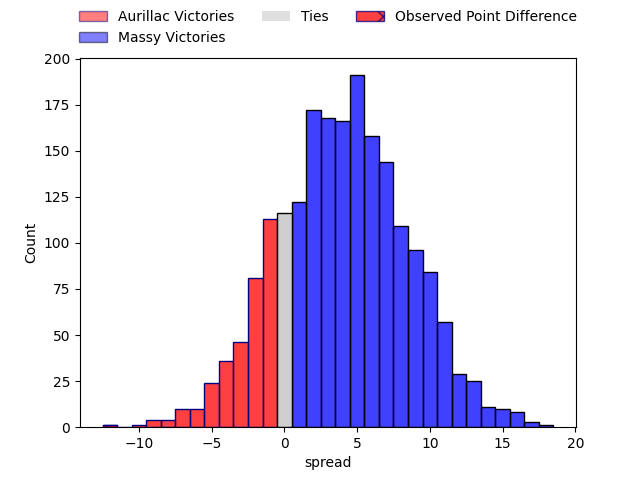
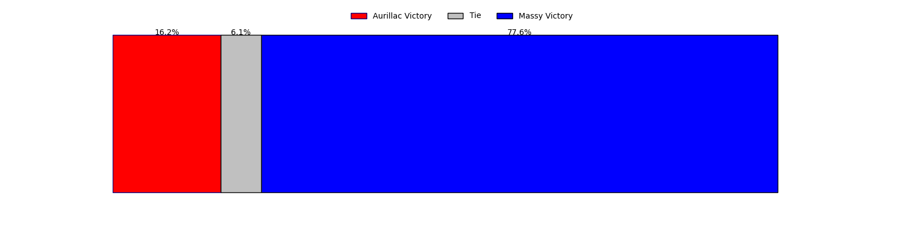
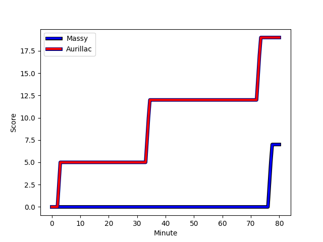
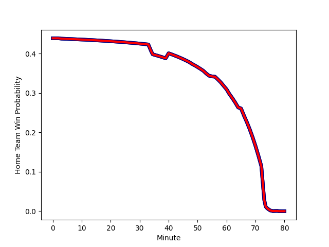

---  
layout: page  
title: Aurillac at Massy; 19-7  
date: 2023-02-17 19:30:00 18:00:00 -0500  
categories: match review  
---
# Aurillac at Massy; 19-7

# Club Level Predictions

The first set of predictions treats a club as the smallest object, as the club develops its members, organizes a gameplan, and deploys its players as needed for each match. This club model has a prediction of 0.612, which translates to predicting Massy to win by 4.0.

Each club has a rating and a rating deviation (simiar to a Glicko system), and expected performances can be generated. This allows for simulated matches and spreads like the ones below.
## Projected Performances

## Projected Spreads

## Projected Results

# Player Level Predictions

Treating teams instead as an entity made up of the currently active players, I have ratings for each player in an altogether different system. These can be combined to form team ratings once teamsheets are announced, weighting starters a bit higher than the reserves. After the match is played, players can be weighted by their minutes on the field, allowing for an accurate measure of the team's composition. With these compiled team ratings, we can make predictions, measure inaccuracy, and update the individual player ratings.
## Prediction with Player Minutes: Aurillac by 1.9

Aurillac by 5.9 on a neutral field
## Scores over Time

## Win Probability over Time

There were 7 large changes in win probability in this match
## Prediction without Player Minutes: Aurillac by 3.1

Aurillac by 7.1 on a neutral pitch

|   Away Minutes | Away Player                                                                                           |   Away elo |   Away Percentile |   Number |   Home Percentile |   Home elo | Home Player                                                                     |   Home Minutes |
|---------------:|:------------------------------------------------------------------------------------------------------|-----------:|------------------:|---------:|------------------:|-----------:|:--------------------------------------------------------------------------------|---------------:|
|             48 | [Robert Rodgers](..//playerfiles//RobertRodgers_cleaned.md)                                           |      90.52 |                30 |        1 |                10 |      81.57 | [Fernandez Correa](..//playerfiles//FernandezCorrea_cleaned.md)                 |             48 |
|             48 | [Robert Rodgers](..//playerfiles//RobertRodgers_cleaned.md)                                           |      90.52 |                35 |        1 |                15 |      81.57 | [Fernandez Correa](..//playerfiles//FernandezCorrea_cleaned.md)                 |             48 |
|             48 | [Robert Rodgers](..//playerfiles//RobertRodgers_cleaned.md)                                           |      90.52 |                30 |        1 |                15 |      81.57 | [Fernandez Correa](..//playerfiles//FernandezCorrea_cleaned.md)                 |             48 |
|             48 | [Robert Rodgers](..//playerfiles//RobertRodgers_cleaned.md)                                           |      90.52 |                35 |        1 |                10 |      81.57 | [Fernandez Correa](..//playerfiles//FernandezCorrea_cleaned.md)                 |             48 |
|             61 | [Adrian Smith](..//playerfiles//AdrianSmith_cleaned.md)                                               |      97.26 |                60 |        2 |                30 |      91.16 | [Corentin Chabeaudie](..//playerfiles//CorentinChabeaudie_cleaned.md)           |             11 |
|             65 | [Giorgi Kartvelishvili](..//playerfiles//GiorgiKartvelishvili_cleaned.md)                             |     106.98 |                84 |        3 |                40 |      91.9  | [Guiterembi Vickos](..//playerfiles//GuiterembiVickos_cleaned.md)               |             40 |
|             61 | [Martial Rolland](..//playerfiles//MartialRolland_cleaned.md)                                         |      97.06 |               nan |        4 |                28 |      90.43 | [Abongile Nonkontwana](..//playerfiles//AbongileNonkontwana_cleaned.md)         |             59 |
|             80 | [Georgi Javakhia](..//playerfiles//GeorgiJavakhia_cleaned.md)                                         |      98.16 |                60 |        5 |                 8 |      74.73 | [Andrew Chauveau](..//playerfiles//AndrewChauveau_cleaned.md)                   |             65 |
|             53 | [Cam Dodson](..//playerfiles//CamDodson_cleaned.md)                                                   |     100.6  |                66 |        6 |                26 |      88.21 | [Samuel Nollet](..//playerfiles//SamuelNollet_cleaned.md)                       |             80 |
|             80 | [Didier Tison](..//playerfiles//DidierTison_cleaned.md)                                               |     100.48 |                65 |        7 |                 6 |      68.87 | [Ewan Coetzee](..//playerfiles//EwanCoetzee_cleaned.md)                         |             40 |
|             48 | [Latuka Maituku](..//playerfiles//LatukaMaituku_cleaned.md)                                           |      85.46 |                16 |        8 |                23 |      82.34 | [Dylan Lam](..//playerfiles//DylanLam_cleaned.md)                               |             80 |
|             48 | [Latuka Maituku](..//playerfiles//LatukaMaituku_cleaned.md)                                           |      85.46 |                16 |        8 |                12 |      82.34 | [Dylan Lam](..//playerfiles//DylanLam_cleaned.md)                               |             80 |
|             56 | [David Delarue](..//playerfiles//DavidDelarue_cleaned.md)                                             |      93    |                46 |        9 |                29 |      85.91 | [Gaetan Pichon](..//playerfiles//GaetanPichon_cleaned.md)                       |             66 |
|             56 | [David Delarue](..//playerfiles//DavidDelarue_cleaned.md)                                             |      93    |                46 |        9 |                36 |      93    | [Gaëtan Pichon](..//playerfiles//GaëtanPichon_cleaned.md)                       |             66 |
|             56 | [David Delarue](..//playerfiles//DavidDelarue_cleaned.md)                                             |      93    |                41 |        9 |                17 |      85.91 | [Gaetan Pichon](..//playerfiles//GaetanPichon_cleaned.md)                       |             66 |
|             56 | [David Delarue](..//playerfiles//DavidDelarue_cleaned.md)                                             |      93    |                46 |        9 |                17 |      85.91 | [Gaetan Pichon](..//playerfiles//GaetanPichon_cleaned.md)                       |             66 |
|             56 | [David Delarue](..//playerfiles//DavidDelarue_cleaned.md)                                             |      93    |                41 |        9 |                29 |      85.91 | [Gaetan Pichon](..//playerfiles//GaetanPichon_cleaned.md)                       |             66 |
|             56 | [David Delarue](..//playerfiles//DavidDelarue_cleaned.md)                                             |      93    |                41 |        9 |                36 |      93    | [Gaëtan Pichon](..//playerfiles//GaëtanPichon_cleaned.md)                       |             66 |
|             80 | [Antoine Aucagne](..//playerfiles//AntoineAucagne_cleaned.md)                                         |      81.59 |                11 |       10 |                11 |      81.07 | [Will Haydon-Wood](..//playerfiles//WillHaydon-Wood_cleaned.md)                 |             55 |
|             80 | [Antoine Aucagne](..//playerfiles//AntoineAucagne_cleaned.md)                                         |      81.59 |                11 |       10 |                22 |      81.07 | [Will Haydon-Wood](..//playerfiles//WillHaydon-Wood_cleaned.md)                 |             55 |
|             40 | [Giorgi Gogoladze](..//playerfiles//GiorgiGogoladze_cleaned.md)                                       |     107.28 |                81 |       11 |                 7 |      71.62 | [Yanis Dit Robaglia](..//playerfiles//YanisDitRobaglia_cleaned.md)              |             80 |
|             80 | [Elijah Niko](..//playerfiles//ElijahNiko_cleaned.md)                                                 |      91.33 |                39 |       12 |                 2 |      61.69 | [Mathieu Guillomot](..//playerfiles//MathieuGuillomot_cleaned.md)               |             80 |
|             80 | [Jimmy Yobo](..//playerfiles//JimmyYobo_cleaned.md)                                                   |      98.13 |                59 |       13 |                31 |      89.04 | [Victorien Jacomme](..//playerfiles//VictorienJacomme_cleaned.md)               |             80 |
|             80 | [Adriaan Jocobus van der Berg Coertzen](..//playerfiles//AdriaanJocobusvanderBergCoertzen_cleaned.md) |      97.25 |                58 |       14 |                28 |      88.03 | [Thomas Rozière](..//playerfiles//ThomasRozière_cleaned.md)                     |             80 |
|             80 | [Adriaan Jocobus van der Berg Coertzen](..//playerfiles//AdriaanJocobusvanderBergCoertzen_cleaned.md) |      97.25 |                57 |       14 |                28 |      88.03 | [Thomas Rozière](..//playerfiles//ThomasRozière_cleaned.md)                     |             80 |
|             80 | [Anderson Neisen](..//playerfiles//AndersonNeisen_cleaned.md)                                         |      67.6  |                 6 |       15 |                60 |      99.01 | [Massimo Ortolan](..//playerfiles//MassimoOrtolan_cleaned.md)                   |             80 |
|             40 | [Marc Palmier](..//playerfiles//MarcPalmier_cleaned.md)                                               |     114.56 |                88 |       16 |                37 |      90.52 | [Pierre-Alexandre Duclieu](..//playerfiles//Pierre-AlexandreDuclieu_cleaned.md) |             69 |
|             32 | [Alexandre Plantier](..//playerfiles//AlexandrePlantier_cleaned.md)                                   |     110.08 |                88 |       17 |                88 |     109.39 | [Nicolas Ferrer](..//playerfiles//NicolasFerrer_cleaned.md)                     |             40 |
|             32 | [Théo Cambon](..//playerfiles//ThéoCambon_cleaned.md)                                                 |      76.93 |                 9 |       18 |                73 |     103.68 | [Evrard Dion Oulai](..//playerfiles//EvrardDionOulai_cleaned.md)                |             40 |
|             32 | [Théo Cambon](..//playerfiles//ThéoCambon_cleaned.md)                                                 |      76.93 |                 7 |       18 |                73 |     103.68 | [Evrard Dion Oulai](..//playerfiles//EvrardDionOulai_cleaned.md)                |             40 |
|             27 | [Yann Tivoli](..//playerfiles//YannTivoli_cleaned.md)                                                 |     104.82 |                75 |       19 |                27 |      88.69 | [Robin Poipy](..//playerfiles//RobinPoipy_cleaned.md)                           |             32 |
|             24 | [Hugo Bouyssou](..//playerfiles//HugoBouyssou_cleaned.md)                                             |      79.69 |                12 |       20 |               nan |      95    | [Kimani Sitauti](..//playerfiles//KimaniSitauti_cleaned.md)                     |             25 |
|             19 | [Luka Nioradze](..//playerfiles//LukaNioradze_cleaned.md)                                             |     118.87 |                95 |       21 |               nan |      92.59 | [Mehdi Tlili](..//playerfiles//MehdiTlili_cleaned.md)                           |             21 |
|             19 | [Jean-Baptiste Singer](..//playerfiles//Jean-BaptisteSinger_cleaned.md)                               |      81.6  |                16 |       22 |                11 |      82.37 | [Louis Bruinsma](..//playerfiles//LouisBruinsma_cleaned.md)                     |             15 |
|             19 | [Jean-Baptiste Singer](..//playerfiles//Jean-BaptisteSinger_cleaned.md)                               |      81.6  |                14 |       22 |                11 |      82.37 | [Louis Bruinsma](..//playerfiles//LouisBruinsma_cleaned.md)                     |             15 |
|             19 | [Jean-Baptiste Singer](..//playerfiles//Jean-BaptisteSinger_cleaned.md)                               |      81.6  |                16 |       22 |                16 |      82.37 | [Louis Bruinsma](..//playerfiles//LouisBruinsma_cleaned.md)                     |             15 |
|             19 | [Jean-Baptiste Singer](..//playerfiles//Jean-BaptisteSinger_cleaned.md)                               |      81.6  |                14 |       22 |                16 |      82.37 | [Louis Bruinsma](..//playerfiles//LouisBruinsma_cleaned.md)                     |             15 |
|             15 | [Tim Daniel-Meissen](..//playerfiles//TimDaniel-Meissen_cleaned.md)                                   |      87.68 |                31 |       23 |                21 |      84.7  | [Samuel Boissinot](..//playerfiles//SamuelBoissinot_cleaned.md)                 |             14 |

