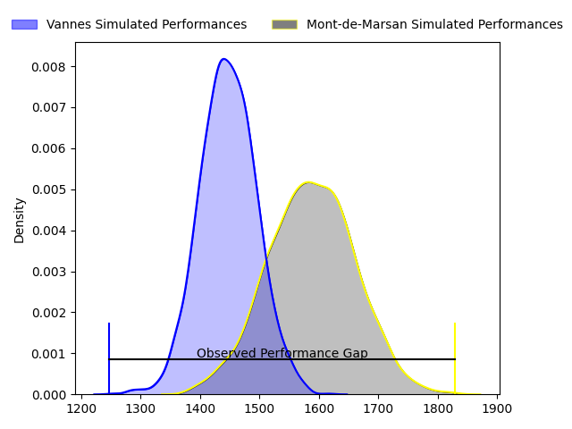
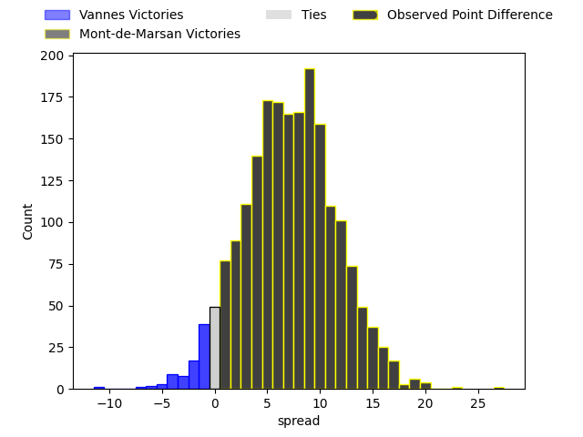
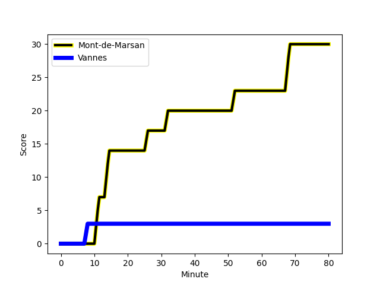
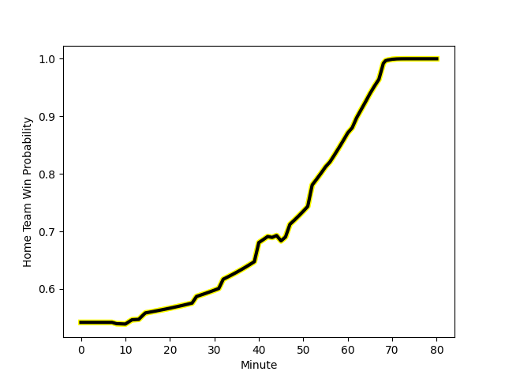

---  
layout: page  
title: Vannes at Mont-de-Marsan; 3-30  
date: 2023-02-17 19:00:00 18:00:00 -0500  
categories: match review  
---
# Vannes at Mont-de-Marsan; 3-30

# Club Level Predictions

The first set of predictions treats a club as the smallest object, as the club develops its members, organizes a gameplan, and deploys its players as needed for each match. This club model has a prediction of 0.688, which translates to predicting Mont-de-Marsan to win by 7.0.

Each club has a rating and a rating deviation (simiar to a Glicko system), and expected performances can be generated. This allows for simulated matches and spreads like the ones below.
## Projected Performances

## Projected Spreads

## Projected Results

# Player Level Predictions

Treating teams instead as an entity made up of the currently active players, I have ratings for each player in an altogether different system. These can be combined to form team ratings once teamsheets are announced, weighting starters a bit higher than the reserves. After the match is played, players can be weighted by their minutes on the field, allowing for an accurate measure of the team's composition. With these compiled team ratings, we can make predictions, measure inaccuracy, and update the individual player ratings.
## Prediction with Player Minutes: Mont-de-Marsan by 11.3

Mont-de-Marsan by 7.3 on a neutral field
## Scores over Time

## Win Probability over Time

There were 3 large changes in win probability in this match
## Prediction without Player Minutes: Mont-de-Marsan by 10.8

Mont-de-Marsan by 6.8 on a neutral pitch

|   Away Minutes | Away Player                                                                  |   Away elo |   Away Percentile |   Number |   Home Percentile |   Home elo | Home Player                                                              |   Home Minutes |
|---------------:|:-----------------------------------------------------------------------------|-----------:|------------------:|---------:|------------------:|-----------:|:-------------------------------------------------------------------------|---------------:|
|             47 | [Andy Bordelai](..//playerfiles//AndyBordelai_cleaned.md)                    |     121.12 |                96 |        1 |                90 |     112.22 | [Thomas Bultel](..//playerfiles//ThomasBultel_cleaned.md)                |             65 |
|             47 | [Théo Beziat](..//playerfiles//ThéoBeziat_cleaned.md)                        |      91.36 |                38 |        2 |                84 |     107.36 | [Jose Luis Gonzalez](..//playerfiles//JoseLuisGonzalez_cleaned.md)       |             61 |
|             47 | [Théo Beziat](..//playerfiles//ThéoBeziat_cleaned.md)                        |      91.36 |                58 |        2 |                84 |     107.36 | [Jose Luis Gonzalez](..//playerfiles//JoseLuisGonzalez_cleaned.md)       |             61 |
|             65 | [Paga Tafili](..//playerfiles//PagaTafili_cleaned.md)                        |     132.86 |                99 |        3 |                 7 |      77.11 | [Lasha Macharashvili](..//playerfiles//LashaMacharashvili_cleaned.md)    |             40 |
|             80 | [Joe Edwards](..//playerfiles//JoeEdwards_cleaned.md)                        |      96.64 |                55 |        4 |                96 |     125.47 | [Romain Durand](..//playerfiles//RomainDurand_cleaned.md)                |             80 |
|             80 | [Myles Edwards](..//playerfiles//MylesEdwards_cleaned.md)                    |      65.45 |                 3 |        5 |                61 |      98.37 | [Andrei Ostrikov](..//playerfiles//AndreiOstrikov_cleaned.md)            |             44 |
|             47 | [Karl Chateau](..//playerfiles//KarlChateau_cleaned.md)                      |      83.76 |                28 |        6 |                64 |      99.87 | [Aurélien Lisena](..//playerfiles//AurélienLisena_cleaned.md)            |             56 |
|             47 | [Karl Chateau](..//playerfiles//KarlChateau_cleaned.md)                      |      83.76 |                18 |        6 |                64 |      99.87 | [Aurélien Lisena](..//playerfiles//AurélienLisena_cleaned.md)            |             56 |
|             80 | [Gregoire Bazin](..//playerfiles//GregoireBazin_cleaned.md)                  |      59.8  |                 3 |        7 |                 2 |      61.39 | [Léo Banos](..//playerfiles//LéoBanos_cleaned.md)                        |             80 |
|             80 | [Gregoire Bazin](..//playerfiles//GregoireBazin_cleaned.md)                  |      59.8  |                 2 |        7 |                 2 |      61.39 | [Léo Banos](..//playerfiles//LéoBanos_cleaned.md)                        |             80 |
|             47 | [Juan Bautista Pedemonte](..//playerfiles//JuanBautistaPedemonte_cleaned.md) |      89.46 |                31 |        8 |                94 |     123.03 | [William Wavrin](..//playerfiles//WilliamWavrin_cleaned.md)              |             45 |
|             65 | [Michael Ruru](..//playerfiles//MichaelRuru_cleaned.md)                      |      81.59 |                14 |        9 |                16 |      83.48 | [Christophe Loustalot](..//playerfiles//ChristopheLoustalot_cleaned.md)  |             65 |
|             61 | [Maxime Lafage](..//playerfiles//MaximeLafage_cleaned.md)                    |      92.76 |                43 |       10 |                59 |      98.76 | [Willie du Plessis](..//playerfiles//WillieduPlessis_cleaned.md)         |             80 |
|             80 | [Matthys Gratien](..//playerfiles//MatthysGratien_cleaned.md)                |     107.44 |                81 |       11 |                30 |      88.62 | [Kaminieli Rasaku](..//playerfiles//KaminieliRasaku_cleaned.md)          |             80 |
|             80 | [Andres Vilaseca](..//playerfiles//AndresVilaseca_cleaned.md)                |      95.33 |                51 |       12 |                 4 |      68.34 | [Jules Even](..//playerfiles//JulesEven_cleaned.md)                      |             80 |
|             80 | [Nicolas Freitas](..//playerfiles//NicolasFreitas_cleaned.md)                |      87.57 |                25 |       13 |                48 |      94.17 | [Ambrose Curtis](..//playerfiles//AmbroseCurtis_cleaned.md)              |             80 |
|             62 | [Romaric Camou](..//playerfiles//RomaricCamou_cleaned.md)                    |      97.5  |                54 |       14 |                29 |      87.21 | [Alexandre de Nardi](..//playerfiles//AlexandredeNardi_cleaned.md)       |             80 |
|             80 | [Gwenaël Duplenne](..//playerfiles//GwenaëlDuplenne_cleaned.md)              |      91.71 |                43 |       15 |                97 |     129.73 | [Yoann Laousse Azpiazu](..//playerfiles//YoannLaousseAzpiazu_cleaned.md) |             43 |
|             33 | [Cyril Blanchard](..//playerfiles//CyrilBlanchard_cleaned.md)                |      99.94 |                67 |       16 |                93 |     121.63 | [Gheorge Gajion](..//playerfiles//GheorgeGajion_cleaned.md)              |             40 |
|             33 | [Cyril Blanchard](..//playerfiles//CyrilBlanchard_cleaned.md)                |      99.94 |                67 |       16 |                96 |     121.63 | [Gheorge Gajion](..//playerfiles//GheorgeGajion_cleaned.md)              |             40 |
|             33 | [Éric Marks](..//playerfiles//ÉricMarks_cleaned.md)                          |      83.97 |                17 |       17 |                94 |     117.82 | [Simon Renda](..//playerfiles//SimonRenda_cleaned.md)                    |             37 |
|             33 | [Ximun Bessonart](..//playerfiles//XimunBessonart_cleaned.md)                |      84.48 |                22 |       18 |                48 |      93.92 | [Aston Brad Fortuin](..//playerfiles//AstonBradFortuin_cleaned.md)       |             36 |
|             33 | [Ximun Bessonart](..//playerfiles//XimunBessonart_cleaned.md)                |      84.48 |                15 |       18 |                48 |      93.92 | [Aston Brad Fortuin](..//playerfiles//AstonBradFortuin_cleaned.md)       |             36 |
|             33 | [Francisco Gorrisen](..//playerfiles//FranciscoGorrisen_cleaned.md)          |      92.01 |                40 |       19 |               nan |      97.56 | [Thibault Tauleigne](..//playerfiles//ThibaultTauleigne_cleaned.md)      |             35 |
|             19 | [Jean Chezeau](..//playerfiles//JeanChezeau_cleaned.md)                      |      92.36 |                40 |       20 |                45 |      93.71 | [Yann Brethous](..//playerfiles//YannBrethous_cleaned.md)                |             24 |
|             18 | [Nathanael Hulleu](..//playerfiles//NathanaelHulleu_cleaned.md)              |      86.59 |                23 |       21 |                63 |      93.46 | [Simon Labouyrie](..//playerfiles//SimonLabouyrie_cleaned.md)            |             19 |
|             15 | [Simon Bourgeois](..//playerfiles//SimonBourgeois_cleaned.md)                |      93.24 |               nan |       22 |               nan |      97.65 | [Dino Casadei](..//playerfiles//DinoCasadei_cleaned.md)                  |             15 |
|             15 | [Erwan Nicolas](..//playerfiles//ErwanNicolas_cleaned.md)                    |     114.84 |                93 |       23 |                60 |      95.54 | [Baptiste Canut](..//playerfiles//BaptisteCanut_cleaned.md)              |             15 |

