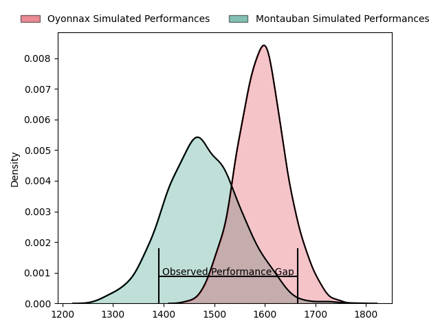
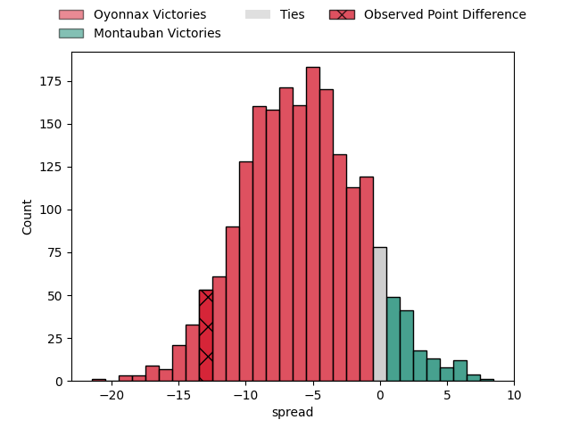
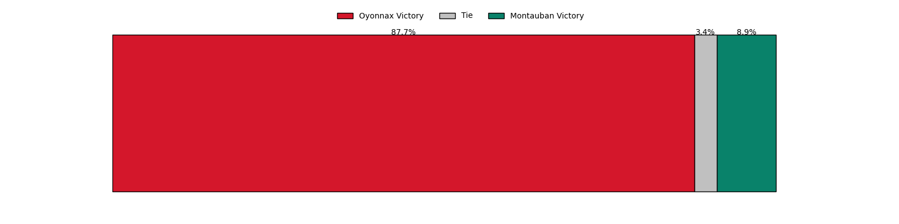
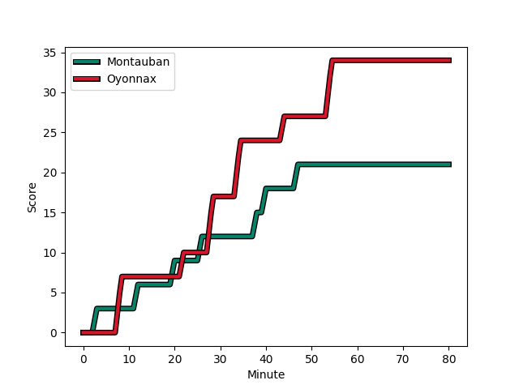
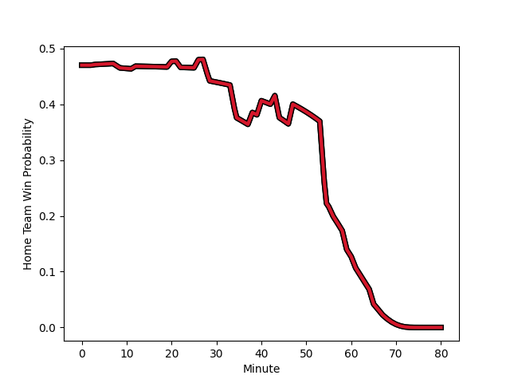

---  
layout: page  
title: Oyonnax at Montauban; 34-21  
date: 2023-02-17 19:30:00 18:00:00 -0500  
categories: match review  
---
# Oyonnax at Montauban; 34-21

# Club Level Predictions

The first set of predictions treats a club as the smallest object, as the club develops its members, organizes a gameplan, and deploys its players as needed for each match. This club model has a prediction of 0.341, which translates to predicting Oyonnax to win by 5.8.

Each club has a rating and a rating deviation (simiar to a Glicko system), and expected performances can be generated. This allows for simulated matches and spreads like the ones below.
## Projected Performances

## Projected Spreads

## Projected Results

# Player Level Predictions

Treating teams instead as an entity made up of the currently active players, I have ratings for each player in an altogether different system. These can be combined to form team ratings once teamsheets are announced, weighting starters a bit higher than the reserves. After the match is played, players can be weighted by their minutes on the field, allowing for an accurate measure of the team's composition. With these compiled team ratings, we can make predictions, measure inaccuracy, and update the individual player ratings.
## Prediction with Player Minutes: Oyonnax by 1.2

Oyonnax by 5.2 on a neutral field
## Scores over Time

## Win Probability over Time

There were 9 large changes in win probability in this match
## Prediction without Player Minutes: Montauban by 0.1

Oyonnax by 3.9 on a neutral pitch

|   Away Minutes | Away Player                                                           |   Away elo |   Away Percentile |   Number |   Home Percentile |   Home elo | Home Player                                                         |   Home Minutes |
|---------------:|:----------------------------------------------------------------------|-----------:|------------------:|---------:|------------------:|-----------:|:--------------------------------------------------------------------|---------------:|
|             67 | [Antoine Abraham](..//playerfiles//AntoineAbraham_cleaned.md)         |      85    |                14 |        1 |                75 |     100.11 | [Lucas Seyrolle](..//playerfiles//LucasSeyrolle_cleaned.md)         |             66 |
|             67 | [Antoine Abraham](..//playerfiles//AntoineAbraham_cleaned.md)         |      85    |                14 |        1 |                44 |     100.11 | [Lucas Seyrolle](..//playerfiles//LucasSeyrolle_cleaned.md)         |             66 |
|             61 | [Teddy Durand](..//playerfiles//TeddyDurand_cleaned.md)               |      95.12 |                52 |        2 |                22 |      95.74 | [Arnaud Feltrin](..//playerfiles//ArnaudFeltrin_cleaned.md)         |             34 |
|             61 | [Teddy Durand](..//playerfiles//TeddyDurand_cleaned.md)               |      95.12 |                52 |        2 |                55 |      95.74 | [Arnaud Feltrin](..//playerfiles//ArnaudFeltrin_cleaned.md)         |             34 |
|             61 | [Thibault Berthaud](..//playerfiles//ThibaultBerthaud_cleaned.md)     |      96.81 |                58 |        3 |                90 |     111.93 | [Mirian Burduli](..//playerfiles//MirianBurduli_cleaned.md)         |             66 |
|             54 | [Tom Murday](..//playerfiles//TomMurday_cleaned.md)                   |      85.09 |                21 |        4 |                34 |      90.05 | [Dan Malafosse](..//playerfiles//DanMalafosse_cleaned.md)           |             43 |
|             54 | [Steve Mafi](..//playerfiles//SteveMafi_cleaned.md)                   |      98.2  |               nan |        5 |                86 |     111.09 | [Kevin Gimeno](..//playerfiles//KevinGimeno_cleaned.md)             |             80 |
|             54 | [Steve Mafi](..//playerfiles//SteveMafi_cleaned.md)                   |      98.2  |               nan |        5 |                70 |     111.09 | [Kevin Gimeno](..//playerfiles//KevinGimeno_cleaned.md)             |             80 |
|             80 | [Kevin Lebreton](..//playerfiles//KevinLebreton_cleaned.md)           |     152.8  |                99 |        6 |                30 |      89.15 | [Kyllian Ringuet](..//playerfiles//KyllianRinguet_cleaned.md)       |             59 |
|             65 | [Hugo Hermet](..//playerfiles//HugoHermet_cleaned.md)                 |     100.78 |                58 |        7 |                 2 |      61.42 | [Frédéric Quercy](..//playerfiles//FrédéricQuercy_cleaned.md)       |             80 |
|             80 | [Filimo Taofifenua](..//playerfiles//FilimoTaofifenua_cleaned.md)     |      89.21 |                39 |        8 |                44 |      93.53 | [Quentin Witt](..//playerfiles//QuentinWitt_cleaned.md)             |             80 |
|             80 | [Yvan David](..//playerfiles//YvanDavid_cleaned.md)                   |     101.39 |                70 |        9 |                76 |     103.37 | [Shaun Venter](..//playerfiles//ShaunVenter_cleaned.md)             |             59 |
|             80 | [Justin Bouraux](..//playerfiles//JustinBouraux_cleaned.md)           |     118.4  |                90 |       10 |                88 |     114.79 | [Jérôme Bosviel](..//playerfiles//JérômeBosviel_cleaned.md)         |             80 |
|             80 | [Gavin Stark](..//playerfiles//GavinStark_cleaned.md)                 |      94.02 |                47 |       11 |                80 |     106.7  | [Bastien Guillemin](..//playerfiles//BastienGuillemin_cleaned.md)   |             80 |
|             59 | [Théo Millet](..//playerfiles//ThéoMillet_cleaned.md)                 |      91.94 |                41 |       12 |                92 |     117.14 | [Maxime Mathy](..//playerfiles//MaximeMathy_cleaned.md)             |             59 |
|             80 | [Leo Treilles](..//playerfiles//LeoTreilles_cleaned.md)               |      96.16 |                60 |       13 |                71 |     101.29 | [Taleta Tupuola](..//playerfiles//TaletaTupuola_cleaned.md)         |             56 |
|             65 | [Joe Ravouvou](..//playerfiles//JoeRavouvou_cleaned.md)               |      98.23 |                60 |       14 |                48 |      94.37 | [Semesa Rokoduguni](..//playerfiles//SemesaRokoduguni_cleaned.md)   |             80 |
|             80 | [Aurelien Callandret](..//playerfiles//AurelienCallandret_cleaned.md) |     108.81 |                83 |       15 |                43 |      92.61 | [Raphaël Sanchez](..//playerfiles//RaphaëlSanchez_cleaned.md)       |             80 |
|             26 | [Phoenix Battye](..//playerfiles//PhoenixBattye_cleaned.md)           |     105.6  |                77 |       16 |                42 |      92.4  | [Kevin Firmin](..//playerfiles//KevinFirmin_cleaned.md)             |             46 |
|             26 | [Victor Lebas](..//playerfiles//VictorLebas_cleaned.md)               |      88.84 |                40 |       17 |                82 |     108.34 | [Alexandre Manukula](..//playerfiles//AlexandreManukula_cleaned.md) |             37 |
|             26 | [Victor Lebas](..//playerfiles//VictorLebas_cleaned.md)               |      88.84 |                40 |       17 |                64 |     108.34 | [Alexandre Manukula](..//playerfiles//AlexandreManukula_cleaned.md) |             37 |
|             21 | [Florian Vialelle](..//playerfiles//FlorianVialelle_cleaned.md)       |      89.36 |                32 |       18 |                48 |      94.29 | [Paul Bonnefond](..//playerfiles//PaulBonnefond_cleaned.md)         |             24 |
|             19 | [Benjamin Geledan](..//playerfiles//BenjaminGeledan_cleaned.md)       |     101.56 |                73 |       19 |                65 |     100.18 | [Sevenaia Galala](..//playerfiles//SevenaiaGalala_cleaned.md)       |             21 |
|             15 | [Wandrille Picault](..//playerfiles//WandrillePicault_cleaned.md)     |     120.32 |                93 |       20 |                 4 |      70.07 | [Epeli Momo](..//playerfiles//EpeliMomo_cleaned.md)                 |             21 |
|             15 | [Jules Soulan](..//playerfiles//JulesSoulan_cleaned.md)               |     132.68 |                96 |       21 |                81 |     103.96 | [Alexis Bernadet](..//playerfiles//AlexisBernadet_cleaned.md)       |             21 |
|             19 | [Victor Delmas](..//playerfiles//VictorDelmas_cleaned.md)             |     104.96 |               nan |       22 |                97 |     125.3  | [Nicolas Agnesi](..//playerfiles//NicolasAgnesi_cleaned.md)         |             14 |
|             13 | [Irakli Mirtskhulava](..//playerfiles//IrakliMirtskhulava_cleaned.md) |      95    |               nan |       23 |                21 |      85.24 | [Simon Renaud](..//playerfiles//SimonRenaud_cleaned.md)             |             14 |

