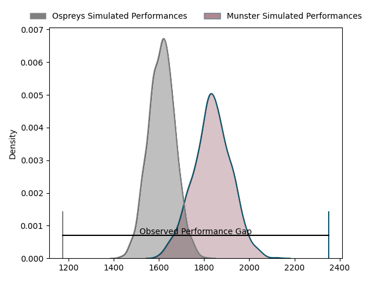
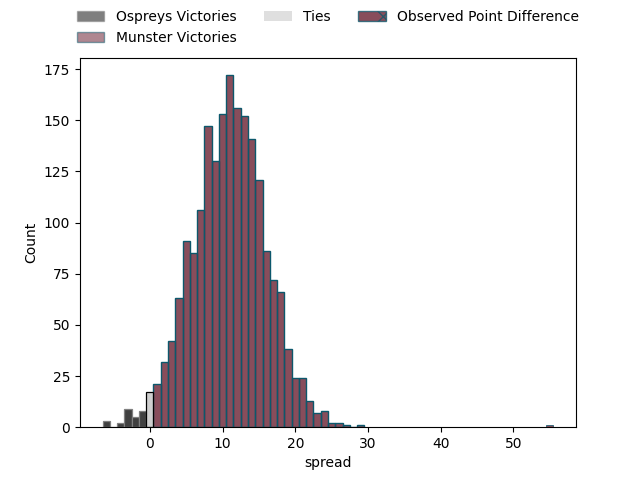
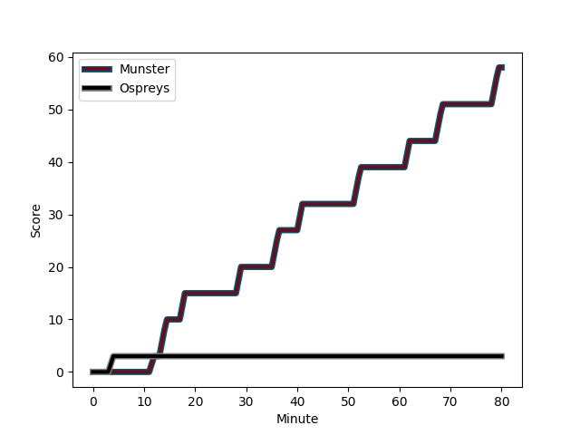
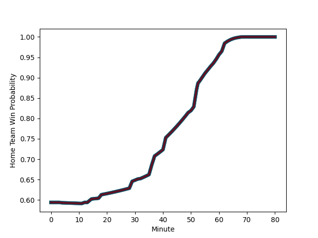

---  
layout: page  
title: Ospreys at Munster; 3-58  
date: 2023-02-17 20:35:00 18:00:00 -0500  
categories: match review  
---
# Ospreys at Munster; 3-58

# Club Level Predictions

The first set of predictions treats a club as the smallest object, as the club develops its members, organizes a gameplan, and deploys its players as needed for each match. This club model has a prediction of 0.779, which translates to predicting Munster to win by 11.1.

Each club has a rating and a rating deviation (simiar to a Glicko system), and expected performances can be generated. This allows for simulated matches and spreads like the ones below.
## Projected Performances

## Projected Spreads

## Projected Results

# Player Level Predictions

Treating teams instead as an entity made up of the currently active players, I have ratings for each player in an altogether different system. These can be combined to form team ratings once teamsheets are announced, weighting starters a bit higher than the reserves. After the match is played, players can be weighted by their minutes on the field, allowing for an accurate measure of the team's composition. With these compiled team ratings, we can make predictions, measure inaccuracy, and update the individual player ratings.
## Prediction with Player Minutes: Munster by 17.6

Munster by 13.6 on a neutral field
## Scores over Time

## Win Probability over Time

There were 2 large changes in win probability in this match
## Prediction without Player Minutes: Munster by 17.4

Munster by 13.4 on a neutral pitch

|   Away Minutes | Away Player                                                                 |   Away elo |   Away Percentile |   Number |   Home Percentile |   Home elo | Home Player                                                     |   Home Minutes |
|---------------:|:----------------------------------------------------------------------------|-----------:|------------------:|---------:|------------------:|-----------:|:----------------------------------------------------------------|---------------:|
|             60 | [Nicky Smith](..//playerfiles//NickySmith_cleaned.md)                       |     105.26 |                82 |        1 |                66 |      99.98 | [Josh Wycherley](..//playerfiles//JoshWycherley_cleaned.md)     |             67 |
|             60 | [Elvis Taione](..//playerfiles//ElvisTaione_cleaned.md)                     |      91.71 |                40 |        2 |                86 |     108.51 | [Niall Scannell](..//playerfiles//NiallScannell_cleaned.md)     |             56 |
|             52 | [Tom Botha](..//playerfiles//TomBotha_cleaned.md)                           |     100.08 |                67 |        3 |                73 |     101.54 | [Roman Salanoa](..//playerfiles//RomanSalanoa_cleaned.md)       |             68 |
|             68 | [Bradley Davies](..//playerfiles//BradleyDavies_cleaned.md)                 |      87.5  |                26 |        4 |                93 |     118.61 | [Jean Kleyn](..//playerfiles//JeanKleyn_cleaned.md)             |             57 |
|             80 | [Huw Sutton](..//playerfiles//HuwSutton_cleaned.md)                         |      90.96 |                37 |        5 |                65 |      99.9  | [Fineen Wycherley](..//playerfiles//FineenWycherley_cleaned.md) |             80 |
|             53 | [Jack Regan](..//playerfiles//JackRegan_cleaned.md)                         |      92.46 |                41 |        6 |                68 |     102.11 | [Jack O'Donoghue](..//playerfiles//JackO'Donoghue_cleaned.md)   |             32 |
|             80 | [Ethan Roots](..//playerfiles//EthanRoots_cleaned.md)                       |     102.9  |                70 |        7 |                85 |     111.74 | [John Hodnett](..//playerfiles//JohnHodnett_cleaned.md)         |             80 |
|             80 | [Morgan Morris](..//playerfiles//MorganMorris_cleaned.md)                   |     102.19 |                69 |        8 |                83 |     110.28 | [Gavin Coombes](..//playerfiles//GavinCoombes_cleaned.md)       |             80 |
|             68 | [Reuben Morgan-Williams](..//playerfiles//ReubenMorgan-Williams_cleaned.md) |      94.15 |                47 |        9 |                82 |     106.76 | [Paddy Patterson](..//playerfiles//PaddyPatterson_cleaned.md)   |             50 |
|             80 | [Stephen Myler](..//playerfiles//StephenMyler_cleaned.md)                   |      93.67 |               nan |       10 |                80 |     106.63 | [Joey Carbery](..//playerfiles//JoeyCarbery_cleaned.md)         |             80 |
|             68 | [Keelan Giles](..//playerfiles//KeelanGiles_cleaned.md)                     |      95.11 |                50 |       11 |                66 |     100.67 | [Simon Zebo](..//playerfiles//SimonZebo_cleaned.md)             |             80 |
|             80 | [Owen Watkin](..//playerfiles//OwenWatkin_cleaned.md)                       |      95    |               nan |       12 |                86 |     110.93 | [Malakai Fekitoa](..//playerfiles//MalakaiFekitoa_cleaned.md)   |             80 |
|             37 | [Michael Collins](..//playerfiles//MichaelCollins_cleaned.md)               |     109.91 |                85 |       13 |                88 |     113.46 | [Antoine Frisch](..//playerfiles//AntoineFrisch_cleaned.md)     |             58 |
|             80 | [Luke Morgan](..//playerfiles//LukeMorgan_cleaned.md)                       |     101.08 |                67 |       14 |                73 |     103.4  | [Liam Coombes](..//playerfiles//LiamCoombes_cleaned.md)         |             52 |
|             80 | [Max Nagy](..//playerfiles//MaxNagy_cleaned.md)                             |     103.56 |                69 |       15 |                75 |     106.31 | [Shane Daly](..//playerfiles//ShaneDaly_cleaned.md)             |             80 |
|             20 | [Garyn Phillips](..//playerfiles//GarynPhillips_cleaned.md)                 |      92.4  |               nan |       16 |               nan |      98.97 | [Stephen Archer](..//playerfiles//StephenArcher_cleaned.md)     |             12 |
|             20 | [Tom Cowan-Dickie](..//playerfiles//TomCowan-Dickie_cleaned.md)             |      94.63 |               nan |       17 |                85 |     111.33 | [Alex Kendellen](..//playerfiles//AlexKendellen_cleaned.md)     |             23 |
|             28 | [Rhys Henry](..//playerfiles//RhysHenry_cleaned.md)                         |      91.08 |                36 |       18 |               nan |      95.43 | [Mark Donnelly](..//playerfiles//MarkDonnelly_cleaned.md)       |             13 |
|             12 | [James Fender](..//playerfiles//JamesFender_cleaned.md)                     |      92.06 |                46 |       19 |                63 |      99.42 | [Jack O'Sullivan](..//playerfiles//JackO'Sullivan_cleaned.md)   |             48 |
|             27 | [Harri Deaves](..//playerfiles//HarriDeaves_cleaned.md)                     |      88.41 |                27 |       20 |               nan |      95    | [Ethan Coughlan](..//playerfiles//EthanCoughlan_cleaned.md)     |             30 |
|             12 | [Matthew Aubrey](..//playerfiles//MatthewAubrey_cleaned.md)                 |      88.93 |                30 |       21 |                67 |     106.83 | [Ben Healy](..//playerfiles//BenHealy_cleaned.md)               |             28 |
|             12 | [Jack Walsh](..//playerfiles//JackWalsh_cleaned.md)                         |      97.89 |                57 |       22 |                69 |     100.87 | [Rory Scannell](..//playerfiles//RoryScannell_cleaned.md)       |             22 |
|             43 | [Iestyn Hopkins](..//playerfiles//IestynHopkins_cleaned.md)                 |      95    |               nan |       23 |                57 |      99.32 | [Diarmuid Barron](..//playerfiles//DiarmuidBarron_cleaned.md)   |             24 |

