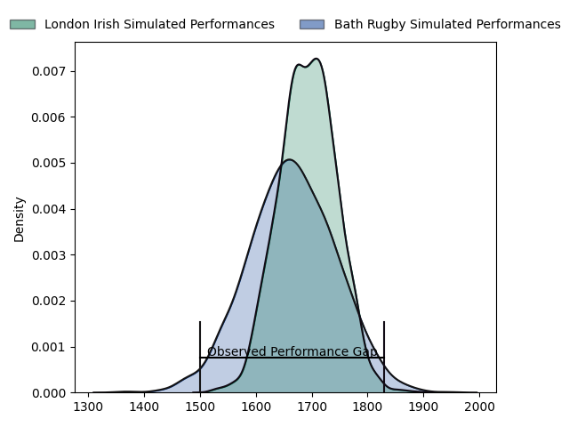
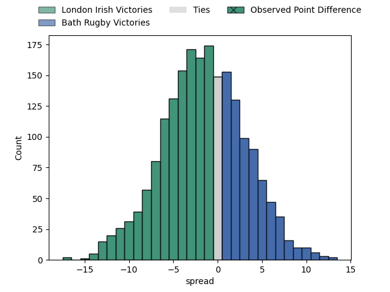
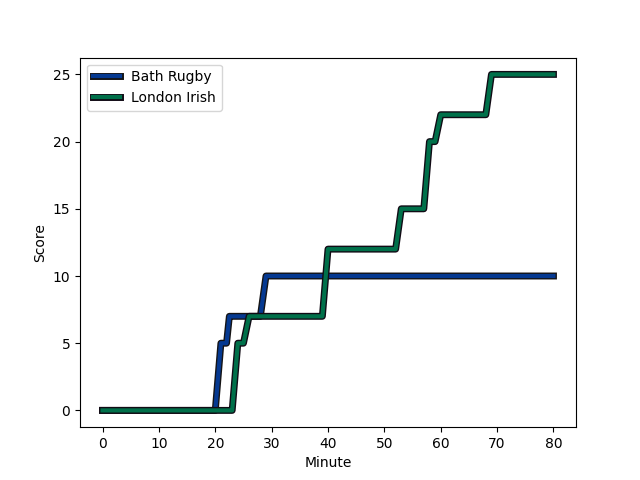
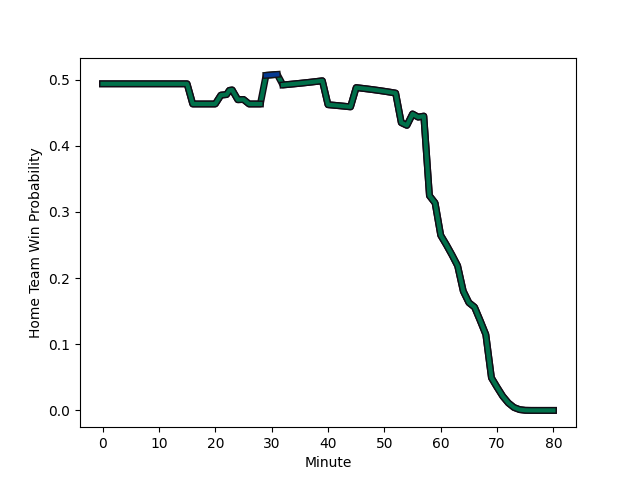

---  
layout: page  
title: London Irish at Bath Rugby; 25.0-10.0  
date: 2023-02-18 10:00:00 18:00:00 -0500  
categories: match review  
---
# London Irish at Bath Rugby; 25.0-10.0

# Club Level Predictions

The first set of predictions treats a club as the smallest object, as the club develops its members, organizes a gameplan, and deploys its players as needed for each match. This club model has a prediction of 0.456, which translates to predicting London Irish to win by 1.5.

Each club has a rating and a rating deviation (simiar to a Glicko system), and expected performances can be generated. This allows for simulated matches and spreads like the ones below.
## Projected Performances

## Projected Spreads

## Projected Results

# Player Level Predictions

Treating teams instead as an entity made up of the currently active players, I have ratings for each player in an altogether different system. These can be combined to form team ratings once teamsheets are announced, weighting starters a bit higher than the reserves. After the match is played, players can be weighted by their minutes on the field, allowing for an accurate measure of the team's composition. With these compiled team ratings, we can make predictions, measure inaccuracy, and update the individual player ratings.
## Prediction with Player Minutes: Bath Rugby by 3.7

London Irish by 0.3 on a neutral field
## Scores over Time

## Win Probability over Time

There were 11 large changes in win probability in this match
## Prediction without Player Minutes: Bath Rugby by 4.0

Bath Rugby by 0.0 on a neutral pitch

|   Away Minutes | Away Player                                                                       |   Away elo |   Away Percentile |   Number |   Home Percentile |   Home elo | Home Player                                                           |   Home Minutes |
|---------------:|:----------------------------------------------------------------------------------|-----------:|------------------:|---------:|------------------:|-----------:|:----------------------------------------------------------------------|---------------:|
|             73 | [Facundo Gigena](..//playerfiles//FacundoGigena_cleaned.md)                       |      97.86 |                61 |        1 |                88 |     109.55 | [Beno Obano](..//playerfiles//BenoObano_cleaned.md)                   |             58 |
|             45 | [Agustin Creevy](..//playerfiles//AgustinCreevy_cleaned.md)                       |     114.96 |                93 |        2 |                97 |     126.23 | [Tom Dunn](..//playerfiles//TomDunn_cleaned.md)                       |             57 |
|             57 | [Oli Hoskins](..//playerfiles//OliHoskins_cleaned.md)                             |     111.76 |                90 |        3 |                 0 |      48.57 | [D'Arcy Rae](..//playerfiles//D'ArcyRae_cleaned.md)                   |             45 |
|             57 | [Api Ratuniyarawa](..//playerfiles//ApiRatuniyarawa_cleaned.md)                   |      96.04 |                52 |        4 |                78 |     105.96 | [Dave Attwood](..//playerfiles//DaveAttwood_cleaned.md)               |             45 |
|             80 | [Rob Simmons](..//playerfiles//RobSimmons_cleaned.md)                             |     134.87 |                98 |        5 |                46 |      93.26 | [Josh McNally](..//playerfiles//JoshMcNally_cleaned.md)               |             55 |
|             80 | [Juan Martin Gonzalez](..//playerfiles//JuanMartinGonzalez_cleaned.md)            |      93.93 |                45 |        6 |                97 |     127.29 | [Miles Reid](..//playerfiles//MilesReid_cleaned.md)                   |             80 |
|             80 | [Tom Pearson](..//playerfiles//TomPearson_cleaned.md)                             |     133.54 |                97 |        7 |                54 |      97.14 | [Sam Underhill](..//playerfiles//SamUnderhill_cleaned.md)             |             66 |
|             73 | [Matt Rogerson](..//playerfiles//MattRogerson_cleaned.md)                         |     105.16 |                75 |        8 |                56 |      97.86 | [Josh Bayliss](..//playerfiles//JoshBayliss_cleaned.md)               |             80 |
|             32 | [Joe Powell](..//playerfiles//JoePowell_cleaned.md)                               |      86.88 |                25 |        9 |                93 |     114.47 | [Ben Spencer](..//playerfiles//BenSpencer_cleaned.md)                 |             73 |
|             80 | [Paddy Jackson](..//playerfiles//PaddyJackson_cleaned.md)                         |     127    |                95 |       10 |                93 |     124.25 | [Piers Francis](..//playerfiles//PiersFrancis_cleaned.md)             |             51 |
|             80 | [Ben Loader](..//playerfiles//BenLoader_cleaned.md)                               |     106.56 |                76 |       11 |                93 |     118.32 | [Ruaridh McConnochie](..//playerfiles//RuaridhMcConnochie_cleaned.md) |             80 |
|             77 | [Rory Jennings](..//playerfiles//RoryJennings_cleaned.md)                         |     108.1  |                83 |       12 |                72 |     102.52 | [Cameron Redpath](..//playerfiles//CameronRedpath_cleaned.md)         |             80 |
|             80 | [Benhard Janse van Rensburg](..//playerfiles//BenhardJansevanRensburg_cleaned.md) |     105.91 |                79 |       13 |                92 |     117.21 | [Jonathan Joseph](..//playerfiles//JonathanJoseph_cleaned.md)         |             80 |
|             80 | [Lucio Cinti](..//playerfiles//LucioCinti_cleaned.md)                             |      87.54 |                26 |       14 |                60 |      98.22 | [Joe Cokanasiga](..//playerfiles//JoeCokanasiga_cleaned.md)           |             80 |
|             70 | [James Stokes](..//playerfiles//JamesStokes_cleaned.md)                           |     101.82 |                67 |       15 |                97 |     130.32 | [Matt Gallagher](..//playerfiles//MattGallagher_cleaned.md)           |             80 |
|             35 | [Mike Willemse](..//playerfiles//MikeWillemse_cleaned.md)                         |      81.29 |                 9 |       16 |                66 |      99.25 | [Niall Annett](..//playerfiles//NiallAnnett_cleaned.md)               |             23 |
|              7 | [Tarek Haffar](..//playerfiles//TarekHaffar_cleaned.md)                           |      95    |               nan |       17 |                 8 |      78.05 | [Valery Morozov](..//playerfiles//ValeryMorozov_cleaned.md)           |             22 |
|             23 | [Lovejoy Chawatama](..//playerfiles//LovejoyChawatama_cleaned.md)                 |      80.86 |                11 |       18 |                16 |      82.99 | [Will Stuart](..//playerfiles//WillStuart_cleaned.md)                 |             35 |
|             23 | [Josh Caulfield](..//playerfiles//JoshCaulfield_cleaned.md)                       |      90.03 |               nan |       19 |                95 |     121.06 | [Quinn Roux](..//playerfiles//QuinnRoux_cleaned.md)                   |             25 |
|              7 | [Chandler Cunningham-South](..//playerfiles//ChandlerCunningham-South_cleaned.md) |     101.26 |               nan |       20 |                10 |      77    | [Fergus Lee-Warner](..//playerfiles//FergusLee-Warner_cleaned.md)     |             35 |
|             48 | [Ben White](..//playerfiles//BenWhite_cleaned.md)                                 |     108.92 |                86 |       21 |                66 |      99.77 | [Louis Schreuder](..//playerfiles//LouisSchreuder_cleaned.md)         |              7 |
|              3 | [Luca Morisi](..//playerfiles//LucaMorisi_cleaned.md)                             |     112.15 |                87 |       22 |                18 |      85.23 | [Orlando Bailey](..//playerfiles//OrlandoBailey_cleaned.md)           |             29 |
|             10 | [Will Joseph](..//playerfiles//WillJoseph_cleaned.md)                             |      93.01 |                44 |       23 |                95 |     123.1  | [Chris Cloete](..//playerfiles//ChrisCloete_cleaned.md)               |             14 |

